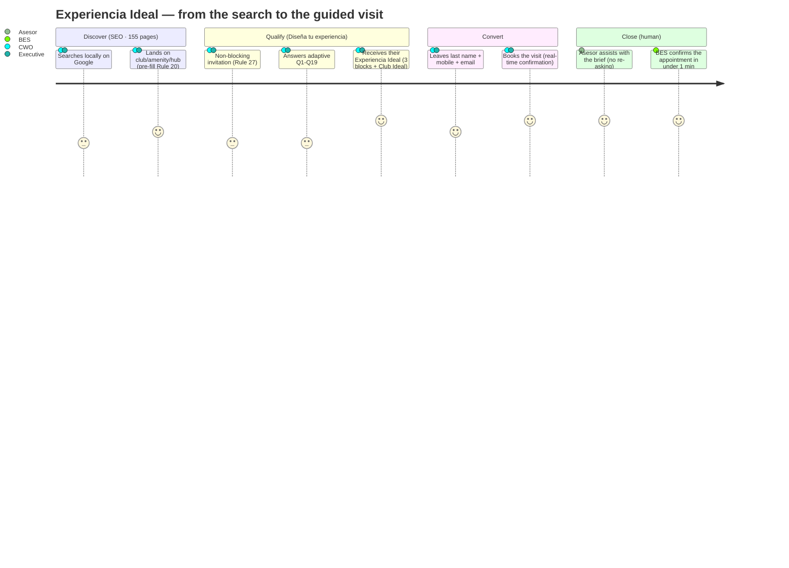
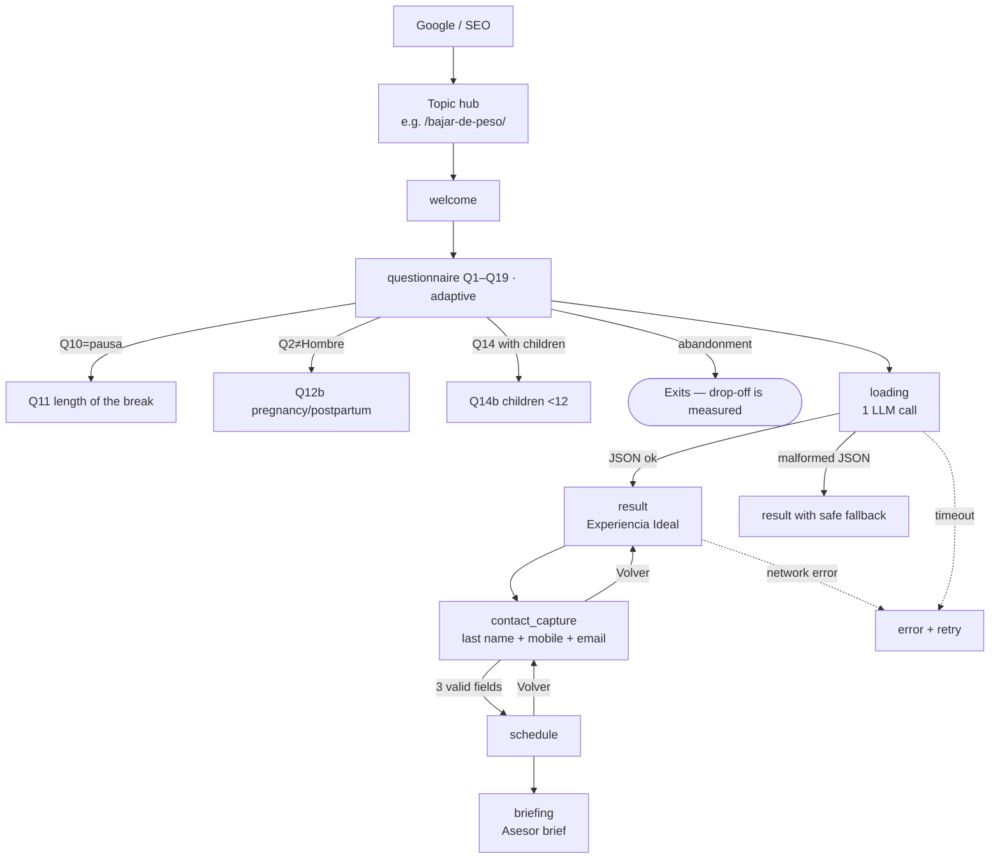

# UX Spec — Experiencia Ideal · Sports World

| Field | Value |
|---|---|
| Version | v5.0 |
| Date | 2026-06-12 |
| Authors | Product · Design · Engineering · QA (co-authorship pending sign-off) |
| Status | In review |
| Target stack | Next.js + React + TypeScript + Tailwind · SSR/ISR · headless CMS |
| Handoff tool | `[TBD — link Figma inspect]` |
| Package documents | `DESIGN.md` (tokens + premium guidelines) · `anexo-clinico.md` · `anexo-contenido-prompts.md` · `anexo-ingenieria-crm.md` |
| Reference prototype | `sw_experiencia_ideal_demo_v6_FINAL.jsx` — working implementation of the questionnaire→result→brief flow; where it differs from this document, this document governs |

> **How to read this document.** Sections 1–12 follow the standard order of a UX spec: from the why (business) to the what (architecture, flows, screens) and how it is verified (edge cases, accessibility, acceptance, metrics). Rules keep their stable number (`Rule N`) for cross-reference with code and annexes; the **rule index** at the end maps each rule to its section. Interface copy quoted in guillemets is verbatim es-MX.

## Table of contents

- **Executive summary**
- **1. Design rationale**
  - 1.1 Reasoning chain (Why → Who → What → How)
  - 1.2 Macro justification (business strategy)
  - 1.3 Micro justification (specific decisions)
  - 1.4 Audience, brand and language
- **2. Personas and customer journey**
  - 2.1 Personas
  - 2.2 Customer journey — the funnel that connects the three goals
  - 2.3 User-research findings that inform the design
- **3. Information architecture and SEO**
  - 3.1 Page inventory
  - 3.2 Detail by page type
  - 3.3 Individual training: subgroup taxonomy
  - 3.4 Confirmed site data (Rule 11)
  - 3.5 Live data per club (Rule 12)
  - 3.6 Required cross-linking between pages (Rule 10)
  - 3.7 Structured markup schema.org (Rule 13)
  - 3.8 External search routing (Rule 15)
  - 3.9 Conventions
- **4. Flows, states and personalization**
  - 4.1 User state with respect to the questionnaire (Rule 32)
  - 4.2 Inference from the external search (Rule 16)
  - 4.3 Precedence between competing inferences (Rule 17)
  - 4.4 Pre-filling by landing page (Rule 20)
  - 4.5 Application pipeline (questionnaire → result → brief)
  - 4.6 Stale-experience refresh (Rule 34)
- **5. Per-screen and per-component specification**
  - 5.1 Global header
  - 5.2 «Tu Sports World» side panel
  - 5.3 BES — global conversational assistant
  - 5.4 Contextual menu (recommendations, not menus)
  - 5.5 SEO topic hub (e.g. `/bajar-de-peso/`)
  - 5.6 Home — behavior matrix
  - 5.7 Individual club page — behavior matrix
  - 5.8 Class pages
  - 5.9 Goal hubs — matrix
  - 5.10 FitKidz
  - 5.11 Personal Training — matrix
  - 5.12 Journal — matrix
  - 5.13 Memberships (Rule 22 — no checkout)
  - 5.14 Individual-training pages
  - 5.15 BES via fallback URL — matrix
  - 5.16 «Diseña tu experiencia» questionnaire
  - 5.17 Result — the Experiencia Ideal page
  - 5.18 Contact capture (Rule 32b)
  - 5.19 Scheduling and Asesor brief
- **6. Edge-case and conditional-state matrix**
  - 6.1 Geolocation denied or unavailable
  - 6.2 Search infers a location with no club
  - 6.3 SEPOMEX (ZIP autocomplete) unavailable
  - 6.4 Form validation errors
  - 6.5 Questionnaire abandoned mid-flow
  - 6.6 Health disclaimer rejected
  - 6.7 BES asked an out-of-scope question
  - 6.8 Catalog or booking API unavailable
  - 6.9 Search with competing inferences
  - 6.10 Returning user with a stale experience
  - 6.11 JavaScript disabled or older browser
  - 6.12 Slow connection or data-saver mode
  - 6.13 Empty amenity or club lists
  - 6.14 Aquatic preference but the ideal club has no pool
  - 6.15 Q12 suppresses Block 1 and Block 2 at once
  - 6.16 Replacement class outside Q4 compatibility
  - 6.17 Club change yields no viable Block 3 set
  - 6.18 All three blocks suppressed
- **7. Design system, tokens and writing**
  - 7.1 Brand and editorial positioning (Rule 8)
  - 7.2 Editorial rules for all copy (Rule 9)
- **8. Accessibility (WCAG 2.2 AA)**
- **9. Privacy and data handling (Rule 36)**
- **10. Handoff and synchronization**
  - 10.1 Pending client inputs
- **11. Acceptance criteria**
- **12. Metrics and experimentation**
  - 12.1 KPIs
  - 12.2 Lead scoring and routing
  - 12.3 Progressive profiling (recommendation)
  - 12.4 A/B testing
- **Appendix B — Pages explicitly out of scope (Rule 37)**
- **Appendix C — Glossary**
- **Appendix D — Code reference**
- **Appendix F — Result page reference template**
- **Appendix G — Asesor brief**
- **Appendix H — Single LLM call: schema and YMYL-aware prompt**
- **Appendix — Rule index**
- **Document control**

---

## Executive summary

**The problems that motivate the redesign** (documented as signed objectives):

1. The site appears in less than 1% of "gym para bajar de peso" searches → **`/bajar-de-peso/`** hub with YMYL content and a visible medical sign-off (cédula profesional, Rule 14).
2. It is outside the top 100 for searches like "yoga cerca de mí" → **one dedicated page per class**: 51 adult classes (7 Les Mills + 44 regular) + the FitKidz hub with 34 children's activities (§3).
3. "Gym near me" lands on the home page instead of the nearest club → location detection and **routing to the nearest club** (routing table, Rule 15).
4. *(Operational)* The user fills out a form and days go by without contact from an advisor → **BES 24/7** solves operational questions on the spot (Rule 3); the human Asesor steps in when they add real value. First response <1 min.

**Three assets no competitor combines:** **49** clubs across 13 states (32 in the Valle de México metro area, 17 in the rest of the country) · a catalog of **51+34** classes · and the unique asset: **every class classified by its exact contribution to each user goal** (clinical-annex fichas; medical validation gate).

**The project's thesis:** deeply knowing the user is what makes it possible to propose *their ideal experience*.

`QUESTIONNAIRE → KNOWLEDGE → EXPERIENCIA IDEAL → QUALIFIED LEAD`

**The prospect arrives through one of four doors** — home (1) · club (49) · class/amenity (61) · goal (6 hubs) — and all of them lead to the same destination: **«Diseña tu experiencia»**, the official questionnaire of **15 base questions + 6 conditionals** (Q1–Q19, 15–21 visible). Each door carries implicit information and the system uses it (Rule 16/20): landing on a club **omits Q15/Q16** (13 remain; 16 on the weight path); landing on a class or goal hub **pre-marks Q4**; the weight path adds Q17–Q19 and the **YMYL modal** before the result. The user does not see menus: they see recommendations (state-driven contextual menu, Rules 23–31).

**The result is a personalized editorial document, not a list:** a hook that connects with their motivation (Q3) + summary cards + a **Club Ideal** card with verifiable data only (Rule 42) + **three blocks** — 01 Strength · 02 Cardio · 03 Classes from the resolved club's real catalog, filtered by the hard YMYL contraindication filter — with "Because you mentioned that…" connectors. **It honors the user's decision:** if they change the club, it recalculates; if they change a class, it reorders (Rule 41); it never blocks, never insists.

**BES** is not an FAQ: it is the club's complete knowledge hub with the ability to act inside the chat (prices, promos, schedules, class timetables, memberships, booking the visit), by text or voice. Sensitive matters are **not executed directly**: cancellations, freezes and refunds are captured, open a CRM ticket and connect with the Asesor (Rule 3.1). WhatsApp visit reminders at 24 h and 2 h (Rule 3.2).

**The value closer: the Asesor's guide.** Every lead reaches the club with the Appendix G brief — **5 validation questions**, a **4-step visit route** (connect with their goal · focused tour · solve the blocker · close with a next step), main + complement proposal, **3 closing priorities** and a closing script ≤60 words — prioritized by flags (family/kids, medical condition, coming from another gym, beginner, returning from a pause). The Asesor converts **without re-asking anything** the user already answered: that is the real value for the 49 sales teams.

**Signed goals:** double organic traffic (**80,000 → 160,000 visits/month in 3 months**) · **2x qualified leads** · first response **<1 min, 24/7**.

---

## 1. Design rationale

The site exists to turn Google searches into guided club visits. This section documents that full chain: the business goal (double organic traffic from 80,000 to 160,000 monthly visits and double qualified leads), who the actors are (the two CORE archetypes, the Asesor and BES), what measurable behavior is expected from the user, and why each product decision — the single adaptive questionnaire, red reserved for conversion, contact capture after the result — is what it is and not something else.

### 1.1 Reasoning chain (Why → Who → What → How)

- **Why (SMART goal).** Double the site's organic traffic: go from **80,000 to 160,000 monthly visits in 3 months**, making the site far more findable on Google through an SEO strategy applied to a **new hub-and-pagination structure**. Example lever: a **"perder peso" (weight loss) hub** captures one of the highest-volume searches in Mexico and, on its own, has the potential to double traffic.
 - **Secondary goal:** double (**2x**) the number of **qualified leads** that reach the Asesor.
 - **Tertiary goal:** reduce **customer response time** through the **voice agent** (immediate 24/7 service).
- **Who (actors).**
 - *Primary:* the two CORE archetypes of the consumer journey (§2): **Family Wellbeing Manager** (Family CWO, Priority 1, LTV 3x–4x) and **Urban Hybrid Executive** (Third Spacer, Priority 2). They arrive via local Google search and land through one of 4 doors (home, club, amenity/class, goal page).
 - *Secondary:* the **Asesor** (sales) who receives the brief and schedules the guided visit; the **voice agent** that answers and coordinates.
 - *Offstage:* trainers who define exercises in the first session; the marketing/SEO team that governs the hubs.
- **What (measurable behavior / Jobs to be Done).** The visitor must: **find** the site on Google → **complete** the Experiencia Ideal questionnaire → **leave** their contact information → **schedule** the guided visit. Measured by: organic traffic, questionnaire completion rate, qualified leads, and time to first response.
- **How (tactics/UI).** An **SEO hub** architecture (high-volume indexable pages) feeding the **Experiencia Ideal** flow: an **adaptive** guided questionnaire (15–21 questions depending on gender, pause, children, and weight path) that delivers a personalized recommendation (Block 1 weights · Block 2 cardio · Block 3 classes) + contact capture + brief for the Asesor + voice agent.

### 1.2 Macro justification (business strategy)

The growth engine is **structural SEO**, not paid advertising. Today the site receives 80,000 visits/month; the ceiling is limited by the **information architecture**: few indexable pages targeting high-volume searches. The new structure creates **topic hubs** (lose weight, muscle mass, cardiovascular health, etc.) and **paginated pages** of clubs/classes, multiplying the indexable surface and relevance. Each hub is at once an **SEO entry point** and the start of the **conversion funnel** (Experiencia Ideal). Thus, the same structural change serves all three goals: more traffic, more qualified leads, and faster response.

#### Business objectives

The site is rebuilt to fix three measurable problems with the previous site:

| Problem | Cause | Solution in the new site |
| --- | --- | --- |
| The site appears in less than 1% of "gym for losing weight" searches | No dedicated weight-loss page existed | Hub at /bajar-de-peso/ with YMYL-compliant content and medical sign-off |
| The site ranks outside the top 100 results for "yoga near me" | Class pages were not optimized | One dedicated page per class (51 adult classes + the FitKidz hub absorbing 34 children's activities) with structured markup |
| Searches like "gym near me" land on the homepage instead of the closest club | The previous site did not detect location | The new site detects location and routes to the closest club (Rule 15) |

#### Success measures

| Measure | Target |
| --- | --- |
| Organic traffic visibility on "bajar de peso" cluster | Top 10 in target queries within 90 days of launch |
| "Gym near me" → closest club routing accuracy | 100% of geolocated sessions routed to the closest open club |
| Class-page organic visibility | Top 50 for the 51 adult classes within 90 days |
| Core Web Vitals on mobile p75 | LCP < 2.5 s, INP < 200 ms, CLS < 0.1 |
| Accessibility | WCAG 2.2 AA on every page |

### 1.3 Micro justification (specific decisions)

| Decision | Why this one and not another |
|---|---|
| **Single guided questionnaire** (adaptive, 15–21 questions) instead of a short form | It is an **interactive tool of value** (an "ideal experience" calculator): the user provides data in exchange for a personalized recommendation, which mitigates the bounce rate of long forms. *Risk:* it is still long → drop-off is measured per question (see §12) and progressive profiling is evaluated if abandonment exceeds the threshold. |
| **Brand red `#E6282A`** reserved for CTAs and accents | It signals action/conversion; it is never used in text blocks so as not to dilute the hierarchy. |
| **Three color blocks** (blue/green/gray) for the recommendation | They cognitively segment the three components of the workout; they reduce load by separating "what I do with weights / cardio / classes". |
| **Contact capture AFTER the result** | The user has already received value (their recommendation); asking for data at that moment maximizes conversion and lead quality. |
| **Accessible, jargon-free language** ("crecimiento muscular", not "hipertrofia") | The target audience is not expert; jargon alienates and reduces conversion (see `ux-writing`). |
| **Goal-oriented subgroup names** (6) instead of ACSM nomenclature | The user recognizes themselves in their goal ("Bajar de peso"), not in a technical physiology term. |

---

### 1.4 Audience, brand and language

The site serves three primary user types, in priority order:

- Prospective members researching a gym - intent-driven, often arriving from external search ("gimnasio Polanco", "bajar de peso gym", "yoga estudio").
- Existing members performing self-service tasks - checking schedules, locating amenities, asking the conversational assistant about hours, cancellations, or freezes.
- Parents and family decision-makers researching the children's program (FitKidz) - exploratory rather than class-name-specific search behavior.

The site's brand is **premium fitness**. Three implications:

The FitKidz sub-brand is **premium family fitness**.

- Considered typography, generous spacing, editorial photography.
- Direct, measured language. No forced enthusiasm, no exclamation marks, no all-caps marketing copy, no question-bait headlines.
- Family framing applies only on FitKidz pages. Everywhere else the framing is individual or personalized. The rest of the site speaks to one user at a time, not to "the family".

The Sports World website is delivered in Spanish (Mexico) to end users. Throughout this specification, button names and other production UI labels are kept in their Spanish form, with an English gloss in parentheses on first mention. The descriptive prose around them is in English

to serve a multilingual production team. Internal system codes (such as CIUDAD-1, ( CIUDAD-

ZMVM1 Q17 ) are kept in Spanish because they map directly to implementation identifiers and

must remain identical in code, copy CMS, and design files.

---

## 2. Personas and customer journey

> The archetypes come from Sports World's user research (*Consumer Journey*); here they are expressed on top of the site's real machinery: the **155 pages** (§3) are the net that captures their Google searches (that is where the 80,000→160,000 comes from), **«Diseña tu experiencia»** (Q1–Q19) is the instrument that turns them into a qualified lead, and the **Asesor brief** (Appendix G) is what the business receives in return.

### 2.1 Personas

The archetypes are **who** arrives (what they type into Google and which of the 155 pages they enter through); the **Q4** goal they mark is **what** they are looking for. Each persona is specified as a path through the real system: search → routing (Rule 15) → pre-fills (Rule 16/20) → questionnaire → result → brief.

**P1 — Family Wellbeing Manager ("Family CWO") · CORE Priority 1 · owner of the LTV (3x–4x an individual membership).**
35–50 · NSE AB/C+ · 1–2 kids aged 4–12 · Del Valle, Polanco, Satélite, Interlomas, Pedregal. JTBD: *"the club should give me time back"* — train while the kids are safe at FitKidz, without coordinating three locations.

| Stage | What she does | What the system does (applicable rule) |
| --- | --- | --- |
| **Searches** | "natación para niños Satélite" (kids' swimming), "gym for kids near me" | Search routing (Rule 15): children/family → **/fitkidz/**; amenity+location → **/amenidades/alberca/**; if the search carries a location, Q15/Q16 are inferred (Rule 16) |
| **Lands** | Reviews the FitKidz hub (activities by age, discipline and club) or the club page | Landing on FitKidz **pre-fills Q14 = "Yo y mis hijos"** (Rule 20) → Q14b comes pre-armed; landing on **/clubes/[club]/** omits Q15/Q16 (the count drops by 2). «Diseña tu experiencia» waits in the header and contextual menu without blocking her reading (Rule 27) |
| **Answers** | Q2 = Mujer → **Q12b** appears (pregnancy/postpartum); typical Q4 = Bajar de peso or cardiovascular health; Q6 includes the pool; Q14b = Yes. If she marks Bajar de peso: **Q17–Q19** (GLP-1/bariatric treatments, weight/height/waist, change goal) | `resolveBlocks` (Rule 39): aquatic variants of Blocks 1/2 **only if the resolved club has a pool**; otherwise dry blocks + "this club has no pool; check other clubs nearby". On the weight path, the YMYL modal signed by the medical reviewer shows **before** the result (Rule 19) |
| **Receives** | Her Experiencia Ideal: "Fuerza integral con pesas" + "Cardio continuo moderado 35–45 min" + the top 2 classes from **her club's real catalog**, already filtered for contraindications (Q12/Q12b/Q17 → keys l/c/e/p/b) | **Club Ideal** card (Rule 42: only verifiable backend data, never invented); `infrastructure_argument` ≤55 words citing the specific club; FitKidz section in **State A** (chips with class names) or **State B** in the 10 clubs without names ("Tu Asesor te compartirá las actividades para tus hijos") |
| **Decides** (1–3 weeks, consults her partner) | Comes back to the site to re-review and show her partner | **Rule 28**: once the questionnaire is complete, the menu changes to «Volver a tu experiencia ideal» — she returns to her result without repeating anything. BES answers questions 24/7 (<1 min) |
| **Visits** | Guided visit **with the kids** | The brief arrives flagged **isFamily + hasKids**; the 4-step `visit_route` includes solving the kids' logistics; the 5 `validation_questions` **never re-ask** what Q14/Q14b already captured. Absolute blocker: any sign of child-safety risk |

**P2 — Urban Hybrid Executive ("Third Spacer") · CORE Priority 2 · justifies the premium price.**
28–45 · hybrid/remote professional · lives or works near a legacy club (Antara, Reforma, Polanco, Santa Fe, Interlomas). JTBD: a **third space** to break up the day, train and shower in premium conditions.

| Stage | What he does | What the system does (applicable rule) |
| --- | --- | --- |
| **Searches** | "gym con vapor Polanco" (gym with steam room), "gym near me", "body pump cdmx" | Rule 15: amenity+location → **/amenidades/sauna-y-vapor/**; "near me" → closest club via geolocation; class → **/clases/signature/body-pump/**. Searching for an amenity does **not** infer a training preference (Rule 16): his qualification happens entirely inside the questionnaire |
| **Lands** | Performs the club **review-check**: real photos, schedules, classes, reviews | The club page shows that club's real catalog; landing there omits Q15/Q16 (Rule 20). Landing on a class page pre-marks the Q4 aligned with that class (map = the Block 3 fichas) |
| **Answers** | Q4 = Aumentar masa muscular or athletic performance; Q7 = Early (5:00–8:00) and/or Night (20:00–22:00); Q10 = "Sí, vengo de otro gimnasio"; sometimes Q13 = "Solo, a mi ritmo" | Q13 = Solo → **Block 3 OFF** and the menu renames "Clases recomendadas" → "Tu rutina individual" (Rule 38); Q10 raises the `fromOtherGym` flag for the brief |
| **Receives** | Block 1 named after his goal: **"Desarrollo muscular progresivo"** (muscle mass) or **"Potencia y velocidad"** (performance) + **"Intervalos intensos 4×4"** cardio — no jargon (never "hypertrophy" or "HIIT") | `infrastructure_argument` cites the **49 clubs and multiclub access** + the resolved club's premium amenities (steam/sauna); Block 3 classes respect his Q7 (schedule tiebreaker in Rule 40) |
| **Decides** (fast; reads 5–15 reviews) | Books on the spot | `schedule` phase with **real-time confirmation** (client's API); BES/WhatsApp confirm in <1 min — exactly the friction that makes him walk away from competitors |
| **Visits** | Short, focused tour, no slow selling | Brief with `fromOtherGym`: the Asesor opens with what his previous gym lacked; the 3 `closing_priorities` aim at closing during the same visit |

**P3 — Asesor (internal).** Does not design the experience: they **consume** it. They receive the Appendix G brief — exactly **5 `validation_questions`** (≤18 words each), a **4-step `visit_route`** (Connect with their goal · Focused tour · Solve the blocker · Close with a next step), a `proposal` (main + complement), **3 `closing_priorities`** and a `closing_script` ≤60 words in first person. Their metric: converting the visit **without re-asking any of the 15–21 answers** — consistency across the 49 clubs depends on everyone working from the same brief.
**P4 — BES (conversational agent, system).** Global floating widget across the 155 pages (Rule 3), with a fallback URL for users without JavaScript. It absorbs what the site deliberately does not publish as pages (cancellations, freezes, support — Rule 37) and confirms appointments. It is the lever of the tertiary goal: **first response <1 min, 24/7**.

### 2.2 Customer journey — the funnel that connects the three goals

Every phase of the journey has a concrete instrument in this spec and serves a measurable goal from §10:

| Phase | Concrete instrument | Goal it serves |
| --- | --- | --- |
| **Discover** | The 155 indexable pages (§3): 49 clubs · 51 classes (7 Les Mills signature + 44 regular) · 5 goal hubs (`/perfiles/…`) · the `/bajar-de-peso/` hub (YMYL) · 10 amenities · FitKidz · Personal Training · 10 individual-training pages · 6 membership pages · 20 journal articles · Home | **80,000 → 160,000 visits/month** (the indexable surface IS the lever) |
| **Qualify** | «Diseña tu experiencia» (adaptive Q1–Q19) with landing pre-fills (Rule 20) and search inference (Rule 16): every entry door shortens the questionnaire | **2x qualified leads** — the lead arrives with 15–21 variables, not just a name and a phone number |
| **Convert** | `result` (the recommendation is the "payment" for the data) → `contact_capture` (last name + 10-digit mobile + email) → `schedule` (real-time API) | **2x qualified leads** (quality + volume) |
| **Close** | `briefing` → Asesor brief (Appendix G) + BES 24/7 | **First response <1 min** |



The exact technical phases (welcome · questionnaire · loading · result · contact_capture · schedule · briefing · error) and every branch live in **§4** and **§5**.

### 2.3 User-research findings that inform the design

Each user-research finding is addressed by a specific rule or section of this document:

| Research finding | Where this document handles it |
| --- | --- |
| Entry doors reveal intent | Landing pre-fill (Rule 20) + search inference (Rule 16); the `/bajar-de-peso/` hub is the highest-volume door and pre-marks Q4 (activating Q17–Q19) |
| Non-blocking invitation, persistent as a button | «Diseña tu experiencia» in the header (Rule 1) and in the contextual menu while the questionnaire is incomplete (Rule 27); once completed it switches to «Volver a tu experiencia ideal» (Rule 28) |
| The review-check of the specific club decides the conversion | Club page (§3) with real photos, schedules, classes, reviews and amenities; Club Ideal card with verifiable data (Rule 42) |
| Asesor consistency across 49 clubs + fast confirmation | A single brief (Appendix G) generated in the same LLM call as the report; real-time scheduling (`schedule` phase, client's API) |
| Silent plateau (weeks 4–6) and returns after an absence = highest churn | **Outside the site's scope** (post-sale retention/CRM); logged as a dependency, not designed here |
| Benchmarks: NPS 47.3 · retention 66.4% · 50% churn at 6 months (industry) | §10 context; the site impacts **acquisition**, not post-sale retention |


---

## 3. Information architecture and SEO

The indexable surface is the lever of the traffic goal: 155 pages across 12 types, each with its own search purpose, live club data and structured markup.

### 3.1 Page inventory

The site has 12 canonical page types in scope plus the BES conversational assistant, which is implemented as a global floating widget rather than a destination page.

| # | Page type | Count | URL pattern | Health-sensitive (YMYL) |
| --- | --- | --- | --- | --- |
| 1 | Home | 1 | / | No |
| 2 | Individual club | 49 | /clubes/[club]/ | No |
| 3 | Amenity | 10 | /amenidades/[amenidad]/ | No |
| 4 | Premium Les Mills class | 7 | /clases/signature/[clase]/ | No |
| 5 | Regular class | 44 | /clases/[clase]/ | No |
| 6 | FitKidz | 1 | /fitkidz/ | No |
| 7 | Goal hub | 5 | /perfiles/[objetivo]/ | Only rehabilitation |
| 8 | Bajar de peso hub | 1 | /bajar-de-peso/ | Yes (YMYL) |
| 9 | Personal Training | 1 | /personal-training/ | No |
| 10 | Memberships | 6 (1 hub + 5 plans) | /membresias/ and /membresias/[plan]/ | No |
| 11 | Journal article | 20 | /diario/[articulo]/ | Some, yes |
| 12 | Individual-training page | 10 (2 parent + 8 subgroup subpages) | /entrenamiento-con-pesas-individual/[subgrupo] · /entrenamiento-aerobico-individual/[subgrupo] | No |

Total signed pages: 1 + 49 + 10 + 7 + 44 + 1 + 5 + 1 + 1 + 6 + 20 + 10 = **155 pages**.

> The scope of this spec is **155 pages** (the 12 types in the table).

BES. The conversational assistant is a global floating widget present on every page (Rule 3). It

also exposes a fallback URL for users without JavaScript and for deep-linking. BES is

delivered as a separate project with its own specification; this document covers only its integration points and behavioral interfaces with the rest of the site.

### 3.2 Detail by page type

- The 5 goal hubs (type 7, `/perfiles/`) are: first steps, health and wellness, body aesthetics, build strength, rehabilitation. The weight-loss hub is a separate type (type 8) because of its YMYL classification.
- The 5 membership plans are: UniClub, AllClub, Black Pass, Pink Plan, and the 21-Day Promo.
- The 10 amenity hubs are: pool, INTENZ (functional training zone), FitKidz, boxing ring, climbing wall, courts, sauna and steam room, showers and locker rooms, cafe, and parking.
- "FitKidz" appears both as a page type (the parent hub) and as one of the 10 amenities. The FitKidz hub is the fully-built page; the FitKidz amenity entry is a pointer that links to it.
- The FitKidz hub absorbs all 34 children's activities. Children's activities do not have individual pages; they are organized within the hub by age range, discipline type, and club availability.
- Architecture diagram: *(visual diagram — Week-1 design deliverable; the «Page inventory» above is the authoritative content)*

The diagram above is a textual approximation. The design team produces the formal IA diagram as a Week-1 deliverable. Anti-orphan rule: every page must be reachable from at least two other pages. The cross-linking matrix is enforced by Rule 10.

> **Goal hubs and Q4 goals — relationship, not equivalence.** Goal hubs are SEO landing pages named for search intent; they are **not** a 1:1 copy of the questionnaire's 6 Q4 goals. This is the exact relationship (pre-fill per Rule 20):
>
> | Goal hub (page type) | Q4 goal it pre-marks |
> | --- | --- |
> | Weight loss (type 8, YMYL) | Bajar de peso |
> | Salud y Bienestar | Mejorar mi salud cardiovascular |
> | Estética corporal | Mejorar mi estética corporal |
> | Ganar Fuerza | Aumentar masa muscular |
> | Rehabilitación | Recuperarme de una lesión o dolor |
> | Primeros Pasos | None: pre-marks Q9 = Principiante (serves any goal for first-timers) |
>
> The sixth Q4 goal, **Mejorar mi desempeño atlético**, has no dedicated goal hub: it is served by the individual-training pages (Potencia and SIT subpages, §3.3) and is reachable from the Ganar Fuerza hub. That is why there are **5 goal hubs + 1 weight hub** for **6 Q4 goals**: the correspondence is intentional, not a counting error.

### 3.3 Individual training: subgroup taxonomy

User-facing Block 1 names are the **six official Catalog names**, mapped from the primary Q4 goal (mapping table below): **Fuerza integral con pesas** (full body, moderate load) · **Rutina por grupos musculares** (definition by zones) · **Desarrollo muscular progresivo** (progressive load) · **Potencia y velocidad** (explosive strength) · **Fuerza de mantenimiento** (general strength) · **Fuerza guiada en máquinas** (controlled technique). The ACSM prescription, equipment and citation detail that follows is the internal protocol reference and is not shown to the user; the technical names (Fuerza, Hipertrofia, Potencia, Resistencia muscular, LISS, MICT, HIIT, SIT) live only in fichas, subpage URLs and backend identifiers.

Two top-level individual-training pages — entrenamiento-con-pesas-individual and entrenamiento-aerobico-individual — plus their 8 subgroup subpages (Rule 20) are **canonical page type 12** in the inventory above. They are part of the signed 155-page scope. Each maps to six subgroups (one per Q4 goal; official names in «Catálogo oficial — Programas de entrenamiento individual»), grounded in ACSM consensus. A third, aquatic block (Entrenamiento acuático) activates when Q6 = "En la alberca"/"Ambas" and the resolved club has a pool. The weight-training subgroups follow the ACSM Position Stand 2026 (Currier BS, D'Souza AC, Singh MAF, et al. "Resistance Training Prescription for Muscle Function, Hypertrophy, and Physical Performance in Healthy Adults: An Overview of Reviews." Medicine & Science in Sports & Exercise 2026. DOI: 10.1249/MSS.0000000000003897). The aerobic subgroups follow the ACSM/ESSA Joint Expert Statement 2024 ("Physical Activity and Exercise Intensity Terminology." Journal of Science and Medicine in Sport 2024). Pre-fill and result behavior for these pages is governed by Rule 38.


The **ACSM technical prescriptions per subgroup** (sets, reps, %1RM, rests, equipment, DOIs) live in `anexo-clinico.md` §2 (owner: MD validation; — the text itself admits "not shown to the user" and the §3.9 scope boundary excludes them from the behavior spec).

#### Q4 goal → subgroup mapping (Rule 38)

| Q4 goal | Block 1 — Fuerza y desarrollo muscular (official name · detail) | Block 2 — Cardio y resistencia (official name · machine · duration) |
| --- | --- | --- |
| Bajar de peso | **Fuerza integral con pesas** (full body, moderate weight) | **Cardio continuo moderado** · treadmill/bike/elliptical · 35–45 min |
| Mejorar mi estética corporal y definición muscular | **Rutina por grupos musculares** (zone-by-zone definition) | **Cardio moderado con intervalos** · treadmill/bike/elliptical · 25–35 min |
| Aumentar masa muscular | **Desarrollo muscular progresivo** (increasing load) | **Cardio ligero de mantenimiento** · gentle treadmill/bike · 15–25 min |
| Mejorar mi desempeño atlético | **Potencia y velocidad** (explosive strength) | **Intervalos intensos 4×4** · bike/rower/treadmill · 30–40 min |
| Mejorar mi salud cardiovascular | **Fuerza de mantenimiento** (general strength) | **Base aeróbica 80/20** · treadmill/bike/elliptical/rower · 35–45 min |
| Recuperarme de una lesión o dolor crónico | **Fuerza guiada en máquinas** (controlled technique) | **Recuperación activa de bajo impacto** · recumbent bike/elliptical/very gentle treadmill · 15–25 min |

If Q4 has two selections (allowed up to two), the recommended set is the union of both rows, deduplicated.

#### Official catalog — individual training programs

Three official families (Fuerza y desarrollo muscular · Cardio y resistencia · Entrenamiento acuático), 6 sub-classes each, mapped to the 6 Q4 goals. The full detail (mapping tables and `clínico`/`inferido` statuses) lives in `anexo-clinico.md` §3. The aquatic block activates when Q6 = "En la alberca"/"Ambas" and the resolved club has a pool (Rule 39).

### 3.4 Confirmed site data (Rule 11)

| Item | Value |
| --- | --- |
| Total clubs | 49 |
| States with clubs | 13 |
| Clubs in the Mexico City Metropolitan Area (CDMX + Estado de México) | 32 |
| Clubs outside that area | 17 (across 11 states) |
| Adult classes | 51 (7 Premium Les Mills + 44 regular) |
| FitKidz children's activities | 34 |
| Goal hubs | 5 |
| Amenity hubs | 10 |
| Membership plans | 5 (plus the hub) |
| Initial Journal articles | 20 |
| Total signed pages (Workstream B scope) | 155 |

### 3.5 Live data per club (Rule 12)

Each individual club page (page type 2) displays the following four data points pulled live from the client's API:

- Operating hours by day of week.
- Phone and email for the club.
- Class catalog-which of the 51adult classes and which FitKidz activities are offered at this specific club.
- Class schedule - by class, by day, with times.
If the API is unavailable, the page falls back to the last successfully cached value with a visible notice; see Edge Case 6.8.

### 3.6 Required cross-linking between pages (Rule 10)

Each page must link to its related pages. No orphan pages.

). Headlines are direct


| From | To | Direction |
| --- | --- | --- |
| Each club page | Each amenity it offers | Bidirectional |
| Each amenity page | Each club that offers it | Bidirectional |
| Each class page | Each club where the class is offered | Bidirectional |
| Each Journal | At least one related hub, and at least one club if | One-way (article➔hub/club) |
| article | geographic relevance exists | |
| Personal Training page | Each of the 5 goal hubs | Bidirectional |
| Each goal hub | Personal Training page | Bidirectional (counterpart of |
| | | the above) |

### 3.7 Structured markup schema.org (Rule 13)

Each page type carries the corresponding structured data so search engines can understand its content:

| Page type | Required schema.org types |
| --- | --- |
| Club pages | HealthClub + OpeningHoursSpecification (one entry per day per club) + GeoCoordinates (latitude, longitude verified) |
| Class pages (premium and regular) | **Course**. Per-club schedules may be complemented with `Event` per scheduled session (engineering decision). |
| Bajar de peso hub | MedicalWebPage + the medical reviewer with credentials (name and cédula profesional) |
| Goal hubs and any page with FAQs | FAQPage |
| Journal articles | Article (author with credentials when applicable) |
| Every page (except home) | BreadcrumbList |

All structured data must validate against Google's Rich Results Test before publication.

All structured data must validate against Google's Rich Results Test before publication.

### 3.8 External search routing (Rule 15)

Rule 15 - Mapping search queries to pages

When a user runs a search engine query related to Sports World, the site must take them to the page that best answers that query.


| Query type | Examples | Landing page |
| --- | --- | --- |
| Pure brand search | sports world, sports world mexico | Home |
| Brand + specific location | sports world polanco, sports world antara | The specific club's page |
| Gym near me | gimnasio cerca de mi, gimnasio polanco | Closest club via geolocation; if location cannot be detected, lands on Home with the club-search flow open |
| Amenity + location | alberca cdmx, yoga estudio polanco | The amenity hub |
| Specific class | body pump, spinning cdmx, pilates reformer | That class's page |
| Personal goal | estética corporal, ganar masa muscular, primeros pasos en el gym | Corresponding goal hub |
| Weight loss | bajar de peso, perder peso gym, GLP-1 ozempic gimnasio | Bajar de peso hub |
| Rehabilitation | rehabilitación rodilla gym, ejercicio post lesión | Rehabilitation hub |
| Children / family | gimnasio para niños, actividades familia, FitKidz | FitKidz |
| Personal Training | entrenador personal, personal trainer cdmx | Personal Training |
| Pricing and memberships | precio sports world, uniclub vs allclub | Memberships hub |
| Fitness information | calorias spinning, diferencia body pump vs combat | Journal article on the topic |
| Sports World specific information / cancellations, freezes, support | horario polanco, alberca en antara | Home with the BES widget opened |

### 3.9 Conventions

The site is designed and engineered mobile-first as a methodology, not as a responsive afterthought. Every layout, interaction, and rule in this specification is to be implemented starting from the mobile viewport and progressively enhanced upward. The ONLY breakpoint system is the token system (DESIGN.md): mobile 360 · tablet 768 · laptop 1024 · desktop 1440. The opposite - designing desktop and "making it responsive" later- is non-conformant.

Where this specification describes a desktop-only behavior (such as interactions in Rule

5), the rule is explicit about its viewport scope. The mobile equivalent is always specified.

The specification uses several immutable identifier systems. Once assigned, a code never changes meaning and is never reused for a different element. If an element is removed from the site, its code is retired permanently and not reassigned.


| Code system | Format | Examples | Meaning |
| --- | --- | --- | --- |
| Pagetype | numeric, 1-12 | Page type 2 = Individual club | Twelve canonical page types in the 155-page scope. BES is a global widget (Rule 3). |
| Question | Q+number (+variant) | Q1, Q4, Q12, Q16, Q17, Q18, Q19 | Questionnaire questions. |
| City classification | CIUDAD- +tag | CIUDAD-UNO, CIUDAD-POCOS, CIUDAD-ZMVM | Number of clubs in the user's city. |
| Rule | Rule + number | Rule 7, Rule 25 | Global site rules; the rule index (at the end) maps each to its section. |
| Article tag | lowercase, hyphenated | bajar-de-peso, clase-spinning, amenidad-alberca | Content tags for the Journal cross-linking system (Rule 29). |

- End-user UI strings: Spanish (Mexico). Imperative second-person familiar for CTAs
( Visi ta un club , not Visi te un club ). Mexican Spanish vocabulary ( checar , platicar , Aqui empieza todo - not the peninsular Aqui comienza todo ). No English calques.

- Specification prose: English, for the production team.
- Internal system codes: Spanish, never translated.

Each per-page matrix in §5 has three columns:

- State - combination of two factors: (a) whether the user has completed the questionnaire, and (b) whether the user has a club identified.
- Questionnaire - the number of questions presented after pre-filling. If a question is omitted entirely (the special Individual Club case for Q15 and Q16), it does not count. If a question is pre-filled but editable, it still counts as a visible question.
- Contextual menu - the buttons that appear in the page's body content for that state. The header buttons (always visible per Rules 1-2) and the BES widget (always visible per Rule 3) are not repeated in each matrix.
The contextual button appears in matrices only on pages

where tagged articles are reasonably expected to exist (the hub, goal hubs,

Personal Training). On other pages the button still appears dynamically when matching articles are tagged, but it is not documented in the matrix because it is variable.

#### Scope boundary: what this document does not cover

The following subjects are intentionally out of scope of this specification.They are governed by other partner-facing documents.

- Visual production rules (which photographs to use, AI-generated image guidelines, video shot lists, employee imagery policies, asset volume targets) - these live in the partner brief, Section 6.
- Technical stack choices (framework, CMS, hosting, observability, performance tooling) - these live in the partner brief, Section 5.
- Brand asset creative direction (typography selection, color palette, logo, mood references)
- these live in the brand asset pack delivered to the partner in Week 1.

- Project process (approval gates, deliverable schedule, vendor capabilities, commercial terms) -these live in the partner brief.
- Content production rules (anti-duplicate-content scoring, Spanish-MX register details beyond CTAs, Journal article selection criteria) - these live in the content team's guide.

---

## 4. Flows, states and personalization

All branches (not just the happy path). System phases: `welcome · questionnaire · loading · result · contact_capture · schedule · briefing · error`.



**Safety filter (YMYL):** before building Block 3 (classes), the engine applies the **hard contraindication filter** (5 conditions: injury, cardiovascular, pregnancy, postpartum, bariatric). Contraindicated classes never appear. Full detail in §5.17 (Rule 14b). 

---

### 4.1 User state with respect to the questionnaire (Rule 32)

To build the contextual menu of each page, the system classifies the user into one of three states:

| State | Description |
| --- | --- |
| No questionnaire | The user has not completed the questionnaire. |
| Complete, inside the flow | The user completed the questionnaire and reached this page by clicking a button from their personalized plan (e.g., "View your club" from the result screen). |
| Complete, outside the flow | The user completed the questionnaire previously but reached this page through a different path (external search, internal navigation, etc.). |

When the user has completed the questionnaire, they always have a club identified - the questionnaire questions that identify the club (Q15 and Q16) are part of the 15 base questions. Visible-question count by path (base 15 plus conditionals): 15 with no conditionals; +1 if Q11 (pause); +1 if Q12b (Q2 ≠ Hombre); +1 if Q14b (children <12); +3 if Q17–Q19 (Q4 includes Bajar de peso). Range 15–21. See the normative count table below.

> **Normative question-count table:**

| Active condition | Added | Δ |
| --- | --- | :-: |
| Base — always visible | Q1–Q10, Q12, Q13, Q14, Q15, Q16 | **15** |
| Q10 = "Regreso después de una pausa" | + Q11 | +1 |
| Q2 ≠ Hombre (includes "Prefiero no mencionarlo") | + Q12b | +1 |
| Q14 ∈ {"Yo y mis hijos", "La familia completa"} | + Q14b | +1 |
| Q4 incluye "Bajar de peso" | + Q17, Q18, Q19 | +3 |
| **Minimum** (no conditionals) | | **15** |
| **Maximum** (all active) | | **21** |

### 4.2 Inference from the external search (Rule 16)

When a user lands on the site from an external search, the system can infer only two

questionnaire variables from what they searched:

- Goal (Q4) - only if the search contained an explicit goal (weight loss, body aesthetics, strength, conditioning and endurance, injury or pain recovery).
- Location (Q15 and Q16) - only if the search contained a specific location.
The following inferences are not drawn:

- A class search (external query) does not fill in the goal, because the same class can serve multiple goals. (Landing on a class hub still pre-marks Q4 per Rule 20.)
- An amenity search does not fill in movement preference (Q5 or Q6), because amenity preference does not determine training style.
- Scope note: Rule 16 governs ONLY inference from the external search query. Landing-page pre-fills are governed by Rule 20 and Rule 20 is authoritative where they overlap: FitKidz landing pre-fills Q14, Personal Training landing pre-fills Q13, and class/goal-hub landing pre-marks Q4.
- Landing on the Bajar de peso hub does not force the weight-loss optionals; those optionals
only activate when the user actually marks Q4 = Bajar de peso in the questionnaire.

- Landing on a page through internal navigation infers nothing. Only the external search that brought the user to the site counts toward variable inference.
**Exception.** When the user presses «Tu Club ideal» inside the site and provides their location through that flow, the location populates Q16 automatically. This is not search inference — it is direct capture from a user interaction.

### 4.3 Precedence between competing inferences (Rule 17)

When a query combines elements that map to multiple inferences (e.g. «yoga Polanco bajar de peso» — a class + a location + a goal), the system applies a single precedence:

Q4 (goal) > Q16 (location) > class-driven goal pre-mark (the movement-aligned goal inferred from a class search)

Concretely: for the example query, the user lands on the Bajar de peso hub (Q4 wins) with Q16 pre-filled to Polanco. The class-driven goal pre-mark is not applied because the goal-driven landing overrides the class-driven landing.

- The (Diseiia tu experiencia) questionnaire

### 4.4 Pre-filling by landing page (Rule 20)

When the user lands on a specific page, the system pre-fills the questions it can already infer from the landing. Every pre-filled answer remains editable.


| Landing page | Pre-filled / inferred | Behavior |
| --- | --- | --- |
| Home | None from landing. Q3, Q4 or Q15 may be inferred from the external search query per Rule 16. | If the external search includes a location, Q15 and Q16 are pre-filled. |
| Individual club page | Q15 and Q16 omitted entirely. | The count drops by 2 for this entry path. |
| Amenity hub | None. | |
| Premium or regular class hub | Q4 pre-marks the movement-aligned goal. | The class-to-goal map is the Block 3 fichas table (perfil por objetivo Q4) under Rule 14b — see «Fichas de clases grupales (Block 3)». |
| FitKidz | Q14 pre-fills "Yo y mis hijos". | |
| Goal hub — Primeros Pasos | Q9 pre-marks "Principiante". | |
| Goal hub — Salud y Bienestar | Q4 pre-marks "Mejorar mi salud cardiovascular". | |
| Goal hub — Estética corporal | Q4 pre-marks "Mejorar mi estética corporal". | Renamed from Tonificar. |
| Goal hub — Ganar Fuerza | Q4 pre-marks "Aumentar masa muscular". | |
| Goal hub — Rehabilitación | Q4 pre-marks "Recuperarme de una lesión o dolor". | |
| YMYL hub — Bajar de peso | Q4 pre-marks "Bajar de peso", which activates Q17 to Q19. | |
| Personal Training | Q13 pre-marks "Acompañado/Acompañada". | |
| Memberships, Journal | None. | |
| entrenamiento-con-pesas-individual (and subpages) | Q13 pre-marks "Solo, a mi ritmo" (or "Sola" if Q2 = Mujer). Subpages pre-mark Q4: Fuerza → "Aumentar masa muscular"; Hipertrofia → "Mejorar mi estética corporal"; Potencia → "Mejorar mi desempeño atlético"; Resistencia muscular → "Mejorar mi salud cardiovascular". | New. |
| entrenamiento-aerobico-individual (and subpages) | Q13 pre-marks "Solo, a mi ritmo" (or "Sola" if Q2 = Mujer). Subpages pre-mark Q4: LISS → no pre-mark; MICT → "Mejorar mi salud cardiovascular"; HIIT → "Mejorar mi estética corporal"; SIT → "Mejorar mi salud cardiovascular". | New. |

Pre-fill is always editable by the user.

### 4.5 Application pipeline (questionnaire → result → brief)

> The official 51-class catalog and the Q1–Q19 questionnaire are **normative**. The **reference prototype** (`sw_experiencia_ideal_demo_v6_FINAL.jsx`, see the cover table) implements this flow; where it differs, this document governs. In particular: the catalog has **51 classes** (`DANZA AEREA`, `FLYBOARD`, `INTERVAL`, `FULL BODY`, `GIMNASIA DE GRUPOS` and `ACUAEROBICS` do not exist in it) and **Q18** captures weight · height · **waist**. Prototype name mapping → canonical: `FUN TRAC`→FUNTRAC · `KINETICS BALL`→KINETIC BALL · `SH BAM`→SH'BAM · `JAZZ 90`→JAZZ · `GRIT DEMO`→GRIT · `TRAINT BOOST DEMO`→TRAINT BOOST · `HAWAIANO`→RITMOS LATINOS · `FIT Y DANCE`→FIT DANCE · `ACUAZUMBA`→AQUA ZUMBA.

**1. Questionnaire flow (`getQuestions`).** 15 base + 6 conditional (see the normative table). Triggers: Q11 if Q10 = "Regreso después de una pausa"; Q12b if Q2 ≠ "Hombre"; Q14b if Q14 ∈ {"Yo y mis hijos","La familia completa"}; Q17/Q18/Q19 if Q4 includes "Bajar de peso". Gender conjugation in Q3, Q13, Q14 when Q2 = Mujer.

**2. Block resolution (`resolveBlocks`, Q6-aware).** Primary goal = first Q4 selection.
- **Q6 = "En la alberca"** → if the club has a pool: Block 1 and Block 2 use the **aquatic variants**; if it has no pool: dry blocks + note "este club no tiene alberca; revisa otros clubes cerca".
- **Q6 = "Ambas"** → dry Block 1; dry Block 2 + aquatic alternative if the club has a pool.
- **Q6 = "Lo que mi entrenador recomiende"** → dry blocks; the trainer decides floor/pool in the 1st session.
- **Q6 = "En piso / área seca"** → dry blocks.
- **Block 3 (group classes)** is shown only if Q13 ≠ "Solo/Sola, a mi ritmo" (if the user trains alone → Block 3 OFF; the menu renames "Clases recomendadas" → "Tu rutina individual").

**3. Block 1 (Strength) and Block 2 (Cardio): Q4 → subgroup + protocol mapping** = the 3 official families (see «Official catalog» above). The demo provides `protocol` and `why` per goal; aquatic variants (Q6 = pool) in `AQUATIC_BLOCK_1/2`.

**4. Group-class ranking (`rankClasses`) — over the 51 canonical classes:**
1. Only classes the **club offers** (per-club catalog).
2. **Q6 filter**: "En la alberca" → aquatic only; "En piso" → dry only.
3. **Q9 level filter**: the class must include the user's level.
4. **Hard contraindication filter** (Q12, Q12b, Q17 → keys l/c/e/p/b): excludes contraindicated classes (matrix of 51).
5. **Score by Q4** (`profiles`): top3 = +3, apto = +1, **not apto = the class is discarded**. Multi-Q4 accumulates. The canonical algorithm is Rule 40 (adds tiebreakers Q3 +2, Q5 +1, Q7 +1/+0.5); this demo implementation must be extended to match it.
6. Order by score desc + alphabetical → **top 2** + "también encajan" (3–5).

**5. Single LLM call (`callClaude`) — produces the client report AND the asesor brief** (1 single call; model and parameters in `anexo-ingenieria-crm.md` R12). System prompt: forbids "plan" (use "tu experiencia ideal"/"rutina"), Qn codes and technical jargon; YMYL rules (no diagnosing/prescribing; the asesor validates with clinical judgment). Defense-in-depth: a recursive `stripQCodes` deletes any Qn the LLM leaks.

Exact JSON keys:
- **Client report:** `hook` (≤30 words, connects with Q3) · `plan_argument` (≤45, without "plan", closes on personalization) · `intent_line` (≤18, reflects Q13/Q14) · `infrastructure_argument` (≤55, cites 49 clubs + classification by goal + club) · `class_1_connector` / `class_2_connector` (≤15 each, "Porque mencionaste que…", only if Block 3).
- **Lead summary (asesor):** `validation_questions` (**exactly 5**, ≤18 each) · `visit_route` (**4 steps**: Connect with their goal · Focused tour · Resolve the blocker · Close with a next step) · `proposal` {`main` ≤35, `complement` ≤30} · `closing_priorities` (**exactly 3**, ≤12 each) · `closing_script` (≤60, 1st person asesor→lead).

**6. Flags that prioritize the brief** (derived from answers): `fromOtherGym`, `hasMedical` (+ trimester if pregnancy, time on treatment if GLP-1), `wantsAquatic` (real comfort in the water), `isFamily`+`hasKids` (services/ FitKidz for the children), `isPrincipiante` (first-time member), `fromPause` (reason and duration).

**7. Medical context (`medicalContext`)** is injected into the prompt when `hasMedical`: lists conditions; pregnancy/postpartum (impact classes already filtered); GLP-1 (prioritize strength to preserve muscle mass); bariatric; a reminder that the group filter already excludes contraindicated classes and that the asesor adjusts individual protocols with clinical judgment.

### 4.6 Stale-experience refresh (Rule 34)

A questionnaire-complete user whose result was generated more than 60 days ago is shown a non-blocking prompt offering to refresh their experience with current life context («¿Sigue siendo tu objetivo?»). If the user does not interact with the prompt, their result remains available unchanged. This prevents stale recommendations from biasing the contextual menu indefinitely.

---

## 5. Per-screen and per-component specification

Each subsection follows the same order: purpose · behavior · content · states. The «user state → visible questions → contextual menu» matrices define the exact behavior per page type.

### 5.1 Global header

The header is fixed at the top of all 155 pages and concentrates the site's three parallel routes (Tu Sports World · Diseña tu experiencia · Pregúntale a BES) plus the single conversion action («Agenda tu visita», red button). Its desktop structure, its two-row collapse on mobile, the CTA behavior and its conduct on scroll are defined in the four rules below.

#### Desktop structure (Rule 1)

The header is fixed to the top of the screen on every page. It contains five elements, from left to right:

- Sports World logo - always returns to the home page on click.
- Tu Sports World (Your Sports World) - opens a side drawer with the 8 main hubs of the site (Rule 4).
- Diseña tu experiencia (Design your experience) - opens the questionnaire (Rules 18-21).
- Pregúntale a BES (Ask BES) - opens the BES global widget (Rule 3).
- Agenda tu visita (Book your visit) - red pill button leading to the guided-visit booking flow (Rule 6).
Items 2, 3, and 4 are three parallel paths through the site. They share equal hierarchy: the user picks whichever they prefer. Item 5 is the only conversion action and is treated visually differently.

#### Mobile structure (Rule 2)

On screens narrower than 1024 px the four left-side elements do not fit on a single row. The solution is two stacked rows:

- **Row 1 (header, 56 px):** Sports World logo (left) + red «Agenda tu visita» button (right).
- **Row 2 (editorial strip, 44 px):** Tu Sports World · Diseña tu experiencia · Pregúntale a BES.

Labels shorten according to the available width:

| Screen width | Labels shown |
| --- | --- |
| ≥ 1024 px (desktop) | Tu Sports World • Diseña tu experiencia • Pregúntale a BES (full text) |
| 768–1023 px (tablet) | Full text in a single strip; if it does not fit, abbreviate to: Tu Sports World • Diseña tu experiencia • BES |
| 480–767 px (large mobile) | Icon + text: ☰ Menú • ✦ Diseña tu experiencia • 💬 BES (the strip may scroll horizontally before truncating) |
| < 480 px (small mobile) | Icons only with `aria-label`: ☰ (Tu Sports World) • ✦ (Diseña tu experiencia) • 💬 (BES). The red «Agenda tu visita» button stays visible with text in row 1 |

> The conversion button «Agenda tu visita» is **never** reduced to an icon: it is the primary action and keeps its label at every width (Rule 6). Each icon carries an `aria-label` with its full name for screen readers.

#### Header CTA «Agenda tu visita» (Rule 6)

- Visual treatment: pill button (rounded corners, capsule-style) with brand red background and white text.
- Position: pinned to the right of the header on every page in every navigation state. This is the only exception to the "each thing lives in one place" rule, because it is the site's primary conversion action and must always be reachable in a single tap.
- On press: leads to the guided-visit booking flow. If the user has not completed the questionnaire yet, the questionnaire is presented as a prerequisite step before confirming the appointment.

#### Scroll behavior (Rule 7)

The header stays pinned to the top of the screen as the user scrolls. Its height does not change. Its background is solid (subtle transparency and blur for a premium feel: background opacity 0.85, backdrop-blur 8px), unchanged across scroll positions.

### 5.2 «Tu Sports World» side panel

«Tu Sports World» is the site's single structural navigation point: a side panel gathering the 8 main hubs (clubs, classes, amenities, profiles, weight loss, FitKidz, memberships and journal). The header's three action items are not duplicated inside it — each piece of navigation lives in exactly one place. Its contents and behavior (open, close, animation, keyboard) are defined in the two rules below.

#### Contents (Rule 4)

On hover (desktop) or tap (mobile) over «Tu Sports World», a side panel slides in from the right with the site's 8 main hubs:

- Clubs.
- Classes.
- Amenities.
- Profiles (goal hubs).
- Bajar de peso.
- FitKidz (children's program).
- Memberships.
- Journal (editorial articles).

The panel is 560 px wide on desktop and full screen on mobile. It includes a footer with social links and the privacy notice.

The three header items — «Diseña tu experiencia», «Pregúntale a BES» and «Agenda tu visita» — are **not** in the side panel: each piece of navigation lives in exactly one place to avoid duplication.

#### Behavior (Rule 5)

- Desktop: opens on hover over «Tu Sports World» with a 200 ms delay to prevent accidental triggers. Closes when the cursor leaves the panel, with a 300 ms grace period.
- Mobile: opens on tap. Closes on tap outside the panel or on tap of any item.
- Animation: slides in from the right in 320 ms; exits in 240 ms.
- Backdrop: while open, the rest of the page is covered with a semi-transparent veil (12 px backdrop-blur + black overlay at 40% opacity).
- Manual close: an "X" at the top left of the panel.
- Keyboard: `Esc` closes the panel; `Tab` cycles focus only within the panel while open (focus trap).

### 5.3 BES — global conversational assistant

BES («Pregúntale a BES») is the site's conversational assistant: a floating widget present on all 155 pages that answers operational questions (schedules, prices, classes, memberships), books visits and knows the context of the page where it opens. It has deliberate limits — it does not execute cancellations or answer deep health questions — and a narrow WhatsApp scope (visit reminders only). The three rules below define the widget, its limits and that scope.

#### Global widget (Rule 3)

BES («Pregúntale a BES — tu asistente Sports World») is a **global floating widget** present on every one of the 155 pages. It is not a destination page.

- **Floating button.** Anchored to the bottom-right corner on all pages and breakpoints. It does not move with scroll.
- **Chat panel.** Slides in over the current page (does not navigate to a new URL). Mobile: full-screen panel with a close button. Desktop: 420 px right-side panel.
- **Default mode:** text input and text response. A toggle in the panel header switches to voice input and voice output.
- **Header entry point.** The «Pregúntale a BES» header element (Rule 1) is a redundant entry point that opens the same panel.
- **Fallback URL.** Users without JavaScript, users following a shared link and search-engine indexers reach a server-rendered fallback page with a clear message and the same chat interface in a non-floating layout.
- **Context passing.** When opened, BES knows the current page type and its identifiers (club tag, amenity slug, goal slug, class slug), so it can answer page-specific questions without the user restating context.

BES is delivered as a separate project with its own specification; this document covers only its integration points with the site.

#### What BES does NOT do (Rule 3.1)

- It does not directly execute cancellations, freezes, plan changes or refunds. It captures the request, performs basic identity validation, opens a ticket in the client's CRM and offers to connect the user with a human Asesor.
- It does not answer deep health questions. It redirects them to the corresponding hub (Bajar de peso or the goal hub), which carries the medical reviewer's sign-off.
- It does not promise outcomes.

#### WhatsApp scope (Rule 3.2)

- Visit reminders only. When a user books a guided visit, BES schedules two WhatsApp template messages: one 24 hours before the appointment, one 2 hours before. The messages are templated and informational; they do not require user reply.
- Consent. The phone number is captured during the booking flow with explicit opt-in to WhatsApp reminders. Without opt-in, no WhatsApp message is sent and the visit reminder falls back to email.
- Out of scope. BES does not use WhatsApp for sales, account changes, or any other communication category.

### 5.4 Contextual menu (recommendations, not menus)

The user does not see menus: they see recommendations. The contextual menu is the set of action buttons inside each page's body, and it changes along three axes: questionnaire state (incomplete / complete), the page the user arrives at, and the resolved club. «Agenda tu visita guiada» always appears; the rest of the buttons follow the rules below.

#### What the contextual menu is (Rule 25)

The contextual menu is the set of buttons that appear as primary actions inside the page's body content (not in the header). It changes based on the page and the user's state at the moment of landing.

There are two kinds of buttons in the contextual menu:

- **Always-on buttons**, subject to global conditions that apply across nearly all pages.
- **Page-specific buttons**, which depend on the content of that particular page.

#### «Agenda tu visita guiada» — always present (Rule 26)

In the contextual menu of **every** page, in **every** state, the «Agenda tu visita guiada» button appears. It is the site's conversion action and has no exceptions. It is the body-content counterpart of the header button (Rule 6); both lead to the same booking flow.

#### «Tu Club ideal» button (Rule 23)

The **«Tu Club ideal»** button appears in the contextual menu when:

- the user is on a page that is NOT an individual club page, and
- the user is not inside their ideal-experience flow.

On individual club pages it does not appear (the user is already at a club); instead «Otros clubes en tu ciudad» or «Otros clubes en el área» may appear, per Rule 24.

**Behavior on press:**

| Situation | What happens on press |
| --- | --- |
| No location inferred | The system presents questionnaire questions Q15 and Q16 (geographic intent: home, work, school, other; then city / neighborhood / ZIP). |
| Location inferred from the external search | The system presents Q15 and Q16 pre-filled with the inferred location; the user confirms or changes it. |

Once the location is captured, the system applies the geographic rules (Rule 24) to surface clubs based on how many exist in the indicated city.

#### «Otros clubes…» button and geographic rules (Rule 24)

The **«Otros clubes…»** button appears only on individual club pages. Its label and behavior depend on three factors:

**Factor 1 — how many clubs exist in the current club's city:**

| City type | Definition |
| --- | --- |
| CIUDAD-UNO | Only 1 club in the city. |
| CIUDAD-POCOS | 2 or 3 clubs in the city. |
| CIUDAD-ZMVM | More than 3 clubs (Mexico City + Estado de México metro area, 32 clubs). |

**Factor 2** — whether the user already chose a club explicitly via the questionnaire. **Factor 3** — whether the system has a location inferred from the external search.

**Button behavior:**

| City type | User state | Label | Action on press |
| --- | --- | --- | --- |
| CIUDAD-UNO | Any | (the button does not appear) | — |
| CIUDAD-POCOS | Club identified (by landing, selection or inference) | Otros clubes en tu ciudad | Shows the other 1 or 2 clubs in the city. No additional options. |
| CIUDAD-ZMVM | Club identified | Otros clubes en el área | Two options: (1) clubs near the current club (10 km radius); (2) clubs near a different location — the system asks home, work, school or other; then city / neighborhood / ZIP; then applies the city-count filter for the new city. |
| CIUDAD-ZMVM | No club identified, no inferred location | Tu Club ideal | The system presents Q15 and Q16 to identify the club. |

#### Appears when the questionnaire is incomplete (Rule 27)

As long as the user has not completed the questionnaire, Diseña tu experiencia appears in the contextual menu of every page. The system needs to capture the questionnaire variables and remind the user that this option is available. Once the questionnaire is complete, [ Diseña tu experiencia)stops appearing in the contextual menu (the button stays in the header per Rule 1, but it does not duplicate inside the body).

#### Appears when the questionnaire is complete (Rule 28)

Once the user has completed the questionnaire, Volver a tu experiencia ideal (Back to your ideal experience) appears in the contextual menu. It replaces the Diseña tu experiencia button. It takes the user back to their personalized plan output.

Rule 29- - when it appears

Each Journal article carries one or more tags that associate it with relevant pages on the site. Possible tags include:

When a user lands on a page and at least one Journal article exists with a tag matching that page, the contextual menu shows the Artículos o información útil button, which expands to display the relevant articles. If no articles are tagged for that page, the button does not appear.

#### Summary of buttons per state (Rule 33)

Each page's contextual menu is a function of **three axes**, not the club alone: (1) the **questionnaire state** (Rule 32), (2) the **page the user arrives from / page type** (the per-page matrices in §5 + landing inference, Rule 16/20), and (3) the **resolved club** (Rule 24/42: single-club city, =<3 clubs, >3 clubs, or with inferred location). The table below resolves axis (1); axes (2) and (3) determine the *page-specific buttons* and whether "Tu Club ideal" appears, per each §5 matrix.

| Questionnaire state (Rule 32) | Contextual-menu buttons |
| --- | --- |
| **No questionnaire** | "Tu Club ideal" (when axis 3 applies: >3 clubs or inferred location) - "Diseña tu experiencia" (Rule 27) - "Agenda tu visita guiada" - "Articulos o informacion util" (if tagged articles exist) - page-specific buttons (axis 2) |
| **Complete, inside the flow** (reached this page via a button from their result, e.g. "Ver tu club") | Page-specific buttons (axis 2). "Diseña tu experiencia" is not offered (already complete) and "Volver a tu experiencia ideal" is not duplicated: the user is already navigating inside their experience |
| **Complete, outside the flow** (completed earlier but arrived via external search or internal navigation) | "Volver a tu experiencia ideal" (Rule 28, replaces "Diseña tu experiencia") - "Articulos o informacion util" (if any) - page-specific buttons (axis 2) |

Cross-cutting rule: "Agenda tu visita guiada" (conversion) and "Pregúntale a BES" are always in the header (Rule 1) and are not duplicated in the body (Rule 7). "Diseña tu experiencia" / "Volver a tu experiencia ideal" live in exactly one place at a time per state (Rule 27/28).

### 5.5 SEO topic hub (e.g. `/bajar-de-peso/`)

- **Purpose:** capture high-intent organic traffic and route it into «Diseña tu experiencia». In the case of `/bajar-de-peso/`, landing there pre-marks Q4 = Bajar de peso (Rule 20), which activates Q17–Q19 and the YMYL modal before the result.
- **Layout and dimensions:** 12-column grid; max container 1200px; padding 16px mobile / 24px desktop; breakpoints 360 / 768 / 1024 / 1440px.
- **SEO content (minimum per hub):** H1 with the primary keyword; 600–900 words of useful copy; FAQ with `schema.org/FAQPage`; internal links to related clubs and classes; CTA «Diseña tu experiencia» (the button's official name, Rule 1/27).
- **Metadata:** `<title>` ≤ 60 chars, `meta description` ≤ 155 chars, canonical, Open Graph; `lang="es-MX"`.
- **Pagination:** club/class listings with logical `rel=next/prev` and clean URLs `/clubes/cdmx/pagina-2`; avoids duplicate content via canonical.
- **Primary CTA:** red button `#E6282A` → starts `welcome`.
- **Only `/bajar-de-peso/`:** slot for the **45–60 s institutional video** (licensed music + voice-over). Deferred loading (`poster` + lazy) so it does not break the LCP budget; never autoplay with audio.
- **Images:** serve in **AVIF/WebP** with responsive `srcset`; photos come from the client's image bank (~650 retouched) + ~150 AI-generated.
- **Non-functional requirement:** **LCP < 2.5 s**, **CLS < 0.1**, **INP < 200 ms** (Core Web Vitals — they affect SEO ranking).

### 5.6 Home — behavior matrix

| State | Questionnaire | Contextual menu |
| --- | --- | --- |
| No questionnaire · no inferred location · pure brand search | 15 standard questions (18 if weight loss) | Diseña tu experiencia · Agenda tu visita guiada |
| No questionnaire · no inferred location · search with goal | 15 questions, Q4 pre-filled and editable (18 if weight loss) | Diseña tu experiencia · Agenda tu visita guiada |
| No questionnaire · with inferred location | 15 questions, Q15 and Q16 pre-filled and editable (18 if weight loss) | Tu Club ideal · Diseña tu experiencia · Agenda tu visita guiada |
| Questionnaire complete (always outside the flow on home) | Already complete | Volver a tu experiencia ideal · Agenda tu visita guiada |

### 5.7 Individual club page — behavior matrix

By landing on a specific club page the club is already identified, so Q15 and Q16 are omitted (13 base questions; 16 if weight loss). City size changes the Tu Club ideal / Otros clubes buttons.

| State | Questionnaire | Contextual menu |
| --- | --- | --- |
| No questionnaire · single-club city | 13 standard questions (16 if weight loss) | Diseña tu experiencia · Agenda tu visita guiada |
| No questionnaire · city with up to 3 clubs | 13 standard questions (16 if weight loss) | Diseña tu experiencia · Agenda tu visita guiada |
| No questionnaire · city with more than 3 clubs (CIUDAD-ZMVM) | 13 standard questions (16 if weight loss) | Tu Club ideal · Diseña tu experiencia · Agenda tu visita guiada |
| Complete, inside the flow | Already complete | Volver a tu experiencia ideal · Agenda tu visita guiada |
| Complete, outside the flow · single-club city | Already complete | Volver a tu experiencia ideal · Agenda tu visita guiada |
| Complete, outside the flow · city with up to 3 clubs | Already complete | Volver a tu experiencia ideal · Agenda tu visita guiada |
| Complete, outside the flow · city with more than 3 clubs | Already complete | Volver a tu experiencia ideal · Otros clubes en el área · Agenda tu visita guiada |

#### Other clubs in the area and class re-evaluation (Rule 43)

The Club Ideal card "Ver otros clubes cerca de ti" action opens a panel listing additional Sports World clubs within a radius configurable by Product in site config (default 15 km) of the user's Q16 location, sorted by driving distance ascending. Panel entries show club name, distance in minutes, full address, and a single-line summary of distinguishing amenities.

When the user selects a different club: (1) the Club Ideal card updates with the new name, distance, address, intent line and features; (2) Block 3 is re-evaluated with the new club's catalog - the Rule 40 algorithm executes again, top_2, tambien_encajan and resto are recomputed, and the LLM is re-invoked for the new top classes' benefit IDs, match reasons and connector strings; (3) Blocks 1 and 2 are NOT re-evaluated, as they are subgroup-based, not club-dependent; (4) the change persists in session and in CRM with a flag indicating a manual override.

If the new club's catalog cannot produce a viable Block 3 set, the system displays a soft warning - "En este club no programamos [class names] en tus horarios. Aquí están las clases que sí encajan" - and the user can accept the alternatives or return to the previous club.

### 5.8 Class pages

The site has 51 class pages (7 premium Les Mills under `/clases/signature/` and 44 regular under `/clases/`), one per catalog class. Each shows the description, the clubs offering it with real schedules, and pre-marks the Q4 goal aligned with the class when the user starts the questionnaire from it. The matrices below define their exact behavior per user state.

#### Premium Les Mills class — matrix

Landing on a class pre-marks Q4 (the movement-aligned goal) from the class's discipline. The user can confirm or change.


| State | Questionnaire | Contextual menu |
| --- | --- | --- |
| No questionnaire · no club selected · no inferred location | 15 questions, Q4 pre-filled and editable (18 if weight loss) | Tu Club ideal • Diseña tu experiencia · Agenda tu visita guiada |
| No questionnaire · no club selected · with inferred location | 15 questions, Q4, Q15 and Q16 pre-filled and editable (18 if weight loss) | Tu Club ideal • Diseña tu experiencia · Agenda tu visita guiada |
| No questionnaire · with club selected | 15 questions, Q4 pre-filled and editable (18 if weight loss) | Diseña tu experiencia · Agenda tu visita guiada |
| Complete, inside the flow | Already complete | Volver a tu experiencia ideal · Agenda tu visita guiada |
| Complete, outside the flow | Already complete | Volver a tu experiencia ideal · Agenda tu visita guiada |

#### Regular class — matrix

Behavior identical to Premium Les Mills class (same 5-state matrix above; landing pre-marks Q4 from the class discipline).

### 5.9 Goal hubs — matrix

Applies to all 5 hubs (Primeros Pasos, Salud y Bienestar, Estética corporal, Ganar Fuerza, Rehabilitación). Landing pre-marks Q4 with the hub's goal. The YMYL health-disclaimer modal is shown only on the weight-loss path (Q4 = Bajar de peso), not on the rehabilitation hub.

| State | Questionnaire | Contextual menu |
| --- | --- | --- |
| No questionnaire · no club selected · no inferred location | 15 questions, Q4 pre-filled and editable (18 if user switches to weight loss) | Artículos o información útil (if any) · Diseña tu experiencia · Agenda tu visita guiada |
| No questionnaire · no club selected · with inferred location | 15 questions, Q4, Q15 and Q16 pre-filled and editable (18 if weight loss) | Artículos o información útil (if any) · Diseña tu experiencia · Agenda tu visita guiada |
| No questionnaire · with club selected | 15 questions, Q4 pre-filled and editable (18 if weight loss) | Diseña tu experiencia · Agenda tu visita guiada |
| Complete, inside the flow | Already complete | Volver a tu experiencia ideal · Agenda tu visita guiada |
| Complete, outside the flow | Already complete | Volver a tu experiencia ideal · Agenda tu visita guiada |

**Bajar de peso hub (YMYL).** Landing pre-marks Q4 = Bajar de peso, which automatically activates the weight-loss conditionals (Q17–Q19), so the count is always 18. A health-disclaimer modal appears before the result. This page always has Journal articles tagged bajar-de-peso, so the Artículos button always appears.

| State | Questionnaire | Contextual menu |
| --- | --- | --- |
| No questionnaire · no club selected · no inferred location | 18 questions with Q4 pre-filled and editable | Artículos o información útil · Diseña tu experiencia · Agenda tu visita guiada |
| No questionnaire · no club selected · with inferred location | 18 questions with Q4, Q15 and Q16 pre-filled and editable | Artículos o información útil · Diseña tu experiencia · Agenda tu visita guiada |
| No questionnaire · with club selected | 18 questions with Q4 pre-filled and editable | Diseña tu experiencia · Agenda tu visita guiada |
| Complete, inside / outside the flow | Already complete | Volver a tu experiencia ideal · Agenda tu visita guiada |

### 5.10 FitKidz

FitKidz is the children's program hub: it absorbs the 34 kids' activities (organized by age, discipline and per-club availability; they have no individual pages) and pre-fills Q14 = «Yo y mis hijos» when the user starts the questionnaire from here. Its specific buttons — viewing the identified club's classes and the surfaced clubs with their three actions — are defined in the two rules below.

#### Specific buttons (Rule 30)

On the FitKidz page, in addition to the general buttons, a specific button — «Clases FitKidz disponibles» (Available FitKidz classes) — appears once the user has a club identified. On press, it shows the FitKidz classes offered at that user's club, with their schedules.

This button does not appear when the user has no club identified, because each club has a different subset of the 34 FitKidz activities, and showing them all without context would be misleading.

The 34 FitKidz activities are organized within the FitKidz hub by:

- Age range (toddlers, kids, pre-teens, teens- concrete ranges set by the content team).
- Discipline type (aquatic, athletic, expressive, martial, fitness).
- Club availability (which clubs offer this activity).

#### Clubs surfaced inside FitKidz (Rule 31)

When the user is on FitKidz and the system surfaces up to 3 proposed clubs (per the geographic rules in Rule 24), each club is presented with three buttons of its own:

1. **«Ver el club»** — leads to the individual club page.
2. **«Agenda tu visita guiada»** — guided-visit flow with that club preselected.
3. **«Clases FitKidz disponibles para tu familia»** — shows that specific club's FitKidz classes, with schedules.

### 5.11 Personal Training — matrix

Landing pre-marks Q13 = Acompañado/Acompañada. The user can confirm or change.

| State | Questionnaire | Contextual menu |
| --- | --- | --- |
| No questionnaire · no club selected · no inferred location | 15 questions with Q13 pre-filled and editable (18 if weight loss) | Artículos o información útil (if any) · Diseña tu experiencia · Agenda tu visita guiada |
| No questionnaire · no club selected · with inferred location | 15 questions with Q13, Q15 and Q16 pre-filled and editable (18 if weight loss) | Artículos o información útil (if any) · Diseña tu experiencia · Agenda tu visita guiada |
| No questionnaire · with club selected | 15 questions with Q13 pre-filled and editable (18 if weight loss) | Diseña tu experiencia · Agenda tu visita guiada |
| Complete, inside the flow | Already complete | Volver a tu experiencia ideal · Agenda tu visita guiada |
| Complete, outside the flow | Already complete | Volver a tu experiencia ideal · Agenda tu visita guiada |

**Memberships.** Landing on memberships does not allow inferring questionnaire variables. Per Rule 22, the page has no online checkout — conversion goes through Agenda tu visita guiada.

| State | Questionnaire | Contextual menu |
| --- | --- | --- |
| No questionnaire · no club selected · no inferred location | 15 standard questions (18 if weight loss) | Tu Club ideal · Diseña tu experiencia · Agenda tu visita guiada |
| No questionnaire · no club selected · with inferred location | 15 questions with Q15 and Q16 pre-filled and editable (18 if weight loss) | Tu Club ideal · Diseña tu experiencia · Agenda tu visita guiada |
| No questionnaire · with club selected | 15 standard questions (18 if weight loss) | Diseña tu experiencia · Agenda tu visita guiada |
| Complete, inside the flow | Already complete | Volver a tu experiencia ideal · Agenda tu visita guiada |
| Complete, outside the flow | Already complete | Volver a tu experiencia ideal · Agenda tu visita guiada |

### 5.12 Journal — matrix

Landing on an article does not allow inferring questionnaire variables.

| State | Questionnaire | Contextual menu |
| --- | --- | --- |
| No questionnaire · no club selected · no inferred location | 15 standard questions (18 if weight loss) | Diseña tu experiencia · Agenda tu visita guiada |
| No questionnaire · no club selected · with inferred location | 15 questions with Q15 and Q16 pre-filled and editable (18 if weight loss) | Diseña tu experiencia · Agenda tu visita guiada |
| No questionnaire · with club selected | 15 standard questions (18 if weight loss) | Diseña tu experiencia · Agenda tu visita guiada |
| Complete, inside the flow | Already complete | Volver a tu experiencia ideal · Agenda tu visita guiada |
| Complete, outside the flow | Already complete | Volver a tu experiencia ideal · Agenda tu visita guiada |

#### Article tags (Rule 29)

The Journal's article tags (all lowercase, hyphenated) link articles to class pages, hubs and clubs for the Rule 10 cross-linking. The canonical tag list is `[TBD — content team: the list did not survive the source document intact; rebuild it with the editorial team before production]`.

### 5.13 Memberships (Rule 22 — no checkout)

The 6 membership pages (1 hub + 5 plans) show for each plan: description, what is included, what is not, the price, the fine print and a comparison. **They include no transactional checkout.**

The conversion path from a membership page is «Agenda tu visita guiada», which captures the lead and routes it to the call center or the relevant club for a guided in-person visit. The actual sale happens in person at the club or by phone with the call center, not on the site.

### 5.14 Individual-training pages

The site offers two top-level individual-training experiences, entrenamiento-con-pesas-individual and entrenamiento-aerobico-individual, each mapping to six subgroups — one per Q4 goal, with the official names of the Catálogo oficial (see §3 and the bridge table below) — grounded in ACSM consensus. When the user lands on any page within these two trees, Q13 pre-marks "Solo, a mi ritmo" (rendered "Sola" if Q2 = Mujer), and Q4 pre-marks the goal that corresponds to the subgroup landed on, per the mapping in Rule 20.

When Q13 = "Solo, a mi ritmo" (or "Sola, a mi ritmo") in the final answer, the user's Experiencia Ideal result page does not recommend group classes. Instead it recommends: (1) the individual weight-training subgroup or subgroups that match Q4 per the table in §3, Individual-training subgroup taxonomy; (2) the individual aerobic-training subgroup or subgroups that match Q4 per the same table. If Q4 contains two selections, the recommended set is the union of both rows, deduplicated.

The class catalog is suppressed for this user state. The contextual menu (Rules 22-31) reflects this: where it would normally show "Clases recomendadas", it instead shows "Tu rutina individual".

#### Individual weight training — matrix

Individual weight-training page (class page type). Per Rule 38, Q13 pre-marks Solo, a mi ritmo (Sola if Q2 = Mujer) and the result page recommends individual subgroups, not group classes; the contextual menu shows Tu rutina individual instead of Clases recomendadas.


| State | Questionnaire | Contextual menu |
| --- | --- | --- |
| No questionnaire | 15 questions, Q13 pre-marked Solo/Sola and Q4 pre-marked per subpage, both editable (18 if weight loss) | Diseña tu experiencia · Agenda tu visita guiada |
| Complete, inside the flow | Already complete | Volver a tu experiencia ideal · Tu rutina individual · Agenda tu visita guiada |
| Complete, outside the flow | Already complete | Volver a tu experiencia ideal · Tu rutina individual · Agenda tu visita guiada |

Subpage Q4 pre-mark (Rule 20, deduplicado): Fuerza pre-marks **Aumentar masa muscular**; Hipertrofia pre-marks Mejorar mi estética corporal; Potencia pre-marks Mejorar mi desempeño atlético; Resistencia muscular pre-marks Mejorar mi salud cardiovascular. Landing→result consistency note: the pre-fill is editable; the result derives from the final Q4, so it may differ from the visited subpage — intentional behavior, documented here.

#### Individual aerobic training — matrix

Individual aerobic-training page (class page type). Per Rule 38, Q13 pre-marks Solo, a mi ritmo (Sola if Q2 = Mujer) and the result page recommends individual subgroups, not group classes; the contextual menu shows Tu rutina individual.


| State | Questionnaire | Contextual menu |
| --- | --- | --- |
| No questionnaire | 15 questions, Q13 pre-marked Solo/Sola and Q4 pre-marked per subpage, both editable (18 if weight loss) | Diseña tu experiencia · Agenda tu visita guiada |
| Complete, inside the flow | Already complete | Volver a tu experiencia ideal · Tu rutina individual · Agenda tu visita guiada |
| Complete, outside the flow | Already complete | Volver a tu experiencia ideal · Tu rutina individual · Agenda tu visita guiada |

Subpage Q4 pre-mark (Rule 20, deduplicado): LISS no pre-mark; MICT pre-marks Mejorar mi salud cardiovascular; HIIT pre-marks Mejorar mi estética corporal; SIT pre-marks **Mejorar mi desempeño atlético**.

### 5.15 BES via fallback URL — matrix

BES is normally reached via the global widget (Rule 3), which overlays the current page. The dedicated URL exists as a fallback for non-JavaScript users and as a deep-linkable destination. When reached via /bes, the page is server-rendered with the same chat interface in a non-floating layout.

| State | Behavior |
| --- | --- |
| No questionnaire | The assistant answers questions. If BES detects a personalization intent, it offers to open the questionnaire; the user decides. Always-available action: "Hablar con un asesor humano". |
| Complete, inside the flow | The assistant answers while keeping the experience context. "Volver a tu experiencia ideal" is always visible. |
| Complete, outside the flow | The assistant responds freely. "Volver a tu experiencia ideal" is always visible. |

### 5.16 «Diseña tu experiencia» questionnaire

- **Purpose:** qualify and personalize; collect the lead's data.
- **Structure (official questionnaire):** **15 base questions** always visible (Q1–Q10, Q12, Q13, Q14, Q15, Q16) + **6 conditionals**: **Q11** (if Q10=pausa), **Q12b** (if Q2 ≠ Hombre), **Q14b** (if Q14 includes children), and **Q17–Q19** (if Q4 includes Bajar de peso). Actual total **15–21** depending on the path (see the normative count table in §4.1).
- **One step per screen**, progress bar, "Continuar" button disabled until answered.
- **Interactive states:** option `default / hover / focus-visible / selected / disabled`; button `default / hover / active / disabled / loading`.
- **Inline (real-time) validation:**
 - Q1 Name: required, ≥ 2 characters.
 - Q8 days / Q7 schedules: multi-select, ≥ 1.
 - Q16 ZIP code **or** neighborhood (OR — at least one; both is acceptable): ZIP = 5 numeric digits.
- **Content (UX writing):** questions in Mexican Spanish, active voice, no jargon. Gender agreement if Q2=Mujer (Q3, Q13, Q14).
- **Non-functional requirement:** transition between questions < 100 ms; state persisted on the client so answers are not lost on reload (only after accepting the privacy notice, see edge case 6.5).

#### Base questionnaire: 15 + 6 conditionals (Rule 18)

Per the official questionnaire, there are 15 base questions always shown (Q1–Q10, Q12, Q13, Q14, Q15, Q16) plus six conditional questions: Q11 (only if Q10 = "Regreso después de una pausa"), Q12b (visible unless Q2 = Hombre — includes "Prefiero no mencionarlo", with neutral phrasing), Q14b (only if Q14 = "Yo y mis hijos" or "La familia completa"), and the weight-loss conditionals Q17, Q18, Q19 (only if Q4 includes "Bajar de peso", see Rule 19). Visible count ranges 15–21 (normative table below). Pregnancy is not an option inside Q12 — captured separately in Q12b. Question copy is production Spanish (MX); type descriptors are engineering notes. All pre-filled answers remain editable.


| Code | Question (ES MX) | Type | Options / Field |
| --- | --- | --- | --- |
| Q1 | ¿Cómo te llamas? | Text, required | Free text. Placeholder: "Tu nombre completo". |
| Q2 | Género | Single-select, required | Hombre · Mujer · Prefiero no mencionarlo |
| Q3 | ¿Qué quieres sentir al salir del club? | Single-select, required | Desconectado/a del trabajo y la rutina · Renovado/a y de buen ánimo · Parte de una comunidad saludable · Confiado/a en que mi cuerpo no me va a fallar · Más a gusto conmigo mismo/a (feminine forms if Q2 = Mujer) |
| Q4 | ¿Qué buscas? | Multi-select, max 2, required | Bajar de peso · Mejorar mi estética corporal y definición muscular · Aumentar masa muscular · Mejorar mi desempeño atlético · Mejorar mi salud cardiovascular · Recuperarme de una lesión o dolor crónico |
| Q5 | ¿Qué ritmo va contigo? | Single-select, required | Suave/controlado · Moderado y constante · Intenso, que me rete |
| Q6 | ¿Dónde prefieres entrenar? | Single-select, required | En piso / área seca · En la alberca · Ambas · Lo que mi entrenador recomiende |
| Q7 | ¿En qué horario prefieres entrenar? | Multi-select, required | Temprano (5:00–8:00) · Media mañana (8:00–11:00) · Mediodía (11:00–14:00) · Primera tarde (14:00–17:00) · Tarde (17:00–20:00) · Noche (20:00–22:00) |
| Q8 | ¿Qué días prefieres entrenar? | Multi-select, required | L · M · X · J · V · S · D |
| Q9 | ¿Cuál es tu nivel de entrenamiento? | Single-select, required | Principiante · Intermedio · Avanzado |
| Q10 | ¿Vienes de otro gimnasio? | Single-select, required | Sí, vengo de otro gimnasio · Nunca he ido a un gimnasio · Regreso después de una pausa |
| Q11 | ¿Qué tan larga fue la pausa? | Single-select, conditional (visible if Q10 = Regreso después de una pausa) | Menos de 3 meses · Entre 3 y 12 meses · Más de un año |
| Q12 | ¿Tienes alguna condición médica? | Multi-select, required | Ninguna · Lesión o dolor articular/muscular · Condición cardiovascular o de presión · Otra, la comento en el club (helper when Q2 ≠ Hombre: "Solo condiciones médicas. Embarazo no es una condición." (Q12b asks about it afterwards); helper when Q2 = Hombre: "Solo condiciones médicas." — pregnancy captured separately in Q12b) |
| Q12b | ¿Estás embarazada o en posparto reciente? | Single-select, conditional (**visible unless Q2 = Hombre** — includes "Prefiero no mencionarlo";: gender privacy cannot remove the medical screening; with "Prefiero no mencionarlo" the neutral phrasing "¿Aplica para ti alguna de estas situaciones?" is used) | Sí, embarazo · Sí, posparto reciente (últimos 6 meses) · No |
| Q13 | ¿Prefieres entrenar solo o acompañado? | Single-select, required | Solo/Sola, a mi ritmo · Acompañado/Acompañada, en clases o grupo · Me da igual |
| Q14 | ¿Con quién nos visitas en el club? | Single-select, required | Solo/Sola · Con mi amigo/a · Con mi pareja · Yo y mis hijos · La familia completa |
| Q14b | ¿Uno o más de tus hijos tiene menos de 12 años? | Single-select, conditional (visible if Q14 = "Yo y mis hijos" or "La familia completa") | Sí · No |
| Q15 | ¿Buscas el gimnasio cerca de tu casa o de tu trabajo? | Single-select, required | Cerca de mi casa · Cerca de mi trabajo · Ambos · No me importa |
| Q16 | ¿Dónde queda? | Two fields, at least one required (OR) | Helper: "Llena uno: código postal o colonia." Field A: Código postal (5 digits) · Field B: Colonia (SEPOMEX autocomplete in implementation → CP + colonia + estado; free text as fallback, edge case 6.3). At least one must be present; both is acceptable. |

Gender concordance (Q3, Q13, Q14). If Q2 = Mujer, render feminine forms ("Desconectada", "Renovada", "Confiada", "conmigo misma", "Sola", "Acompañada"). Otherwise the masculine default applies.

#### Weight-path conditionals Q17–Q19 (Rule 19)

> Clarification: "optionals" = **weight-path conditionals**: they appear only if Q4 = Bajar de peso, but **once on that path they are mandatory** (they cannot be skipped). The "required" type descriptor is correct.

When the user marks Q4 = Bajar de peso, three optional questions (Q17 to Q19) are appended after Q16. They are shown for no other goal; in particular, Q4 = Mejorar mi estética corporal does not trigger them.


| Code | Question (ES MX) | Type | Options / Field |
| --- | --- | --- | --- |
| Q17 | ¿Estás tomando algún tratamiento para bajar de peso? | Multi-select, conditional (visible if Q4 includes Bajar de peso) | GLP-1 (Ozempic, Wegovy, Mounjaro) · Cirugía bariátrica · Acompañamiento nutricional con especialista · Otro tratamiento médico para peso · Ninguno. Helper: "Solo tratamientos activos. Las condiciones médicas ya las anotaste antes." |
| Q18 | Tus datos físicos actuales | Numeric, 3 fields, required | Peso actual kg (30–300) · Estatura cm (120–230) · Cintura cm (40–200). Ayuda: "Esta información permite construir un plan seguro. Se almacena bajo consentimiento LFPDPPP." |
| Q19 | ¿Cuál es tu objetivo de cambio? | Single-select, required | 1 a 3 kilos · 3 a 6 kilos · 6 a 10 kilos · 10 a 15 kilos · Más de 15 kilos · Sin un número específico. Ayuda: "Sin promesas clínicas — los rangos son referencia, no compromiso." |

Before the result is rendered, a YMYL health-disclaimer modal is shown, carrying the medical reviewer's signature (see Rule 14). This applies only to the weight-loss path. For visible-question counts per path, the normative count table (Rule 32) is the single source: base 15, +3 on the weight-loss path (18), plus the other conditionals as applicable.

#### Q4 allows up to two goals (Rule 21)

Q4 (goal) is always multi-select with a maximum of two goals. The user may choose one or two of the six goal options, in any combination. There is no per-goal exception: Q4 is multi-select with a maximum of two in all cases. When two goals are selected, the result page and the individual-training recommendations use the union of both goals' mappings, deduplicated, per Rule 38 and §3, Individual-training subgroup taxonomy.

### 5.17 Result — the Experiencia Ideal page

- **Purpose:** deliver the personalized recommendation (the "value" in exchange for the data).
- **Content structure (binding):** the page presents, in this order, the **elements** that must exist — header with hook (Q3) and an argument that names the 3 blocks; **summary cards** (goal, level, schedule, who they train with); **Club Ideal card** (Rule 42); **3 blocks** (01 weights · 02 cardio · 03 classes); **safety section** (YMYL) when applicable; legal note. *What* appears and *what* it says is binding.
- **Visual treatment (the design team decides):** *how* those elements look —whether cards, lists or accordions; spacing, grid, hierarchy— is a design-team deliverable, within the tokens and the **premium style guidelines** (`DESIGN.md`). The demo uses a v6 architecture (red bar, cards, banner, soft color blocks, amber section): it is an **illustrative reference, not an imposed design**.
- **Block 1 (weights):** one of **6 accessible names** per Q4 goal; never lists equipment ("Your trainer defines the exercises and the weight in the first session").
- **Block 2 (cardio):** machine + duration + pace in plain language ("conversational pace", not "Zone 2").
- **Block 3 (classes):** top 2 recommended classes after the contraindication filter, or Personal Training as an alternative.
- **Non-functional requirement:** render with fallback data if the LLM returns invalid JSON (graceful degradation, no blank screen).

#### Combined 3-block structure (Rule 39)

Every user who completes the questionnaire receives a combined personalized plan composed of three structured blocks, presented in this order:

1. Entrenamiento con pesas individual - one of the six official subgroups (§3.3, Catálogo oficial).

2. Entrenamiento aeróbico individual - one of the six official subgroups (§3.3, Catálogo oficial), with user-facing presentation per §5 (machine, duration, and when relative to pesas), not the technical ACSM name.

> **Bridge table — technical protocol (ACSM fichas) ↔ official name:**
>
> | Technical protocol (ficha) | Official name (Block 1) | Official name (Block 2) |
> | --- | --- | --- |
> | Fuerza (strength) | Fuerza integral con pesas / Fuerza de mantenimiento (per Q4) | — |
> | Hipertrofia | Rutina por grupos musculares / Desarrollo muscular progresivo (per Q4) | — |
> | Potencia | Potencia y velocidad | — |
> | Resistencia muscular | Fuerza guiada en máquinas | — |
> | LISS | — | Cardio ligero de mantenimiento / Recuperación activa de bajo impacto |
> | MICT | — | Cardio continuo moderado / Base aeróbica 80/20 |
> | HIIT | — | Cardio moderado con intervalos / Intervalos intensos 4×4 |
> | SIT | — | (componente de Intervalos intensos 4×4, fase sprint) |

3. Clases recomendadas - two top group classes with explanation, plus collapsible additional classes.

Each block is default ON. A block is set OFF only when an explicit suppression condition applies. The system is auditable: any reviewer can predict which blocks the user sees by reading their questionnaire answers.

Block 1 (Pesas) — Q6 NEVER suppresses Block 1: when Q6 = "En la alberca" AND the resolved club has a pool, Block 1 renders its AQUATIC variant (e.g., "Fuerza acuática con equipo" per the Catálogo oficial); if the club has no pool, Block 1 renders the dry variant with the no-pool note (edge case "aquatic preference but the ideal club has no pool"). The ONLY suppression trigger is Q12 containing a condition flagged in the subgroup ficha as an absolute contraindication. Otherwise ON, with subgroup per the Q4 mapping in §3.

Block 2 (Aeróbico) suppression: a Q12 unstabilized cardiovascular condition without clearance restricts it to Cardio suave (LISS) only, or OFF. Otherwise ON, with subgroup per the Q4 mapping in §3 and user-facing presentation per §5.

Block 3 (Clases) suppression: Q13 = "Solo, a mi ritmo" (or "Sola, a mi ritmo") sets it OFF, per Rule 38. Otherwise ON, with selection per Rule 40 and presentation per Rule 41.

Q6 special cases: "Ambas" leaves Blocks 1 and 2 both ON, and the aerobic block may prefer aquatic when the club has a pool; "Lo que mi entrenador recomiende" leaves both ON with the setting decided in the first session; "En piso / área seca" leaves both ON with no aquatic preference; "En la alberca" keeps Blocks 1 and 2 ON in their aquatic variant when the resolved club has a pool (see the Block 1 paragraph above: Q6 never suppresses Block 1); without a pool, both render dry with the corresponding note.

The system returns flags block_1_on, block_2_on and block_3_on. The frontend renders only blocks whose flag is true. If all three would be suppressed, the system raises an error and routes the user to a human asesor.

#### Hard YMYL contraindication filter (Rule 14b)

The Clases recomendadas block (Block 3) applies a hard contraindication filter before ranking — Rule 40 step 4. Contraindicated classes never appear in the user's recommendation and are never named in user-facing copy (the page does not surface what was removed). The filter maps questionnaire answers to five internal condition keys:


| Condition key | Condition | Triggered by |
| --- | --- | --- |
| lesion | Injury or joint/muscle pain | Q12 includes "Lesión o dolor articular/muscular" |
| cardiovascular | Cardiovascular or blood-pressure condition | Q12 includes "Condición cardiovascular o de presión" |
| embarazo | Pregnant | Q12b = "Sí, embarazada" |
| posparto | Recent postpartum (<6 months) | Q12b = "Sí, posparto reciente (últimos 6 meses)" |
| bariatrica | Bariatric surgery | Q17 includes "Cirugía bariátrica" |

Contraindications matrix reorganized by benefit over the canonical catalog of 51 classes (see the following table). The 3 classes that were not in the final catalog (DANZA AEREA, INTERVAL, FLYBOARD) were removed.


**Filter contract (remains here):** 5 condition keys — l (lesión), c (cond_cardiovascular), e (embarazo), p (posparto), b (bariátrica) — mapped from Q12/Q12b/Q17; hard exclusion BEFORE the ranking (Rule 40 step 5); excluded classes are never named to the user. **The data** (matrix of 51 classes by benefit×contraindication + profile sheets per Q4 goal) live in `anexo-clinico.md` §1 as the single source, under a blocking MD-validation gate.

GLP-1 (Ozempic, Wegovy, Mounjaro): no classes are filtered. The research-based clinical recommendation is to PRIORITIZE strength to preserve muscle mass during treatment. A soft info message renders: "Durante tu tratamiento con GLP-1, priorizar clases de fuerza preserva tu masa muscular mientras bajas grasa. Tu Asesor lo confirma en la visita guiada."

"Otra, la comento en el club" (Q12) and "Otro tratamiento médico para peso" (Q17): open-ended responses trigger an asesor-review soft message: "Mencionaste una condición o tratamiento médico. Tu selección de clases grupales ya excluye las clases contraindicadas, y tu Asesor ajusta los protocolos de pesas y cardio individual en la visita guiada según tu criterio clínico."

Research basis: see `research_contraindicaciones_audit.md` (protocol v2, 9 professional sources, epistemic labels [QUOTED]/[DERIVED]/[INFERRED]) Sports-medicine MD validation is **required (blocking gate)** before production YMYL deployment (see open dependencies).

#### Class selection algorithm (Rule 40)

When Block 3 is ON, class selection executes in the backend before the LLM is invoked. The LLM does not generate, rank, or filter classes. The LLM only selects, from validated fichas, the benefit IDs and match-reason IDs to display per class.

This is the SINGLE authoritative ranking algorithm. It runs in order: (1) candidate set - the full catalog of the user's ideal club, resolved from Q15 and Q16; (2) **Q6 setting filter** - "En la alberca" keeps only aquatic classes; "En piso / área seca" keeps only dry classes; "Ambas" / "Lo que mi entrenador recomiende" keep all; (3) Q4 compatibility filter - keep classes whose ficha lists the Q4 goal; **any "no apto" against any selected Q4 goal drops the class outright**; (4) Q9 level filter - keep classes whose ficha lists Q9; (5) contraindication hard filter (Q12, Q12b, Q17 → keys l/c/e/p/b) - remove contraindicated classes; (6) final ranking by score - Q4 match (top3 +3, apto +1), Q3 match (+2), Q5 match (+1), Q7 schedule overlap (full +1, partial +0.5), sorted descending with alphabetic tie-break; (7) partitioning into top_2, tambien_encajan (3 to 5) and resto. The reference prototype must add the Q3/Q5/Q7 tiebreaker scoring to comply with this rule.

The LLM receives top_2 and tambien_encajan with full fichas. It selects beneficios_seleccionados (one or two benefit IDs per class) and razon_de_match_id (one ID matching the user's primary Q4), and produces a conector_personal (15 words or fewer) referencing the user's questionnaire answers verbatim. No factual content is generated by the LLM in this block.

#### Class replacement and full catalog (Rule 41)

Block 3 presentation includes three elements. (1) Two top class cards - each shows the class name, the match reason (ficha verbatim), one or two benefits (ficha verbatim), the LLM-generated conector_personal (15 words or fewer), and two separate action controls displayed as stacked links: "Cambiar mis clases" and "Ver todas las del club". The two actions are independent: "Cambiar mis clases" opens the replacement panel; "Ver todas" opens the full catalog filter. (2) A collapsible "Otras clases que también encajan" listing 3 to 5 classes from tambien_encajan. (3) A full club catalog panel, opened via "Ver todas las del club", listing the filtered club catalog alphabetically with free-text and Q4-chip filters.

"Cambiar mis clases" opens a replacement panel showing tambien_encajan first, then a divider, then the broader catalog. On user selection it replaces the affected card and re-invokes the LLM only for that single class; the other top card is not regenerated. The manual replacement persists in session and in CRM if Q1 and a contact field are present, per the privacy policy (§9).

Constraints: the user cannot select a class outside the club's catalog; each top card is replaceable independently; if the user picks a class outside Q4 compatibility, the card shows a soft note - "Esta clase no es la mejor opción para tu objetivo de [Q4], pero está disponible en tu club"; "Reiniciar cuestionario" remains available throughout.

#### «Tu Club Ideal» card (Rule 42)

The Experiencia Ideal page renders a Club Ideal card between the hero/argument section and the three plan blocks. All factual content is verifiable from the backend (catalog plus geocoding API). No LLM generation of facts.

Card contents: (1) club name, resolved from the club catalog using Q16 location versus club GPS - closest wins unless Q15 = "No me importa", in which case the city or nearest fallback applies; (2) distance, a driving-distance estimate in minutes from Q16 to the club via Google Maps Distance Matrix API or equivalent, displayed as "A N minutos de tu colonia/CP"; (3) address, verbatim from the catalog; (4) intent line, LLM-generated, combining Q13 and Q14 into one sentence of 18 words or fewer, with templates in `anexo-contenido-prompts.md`; (5) features list, exactly four bullets, all verifiable from the catalog - the top two classes from Block 3 with the schedule note "en tus horarios disponibles" when Q7 overlap is full, the pesas area, the pool if it exists, and one additional amenity relevant to the user's Q4; (6) the action link "Ver otros clubes cerca de ti", which triggers Rule 43.

Graceful degradation: if any of contents 1 to 4 cannot be resolved (geocoding failure, missing Q16, catalog gap), omit the unresolvable element. Never invent.

#### Result page matrix

Reached only after the questionnaire is complete. It renders the combined three-block personalized plan defined in Rule 39. Block visibility is controlled by the flags block_1_on, block_2_on and block_3_on; the frontend renders only blocks whose flag is true. The Club Ideal card follows Rule 42 and the other-clubs panel follows Rule 43; class selection follows Rule 40 and the replacement UI follows Rule 41. The page layout reference is in Appendix F, and every LLM-generated string on the page follows the Brand Voice Guide in `anexo-contenido-prompts.md`.


| Block | Default | Suppression condition | Backend flag |
| --- | --- | --- | --- |
| 01 Pesas individual | ON (dry or aquatic variant per Q6 + club pool, Rule 39) | ONLY: Q12 contains a subgroup-ficha absolute contraindication | block_1_on |
| 02 Cardio individual | ON | Q12 unstabilized cardiovascular without clearance (restrict to Cardio suave, or OFF) | block_2_on |
| 03 Clases recomendadas | ON | Q13 = Solo/Sola, a mi ritmo (per Rule 38) | block_3_on |

State matrix. No questionnaire: the page is not reachable; the user is routed to Diseña tu experiencia. Questionnaire complete: full plan renders with blocks per the flags above. Contextual menu: Volver a tu experiencia ideal plus Agendar visita guiada; when block_3_on is false, Clases recomendadas is replaced by Tu rutina individual (per Rule 38). If all three flags are false, the system raises an error and renders the human-asesor handoff card (§6).

#### Block 1 (weights) — user-facing presentation

Block 1 shows the user-facing subgroup name selected from the user's primary Q4 goal — one of the six official Catalog names per the Q4→subgroup mapping (§3.3): Fuerza integral con pesas, Rutina por grupos musculares, Desarrollo muscular progresivo, Potencia y velocidad, Fuerza de mantenimiento, Fuerza guiada en máquinas. The block reason explains the benefit tied to Q4 in plain language. Block 1 never lists equipment in user-facing copy: equipment selection is the trainer's decision in the first session, and the reason ends with "Tu entrenador define los ejercicios y el peso en la primera sesión" (or an approved variant).

#### Block 2 (cardio) — user-facing presentation

The Block 2 card does NOT use the technical ACSM names (LISS, MICT, HIIT, SIT) in user-facing copy. It shows a machine recommendation, a duration, the timing relative to the pesas session, and a plain-language reason. The technical names stay in fichas, subpage URLs and backend identifiers only. Mapping by Q4:


| Q4 goal | Machine (block name) | Duration · intensity · when | Why (plain language) |
| --- | --- | --- | --- |
| Bajar de peso | Caminadora, bicicleta o elíptica | 35 a 45 min · ritmo conversacional · después de pesas, o día separado | Cardio sostenido a un ritmo donde aún puedes mantener una conversación. Quemas grasa como combustible principal y puedes hacerlo día tras día sin agotarte. |
| Mejorar mi estética corporal y definición muscular | Caminadora, bicicleta o elíptica | 25 a 35 min · ritmo conversacional + 1 día con intervalos cortos al máximo · después de pesas, no antes | Cardio que sostiene la pérdida de grasa sin tocar el músculo que estás construyendo. Después de pesas para no agotarte antes del trabajo de fuerza. |
| Aumentar masa muscular | Caminadora suave o bicicleta | 15 a 25 min · ritmo muy ligero · día separado de pesas, o calentamiento corto | Cardio corto y suave. Mucho cardio compite con tu recuperación muscular y limita el crecimiento. La prioridad son las pesas. |
| Mejorar mi desempeño atlético | Bicicleta, remo o caminadora | 30 a 40 min · ritmo conversacional + intervalos cortos al máximo con recuperación activa · día separado de la fuerza explosiva | Intervalos al borde de tu capacidad aeróbica. Suben tu techo cardiovascular más rápido que el cardio sostenido — el factor que más limita tu rendimiento atlético. |
| Mejorar mi salud cardiovascular | Caminadora, bicicleta, elíptica o remo | 35 a 45 min · ritmo conversacional 3-4 días + 1 día con intervalos al máximo · sesión principal del día | Tu motor cardiovascular es la prioridad. Varios días a ritmo conversacional construyen la base; un día con intervalos eleva el techo. Esta combinación es la que más reduce mortalidad. |
| Recuperarme de una lesión o dolor crónico | Bicicleta reclinada, elíptica o caminadora muy suave | 15 a 25 min · ritmo conversacional muy ligero · antes de pesas como activación, o sesión corta | Cardio de bajo impacto que activa la circulación y las articulaciones sin sumar carga a la zona lesionada. Tu entrenador adapta la intensidad según tu evolución. |

The machine list is a recommendation, not a constraint; the user can substitute any equivalent machine in the club. The timing instruction is always relative to the primary Q4 goal; when Q4 has two selections, use the more restrictive guidance (priority for the goal that demands more recovery: Recuperarme de una lesión o dolor crónico, Aumentar masa muscular, Mejorar mi desempeño atlético, Mejorar mi estética corporal, Bajar de peso, Mejorar mi salud cardiovascular). High-intensity interval group classes from the canonical catalog (GRIT, TRAINT BOOST, ALPHA TRAINER, STRONG NATION, POWER JUMP) go exclusively to Block 3, never to Block 2.

### 5.18 Contact capture (Rule 32b)

- **Purpose:** convert interest into a contactable lead. It appears **between** `result` and `schedule`; booking is not possible without completing it.
- **Header:** "Antes de agendar" · "{Nombre}, necesitamos un par de datos para confirmar tu visita."
- **Fields, validation, and errors (verbatim):**

| Field | Validation | Inline error |
|---|---|---|
| Last name | `trim().length ≥ 2` | "Ingresa tu apellido (mínimo 2 letras)" |
| Mobile | exactly **10 digits** | "Ingresa un número de 10 dígitos" |
| Email | `/^[^\s@]+@[^\s@]+\.[^\s@]+$/` | "Ingresa un correo electrónico válido" |

- **Privacy:** "Tus datos se usan únicamente para coordinar tu visita guiada. No los compartimos con terceros."
- **"Continuar" button states:** red when all 3 fields are valid; gray disabled otherwise.
- **Real-time validation:** the email error appears **while typing**, not on submit.

After the Experiencia Ideal result and before calendar selection there is one mandatory intake screen (phase token: contact_capture). The flow is: result → contact_capture → schedule → briefing. The user cannot proceed to date/time selection without providing apellido, celular and correo. This is NOT a questionnaire question; it is a post-questionnaire intake step and is excluded from the Q1-Q19 count.

Header copy (verbatim): eyebrow "Antes de agendar"; H2 "{firstName}, necesitamos un par de datos para confirmar tu visita."; helper "Tu Asesor te contactará para coordinar el horario y enviarte los detalles del club."


| Field | Label | Placeholder | Validation | Error message (verbatim) |
| --- | --- | --- | --- | --- |
| lastName | Apellido | Tu apellido | trim().length >= 2 | Ingresa tu apellido (mínimo 2 letras) |
| phone | Número de celular | 10 dígitos · ejemplo: 5512345678 | digits.length === 10 | Ingresa un número de 10 dígitos |
| email | Correo electrónico | tu@correo.com | /^[^\s@]+@[^\s@]+\.[^\s@]+$/ | Ingresa un correo electrónico válido |

Privacy disclaimer below the fields (verbatim): "Tus datos se usan únicamente para coordinar tu visita guiada. No los compartimos con terceros."

Navigation: "← Volver" returns to the result phase; "Continuar" is red when all three fields are valid and gray-disabled otherwise. On Continuar the trio is stored as result.contact = { lastName, phone, email } and the flow advances to schedule. The back button from schedule returns to contact_capture (not result). The asesor brief renders the full name as {Q1} {lastName} and surfaces phone and email as the contact channels for CRM.

### 5.19 Scheduling and Asesor brief

- `schedule`: day/time selection; "Volver" returns to `contact_capture`.
- `briefing`: the Asesor's brief (10 sections, 5 generated by the LLM) with safety flags. Detail in Appendix G.

### 5.20 Responsive behavior per screen (mobile · tablet · desktop)

The site is **mobile-first**: the "Mobile" column is the base; "Tablet" and "Desktop" are progressive enhancements. Single breakpoint system (tokens `DESIGN.md`): mobile 360 · tablet 768 · laptop 1024 · desktop 1440. Content container: fluid 100% width on mobile (16px padding), centered with a **1200px** max from laptop up (24px padding). This table fixes the **reflow** (what stacks, how many columns, where navigation and the CTA go); the fine visual composition is the design team's, within these tokens.

| Screen / component | Mobile (<768px) | Tablet (768–1023px) | Desktop (≥1024px) |
| --- | --- | --- | --- |
| **Header** (Rule 1/2) | 2 rows: logo + «Agenda tu visita» (row 1, 56px) · Tu Sports World/Diseña/BES strip with icons (row 2, 44px) | 2 rows, abbreviated labels | 1 row, 5 elements with full text |
| **«Tu Sports World» panel** | Full screen, opens on tap, close with «X» | Full screen or wide panel | 560px panel, opens on hover |
| **BES** (Rule 3) | Floating button ↘; chat panel **full screen** | Full or side panel | Floating button ↘; **420px** side panel |
| **SEO hub / content pages** (club, class, goal, FitKidz, PT, journal, memberships) | 1 column; stacked hero (image over text); listings as 1-column cards; «Diseña tu experiencia» CTA **sticky at the bottom** | 2-column listings; 1-column hero | 12-col grid, 1200px container; 2–3 col listings; CTA in the hero flow |
| **Questionnaire** (one step per screen) | Full width; 1 question visible; options stacked full width (target ≥44px); progress bar fixed at top; «Continuar» sticky at bottom | Centered card ~600px; options in 1–2 cols by length | Centered card max ~720px; options in 2 cols when short; «Continuar» below the card |
| **Result — Experiencia Ideal** | All in **1 column**: 4 summary cards in a **2×2** grid; Club Ideal stacked; **3 stacked blocks** (01→02→03); safety section below; CTA banner **sticky at bottom** | 4 summary cards 2×2 or 4-up; blocks in 1–2 cols | 4 summary cards **4-up**; **3 blocks in a 3-column grid**; Club Ideal at content width; CTA in the flow |
| **Contact capture** | Full-width stacked fields; inline validation; «Continuar» sticky at bottom | Centered form ~480px | Centered form ~480px |
| **Scheduling (`schedule`)** | Full-width day/time picker (vertical list or date carousel); 1 column | Calendar/times in 2 cols | Calendar + times side by side |

**Cross-cutting responsive rules:**
- **Primary CTA always reachable:** on mobile, «Agenda tu visita guiada» / «Continuar» are sticky at the bottom so they stay one tap away; on desktop they live in the page flow.
- **No hover dependency:** anything that opens on hover on desktop (side panel) opens on tap on mobile/tablet (Rule 5).
- **Touch targets ≥44×44px** on mobile and tablet (§8).
- **Responsive images** (AVIF/WebP with `srcset`) serving the right size per breakpoint to meet LCP on mobile.
- **Core Web Vitals are measured on mobile** (acceptance criterion §11): it is the viewport that governs ranking.

---

---

## 6. Edge-case and conditional-state matrix

| Condition | Trigger | UI behavior | Message |
|---|---|---|---|
| Empty state (no valid classes) | All classes contraindicated | Block 3 shows Personal Training as the alternative | "Tu Asesor define el detalle en la visita." |
| Exactly 1 viable class remains | Filters leave 1 class | Single card + Personal Training as the second slot | "Esta clase encaja contigo; tu Asesor complementa el resto en la visita." |
| Server error / LLM timeout | 5xx or high latency | Render with safe fallback; retry option | "No pudimos generar tu experiencia. Reintentar." |
| Malformed JSON from the LLM | Parse fails | Page renders hardcoded sections; empty arrays | — (silent) |
| Extremely long text | Very long name/club | Wrap + `text-overflow: ellipsis` on chips | — |
| Slow connection | High latency | Skeleton on `loading` + spinner; no blocking | — |
| `loading` phase (LLM call) — NFR | Always | Immediate skeleton (0s); "Estamos armando tu experiencia…" message at ~5s; timeout with retry at ~15s (Rule 39 fallback if the retry fails) | "Esto está tomando más de lo normal. Reintentar." |
| Network error on `contact_capture`/`schedule` | Submit fails | Data retained on the client; button switches to "Reintentar" without losing what was typed; after 2 failures, offers WhatsApp/BES as an alternate channel | "No pudimos enviar tus datos. Reintentar." |
| No club coverage nearby | ZIP/zone without a club | Shows other clubs + TooFar note | "El club más cercano está a {distancia}." |
| Pregnancy / postpartum / injury / bariatric | Q12/Q12b/Q17 | Hard class filter + safety message | Contextual safety copy (§4.3) |
| FitKidz without class names (10 clubs) | State B | Generic red section, no chips | "Tu Asesor te compartirá las actividades para tus hijos." |
| Questionnaire abandonment | Closes before Q19 | The last question viewed is logged | — (analytics event) |

> Reviewed with QA during the design phase: **`[TO BE DEFINED — schedule review with QA]`**.

---

### 6.1 Geolocation denied or unavailable

Trigger: the browser denies the geolocation permission prompt, or the user is on a device or network that does not return a coordinate.

Behavior: the system does not prompt repeatedly. The user lands on Home with the (Tu Club ideal) flow opened in capture mode (Q15+ Q16 manual entry). A non-intrusive notice explains that

the user can enter their location manually or browse the full club list at .

### 6.2 Search infers a location with no club

**Trigger:** the user searches with a location where no Sports World club exists (e.g. "gimnasio en Tijuana").

**Behavior:** the user lands on Home, not on a club page. A neutral notice ("No tenemos club en Tijuana") accompanies two alternatives: search for the closest club via manual ZIP entry, or browse the full club list. The system does not auto-pick a far club.

### 6.3 SEPOMEX (ZIP autocomplete) unavailable

Trigger: the SEPOMEX endpoint is down or the user's network blocks it.

Behavior: Q16 falls back to a free-text input with looser validation. The user can submit a neighborhood or city name typed by hand. The system later normalizes the input server-side.

### 6.4 Form validation errors

- Errors appear inline immediately under the offending field, in Spanish (Mexico), with the same tone and typography as the rest of the site.
- No error blocks the user from editing other fields.
- On submission of a form with errors, the page scrolls to the first error and places focus on it for keyboard and screen-reader users.

### 6.5 Questionnaire abandoned mid-flow

Behavior: partial questionnaire state is preserved in

after the user has explicitly

accepted the privacy notice (Rule 36). When the user returns, the questionnaire offers to resume from the last answered question. If the user has not accepted the privacy notice, no state is preserved.

### 6.6 Health disclaimer rejected

Trigger: in the (Bajar de peso) flow, the user is shown the health-disclaimer modal and declines.

Behavior: the user does not receive the personalized weight-loss plan. They receive a non-clinical generic experience instead (names the three blocks generically, without intensities, durations or medical content; the Asesor validates in the visit), with a clear explanation that personalized recommendations require accepting the disclaimer. No data is captured beyond what the user has already entered.

### 6.7 BES asked an out-of-scope question

Trigger: the user asks BES for medical diagnosis, billing changes that require human handling, or a service the site does not offer.

Behavior: BES redirects to the relevant hub or offers (Hablar con un asesor humano ). It never fabricates an answer. Out-of-scope categories include deep health questions, account-level financial actions, and any commitment about future pricing or promotions.

### 6.8 Catalog or booking API unavailable

Trigger: the upstream booking API is down, or the club-catalog endpoint times out.

- Live data per club (Rule 12) - operating hours, phone, email, class catalog, schedule - defaults to the last successfully cached values.
- A visible notice on the affected pages explains that schedules may be outdated and asks the user to confirm by phone.
- The (Agenda tu visita guiada) button remains operational but in a degraded mode that captures the lead and contacts the user back manually within one business day (owner: club Asesor/recepción), instead of offering a real-time slot.

### 6.9 Search with competing inferences

Trigger: the user searches (yoga Polanco bajar de peso) (a class+ a location+ a goal).

Behavior: see Rule 17. Q4 (goal) wins over Q16 (location) wins over the class-driven goal pre-mark. For this example, the user lands on the (Bajar de peso) hub with Q16 pre-filled to (Polanco). The class-driven goal pre-mark is not applied (goal-driven landing overrides class-driven landing).

### 6.10 Returning user with a stale experience

Covered by Rule 34. After 60 days, the user is shown a non-blocking refresh prompt.

### 6.11 JavaScript disabled or older browser

Behavior: the site degrades gracefully. Server-rendered content is fully readable. The drawer becomes a static link list. The questionnaire and BES are unavailable in their interactive form, but their entry points show a graceful notice and direct the user to (Agenda tu visita guiada),

which works server-side. The alternative.

fallback URL provides a server-rendered chat-like

### 6.12 Slow connection or data-saver mode

Behavior: hero videos use a poster image fallback. Below-the-fold images use •

The site uses progressive enhancement so that the first meaningful paint is text and image, not a

blocking video. Animation respects the media query.

### 6.13 Empty amenity or club lists

Trigger: the user filters amenity X by city Y, and no club in city Y has amenity X.

Behavior: the empty state is not silent. A short message explains that the combination has no match, and offers two options: (a) the closest club that has the amenity, regardless of city, and (b) the closest amenity to the user's city, regardless of club.

### 6.14 Aquatic preference but the ideal club has no pool

Trigger: Q6 = En la alberca (or Ambas with aquatic preference) but the resolved ideal club has no pool. Behavior: Block 1 is not suppressed in this club; the system keeps Block 1 ON and presents Block 2 on dry-land machines, with a soft note - "Tu club más cercano no tiene alberca; te armamos el plan en piso y te marcamos el club con alberca más cercano". The other-clubs panel (Rule 43) highlights the nearest club with a pool. Never render an aquatic plan for a club without a pool.

### 6.15 Q12 suppresses Block 1 and Block 2 at once

Trigger: Q12 selections constitute an absolute contraindication for the pesas subgroup and an unstabilized cardiovascular condition without clearance, so block_1_on and block_2_on are both false. Behavior: if block_3_on is true, render Block 3 only, with a YMYL note recommending medical clearance before pesas or cardio. If Block 3 is also false, follow the all-blocks-suppressed case below. Never auto-enable a suppressed block.

### 6.16 Replacement class outside Q4 compatibility

Trigger: in the Rule 41 replacement panel the user picks a class not in the Q4-compatible set. Behavior: the card renders the chosen class with the soft note - "Esta clase no es la mejor opción para tu objetivo de [Q4], pero está disponible en tu club". The LLM connector is regenerated for that single card without asserting a Q4 match. The other top card is not regenerated. The override persists per Rule 41.

### 6.17 Club change yields no viable Block 3 set

Trigger: the user changes club via Rule 43 and the new club's catalog cannot produce a viable Block 3 set in the user's Q7 windows. Behavior: the system displays the soft warning - "En este club no programamos [class names] en tus horarios. Aquí están las clases que sí encajan" - offering the closest alternatives, and lets the user accept them or return to the previous club. Blocks 1 and 2 are not re-evaluated (Rule 43).

### 6.18 All three blocks suppressed

Trigger: block_1_on, block_2_on and block_3_on are all false (Rule 39). Behavior: the system does not render an empty plan; it raises a controlled error and renders a human-asesor handoff card inviting the user to Agendar visita guiada and talk to an asesor who will build a supervised plan. The questionnaire answers are preserved and attached to the lead. This is the only case in which the Experiencia Ideal page renders no plan blocks.

---

## 7. Design system, tokens and writing

> **Scope (design ownership).** This section defines **constraints** (brand tokens + accessibility minimums) and the **premium style guidelines**, not the final graphic design. Creating the visual options (hi-fi layouts, components, grid, photography, micro-interactions) is a **deliverable of the development/design team**. The **premium style guidelines** —the approval bar— live in `DESIGN.md`. Everything "visual" that appears in this spec (per-screen visual architecture, Appendix F HTML/CSS) is a **non-binding illustrative reference** derived from the reference prototype.

- **Style guide and premium guidelines:** see `DESIGN.md` (scope, premium style guidelines, tokens + rules for AI agents).
- **Tokens (DTCG/JSON):** palette from the **client's brand assets** (not invented). They are constraints, not design proposals:

| Role | Token | Value |
|---|---|---|
| Action / brand | `color.brand.primary` | `#E6282A` |
| Ink (text) | `color.text.ink` | `#1D1D1B` |
| Secondary text | `color.text.muted` | `#6B6B68` |
| Disabled text | `color.text.disabled` | `#A8A8A6` |
| Border | `color.border.default` | `#E5E5E3` |
| Surface | `color.surface.base` | `#F5F5F4` |
| Block 01 (weights) | `color.block.strength` | `#EEF5FF` |
| Block 02 (cardio) | `color.block.cardio` | `#EDF8F1` |
| Block 03 (classes) | `color.block.classes` | `#F3F4F6` |
| CTA banner | `color.cta.bannerBg` / `color.cta.bannerBorder` | `#FFF4F4` / `#F3B9BC` |
| Safety (YMYL) | `color.safety.bg` | `#FFF6E7` |

- **Reused components/patterns:** block card, summary card, chip/pill, CTA banner, safety section, field with inline validation, progress bar.

### 7.1 Brand and editorial positioning (Rule 8)

Rule 8 - Brand positioning

See Part 1, Brand Positioning. Site brand is **premium fitness**

FitKidz sub-brand is **premium family fitness** (Premium

family fitness). Family framing applies only on FitKidz pages.

### 7.2 Editorial rules for all copy (Rule 9)

The following rules apply to every piece of copy on the site:

- No exclamation marks. Not even on CTAs.
- No marketing-style all-caps. Capitals are allowed only in logos, acronyms (BES, GLP-1) or the initial letter of proper nouns.
- No emoji.
- No anglicisms where a Spanish word exists: membresía, not membership; asesor, not coach or advisor (the word «coach» may only appear inside proper class names from the catalog).
- Gender concordance: when Q2 = Mujer, all copy addressed to the user takes feminine forms (Q3, Q13, Q14 and the result).

---

## 8. Accessibility (WCAG 2.2 AA)

> Project standard: **WCAG 2.2 AA** (blocking axe-core gate), preventive mapping. Note: the **EAA is EU legislation**; Sports World operates only in Mexico, so the applicable framework is WCAG 2.2 AA + local legal risk, not the EAA.

### Perceivable

- **Contrast:** validate every text token against its background ≥ **4.5:1** (normal text) / **3:1** (large). Actual measured ratios for the red `#E6282A`: 4.47:1 on white, 4.09:1 on `#F5F5F4`, 3.78:1 on `#1D1D1B` — all three **fail** AA for normal text. For red text use `#C81E20` (~5.5:1). White on red only passes at ≥18.66px bold (see DESIGN.md tokens).
- **Not color alone:** the "selected" state of an option uses **border + check**, not color alone. The safety section uses **"!" icon + text**, not just the amber.
- **Alt text:** every hub/club image carries a descriptive `alt` (syntax: "{tipo} en {club}, {acción}").

### Operable

- Logical **tab order**: progress → options → Continuar. Visible focus (`focus-visible` 2px ring).
- No control depends on gesture alone; multi-select operable via keyboard (Space/Enter).

### Understandable

- `lang="es-MX"` declared. Error messages in active voice and specific ("Ingresa un número de 10 dígitos").
- Consistent gender agreement (Q2=Mujer).

### Robust

- Dynamic changes announced with `aria-live="polite"` (appointment confirmation, validation errors). `role="alert"` on submission errors.
- Semantic markup: `<fieldset>/<legend>` per question, `<label>` per field.

**Per-screen checklist:** contrast ✔ · alt ✔ · tab order ✔ · visible focus ✔ · language ✔ · aria-live ✔ → run audit with the plugin before front-end.

---

### Per-page accessibility floor (Rule 35)

Every page on the site meets WCAG 2.2 AA. Specifically:

- Minimum contrast 4.5:1 for body text and 3:1 for large text and UI components.
- Full keyboard operability with visible focus rings.
- Semantic HTML landmarks.
- ARIA labels on icon-only buttons.
- `prefers-reduced-motion` respected for animations.
- Touch targets ≥ 44×44 px (Apple HIG) and ≥ 48×48 dp (Material) on mobile.
- No interaction relies on hover alone.

---

## 9. Privacy and data handling (Rule 36)

The site captures personal data at four moments: questionnaire, plan-delivery sign-up, visit booking, and BES conversation.

- At every capture point, the user must see the privacy notice and give explicit consent before any data is stored. Compliance with the Mexican LFPDPPP (Ley Federal de Protección de Datos Personales en Posesión de los Particulares) is mandatory.
- Data is stored in the client's system, not in separate web-side systems.
- Health data (weight, height, medical conditions, medication use) requires additional, specific consent. **UI moment:** the specific health-data consent is captured as a mandatory checkbox ON the Q12 screen, BEFORE the user can answer Q12/Q12b/Q17/Q18 — not after. The pre-result health-disclaimer modal is additional, not a substitute.
- WhatsApp reminder consent (Rule 3.2) is captured separately from the general privacy consent, with explicit opt-in.
- The user can request deletion of their data at any time, and the request is honored within the timeframes set by the applicable regulation.
Contact-capture data (LFPDPPP). The contact-capture step (Rule 32b) collects apellido, número de celular and correo electrónico. Purpose limitation: these data are used únicamente to coordinate the visita guiada (scheduling and club details) and are not shared with third parties, consistent with the on-screen disclaimer "Tus datos se usan únicamente para coordinar tu visita guiada. No los compartimos con terceros." They are stored as result.contact and transferred to CRM under the same consent basis as the questionnaire answers.

Health-related data. Q12, Q12b and Q17 (medical conditions, pregnancy/postpartum, weight-loss treatments) are sensitive personal data under LFPDPPP. They drive the contraindications hard filter (Rule 14b) and require explicit consent; they are used only to exclude contraindicated group classes and to brief the asesor, never to diagnose. The asesor validates with clinical criterion in the visit.

### YMYL content (Rule 14)

The following pages are classified as YMYL (Your Money or Your Life — Google search-quality terminology for content that can affect a user's health or finances):

- The Bajar de peso hub (entire page).
- The Rehabilitation goal hub.
- Journal articles on nutrition, rehabilitation and supplementation.

These requirements apply to all YMYL pages:

- **Visible professional sign-off** — the name and Mexican professional license number (cédula profesional) of the physician, nutritionist or physical therapist backing the content.
- **Health disclaimer** — before recommendations are shown, the user sees a notice that the information is orientational and does not substitute a medical consultation.
- **No numerical promises** — the site never says "you will lose X kilos in Y weeks". Recommendations are presented in phases, without promising a specific outcome.

(Rules about whether photos of the medical reviewer may be displayed are visual-asset production rules and live in the partner brief, section 6, not here.)

---

## 10. Handoff and synchronization

- **Source of truth:** demo `sw_experiencia_ideal_demo_v6_FINAL.jsx` (behavior) + this spec (rationale) + `DESIGN.md` (tokens). Visual handoff: `[TO BE DEFINED — Figma inspect]`.
- **Assets:** vector icons (SVG), exportable; "SPORTS WORLD" logo (weight 800).
- **Design Drift risk mitigated by:** centralized tokens (`DESIGN.md`) and code-backed components (the reference prototype is the functional implementation).

---

### 10.1 Pending client inputs

These questions BLOCK the medical gate (F11) and must be resolved with Sports World before freezing the matrix. None of them can be resolved internally.

| ID | Question | Data point |
| --- | --- | --- |
| D1 🔴 | What is the per-club availability of TONE, TAI CHI, AERO DANCE, SENSUAL DANCE, **ALPHA TRAINER** and **SWIM TRAINERS**? (no column in the source matrix; today `rankClasses` always discards them) | Or are they documented as "in catalog, no current scheduling"? |
| D2 🔴 | Without SWIM TRAINERS, the only scheduled aquatic class is AQUA ZUMBA (31 clubs) → the aquatic top 2 is impossible. Is SWIM TRAINERS to be scheduled, or is a render of 1 card + PT accepted (edge L8)? | Q6=alberca flow |
| D3 🟠 | 14 clubs WITH a pool do not offer AQUA ZUMBA (barranca, cumbres, la-rioja, león, metepec, palmas, paseo-interlomas, terraza-coapa, pedregal, san-jerónimo, san-pedro, puebla, bernardo-quintana, culiacán). Pending scheduling or expected state? | Pool edge |
| D4 🟠 | 5 clubs offer AQUA ZUMBA WITHOUT the pool flag (amores, antara, anzures, reforma, roma). Wrong flag or misassigned class? | Source contradiction |
| D5 🟡 | 6 unofficial columns in the matrix with no destination: BEAT N BIKE (2), INTRINITY (1), BOX 1 (2), INICIACIÓN TKD (3), ECROSS (3), FÚTBOL (3). Incorporate with a class sheet+contraindications or exclude? | Catalog |
| D6 🟡 | Confirm 3 ASSUMED mappings: AE YOGA→AEROYOGA (2 clubs) · HATHA YOGA 90→HATHA YOGA (4) · VINYASA YOGA 90→VINYASA YOGA (6) | Catalog |
| D7 🟠 | FitKidz: the matrix contains 21 children's activities; the correct number is **34** (FitKidz); the client must complete the 13 missing matrix columns | Rule 11 / Rule 30 |
| D8 🟠 | 4 of the 10 amenity hubs have no data source: sauna/steam room, showers/lockers, café, parking. Where do they come from? | 155 signed pages |
| F10 🟡 | kids_classes for the 10 State-B clubs (question tracked with Gabriela) | FitKidz State B |
| F14 ✅ | **Resolved:** class-page schema = **Course** (Rule 13); per-session `Event` remains an optional engineering complement | SEO |

---

## 11. Acceptance criteria

- [ ] Each hub renders an H1 with the keyword, FAQ with structured data, canonical, and valid metadata.
- [ ] Core Web Vitals in the green on mobile (LCP < 2.5 s, CLS < 0.1, INP < 200 ms).
- [ ] The questionnaire advances one question per screen; Q11/Q12b/Q14b appear only with their condition.
- [ ] `schedule` cannot be reached without the 3 valid contact fields.
- [ ] Block 3 never shows a class contraindicated per Q12/Q12b/Q17.
- [ ] If the LLM fails, the result page renders with fallback (no blank screen).
- [ ] All error texts are inline, in active voice, and specific.
- [ ] Contrast of all text/background pairs ≥ 4.5:1 (or 3:1 large), validated by linter.
- [ ] Dynamic changes announced to screen readers (aria-live).
- [ ] `lang="es-MX"` declared on all pages.

---

---

## 12. Metrics and experimentation

The site's success is measured against the three business goals: organic traffic (80,000 → 160,000 visits/month), qualified leads (2x) and first-response time (<1 min via BES). This section defines the KPIs and their sources, where the lead-scoring logic lives, the progressive-profiling recommendation if questionnaire abandonment exceeds the threshold, and the A/B-testing status (not prioritized; components are built as swappable slots from the start).

### 12.1 KPIs

| Metric | Starting point | Target (3 months) | Type |
|---|---|---|---|
| **Monthly organic traffic** | **80,000 visits** | **160,000 (2x)** | Primary KPI |
| **Qualified leads / month** | `[SUPUESTO: 1,000]` | **2x** | Secondary |
| **First-response time** (voice agent) | `[SUPUESTO: horas]` | **< 1 min, 24/7** | Secondary |
| Questionnaire completion rate | `[SUPUESTO: 40%]` | `[SUPUESTO: ≥ 55%]` | Diagnostic |
| Booking rate (guided tour) | `[SUPUESTO: 12%]` | `[SUPUESTO: ≥ 20%]` | Conversion |

> Figures marked `[SUPUESTO]` are for reference; replace with real analytics data.

### 12.2 Lead scoring and routing

Lead-scoring and routing logic (weights, thresholds, CRM/sales rules) lives in `anexo-ingenieria-crm.md`; it defines no UI behavior.

### 12.3 Progressive profiling (recommendation)

The single questionnaire is an abandonment risk. **Instrument per-question drop-off**; if Q1→Q19 falls below `[SUPUESTO: 50%]`, split into **2 stages**: (1) minimum viable (name + goal + area) to deliver a preliminary recommendation, (2) details before scheduling.

### 12.4 A/B testing

**Not prioritized for now** (business decision). When activated, mark as variables: the hub headline, the CTA copy («Diseña tu experiencia» vs «Agenda tu visita guiada» as the hub's primary CTA), and the hero image. Build these components from the start as **interchangeable slots** to avoid rework.

---

---

## Appendix B — Pages explicitly out of scope (Rule 37)

To prevent confusion, the following pages do not exist on the site and are explicitly out of scope:

- Help Center with article cluster. Operational FAQs (cancel, freeze, switch club) are handled by BES. Articles on exercise or nutrition live in the Journal.
- A page for each FitKidz activity. All 34 activities live within the FitKidz hub, organized by age range, discipline, and club availability per Rule 30. There is no individual page per activity.
- A page per trainer. Personal Training has one page, with no individual trainer profiles.
- Studio Polanco or any other boutique studio as a separate entity. They do not exist as a sub-brand on the site.
- Online membership checkout. Per Rule 22, the site does not sell memberships
transactionally; conversion is via «Agenda tu visita guiada» (Rule 22).

## Appendix C — Glossary

The glossary lists every term and code used in this specification.Terms not in this list should not appear in the production site copy or in supporting partner documents without prior addition here.

| Término | Significado |
| --- | --- |
| Agenda tu visita guiada | Book your guided visit. The site's primary conversion action (header version too). |
| BES | The Sports World conversational AI assistant. Full user-facing name: Pregúntale a BES — tu asistente Sports World. Text-first, voice optional. Global floating widget (Rule 3) with /bes as a fallback URL. |
| Bajar de peso (page) | Weight-loss page. Activates the weight-loss optionals Q17–Q19 (Rule 19). Classified as YMYL (Rule 14). |
| Brand / Premium fitness | The site brand: Premium fitness. The FitKidz sub-brand: Premium family fitness. See §1.4. |
| CIUDAD-UNO | City where Sports World has only one club. |
| CIUDAD-POCOS | City where Sports World has 2 or 3 clubs. |
| CIUDAD-ZMVM | Mexico City Metropolitan Area (CDMX and Estado de México), where Sports World has 32 clubs (more than 3). Subject to special geographic rules in Rule 24. |
| Classic navigation | Navigating the site through menus (header, Tu Sports World drawer, internal links), without the questionnaire or BES. |
| Contextual menu | Set of buttons that appear as primary actions inside a page's body content, not in the header. Changes by page and user state (Rule 25). |
| Course (schema) | Schema.org markup type used on every adult class page. |
| Cédula profesional | Mexican professional license number. Required visible on YMYL pages for the medical reviewer (Rule 14). |
| Diseña tu experiencia | Design your experience. The 15-question base questionnaire (18 with the weight-loss optionals) that captures user information to build a personalized experience. |
| External-search inference | When the system deduces information about the user (goal, location) from the words typed into the search engine before reaching the site. |
| FAQPage | Schema.org structured-data markup for pages with FAQs. |
| FitKidz | Sports World's children's program with 34 activities organized by age and discipline. Not every club has FitKidz. |
| GLP-1 | Family of medications for diabetes and weight loss (Ozempic, Wegovy, Mounjaro, and similar). Sensitive information; requires special handling. |
| HealthClub (schema) | Schema.org markup type used on every club page, alongside OpeningHoursSpecification and GeoCoordinates. |
| Hover | Placing the cursor over an element without clicking. Desktop only — does not apply on mobile. |
| Hub | Top-level page on a topic that aggregates related content (memberships, FitKidz, amenity hubs, goal hubs). |
| Club Ideal | The club identified by the system as the best fit for the user (by explicit pick, external-search identification, or Q15/Q16). |
| Inferred location | Location the system deduces without the user providing it explicitly, generally from the external search (e.g., Polanco). |
| LFPDPPP | Ley Federal de Protección de Datos Personales en Posesión de los Particulares — Mexico's federal personal-data protection law. Mandatory compliance for any personal-data capture (Rule 36). |
| LocalBusiness | Schema.org markup type for physical businesses, used on each club page so clubs surface correctly in search and Maps. |
| MedicalWebPage | Schema.org markup type for medical-content pages; used on the Bajar de peso hub to indicate professional sign-off (Rule 13). |
| Memberships (no checkout) | Per Rule 22, membership pages have no online checkout; conversion is via Agenda tu visita guiada. |
| Mobile-first | Methodology declared in §3.9. Mandatory across all design and engineering decisions. |
| Movement type | In v4.1 this was P4 with six categories; in v4.2 movement preference is captured via Q5 (pace) and Q6 (setting), with detailed style in the individual-training subgroups (§3). |
| Q (questionnaire questions) | Questions Q1–Q19. Q4 is goal; Q16 is location. |
| Weight-loss optionals | Q17, Q18, Q19. Shown on the weight-loss path (Rule 19); replace the legacy P10-WL, P11-WL, P12-WL. |
| PAR-Q | Standard medical questionnaire used before starting physical activity. Q12 is a friendly, simplified version. |
| Pill button | Button with moderately rounded corners (capsule-style); the premium-design standard for the conversion action. |
| Pre-fill | When a questionnaire question appears with a suggested answer based on info the system already has. The user can confirm or change. |
| Brand positioning | The site's brand positioning. See §1.4. |
| Premium family fitness | The FitKidz sub-brand positioning. Family framing is exclusive to FitKidz pages. |
| Pregúntale a BES | Ask BES. The header entry point to the BES global widget. |
| Questionnaire complete, inside the flow | The user completed the questionnaire and is currently navigating within the active flow of their personalized experience. |
| Questionnaire complete, outside the flow | The user completed the questionnaire previously but is now navigating freely, no longer inside the active flow. |
| Schema markup | Markup embedded in web-page code that helps search engines understand the content (Rule 13). |
| SEPOMEX | Mexico's postal service. SEPOMEX autocomplete lets the user type a ZIP code and receive the corresponding neighborhood, city, and state. |
| Stale plan | A questionnaire-complete experience generated more than 60 days ago. Triggers a non-blocking refresh prompt (Rule 34). |
| Sticky | Behavior of an element pinned to a fixed screen position when scrolling. The header is sticky. |
| Tag | Label attached to a Journal article to associate it with relevant pages (Rule 29). |
| Tap | Touching an element on a touch screen; the mobile equivalent of clicking. |
| Tu Club ideal | Button and concept that helps the user identify the best-fit Sports World club (Rule 23). |
| Tu Sports World | Name of the side drawer containing the 8 main hubs of classic navigation (Rule 4). |
| WCAG 2.2 AA | Web Content Accessibility Guidelines, version 2.2, level AA. Mandatory for every page (Rule 35). |
| Bajar de peso questionnaire variant | Activates when Q4 = Bajar de peso. 18 questions total (base 15 + weight-loss optionals Q17–Q19); includes a health-disclaimer modal before the result. |
| YMYL | Your Money or Your Life — Google search-quality terminology for content that could affect health or finances. The Bajar de peso hub, rehabilitation hub, and some Journal articles are YMYL (Rule 14). |
| ZMVM | Zona Metropolitana del Valle de México (CDMX + conurbated Estado de México municipalities). Sports World has 32 clubs in this region. |
| LISS / MICT / HIIT / SIT | Aerobic individual-training subgroups (Low-Intensity Steady State / Moderate-Intensity Continuous / High-Intensity Interval / Sprint Interval Training). See §3. |
| Individual-training subgroup | A subpage under entrenamiento-con-pesas-individual (Fuerza, Hipertrofia, Potencia, Resistencia muscular) or entrenamiento-aerobico-individual (LISS, MICT, HIIT, SIT). See §3 and Rule 38. |
| Gender concordance | (Q3, Q13, Q14). If Q2 = Mujer, render feminine forms; otherwise the masculine default applies. |
| Q16 location (OR) | At least one of Código postal or Colonia is required; supplying both is acceptable. |
| Estética corporal hub | Goal hub renamed from Tonificar (Rule 20). |

## Appendix D — Code reference

This appendix collects every code used in the specification, in one place, for quick lookup.

Page types. 12 in scope (numbered 1-12), see Section 3.1. BES is implemented as a global widget (Rule 3).

- Q1 (name), Q2 (gender), Q3 (emotion), Q4 (goal), Q5 (pace), Q6 (setting), Q7 (time), Q8 (days), Q9 (level), Q10 (gym history), Q11 (pause length, conditional on Q10), Q12 (medical; pregnancy/postpartum is NOT inside Q12 — captured separately in Q12b when Q2 ≠ Hombre), Q13 (companion self, gender-concordant), Q14 (companion visit, gender-concordant), Q15 (geography intent), Q16 (location, OR: at least one of código postal / colonia).
- Weight-loss optionals, visible when Q4 includes Bajar de peso, add Q17 (current health), Q18 (physical data), Q19 (change goal). The legacy P-series (P1 to P10) and its weight-loss variant (P10-WL, P11-WL, P12-WL) are retired permanently per the code-immutability principle and are not reassigned.
City classification codes: CIUDAD-UNO, CIUDAD-POCOS, CIUDAD-ZMVM. See Rule 24.

Article tag codes. All lowercase, hyphenated. See Rule 29 for the full list.

Block flags. block_1_on, block_2_on, block_3_on. Booleans returned by the result engine controlling render of the three Experiencia Ideal blocks (Rule 39). Not reassigned.

Individual-training subgroup IDs. pesas-fuerza, pesas-hipertrofia, pesas-potencia, pesas-resistencia-muscular; aero-liss, aero-mict, aero-hiit, aero-sit. Stable identifiers for the eight subgroups in §3; user-facing labels differ per Block 1 and Block 2 presentation (§5).

Suppression reason codes. SUP-Q6-ALBERCA, SUP-Q12-CONTRA, SUP-Q13-SOLO, SUP-CARDIO-RESTRICT. Machine-readable reasons a plan block is set OFF or restricted (Rule 39); surfaced to asesors, never to end users.

Class-card slot IDs. top_2, tambien_encajan, resto, beneficios_seleccionados, razon_de_match_id, conector_personal. Block 3 selection partitions and per-card LLM slots (Rules 40 and 41).

Conditional questionnaire sub-codes. Q12b (pregnancy/postpartum, conditional on Q2 ≠ Hombre) and Q14b (children under 12, conditional on Q14 = "Yo y mis hijos" or "La familia completa"). Not reassigned.

Contraindication condition keys. lesion, cardiovascular, embarazo, posparto, bariatrica. Mapped from Q12, Q12b and Q17; drive the Rule 14b hard filter.

Contact-capture fields. result.contact = { lastName, phone, email }. Collected in the contact_capture phase (Rule 32b); phone normalized to 10 digits.

Flow phases. welcome, questionnaire, loading, result, contact_capture, schedule, briefing, error.

Asesor-brief LLM keys. validation_questions[5], visit_route[4]{title,description}, proposal{main,complement}, closing_priorities[3], closing_script — returned by the single LLM call alongside the client keys hook, plan_argument, intent_line, infrastructure_argument, class_1_connector, class_2_connector (Appendix H).

FitKidz flag. amenidades.includes('FitKidz') boolean per club (40 clubs), separate from the kids_classes catalog; render states A/B/C per Appendix F.

Rules. Rule 1 to Rule 43, with sub-rules 3.1 and 3.2. All numbered globally.

Code immutability principle. None of the codes above are reassigned if an element is removed or replaced. Removed codes are retired permanently. New codes are added at the end of the relevant series.

## Appendix F — Result page reference template

> **Scope (non-binding visual reference).** This appendix is an **illustrative reference** for **content structure, slots and semantics** — it is **not** the prescribed graphic design. Creating the visual design options (hi-fi layout, components, grid, type scale, photography, micro-interactions) is the **design/development team's deliverable**, guided by the **premium style guidelines** in `DESIGN.md`. What is binding here is *which* content blocks exist and *what* they say; *how* they look is the design team's to design. The HTML/CSS below is an earlier reference from the prototype.

This is the authoritative **content shape** of the rendered Experiencia Ideal report for the happy-path user (Sofía: Mujer, Intermedio, Estética corporal, Q6 = Ambas, Q13 = Acompañada, club Polanco). Slot tokens in braces are placeholders; their data sources are documented in the experiencia-ideal matrix in §5. Only the hook, plan argument, intent line, infrastructure argument and per-class connectors are LLM-generated, each governed by `anexo-contenido-prompts.md`; all other content is sourced from the backend or fichas.

### Visual structure (happy path)

[HERO]

Kicker · Name · Hook (Q3-driven) · Plan argument (names 3 blocks) · Tags

[CLUB IDEAL CARD - dark]

Left: club name · distance · address · intent line · "Ver otros clubes ->"

Right: 4 features

[THREE-BLOCK GRID]

Block 1 · Pesas individual · subgroup name · why

Block 2 · Cardio individual · machine + duration + when + why

Block 3 · Clases en grupo · top 2 class rows · two stacked actions

[CTA]

Red button: Agendar visita guiada

Secondary: Reiniciar cuestionario

### Hard constraints

Página 1 fits in one desktop viewport (800 px or less on 1280-wide screens); Página 2 continues below per the Two-page split. Three screen heights or fewer on mobile (2700 px or less on 900-tall viewports); reference rendered total around 1,350 px. No exclamation marks. All factual content (subgroup names, prescription summaries, class names, benefits, match reasons, club name, distance, features, machine recommendations) is sourced from the backend or fichas. Brand tokens: Pantone Black C #1D1D1B, Pantone 485C #E6282A (accent only), Pantone Bright White; Montserrat (900 headlines, 600-700 kickers/tags, 400-500 body).

### Suppression variants

Block 1 aquatic variant (Q6 = alberca, club with pool — per unified Rule 39 logic, Block 1 is NOT suppressed): the Block 1 card renders the aquatic subgroup; hero argument names the aquatic strength work plus cardio and group classes; the infrastructure paragraph emphasizes the pool. Block 3 OFF (Q13 = solo): the Block 3 card is hidden; hero argument - "Combinamos pesas para construir forma y cardio para sostener definición, en tu propio ritmo, sin clases grupales"; the contextual menu renames Clases recomendadas to Tu rutina individual. Block 1 and Block 3 both OFF: only Block 2 renders, with the hero restricted to the aquatic-aerobic narrative. All three OFF: system error per Rule 39, rendering the asesor handoff card.

### Visual architecture (client view)

La página Experiencia Ideal del cliente incorpora estos elementos visuales (se conserva el contenido personalizado por LLM del motor de resultados; no se adopta el contenido genérico de la vista previa):


| Element | Location | Implementation |
| --- | --- | --- |
| Top bar rojo | Top of page | 4px bar, #E6282A |
| Brand box | Header right | "SPORTS WORLD" (800) + "Tu experiencia, a tu medida" (gray) |
| Summary cards (4) | Below header | Tu objetivo (Q4[0]) · Tu nivel (Q9) · Tu horario (Q8+Q7[0]) · Entrenas con (mapped from Q14: A tu ritmo / Con tu amigo/a / Con tu pareja / Con tus hijos / Con tu familia) |
| CTA-row | Between summary and plan-cards | Pink banner (#FFF4F4 / #F3B9BC): "Conoce el club y valida tu experiencia con un Asesor…" + red button "Agendar visita guiada" (pill rojo; sin all-caps por Rule 9) |
| Plan-cards with colors | Three bloque cards | 01 blue (#EEF5FF) · 02 green (#EDF8F1) · 03 gray (#F3F4F6). PT fallback uses dark background. |
| Section title + numbered circle | Above plan-cards | Black circle "1" + "Tres componentes para una experiencia equilibrada" |
| Two-col club + family | Below plan-cards | Club in dark card + Beneficio familiar in green card when applicable |
| Beneficio familiar tags | Inside green card | Pill chips, up to 6 kids class names |
| Safety section amber | Below two-col | Yellow (#FFF6E7) "!" icon + contextual copy (below) + disclaimer |
| Fineprint footer | Bottom | "Recomendación generada con base en tus respuestas." · "Sports World · Tu experiencia, a tu medida" |

### Safety section — contextual copy, not generic

| Condition | Safety body copy (verbatim ES-MX) |
| --- | --- |
| GLP-1 + other medical condition | Tu experiencia incluye prioridad en clases de fuerza para preservar tu masa muscular durante tu tratamiento. Las clases con impacto o restricciones específicas ya están filtradas. Tu Asesor confirma el detalle en la visita guiada. |
| GLP-1 only | Durante tu tratamiento con GLP-1, priorizamos clases de fuerza para preservar tu masa muscular mientras bajas grasa. Tu Asesor confirma el detalle clínico en la visita guiada. |
| Other medical condition (no GLP-1) | Con base en lo que compartiste, esta recomendación prioriza opciones controladas y evita actividades contraindicadas. Las clases con impacto o restricciones específicas ya están filtradas. Informa al personal del club sobre cualquier indicación de tu profesional de salud. |
| No medical condition (default) | Con base en lo que compartiste, esta recomendación se ajusta a tu nivel y disponibilidad. Si tienes alguna indicación médica antes de comenzar, coméntala con tu Asesor en la visita guiada. |

Fixed disclaimer line below the body: "Esta recomendación orienta la selección de servicios disponibles y no sustituye una valoración médica."

### Rejected elements (do not regress)

Explicitly NOT adopted from the earlier reference: the wording "Plan recomendado" (use "experiencia ideal"/"tu experiencia"); generic block descriptions ("Fuerza adaptada / Movimientos controlados"); the generic "Clase guiada" placeholder (use LLM-picked top 2 with personalized connectors); the static brand-name placeholder block (all personalization derives from Q1-Q19 + the LLM call).

### FitKidz — three-state render

FitKidz availability per club is a boolean flag amenidades.includes('FitKidz'), separate from the kids_classes catalog. 40 of the 49 clubs offer FitKidz (matches the official CSV); the old logic kids_classes.length>0 wrongly returned 30. Render states: State A (30 clubs, offers FitKidz + named kids classes) → red section with class chips and "Conoce FitKidz →". State B (10 clubs, offers FitKidz + kids_classes empty) → red section, generic copy "Este club ofrece FitKidz. Tu Asesor te compartirá el detalle de actividades y horarios disponibles para tus hijos en tu visita guiada.", no chips. State C (9 de 49 clubes = 18%, — flujo normal, no excepcional: amores, antara, anzures, apodaca, condesa, pabellón-bosques, reforma, roma, triángulo-tecamachalco) → gray section "Este club no ofrece FitKidz. Otros clubes cerca de ti sí lo tienen — revisa la lista de otros clubes."

The 10 State-B club tags: pedregal, felix-cuevas, miguel-angel-de-quevedo, san-jeronimo, zona-esmeralda, san-pedro, puebla, bernardo-quintana, esfera-queretaro, culiacan. Resolver dependency: when Q14 ∈ {"Yo y mis hijos", "La familia completa"} and Q14b = "Sí", the resolver treats FitKidz as a required amenity and picks from the 40-club universe (clubMeetsAmenity uses the flag, not kids_classes.length). The 10 State-B clubs have authoritative FitKidz availability but incomplete kids_classes data; the open client question to Gabriela for the missing kids class names is tracked in open dependencies.

### Two-page split: client and Asesor views

Both pages split into Página 1 and Página 2 with a digital "Página 2" separator and an A4 page break when printed. Client view — Página 1: top bar, header, summary cards, CTA-row, section title, plan-cards (and expanded change/all-classes panels); Página 2: two-col (club + beneficio familiar), other-clubs panel, TooFar note, safety section, infrastructure argument, bottom CTA + Reiniciar, fineprint. Asesor view — Página 1: client banner, brief header, §1 Perfil, §2 Logística; Página 2: §3-§7, guion de cierre, registro del asesor, footer. No new state-machine phase is introduced; each view is a single component with internal pagination. Print CSS:

@media print {

.page-separator { display: none !important; }

.page-2 { page-break-before: always; }

.brief-page-separator { display: none !important; }

.brief-page-separator + * { page-break-before: always; }

}

### Reference HTML (earlier version, non-binding)

> ⚠️ **Earlier reference.** The authoritative definition of the result page is the «Visual architecture (client view)» table above (4 px red bar, 4 summary cards, pink CTA banner, blue/green/gray blocks #EEF5FF/#EDF8F1/#F3F4F6, club + family, amber safety section), implemented by the reference prototype. The HTML below is an older compact reference: it retains value as base semantics/CSS, but wherever it differs from that table, **the table wins**. The block colors must be added to `:root`.

```html
<!DOCTYPE html>

<html lang="es-MX">

<head>

<meta charset="UTF-8">

<meta name="viewport" content="width=device-width, initial-scale=1.0">

<title>Tu Experiencia Ideal · Sports World</title>

<style>

:root { --black:#1D1D1B; --red:#E6282A; --white:#FFF; --gray-1:#F5F5F4; --gray-2:#E5E5E3; --gray-3:#A8A8A6; --gray-4:#6B6B68; }

* { box-sizing:border-box; margin:0; padding:0; }

body { font-family:'Montserrat',sans-serif; color:var(--black); background:var(--white); line-height:1.5; min-height:100vh; display:flex; flex-direction:column; }

.page { flex:1; max-width:1080px; margin:0 auto; width:100%; padding:1.75rem 2rem 2rem; display:flex; flex-direction:column; gap:1.25rem; }

.hero__kicker { font-size:.6875rem; letter-spacing:.22em; text-transform:uppercase; color:#C81E20; font-weight:700; margin-bottom:.5rem; } /*: #E6282A 4.47:1 fails AA at 11px */

.hero__name { font-size:2.25rem; font-weight:900; line-height:1.05; letter-spacing:-.02em; margin-bottom:.625rem; }

.hero__hook { font-size:1rem; color:var(--black); max-width:720px; line-height:1.45; margin-bottom:.625rem; }

.hero__argument { font-size:.875rem; color:var(--gray-4); max-width:720px; line-height:1.55; }

.hero__argument strong { color:var(--black); font-weight:600; }

.hero__tags { margin-top:.875rem; display:flex; gap:.5rem; flex-wrap:wrap; }

.hero__tag { font-size:.6875rem; padding:.25rem .625rem; background:var(--gray-1); color:var(--gray-4); border-radius:2px; font-weight:600; letter-spacing:.02em; }

.club { background:var(--black); color:var(--white); border-radius:6px; padding:1.25rem 1.5rem; display:grid; grid-template-columns:1fr 1fr; gap:1.25rem; align-items:start; }

.club__kicker { font-size:.625rem; letter-spacing:.22em; text-transform:uppercase; color:var(--white); opacity:.85; font-weight:700; margin-bottom:.375rem; } /*: red/black 3.78:1 fails */

.club__name { font-size:1.375rem; font-weight:900; line-height:1.1; margin-bottom:.375rem; }

.club__distance { font-size:.8125rem; color:var(--gray-3); margin-bottom:.25rem; }

.club__address { font-size:.75rem; color:var(--gray-3); margin-bottom:.625rem; }

.club__intent { font-size:.8125rem; color:var(--white); font-style:italic; border-left:2px solid var(--red); padding-left:.625rem; line-height:1.4; }

.club__features { list-style:none; padding:0; margin:0; }

.club__features li { font-size:.8125rem; color:var(--gray-2); padding:.3125rem 0 .3125rem 1.25rem; position:relative; line-height:1.4; }

.club__features li::before { content:"✓"; position:absolute; left:0; color:var(--red); font-weight:700; }

.club__other { display:inline-block; margin-top:.875rem; font-size:.75rem; color:var(--white); font-weight:600; text-decoration:none; border-bottom:1px solid var(--red); padding-bottom:2px; }

.block__actions { display:flex; flex-direction:column; gap:.5rem; align-items:flex-start; }

.plan { display:grid; grid-template-columns:1fr 1fr 1fr; gap:.875rem; }

.block { background:var(--gray-1); border-radius:4px; padding:1.125rem 1.25rem; display:flex; flex-direction:column; }

.block__kicker { font-size:.6875rem; letter-spacing:.18em; text-transform:uppercase; color:var(--gray-4); margin-bottom:.5rem; font-weight:600; }

.block__name { font-size:1.25rem; font-weight:900; line-height:1.1; margin-bottom:.4375rem; }

.block__details { font-size:.75rem; color:var(--black); font-weight:600; margin-bottom:.5rem; line-height:1.4; }

.block__why { font-size:.8125rem; color:var(--gray-4); margin-bottom:.875rem; flex:1; line-height:1.45; }

.block__action { font-size:.75rem; color:#C81E20; font-weight:700; text-decoration:none; border-bottom:1px solid #C81E20; align-self:flex-start; min-height:44px; display:inline-flex; align-items:center; } /*+C1: target ≥44px, red AA */

.classes__list { flex:1; margin-bottom:.875rem; }

.class-row { padding:.4375rem 0; border-top:1px solid var(--gray-2); }

.class-row:first-child { border-top:none; padding-top:0; }

.class-row__name { font-size:.875rem; font-weight:800; margin-bottom:.125rem; }

.class-row__why { font-size:.75rem; color:var(--gray-4); line-height:1.4; }

.cta { text-align:center; padding-top:.875rem; border-top:1px solid var(--gray-2); }

.cta__button { display:inline-block; background:var(--red); color:var(--white); font-size:1.1875rem; font-weight:700; padding:.875rem 2.25rem; border:none; cursor:pointer; border-radius:4px; text-decoration:none; } /*: white/red passes AA only ≥18.66px bold → 19px */

.cta__secondary { margin-top:.875rem; display:flex; justify-content:center; gap:1.5rem; font-size:.75rem; } .cta__secondary a { min-height:44px; display:inline-flex; align-items:center; } /* */

.cta__secondary a { color:var(--gray-4); text-decoration:none; font-weight:500; }

@media (max-width:720px) {

.page { padding:1.5rem 1rem; gap:1rem; }

.hero__name { font-size:1.75rem; }

.club { grid-template-columns:1fr; }

.plan { grid-template-columns:1fr; gap:.625rem; }

.cta__button { display:block; width:100%; }

.cta__secondary { flex-direction:column; gap:.5rem; align-items:center; }

}

</style>

</head>

<body>

<main class="page">

<header>

<p class="hero__kicker">Tu experiencia ideal</p>

<h1 class="hero__name">{user_first_name}, esta es tu Experiencia Ideal.</h1>

<p class="hero__hook">{LLM_hook · per `anexo-contenido-prompts.md`}</p>

<p class="hero__argument">{LLM_plan_argument · per `anexo-contenido-prompts.md` · names 3 blocks}</p>

<div class="hero__tags">

<span class="hero__tag">{Q9_level}</span>

<span class="hero__tag">{Q8_days_resolved}</span>

<span class="hero__tag">{Q7_time_resolved}</span>

</div>

</header>

<section class="club">

<div class="club__left">

<p class="club__kicker">Tu club ideal</p>

<h2 class="club__name">{club_name}</h2>

<p class="club__distance">A {distance_minutes} de tu {Q16_label}</p>

<p class="club__address">{club_address}</p>

<p class="club__intent">{LLM_intent_line · per `anexo-contenido-prompts.md`}</p>

<a href="#" class="club__other">Ver otros clubes cerca de ti →</a>

</div>

<ul class="club__features">

<li>{top_2_classes_with_schedule_note}</li>

<li>{pesas_area_description}</li>

<li>{pool_or_main_amenity}</li>

<li>{additional_amenity_for_Q4}</li>

</ul>

</section>

<section class="plan">

<article class="block" data-block="1">

<p class="block__kicker">01 · Pesas individual</p>

<h2 class="block__name">{pesas_subgroup_user_label}</h2>

<p class="block__why">{ficha_pesas_why_for_Q4_verbatim}</p>

<a href="#" class="block__action">Ver más →</a>

</article>

<article class="block" data-block="2">

<p class="block__kicker">02 · Cardio individual</p>

<h2 class="block__name">{cardio_machine_per_Block2_spec}</h2>

<p class="block__details">{duration} · {when_relative_to_pesas}</p>

<p class="block__why">{cardio_why_for_Q4}</p>

<a href="#" class="block__action">Ver más →</a>

</article>

<article class="block" data-block="3">

<p class="block__kicker">03 · Clases en grupo</p>

<div class="classes__list">

<div class="class-row">

<p class="class-row__name">{top_1_class_name}</p>

<p class="class-row__why">{top_1_ficha_why_for_user}</p>

</div>

<div class="class-row">

<p class="class-row__name">{top_2_class_name}</p>

<p class="class-row__why">{top_2_ficha_why_for_user}</p>

</div>

</div>

<div class="block__actions">

<a href="#" class="block__action">Cambiar mis clases →</a>

<a href="#" class="block__action">Ver todas las del club →</a>

</div>

</article>

</section>

<div class="cta">

<a href="#" class="cta__button">Agendar visita guiada</a>

<nav class="cta__secondary">

<a href="#">Reiniciar cuestionario</a>

</nav>

</div>

</main>

</body>

</html>
```

## Appendix G — Asesor brief

The asesor-facing brief is rendered after appointment confirmation (phase briefing). It follows a fixed 10-section architecture. Five sections are LLM-generated by the SAME single LLM call that produces the client copy (see Appendix H); the rest is hardcoded from the questionnaire answers, the resolved club and the appointment.

### Structure (10 sections in order)

| Section | Content | Source |
| --- | --- | --- |
| Client banner | "Visita confirmada" + "{firstName}, te esperamos en {club}." + day · hour · address | Hardcoded (Q1 + club + appointment) |
| Brief header | "Brief de visita guiada · confidencial" + "{fullName} · Nivel {Q9}" + chips (Q2, visit with children, pool/floor/both preference) + date | Hardcoded |
| §1 Lead profile | Grid 2×4: Goal (Q4[0]) · Motivation (Q3) · Desired experience (Q6+Q13) · Availability (Q8+Q7) · History (Q10+Q11) · Pace (Q5) · Format (Q13) · Health (Q12+Q12b+Q17). Note: "Validate level and intensity before recommending an activity." | Hardcoded |
| §2 Appointment logistics | Club + Location (distance min) + Companions | Hardcoded |
| §3 What to validate | 5 numbered questions | LLM-generated |
| §4 Recommended route | 4 numbered steps, title + 1 line | LLM-generated |
| §5 Recommended proposal | Main offer + complement/alternative | LLM-generated |
| §6 Closing priorities | 3 bullets | LLM-generated |
| §7 Notes and flags | Flag list (see below) + "Ideal experience calculated" line | Hardcoded |
| Suggested closing script | Quote box, first person | LLM-generated |
| Asesor record / Footer | 4 empty boxes (filled by the asesor) + "USO INTERNO · Datos declarados por el lead; validar antes de formular recomendaciones." | Hardcoded |

### Notes and flags (flag logic)

| Flag | Trigger | Severity | Copy template |
| --- | --- | --- | --- |
| FitKidz family | isFamily && hasKidsUnder12 | warn | Familia con hijos <12 → ofrecer demo de FitKidz en la visita. |
| Beginner | Q9 = Principiante | warn | Nivel principiante. Tour del club obligatorio antes de cualquier sesión. |
| Pause | Q10 includes pausa | warn | Reactivación tras pausa. Recomendar primera sesión conservadora. |
| Pregnancy | Q12b = Sí, embarazada | warn | Embarazada. Clases con impacto/kicks/saltos ya filtradas. Validar trimestre y autorización médica. |
| Postpartum | Q12b = Sí, posparto reciente | warn | Posparto reciente. Clases con impacto/abdominal ya filtradas. Validar evolución con criterio clínico. |
| Bariatric | Q17 includes Cirugía bariátrica | warn | Cirugía bariátrica. Clases de alto impacto y carga pesada ya filtradas. Validar tiempo post-operatorio. |
| GLP-1 | Q17 includes GLP-1 | info | En tratamiento GLP-1. Priorizar fuerza para preservar masa muscular. |
| Specific conditions | Q12 has non-Ninguna items | warn | Condiciones declaradas: {list}. Validar autorización médica si aplica. |
| Alberca note | resolver returned alberca_note | warn | the alberca_note string |
| Solo format | Q13 = Solo/Sola, a mi ritmo | info | Lead busca formato individual. No presionar venta de pack de clases grupales. |
| Calculated experience | always | info | Experiencia ideal calculada: Bloque 1 — {subgrupo} · Bloque 2 — {máquina, duración} · Bloque 3 — {top2 OR Personal Training}. |

Severity drives style: warn = red ⚠ + black text; info = gray middot + gray text.

## Appendix H — Single LLM call: schema and YMYL-aware prompt

One LLM call fires when the questionnaire completes and returns BOTH the client copy and the asesor-brief content. There are NOT separate calls. (Modelo y parámetros: `anexo-ingenieria-crm.md` R12.) The same call populates result.llm with all keys below.

### Output JSON schema (single call)

> These keys match the reference prototype's implementation (`callClaude`). The **full flow** (resolveBlocks, rankClasses, flags, `stripQCodes`) is in §4.5. The official catalogs (51 classes; Q1–Q19 questionnaire) are normative.

```json
{
"hook": "máx 30 palabras, 1-2 frases",
"plan_argument": "máx 45 palabras, por qué la combinación encaja, cierra con personalización",
"intent_line": "máx 18 palabras, modo de acompañamiento + contexto de visita",
"infrastructure_argument": "máx 55 palabras, SW como red de 49 clubes + club específico",
"class_1_connector": "máx 15 palabras, empieza con 'Porque mencionaste que', cita respuesta — OMITIDO si no hay clases",
"class_2_connector": "máx 15 palabras, distinto del 1 — OMITIDO si no hay clases",
"validation_questions": ["exactamente 5 strings, máx 18 palabras c/u"],
"visit_route": [{"title":"string","description":"máx 18 palabras"}, "... (exactamente 4 objetos)"],
"proposal": {"main":"máx 35 palabras","complement":"máx 30 palabras"},
"closing_priorities": ["exactamente 3 strings, máx 12 palabras c/u"],
"closing_script": "máx 60 palabras, primera persona del asesor al lead"
}
```

### Adaptive context

Before composing the user prompt, the backend builds flags from the answers: hasMedical, isPregnant, isPostpartum, onGLP1, onBariatric, isFamily, hasKids, isSolo, isPrincipiante, fromOtherGym, fromPause, fromSedentary, wantsAquatic, wantsDry. When hasMedical is true, the prompt appends a "⚠ CONDICIONES MÉDICAS / TRATAMIENTOS DECLARADOS:" block listing the specific conditions, with an explicit reminder that contraindicated classes are pre-filtered and the asesor handles individual block-protocol adjustment with clinical criterion. The verbatim system-prompt prohibitions are in `anexo-contenido-prompts.md`.

### Sanitization and fallback

A recursive sanitize() walks strings, arrays and nested objects to strip any leaked Q-codes from the LLM output. If the LLM returns malformed JSON or omits required keys, the BriefingScreen and the result page render with safe fallbacks (empty arrays / empty strings): the user-facing Experiencia Ideal page still renders its hardcoded sections without crashing. A separate banned-terms strip is not yet implemented (see open dependencies).

End of UX Specification v4.2. Confidential.

## Appendix — Rule index

| Rule | Topic | Section |
| --- | --- | --- |
| Rule 1 | Desktop header | §5.1 |
| Rule 2 | Mobile header | §5.1 |
| Rule 3 | BES global widget | §5.3 |
| Rule 3.1 | What BES does not do | §5.3 |
| Rule 3.2 | WhatsApp scope | §5.3 |
| Rule 4 | Side panel: contents | §5.2 |
| Rule 5 | Side panel: behavior | §5.2 |
| Rule 6 | Header CTA | §5.1 |
| Rule 7 | Header on scroll | §5.1 |
| Rule 8 | Brand and positioning | §7.1 |
| Rule 9 | Editorial copy rules | §7.2 |
| Rule 10 | Cross-linking between pages | §3.6 |
| Rule 11 | Confirmed site data | §3.4 |
| Rule 12 | Live data per club | §3.5 |
| Rule 13 | Schema markup | §3.7 |
| Rule 14 | YMYL content | §9 |
| Rule 14b | Hard contraindication filter | §5.17 |
| Rule 15 | External search routing | §3.8 |
| Rule 16 | Search inference | §4.2 |
| Rule 17 | Inference precedence | §4.3 |
| Rule 18 | Base questionnaire 15+6 | §5.16 |
| Rule 19 | Weight conditionals Q17–Q19 | §5.16 |
| Rule 20 | Landing pre-fill | §4.4 |
| Rule 21 | Q4 up to two goals | §5.16 |
| Rule 22 | Memberships without checkout | §5.13 |
| Rule 23 | «Tu Club ideal» button | §5.4 |
| Rule 24 | «Otros clubes…» / geography | §5.4 |
| Rule 25 | Contextual menu definition | §5.4 |
| Rule 26 | «Agenda tu visita guiada» always | §5.4 |
| Rule 27 | Questionnaire incomplete | §5.4 |
| Rule 28 | Questionnaire complete | §5.4 |
| Rule 29 | Journal tags | §5.12 |
| Rule 30 | FitKidz buttons | §5.10 |
| Rule 31 | Clubs surfaced in FitKidz | §5.10 |
| Rule 32 | User states | §4.1 |
| Rule 32b | Contact capture | §5.18 |
| Rule 33 | Buttons per state | §5.4 |
| Rule 34 | Stale-experience refresh | §4.6 |
| Rule 35 | Accessibility floor | §8 |
| Rule 36 | User data and privacy | §9 |
| Rule 37 | Out-of-scope pages | Appendix B |
| Rule 38 | Individual training: pre-fill and result | §5.14 |
| Rule 39 | 3-block structure | §5.17 |
| Rule 40 | Class selection algorithm | §5.17 |
| Rule 41 | Class replacement | §5.17 |
| Rule 42 | «Tu Club Ideal» card | §5.17 |
| Rule 43 | Other clubs and re-evaluation | §5.7 |

## Document control

This document is the single source of truth for the behavior of the Sports World public website. It is written for four reading audiences:

- Designers building the screens and interaction patterns.
- Engineers implementing them.
- Content and SEO teams populating each page.
- Client-side stakeholders signing off on each approval gate.
If a behavior is not described here, it does not exist on the site. If a behavior contradicts this document, this document wins until a new version is issued.

**Organization.** Sections 1–12 run from business to verification: rationale (§1), personas (§2), information architecture (§3), flows and states (§4), per-screen specification (§5), edge cases (§6), tokens and writing (§7), accessibility (§8), privacy (§9), handoff (§10), acceptance (§11) and metrics (§12). Appendices keep their **historical letter** as a stable identifier: B (out of scope), C (glossary), D (codes), F (result template), G (Asesor brief), H (LLM call). Appendix A (privacy) was folded into §9 and `anexo-contenido-prompts.md` (brand voice) lives in `anexo-contenido-prompts.md`. Rules (`Rule 1`–`Rule 43`) are stable identifiers; the rule index at the end maps each one to its section.

| Version | Date | Description |
| --- | --- | --- |
| 1.0 | Feb 2026 | Initial draft (sitemap + header rules). |
| 2.0 | Mar 2026 | Added questionnaire and contextual menu logic. |
| 3.0 | May 2026 | Added per-page matrices for the 12 page types. |
| 4.0 | May 2026 | Restructured to industry UX Specification format. Added Project Fundamentals, Conventions, Edge Cases & Error States. Tightened glossary. |
| 4.1 | May 2026 | Strict-adherence revision applying industry best practices (UXmatters / NN/G / Atlassian). Corrected brand positioning to Premium fitness (Premium family fitness only on FitKidz). Declared mobile-first as the methodology. Restructured BES as a global floating widget with /bes as fallback URL. Added BES + WhatsApp reminder behavior with consent. Added explicit membership-no-checkout rule. Enumerated the 4 live data points per club. Adopted YMYL as canonical term. Refined cross-linking, schema markup, FitKidz IA, tap targets. Removed references to employee photographs. Added search-query precedence rule, stale-plan refresh and explicit accessibility floor. |
| 4.2 | Jun 2026 | Adaptive questionnaire redesigned: 10→15 base questions + 6 conditionals (Q11, Q12b, Q14b, Q17, Q18, Q19); new individual-training pages; Rule 38 added; hub Tonificar renamed to Estética corporal. |
| 4.3 | Jun 2026 | Consolidation pass per exhaustive audit (2026-06-11): unified Q6=alberca logic (aquatic variant, never suppress Block 1), single Block 3 ranking algorithm (Rule 40 + Q6 filter + no-apto drop), Q12b gating moved to Q2 ≠ Hombre (YMYL safety), health-data consent moment defined at Q12, template contrast/touch-target fixes, six-subgroup bridge table, pre-fill dedupe, loading NFR, open client-data questions annexed. |
