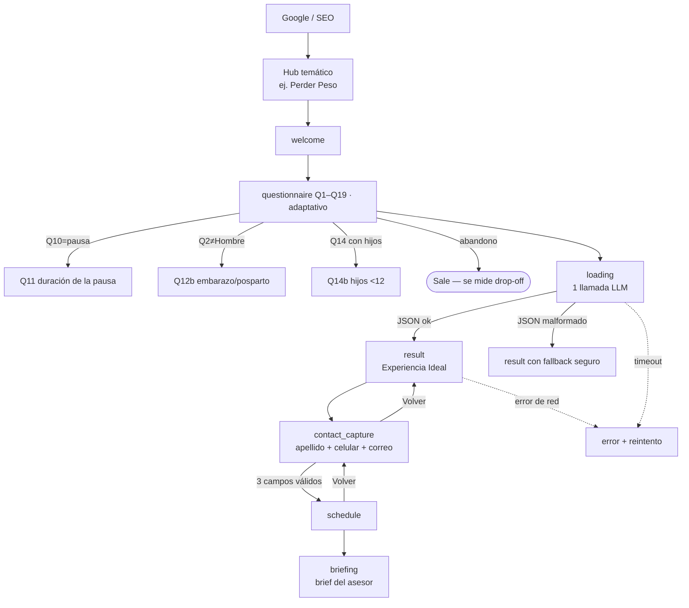

# UX Spec — Experiencia Ideal (captación de leads + SEO) · Sports World

| Campo | Valor |
|---|---|
| Versión | v1.0 (derivada y corregida de 01_UX_Specification_v4_2_10.docx) |
| Fecha | 2026-06-10 |
| Autores | Producto · Diseño · Ingeniería · QA (coautoría pendiente de firma) |
| Estado | En revisión |
| Stack de salida | React + Tailwind `[SUPUESTO — el demo usa estilos en línea; confirmar tokens en Tailwind]` |
| Herramienta de handoff | `[POR DEFINIR — enlazar Figma inspect / Zeplin]` |
| Fuente única de verdad (datos/reglas) | sw_experiencia_ideal_demo_v6_FINAL.jsx + este documento |

> **Nota de método.** Documento **content-complete**: combina la capa estratégica/UX del estándar `ux-spec` (§1–§10) con la **transferencia 1:1** de TODO el documento técnico original (Parts 1–6 + Appendices A–H: 144 secciones y 24 tablas, ver «Parte Técnica»). Nada del original queda fuera; la capa estratégica añade racionalidad, personas, journey, tokens, accesibilidad POUR, conversión, criterios de aceptación y métricas.

---

## 1. Racionalidad del Diseño (Design Rationale)

### 1.1 Cadena de razonamiento (Por qué → Quién → Qué → Cómo)

- **Por qué (meta SMART).** Duplicar el tráfico orgánico del sitio: pasar de **80,000 a 160,000 visitas mensuales en 3 meses**, haciendo el sitio mucho más encontrable en Google mediante una estrategia SEO aplicada a una **nueva estructura de hubs y paginación**. Palanca de ejemplo: un **hub de "perder peso"** captura una de las búsquedas de mayor volumen en México y, por sí solo, tiene potencial de duplicar el tráfico.
 - **Meta secundaria:** duplicar (**2x**) el número de **leads cualificados** que llegan al asesor.
 - **Meta terciaria:** reducir el **tiempo de respuesta al cliente** mediante el **agente de voz** (atención inmediata 24/7).
- **Quién (actores).**
 - *Primarios:* los dos arquetipos CORE del consumer journey (§2): **Family Wellbeing Manager** (Family CWO, Prioridad 1, LTV 3x–4x) y **Urban Hybrid Executive** (Third Spacer, Prioridad 2). Llegan vía búsqueda local en Google y aterrizan por una de 4 puertas (home, club, amenidad/clase, página de objetivo).
 - *Secundario:* el **Asesor** (ventas) que recibe el brief y agenda la visita guiada; el **agente de voz** que responde y coordina.
 - *Fuera de escena:* entrenadores que definen ejercicios en la primera sesión; equipo de marketing/SEO que gobierna los hubs.
- **Qué (comportamiento medible / Jobs to be Done).** El visitante debe: **encontrar** el sitio en Google → **completar** el cuestionario Experiencia Ideal → **dejar** sus datos de contacto → **agendar** la visita guiada. Se mide con: tráfico orgánico, tasa de finalización del cuestionario, leads cualificados y tiempo de primera respuesta.
- **Cómo (táctica/UI).** Arquitectura de **hubs SEO** (páginas indexables de alto volumen) que alimentan el flujo **Experiencia Ideal**: un cuestionario guiado **adaptativo** (15–21 preguntas según género, pausa, hijos y path de peso) que entrega una recomendación personalizada (Bloque 1 pesas · Bloque 2 cardio · Bloque 3 clases) + captura de contacto + brief para el asesor + agente de voz.

### 1.2 Justificación macro (estrategia de negocio)

El motor de crecimiento es **SEO de estructura**, no publicidad pagada. Hoy el sitio recibe 80,000 visitas/mes; el techo está limitado por la **arquitectura de información**: pocas páginas indexables apuntando a búsquedas de alto volumen. La nueva estructura crea **hubs temáticos** (perder peso, masa muscular, salud cardiovascular, etc.) y **páginas paginadas** de clubes/clases, multiplicando la superficie indexable y la relevancia. Cada hub es a la vez una **puerta de entrada SEO** y el inicio del **embudo de conversión** (Experiencia Ideal). Así, el mismo cambio estructural sirve a las tres metas: más tráfico, más leads cualificados y respuesta más rápida.

### 1.3 Justificación micro (decisiones puntuales)

| Decisión | Por qué esta y no otra |
|---|---|
| **Cuestionario único guiado** (adaptativo, 15–21 preguntas) en vez de formulario corto | Es una **herramienta interactiva de valor** (calculadora de "experiencia ideal"): el usuario entrega datos a cambio de una recomendación personalizada, lo que mitiga el rebote de los formularios largos. *Riesgo:* sigue siendo largo → se mide abandono por pregunta (ver §10) y se evalúa perfilado progresivo si el abandono supera el umbral. |
| **Rojo de marca `#E6282A`** reservado a CTA y acentos | Señala acción/conversión; nunca se usa en bloques de texto para no diluir la jerarquía. |
| **Tres bloques de color** (azul/verde/gris) para la recomendación | Segmentan cognitivamente los tres componentes del entrenamiento; reducen carga al separar "qué hago con pesas / cardio / clases". |
| **Captura de contacto DESPUÉS del resultado** | El usuario ya recibió valor (su recomendación); pedir datos en ese momento maximiza la conversión y la calidad del lead. |
| **Lenguaje accesible, sin jerga** ("crecimiento muscular", no "hipertrofia") | El público objetivo no es experto; la jerga aliena y reduce conversión (ver `ux-writing`). |
| **Nombres de subgrupo orientados a objetivo** (6) en vez de nomenclatura ACSM | El usuario se reconoce en su meta ("Bajar de peso"), no en un término técnico de fisiología. |

---

## 2. Personas y Customer Journey

> Audiencia y comportamiento del documento `Consumer Journey — Sports World` (research del cliente), **adaptados a la estructura y al flujo acordados de este spec** (cuestionario Q1–Q19, 6 objetivos Q4, fases `welcome→…→briefing`, 11 tipos de página de Part 3). Donde el journey usa marcos propios (funnel de 8 fases, "10 preguntas", Help Center, member portal, app), **prevalece lo acordado**; del journey se toman los **arquetipos**, las **4 puertas de entrada** y los **insights accionables**.

### 2.1 Personas

Los dos arquetipos CORE son **quién** es el usuario (segmentación por contexto de vida); el **objetivo Q4** que eligen en el cuestionario es **qué** buscan. Los dos ejes conviven: un mismo arquetipo puede elegir distintos Q4.

**P1 — Family Wellbeing Manager ("Family CWO") · CORE Prioridad 1 · dueño del LTV (3x–4x la membresía individual).**
35–50 años · NSE AB/C+ · 1–2 hijos de 4–12 · zonas de alta densidad (Del Valle, Polanco, Satélite, Interlomas, Pedregal). JTBD: *"que el club me devuelva tiempo"* — entrenar mientras los hijos están seguros en FitKidz, sin coordinar tres ubicaciones.
- **Puerta de entrada típica (Rule 16/20):** búsqueda local con foco en hijos ("gym con alberca para niños en [zona]", "natación niños cerca de [escuela]") → aterriza en página de **club** o de **amenidad** (FitKidz/alberca).
- **Señales típicas en el cuestionario:** Q4 = Bajar de peso · Mejorar mi salud cardiovascular · Recuperarme de una lesión; Q6 suele incluir alberca; Q14 = "Yo y mis hijos" (→ Q14b).
- **Lo que la Experiencia Ideal debe lograr:** resaltar FitKidz + alberca del club resuelto y un brief que no re-pregunte la logística familiar. Bloqueo absoluto: cualquier señal de inseguridad infantil. Decisión lenta (1–3 semanas; consulta a la pareja).

**P2 — Urban Hybrid Executive ("Third Spacer") · CORE Prioridad 2 · justifica el precio premium.**
28–45 años · profesional híbrido/remoto · vive o trabaja cerca de un club legacy (Antara, Reforma, Polanco, Santa Fe, Interlomas). JTBD: un **tercer espacio** para romper el día, entrenar y bañarse en condiciones premium.
- **Puerta de entrada típica:** búsqueda hiperlocal o por amenidad ("gym con vapor en Polanco", "club con coworking") → aterriza en página de **club** o de **amenidad**.
- **Señales típicas en el cuestionario:** Q4 = Mejorar mi desempeño atlético · Aumentar masa muscular · Mejorar mi estética corporal; Q7 temprano o post-trabajo.
- **Lo que la Experiencia Ideal debe lograr:** confirmación rápida (agente de voz/WhatsApp), énfasis en amenidades (vapor/sauna/coworking) y multiclub. Decisión más rápida; revisa 5–15 reseñas del club antes de decidir.

**P3 — Asesor (secundaria, interna).** Recibe el brief con banderas y convierte la visita sin re-preguntar lo ya respondido (Appendix G).
**P4 — Agente de voz / BES (secundaria, sistema).** Atiende 24/7, agenda y transfiere a humano.

### 2.2 Customer Journey — el flujo Experiencia Ideal (de Google a la visita guiada)

El journey de este spec es el **flujo on-site acordado**, no el funnel de 8 fases del sector. Ambos arquetipos recorren las **mismas fases**; las divergencias son tácticas (qué se enfatiza).

Las fases técnicas exactas (welcome · questionnaire · loading · result · contact_capture · schedule · briefing · error) y todas las bifurcaciones están en **§3** y **§4**.

### 2.3 Insights del consumer journey que informan el diseño

Cada insight del research se conecta con una regla/sección **ya acordada** (no introduce un marco nuevo):

| Insight del journey | Dónde se atiende en el spec |
| --- | --- |
| Las 4 puertas de entrada revelan intención | Pre-fill por aterrizaje (Rule 16/20); el hub SEO de "perder peso" es la puerta de objetivo |
| Invitación no bloqueante, 1×/sesión, persistente como botón | Comportamiento de invocación del cuestionario (Rule 27) |
| El review-check del club específico decide la conversión | Página de club (Part 3) con fotos reales, horarios, clases, reseñas y amenidades; Club Ideal (Rule 42) |
| Consistencia del asesor entre 49 clubes + confirmación rápida | Brief del asesor (Appendix G) + agenda en tiempo real (fase `schedule`, API del cliente) |
| Meseta silenciosa (sem. 4–6) y regreso tras ausencia = mayor churn | **Fuera del alcance del sitio** (retención/CRM post-venta); se anota como dependencia, no se diseña aquí |
| Benchmarks: NPS 47.3 · retención 66.4% · 50% churn a 6 meses (sector) | Contexto de §10; el sitio impacta **captación**, no la retención post-venta |

> **Precedencia.** El journey describe "10 preguntas, 1 minuto" y artefactos de otra workstream (Help Center, app, member portal). Prevalece lo acordado: **cuestionario oficial 15+6 (Rule 18)**; Help Center fuera de alcance (Rule 37 — lo cubre BES); app/portal son workstreams aparte. La meta de tiempo de completado se mide contra el instrumento oficial (riesgo de abandono, §10.3).

---

## 3. Flujos y Diagrama de Transición

Todas las bifurcaciones (no solo el camino feliz). Fases del sistema: `welcome · questionnaire · loading · result · contact_capture · schedule · briefing · error`.

**Filtro de seguridad (YMYL):** antes de construir el Bloque 3 (clases), el motor aplica el **filtro duro de contraindicaciones** (5 condiciones: lesión, cardiovascular, embarazo, posparto, bariátrica). Las clases contraindicadas nunca aparecen. Detalle completo en el documento técnico (Rule 14b). 

---

## 4. Especificación por Pantalla / Componente

### 4.1 Hub temático SEO (ej. `/perder-peso`)

- **Propósito:** captar tráfico orgánico de alta intención y enrutarlo a Experiencia Ideal.
- **Layout y dimensiones:** grid de 12 columnas; contenedor máx. 1200px; padding 16px móvil / 24px desktop; breakpoints 360 / 768 / 1024 / 1440px.
- **Contenido SEO (mínimo por hub):** H1 con la keyword principal; 600–900 palabras de texto útil; FAQ con `schema.org/FAQPage`; enlaces internos a clubes y clases relacionadas; CTA "Descubre tu experiencia ideal".
- **Metadatos:** `<title>` ≤ 60 car., `meta description` ≤ 155 car., canonical, Open Graph; `lang="es-MX"`.
- **Paginación:** listados de clubes/clases con `rel=next/prev` lógico y URLs limpias `/clubes/cdmx/pagina-2`; evita contenido duplicado con canonical.
- **CTA principal:** botón rojo `#E6282A` → inicia `welcome`.
- **Requisito no funcional:** **LCP < 2.5 s**, **CLS < 0.1**, **INP < 200 ms** (Core Web Vitals — afectan ranking SEO).

### 4.2 Cuestionario (`questionnaire`, Q1–Q19)

- **Propósito:** cualificar y personalizar; recolectar los datos del lead.
- **Estructura (cuestionario oficial):** **15 preguntas base** siempre visibles (Q1–Q10, Q12, Q13, Q14, Q15, Q16) + **6 condicionales**: **Q11** (si Q10=pausa), **Q12b** (si Q2=Mujer), **Q14b** (hijos <12) y **Q17–Q19** (si Q4 incluye Bajar de peso). Total real **15–21** según ruta (ver tabla normativa de conteo en la Parte Técnica).
- **Un paso por pantalla**, barra de progreso, botón "Continuar" deshabilitado hasta responder.
- **Estados interactivos:** opción `default / hover / focus-visible / selected / disabled`; botón `default / hover / active / disabled / loading`.
- **Validación inline (en tiempo real):**
 - Q1 Nombre: requerido, ≥ 2 caracteres.
 - Q8 días / Q7 horarios: multiselección, ≥ 1.
 - Q16 CP **o** zona (XOR): CP = 5 dígitos numéricos.
- **Contenido (UX writing):** preguntas en español MX, voz activa, sin jerga. Concordancia de género si Q2=Mujer (Q3, Q13, Q14).
- **Requisito no funcional:** transición entre preguntas < 100 ms; estado persistido en cliente para no perder respuestas al recargar (solo tras aceptar el aviso de privacidad, ver edge case 6.5).

### 4.3 Resultado — Experiencia Ideal (`result`)

- **Propósito:** entregar la recomendación personalizada (el "valor" a cambio de los datos).
- **Arquitectura visual:** barra superior roja 4px `#E6282A`; 4 tarjetas resumen (objetivo, nivel, horario, con quién entrena); banner CTA rosa `#FFF4F4`/borde `#F3B9BC`; 3 tarjetas de bloque (01 azul `#EEF5FF` · 02 verde `#EDF8F1` · 03 gris `#F3F4F6`); sección de seguridad ámbar `#FFF6E7` con copy contextual; nota legal fija.
- **Bloque 1 (pesas):** uno de **6 nombres accesibles** según objetivo Q4; nunca lista equipo ("Tu entrenador define los ejercicios y el peso en la primera sesión").
- **Bloque 2 (cardio):** máquina + duración + ritmo en lenguaje llano ("ritmo conversacional", no "Zone 2").
- **Bloque 3 (clases):** top 2 clases recomendadas tras el filtro de contraindicaciones, o Personal Training como alternativa.
- **Requisito no funcional:** render con datos de fallback si el LLM devuelve JSON inválido (degradación elegante, sin pantalla en blanco).

### 4.4 Captura de contacto (`contact_capture`)

- **Propósito:** convertir el interés en lead contactable. Aparece **entre** `result` y `schedule`; no se puede agendar sin completarla.
- **Encabezado:** "Antes de agendar" · "{Nombre}, necesitamos un par de datos para confirmar tu visita."
- **Campos, validación y errores (verbatim):**

| Campo | Validación | Error inline |
|---|---|---|
| Apellido | `trim().length ≥ 2` | "Ingresa tu apellido (mínimo 2 letras)" |
| Celular | exactamente **10 dígitos** | "Ingresa un número de 10 dígitos" |
| Correo | `/^[^\s@]+@[^\s@]+\.[^\s@]+$/` | "Ingresa un correo electrónico válido" |

- **Privacidad:** "Tus datos se usan únicamente para coordinar tu visita guiada. No los compartimos con terceros."
- **Estados del botón "Continuar":** rojo cuando los 3 campos son válidos; gris deshabilitado en otro caso.
- **Validación en tiempo real:** el error del correo aparece **mientras escribe**, no al enviar.

### 4.5 Agenda y Brief (`schedule`, `briefing`)

- `schedule`: selección de día/hora; "Volver" regresa a `contact_capture`.
- `briefing`: brief del asesor (10 secciones, 5 generadas por el LLM) con banderas de seguridad. Detalle en el documento técnico (Appendix G).

---

## 5. Matriz de Edge Cases y Estados Condicionales

| Condición | Disparador | Comportamiento de la UI | Mensaje |
|---|---|---|---|
| Estado vacío (sin clases válidas) | Todas las clases contraindicadas | Bloque 3 muestra Personal Training como alternativa | "Tu Asesor define el detalle en la visita." |
| Queda exactamente 1 clase viable (audit L8; real en pabellón-bosques y triángulo-tecamachalco para embarazo) | Filtros dejan 1 clase | Card única + Personal Training como segundo slot | "Esta clase encaja contigo; tu Asesor complementa el resto en la visita." |
| Error de servidor / timeout LLM | 5xx o latencia alta | Render con fallback seguro; opción de reintento | "No pudimos generar tu experiencia. Reintentar." |
| JSON malformado del LLM | Parse falla | Página renderiza secciones hardcodeadas; arrays vacíos | — (silencioso) |
| Texto extremadamente largo | Nombre/club muy largos | Wrap + `text-overflow: ellipsis` en chips | — |
| Conexión lenta | Latencia alta | Skeleton en `loading` + spinner; sin bloqueo | — |
| Fase `loading` (llamada LLM) — NFR (audit L4) | Siempre | Skeleton inmediato (0s); mensaje "Estamos armando tu experiencia…" a los ~5s; timeout con reintento a los ~15s (fallback Rule 39 si reintento falla) | "Esto está tomando más de lo normal. Reintentar." |
| Error de red en `contact_capture`/`schedule` (audit F13) | Falla el submit | Datos retenidos en cliente; botón pasa a "Reintentar" sin perder lo escrito; tras 2 fallos, ofrece WhatsApp/BES como canal alterno | "No pudimos enviar tus datos. Reintentar." |
| Sin cobertura de club cerca | CP/zona sin club | Muestra otros clubes + nota TooFar | "El club más cercano está a {distancia}." |
| Embarazo / posparto / lesión / bariátrica | Q12/Q12b/Q17 | Filtro duro de clases + mensaje de seguridad | Copy contextual de seguridad (§4.3) |
| FitKidz sin nombres de clase (10 clubes) | Estado B | Sección roja genérica, sin chips | "Tu Asesor te compartirá las actividades para tus hijos." |
| Abandono del cuestionario | Cierra antes de Q19 | Se registra la última pregunta vista | — (evento analítico) |

> Revisado con QA en fase de diseño: **`[POR DEFINIR — agendar revisión con QA]`**.

---

## 6. Sistema de Diseño y Tokens

- **Guía de estilo:** ver `DESIGN.md` (tokens + reglas para agentes de IA).
- **Tokens (DTCG/JSON):** paleta extraída del demo (no inventada):

| Rol | Token | Valor |
|---|---|---|
| Acción / marca | `color.brand.primary` | `#E6282A` |
| Tinta (texto) | `color.text.ink` | `#1D1D1B` |
| Texto secundario | `color.text.muted` | `#6B6B68` |
| Texto deshabilitado | `color.text.disabled` | `#A8A8A6` |
| Borde | `color.border.default` | `#E5E5E3` |
| Superficie | `color.surface.base` | `#F5F5F4` |
| Bloque 01 (pesas) | `color.block.strength` | `#EEF5FF` |
| Bloque 02 (cardio) | `color.block.cardio` | `#EDF8F1` |
| Bloque 03 (clases) | `color.block.classes` | `#F3F4F6` |
| Banner CTA | `color.cta.bannerBg` / `color.cta.bannerBorder` | `#FFF4F4` / `#F3B9BC` |
| Seguridad (YMYL) | `color.safety.bg` | `#FFF6E7` |

- **Componentes/patrones reutilizados:** tarjeta de bloque, tarjeta resumen, chip/pill, banner CTA, sección de seguridad, campo con validación inline, barra de progreso.

---

## 7. Accesibilidad (WCAG 2.2 AA) — POUR

> Estándar del proyecto: **WCAG 2.2 AA** (gate axe-core bloqueante), mapeo preventivo. Nota: la **EAA es legislación de la UE**; Sports World opera solo en México, así que el marco aplicable es WCAG 2.2 AA + riesgo legal local, no la EAA.

### Perceptible
- **Contraste:** validar cada token de texto sobre su fondo ≥ **4.5:1** (texto normal) / **3:1** (grande). Ratios reales medidos del rojo `#E6282A`: 4.47:1 sobre blanco, 4.09:1 sobre `#F5F5F4`, 3.78:1 sobre `#1D1D1B` — los tres **fallan** AA para texto normal. Para texto en rojo usar `#C81E20` (~5.5:1). El blanco sobre rojo solo pasa a ≥18.66px bold (ver tokens DESIGN.md).
- **No solo color:** el estado "seleccionado" de una opción usa **borde + check**, no solo color. La sección de seguridad usa **icono "!" + texto**, no solo el ámbar.
- **Alt text:** toda imagen de hub/club lleva `alt` descriptivo (sintaxis: "{tipo} en {club}, {acción}").

### Operable
- **Tab order** lógico: progreso → opciones → Continuar. Foco visible (`focus-visible` ring de 2px).
- Ningún control depende solo de gesto; multiselección operable por teclado (Espacio/Enter).

### Comprensible
- `lang="es-MX"` declarado. Mensajes de error en voz activa y específicos ("Ingresa un número de 10 dígitos").
- Concordancia de género consistente (Q2=Mujer).

### Robusto
- Cambios dinámicos anunciados con `aria-live="polite"` (confirmación de cita, errores de validación). `role="alert"` en errores de envío.
- Marcado semántico: `<fieldset>/<legend>` por pregunta, `<label>` por campo.

**Checklist por pantalla:** contraste ✔ · alt ✔ · tab order ✔ · foco visible ✔ · idioma ✔ · aria-live ✔ → ejecutar auditoría con plugin antes de front-end.

---

## 8. Handoff y Sincronización

- **Fuente de verdad:** demo `sw_experiencia_ideal_demo_v6_FINAL.jsx` (comportamiento) + este spec (racionalidad) + `DESIGN.md` (tokens). Handoff visual: `[POR DEFINIR — Figma inspect]`.
- **Activos:** iconos vectoriales (SVG), exportables; logotipo "SPORTS WORLD" (peso 800).
- **Riesgo de Design Drift mitigado por:** tokens centralizados (`DESIGN.md`) y componentes respaldados por código (el demo es la referencia funcional).

---

## 9. Criterios de Aceptación

- [ ] Cada hub renderiza H1 con keyword, FAQ con datos estructurados, canonical y metadatos válidos.
- [ ] Core Web Vitals en verde en móvil (LCP < 2.5 s, CLS < 0.1, INP < 200 ms).
- [ ] El cuestionario avanza una pregunta por pantalla; Q11/Q12b/Q14b aparecen solo con su condición.
- [ ] No se puede llegar a `schedule` sin los 3 datos de contacto válidos.
- [ ] El Bloque 3 nunca muestra una clase contraindicada según Q12/Q12b/Q17.
- [ ] Si el LLM falla, la página de resultado renderiza con fallback (sin pantalla en blanco).
- [ ] Todos los textos de error son inline, en voz activa y específicos.
- [ ] Contraste de todos los pares texto/fondo ≥ 4.5:1 (o 3:1 grande), validado por linter.
- [ ] Cambios dinámicos anunciados a lectores de pantalla (aria-live).
- [ ] `lang="es-MX"` declarado en todas las páginas.

---

## 10. Métricas y Experimentación

### 10.1 KPIs

| Métrica | Punto de partida | Meta (3 meses) | Tipo |
|---|---|---|---|
| **Tráfico orgánico mensual** | **80,000 visitas** | **160,000 (2x)** | KPI principal |
| **Leads cualificados / mes** | `[SUPUESTO: 1,000]` | **2x** | Secundario |
| **Tiempo de primera respuesta** (agente de voz) | `[SUPUESTO: horas]` | **< 1 min, 24/7** | Secundario |
| Tasa de finalización del cuestionario | `[SUPUESTO: 40%]` | `[SUPUESTO: ≥ 55%]` | Diagnóstico |
| Tasa de agenda (visita guiada) | `[SUPUESTO: 12%]` | `[SUPUESTO: ≥ 20%]` | Conversión |

> Cifras marcadas `[SUPUESTO]` son de referencia; reemplazar con datos reales de analítica.

### 10.2 Lead scoring y enrutamiento

Reubicado a `anexo-ingenieria-crm.md` (audit R14: lógica de CRM/ventas sin comportamiento de UI, pesos `[SUPUESTO]`).

### 10.3 Perfilado progresivo (recomendación)

El cuestionario único es un riesgo de abandono. **Instrumentar drop-off por pregunta**; si Q1→Q19 cae por debajo de `[SUPUESTO: 50%]`, dividir en **2 etapas**: (1) mínimo viable (nombre + objetivo + zona) para dar una recomendación preliminar, (2) detalle antes de agendar.

### 10.4 A/B testing

**No priorizado por ahora** (decisión de negocio). Cuando se active, marcar como variables: titular del hub, copy del CTA ("Agenda tu visita" vs "Descubre tu experiencia ideal"), e imagen hero. Construir estos componentes desde ya como **slots intercambiables** para no rehacer.

---

## Apéndice — Preguntas abiertas al cliente (datos; auditoría 2026-06-11)

Estas preguntas BLOQUEAN el gate médico (F11) y deben resolverse con Sports World antes de congelar la matriz. Ninguna se resuelve internamente.

| ID | Pregunta | Dato |
| --- | --- | --- |
| D1 🔴 | ¿Cuál es la disponibilidad por club de TONE, TAI CHI, AERO DANCE, SENSUAL DANCE, **ALPHA TRAINER** y **SWIM TRAINERS**? (sin columna en la matriz fuente; hoy `rankClasses` las descarta siempre) | ¿O se documentan "en catálogo, sin programación actual"? |
| D2 🔴 | Sin SWIM TRAINERS, la única acuática programada es AQUA ZUMBA (31 clubes) → el top 2 acuático es imposible. ¿Se programa SWIM TRAINERS o se acepta render de 1 card + PT (edge L8)? | Flujo Q6=alberca |
| D3 🟠 | 14 clubes CON alberca no ofrecen AQUA ZUMBA (barranca, cumbres, la-rioja, león, metepec, palmas, paseo-interlomas, terraza-coapa, pedregal, san-jerónimo, san-pedro, puebla, bernardo-quintana, culiacán). ¿Programación pendiente o estado esperado? | Edge alberca |
| D4 🟠 | 5 clubes ofrecen AQUA ZUMBA SIN flag de alberca (amores, antara, anzures, reforma, roma). ¿Flag mal o clase mal asignada? | Contradicción de la fuente |
| D5 🟡 | 6 columnas no oficiales en la matriz sin destino: BEAT N BIKE (2), INTRINITY (1), BOX 1 (2), INICIACIÓN TKD (3), ECROSS (3), FÚTBOL (3). ¿Incorporar con ficha+contraindicaciones o excluir? | Catálogo |
| D6 🟡 | Confirmar 3 mapeos SUPUESTOS: AE YOGA→AEROYOGA (2 clubes) · HATHA YOGA 90→HATHA YOGA (4) · VINYASA YOGA 90→VINYASA YOGA (6) | Catálogo |
| D7 🟠 | FitKidz: la matriz trae 21 actividades infantiles; el spec declara 34. ¿Faltan 13 columnas o se corrige el número? | Rule 11 / Rule 30 |
| D8 🟠 | 4 de los 10 amenity hubs sin fuente de datos: sauna/vapor, regaderas/lockers, café, estacionamiento. ¿De dónde salen? | 145 páginas firmadas |
| F10 🟡 | kids_classes de los 10 clubes State-B (pregunta rastreada con Gabriela) | FitKidz Estado B |
| F14 🟡 | Confirmar schema Event para las 51 páginas de clase (tabla Rule 13 reconstruida de origen corrupto) | SEO |

## Apéndice — Trazabilidad con el documento técnico

Este spec **no reemplaza** las reglas de ingeniería; las ordena bajo el estándar UX. Se conservan y referencian: cuestionario Q1–Q19 (Rule 18/19), modelo de 6 subgrupos (mapeo Q4), filtro de contraindicaciones YMYL (Rule 14b), captura de contacto (Rule 32b), brief del asesor (Appendix G) y llamada única al LLM (Appendix H) del documento `01_UX_Specification_v4_2_10.docx`.

---

---

# Parte Técnica — Transferencia 1:1 del documento original

> Transcripción fiel y completa de `01_UX_Specification_v4_2_10.docx` (todos los encabezados, párrafos y tablas, en su orden original). Las **tablas con celdas combinadas** se renderizan con la celda en su primera columna y el resto del span en blanco. Donde el `.docx` trae **campos vacíos** en el origen, aparecen en blanco (no se inventan).

> ⚠️ **Zonas afectadas por corrupción del `.docx` ORIGEN — estado de reconstrucción.** El archivo fuente traía texto partido a media palabra y campos de Word vacíos. Reconstruido en este pase (gravedad real: media, casi todo recuperable):
> - **Marca (Part 1 / Rule 8):** ✅ reconstruido → "premium fitness" / FitKidz "premium family fitness".
> - **Rule 13 — Schema markup:** ✅ reconstruido con tipos estándar schema.org (confirmar con ingeniería).
> - **Rule 2 — labels desktop:** ✅ reconstruido; los labels acortados (480–1023 y <480) venían vacíos → definir con diseño.
> - **Rule 29 — tags del menú contextual:** menor; reconstruible de Rules 26–31.
> - **Part 3 — diagrama de Information Architecture:** ❌ era una **imagen**; no recuperable como texto (la IA real está en el «Page inventory»). Requiere re-exportar del `.docx` o rehacer el diagrama.
> Documento en **DRAFT** hasta confirmar estas reconstrucciones + re-exportar el diagrama.

Sports World Website - UX Specification

Document type: UX Specification (also known as a Behavior Specification) Version: 4.2 Issue date: Jun 2026 Status: Source of truth for design and engineering. Supersedes v4.1, v4.0 and v3.0.

### Document Control

##### Intended audience

This document is the single source of truth for the behavior of the Sports World public website. It is written for four reading audiences:

- Designers building the screens and interaction patterns.
- Engineers implementing them.
- Content and SEO teams populating each page.
- Client-side stakeholders signing off on each approval gate.
If a behavior is not described here, it does not exist on the site. If a behavior contradicts this document, this document wins until a new version is issued.

##### How to read this document

The document is organized in six parts plus four appendices.

- Part 1- Project Fundamentals. Audience, business objectives, brand positioning, success measures.
- Part 2 - Conventions. Methodology declaration, code conventions, language conventions, scope boundary, how to read the matrices.
- Part 3 - Information Architecture. The 11 page types in scope plus the BES widget, the page count, the architecture diagram.
- Part 4 - Global Rules (Rule 1 to Rule 43). Behavior that applies across the entire site.
- Part 5 - Per-Page Behavior Matrices. One matrix per page type, showing what the user sees in each possible landing scenario.
- Part 6 - Edge Cases & Error States. What the site does when the happy path fails.
- Appendix A - Privacy & Data Handling (Rule 36).
- Appendix B - Out-of-Scope Pages (Rule 37).
- Appendix C - Glossary.
- Appendix D - Code Reference.
Rules are numbered globally so they can be referenced unambiguously.

##### Revision history

| Version | Date | Description |
| --- | --- | --- |
| 1.0 | Feb 2026 | Initial draft (sitemap + header rules). |
| 2.0 | Mar 2026 | Added questionnaire and contextual menu logic. |
| 3.0 | May 2026 | Added per-page matrices for the 12 page types. |
| 4.0 | May 2026 | Restructured to industry UX Specification format. Added Project Fundamentals, Conventions, Edge Cases & Error States. Tightened glossary. |
| 4.1 | May 2026 | Strict-adherence revision applying industry best practices (UXmatters / NN/G / Atlassian). Corrected brand positioning to Premium fitness (Premium family fitness only on FitKidz). Declared mobile-first as the methodology. Restructured BES as a global floating widget with /bes as fallback URL. Added BES + WhatsApp reminder behavior with consent. Added explicit membership-no-checkout rule. Enumerated the 4 live data points per club. Adopted YMYL as canonical term. Refined cross-linking, schema markup, FitKidz IA, tap targets. Removed references to employee photographs. Added search-query precedence rule, stale-plan refresh and explicit accessibility floor. |
| 4.2 | Jun 2026 | Adaptive questionnaire redesigned: 10→15 base questions + 6 conditionals (Q11, Q12b, Q14b, Q17, Q18, Q19); new individual-training pages; Rule 38 added; hub Tonificar renamed to Estética corporal. |
| 4.3 | Jun 2026 | Consolidation pass per exhaustive audit (2026-06-11): unified Q6=alberca logic (aquatic variant, never suppress Block 1), single Block 3 ranking algorithm (Rule 40 + Q6 filter + no-apto drop), Q12b gating moved to Q2 ≠ Hombre (YMYL safety), health-data consent moment defined at Q12, template contrast/touch-target fixes, six-subgroup bridge table, pre-fill dedupe, loading NFR, open client-data questions annexed. |

##### A note on language

The Sports World website is delivered in Spanish (Mexico) to end users. Throughout this specification, button names and other production UI labels are kept in their Spanish form, with an English gloss in parentheses on first mention. The descriptive prose around them is in English

to serve a multilingual production team. Internal system codes (such as CIUDAD-1, ( CIUDAD-

ZMVM1 Q17 ) are kept in Spanish because they map directly to implementation identifiers and

must remain identical in code, copy CMS, and design files.

## Part 1- Project Fundamentals

##### End-user audience

The site serves three primary user types, in priority order:

- Prospective members researching a gym - intent-driven, often arriving from external search ("gimnasio Polanco", "bajar de peso gym", "yoga estudio").
- Existing members performing self-service tasks - checking schedules, locating amenities, asking the conversational assistant about hours, cancellations, or freezes.
- Parents and family decision-makers researching the children's program (FitKidz) - exploratory rather than class-name-specific search behavior.

##### Business objectives

The site is rebuilt to fix three measurable problems with the previous site:

| Problem | Cause | Solution in the new site |
| --- | --- | --- |
| The site appears in less than 1% of "gym for losing weight" searches | No dedicated weight-loss page existed | Hub at /bajar-de-peso/ with YMYL-compliant content and medical sign-off |
| The site ranks outside the top 100 results for "yoga near me" | Class pages were not optimized | One dedicated page per class (51 adult classes + the FitKidz hub absorbing 34 children's activities) with structured markup |
| Searches like "gym near me" land on the homepage instead of the closest club | The previous site did not detect location | The new site detects location and routes to the closest club (Rule 15) |

##### Brand positioning

The site's brand is **premium fitness**. Three implications:

The FitKidz sub-brand is **premium family fitness**.

- Considered typography, generous spacing, editorial photography.
- Direct, measured language. No forced enthusiasm, no exclamation marks, no all-caps marketing copy, no question-bait headlines.
- Family framing applies only on FitKidz pages. Everywhere else the framing is individual or personalized. The rest of the site speaks to one user at a time, not to "the family".

##### Success measures

| Measure | Target |
| --- | --- |
| Organic traffic visibility on "bajar de peso" cluster | Top 10 in target queries within 90 days of launch |
| "Gym near me" → closest club routing accuracy | 100% of geolocated sessions routed to the closest open club |
| Class-page organic visibility | Top 50 for the 51 adult classes within 90 days |
| Core Web Vitals on mobile p75 | LCP < 2.5 s, INP < 200 ms, CLS < 0.1 |
| Accessibility | WCAG 2.2 AA on every page |

### Part 2 - Conventions

##### Methodology: mobile-first

The site is designed and engineered mobile-first as a methodology, not as a responsive afterthought. Every layout, interaction, and rule in this specification is to be implemented starting from the mobile viewport and progressively enhanced upward. El ÚNICO sistema de breakpoints es el de los tokens (DESIGN.md): mobile 360 · tablet 768 · laptop 1024 · desktop 1440 (audit C11; la media query de 720px del template legado debe migrar a 768). The opposite - designing desktop and "making it responsive" later- is non-conformant.

Where this specification describes a desktop-only behavior (such as interactions in Rule

5), the rule is explicit about its viewport scope. The mobile equivalent is always specified.

##### Code conventions

The specification uses several immutable identifier systems. Once assigned, a code never changes meaning and is never reused for a different element. If an element is removed from the site, its code is retired permanently and not reassigned.

| Code system | Format | Examples | Meaning |
| --- | --- | --- | --- |
| Pagetype | numeric, 1-11 | Page type 2 = Individual club | Eleven canonical page types in the 145-page scope. BES is a global widget (Rule 3). |
| Question | Q+number (+variant) | Q1, Q4, Q12, Q16, Q17, Q18, Q19 | Questionnaire questions. |
| City classification | CIUDAD- +tag | CIUDAD-1, POCOS, CIUDAD-ZMVM | Number of clubs in the user's city. |
| Rule | Rule + number | Rule 7, Rule 25 | Global rules in Part 4. |
| Article tag | lowercase, hyphenated | bajar-de-peso, clase-spinning, amenidad-alberca | Content tags for the Journal cross-linking system (Rule 29). |

##### Language conventions

- End-user UI strings: Spanish (Mexico). Imperative second-person familiar for CTAs
( Visi ta un club , not Visi te un club ). Mexican Spanish vocabulary ( checar , platicar , Aqui empieza todo - not the peninsular Aqui comienza todo ). No English calques.

- Specification prose: English, for the production team.
- Internal system codes: Spanish, never translated.

##### How to read the per-page matrices

Each per-page matrix in Part 5 has three columns:

- State - combination of two factors: (a) whether the user has completed the questionnaire, and (b) whether the user has a club identified.
- Questionnaire - the number of questions presented after pre-filling. If a question is omitted entirely (the special Individual Club case for Q15 and Q16), it does not count. If a question is pre-filled but editable, it still counts as a visible question.
- Contextual menu - the buttons that appear in the page's body content for that state. The header buttons (always visible per Rules 1-2) and the BES widget (always visible per Rule 3) are not repeated in each matrix.
The contextual button appears in matrices only on pages

where tagged articles are reasonably expected to exist (the hub, goal hubs,

Personal Training). On other pages the button still appears dynamically when matching articles are tagged, but it is not documented in the matrix because it is variable.

##### Scope boundary - what this specification does NOT cover

The following subjects are intentionally out of scope of this specification.They are governed by other partner-facing documents.

- Visual production rules (which photographs to use, AI-generated image guidelines, video shot lists, employee imagery policies, asset volume targets) - these live in the partner brief, Section 6.
- Technical stack choices (framework, CMS, hosting, observability, performance tooling) - these live in the partner brief, Section 5.
- Brand asset creative direction (typography selection, color palette, logo, mood references)
- these live in the brand asset pack delivered to the partner in Week 1.

- Project process (approval gates, deliverable schedule, vendor capabilities, commercial terms) -these live in the partner brief.
- Content production rules (anti-duplicate-content scoring, Spanish-MX register details beyond CTAs, Journal article selection criteria) - these live in the content workstream brief.

### Part 3 - Information Architecture

##### Page inventory

The site has 11 canonical page types in scope plus the BES conversational assistant, which is implemented as a global floating widget rather than a destination page.

| # | Page type | Count | URL pattern | Health-sensitive (YMYL) |
| --- | --- | --- | --- | --- |
| 1 | Home | 1 | / | No |
| 2 | Individual club | 49 | /clubes/[club]/ | No |
| 3 | Amenity | 10 | /amenidades/[amenidad]/ | No |
| 4 | Premium Les Mills class | 7 | /clases/signature/[clase]/ | No |
| 5 | Regular class | 44 | /clases/[clase]/ | No |
| 6 | FitKidz | 1 | /fitkidz/ | No |
| 7 | Goal hub | 5 | /perfiles/[objetivo]/ | Only rehabilitation |
| 8 | Bajar de peso hub | 1 | /bajar-de-peso/ | Yes (YMYL) |
| 9 | Personal Training | 1 | /personal-training/ | No |
| 10 | Memberships | 6 (1 hub + 5 plans) | /membresias/ and /membresias/[plan]/ | No |
| 11 | Journal article | 20 | /diario/[articulo]/ | Some, yes |

Total signed pages:1 + 49 + 10 + 7 + 44 + 1 + 5 + 1 + 1 + 6 + 20 = 145pages.

BES. The conversational assistant is a global floating widget present on every page (Rule 3). It

also exposes a fallback URL for users without JavaScript and for deep-linking. BES is

delivered as a separate workstream with its own specification; this document covers only its integration points and behavioral interfaces with the rest of the site.

##### Detail on certain page types:

- The 5 goal hubs are: first steps, health and wellness, body aesthetics, build strength, rehabilitation.
- The 5 membership plans are: UniClub, AllClub, Black Pass, Pink Plan, and the 21-Day Promo.
- The 10 amenity hubs are: pool, INTENZ (functional training zone), FitKidz, boxing ring, climbing wall, courts, sauna and steam room, showers and locker rooms, cafe, and parking.
- "FitKidz" appears both as a page type (the parent hub) and as one of the 10 amenities. The FitKidz hub is the fully-built page; the FitKidz amenity entry is a pointer that links to it.
- The FitKidz hub absorbs all 34 children's activities. Children's activities do not have individual pages; they are organized within the hub by age range, discipline type, and club availability.
- Architecture diagram: *(diagrama visual — entregable de diseño Semana 1; el «Page inventory» de arriba es el contenido autoritativo)*

The diagram above is a textual approximation. The design team produces the formal IA diagram as a Week-1 deliverable. Anti-orphan rule: every page must be reachable from at least two other pages. The cross-linking matrix is enforced by Rule 10.

##### Individual-training subgroup taxonomy

User-facing Block 1 subgroup names follow the six accessible labels mapped from the user's primary Q4 goal (see the Q4-to-subgroup mapping in this section): Cuerpo completo con peso moderado, Definición muscular por zonas, Crecimiento muscular con carga creciente, Fuerza explosiva y velocidad, Mantenimiento de fuerza general, Pesas guiadas con énfasis en técnica controlada. The ACSM prescription, equipment and citation detail that follows is the internal protocol reference and is not shown to the user; the technical names (Fuerza, Hipertrofia, Potencia, Resistencia muscular, LISS, MICT, HIIT, SIT) live only in fichas, subpage URLs and backend identifiers.

Two top-level individual-training pages are added as class pages (they fall under the class page type and do not change the eleven canonical page-type count): entrenamiento-con-pesas-individual and entrenamiento-aerobico-individual. Each maps to six subgroups (one per Q4 goal; official names in «Catálogo oficial — Programas de entrenamiento individual»), grounded in ACSM consensus. A third, aquatic block (Entrenamiento acuático) activates when Q6 = "En la alberca"/"Ambas" and the resolved club has a pool. The weight-training subgroups follow the ACSM Position Stand 2026 (Currier BS, D'Souza AC, Singh MAF, et al. "Resistance Training Prescription for Muscle Function, Hypertrophy, and Physical Performance in Healthy Adults: An Overview of Reviews." Medicine & Science in Sports & Exercise 2026. DOI: 10.1249/MSS.0000000000003897). The aerobic subgroups follow the ACSM/ESSA Joint Expert Statement 2024 ("Physical Activity and Exercise Intensity Terminology." Journal of Science and Medicine in Sport 2024). Pre-fill and result behavior for these pages is governed by Rule 38.

Las **prescripciones técnicas ACSM por subgrupo** (series, repeticiones, %1RM, descansos, equipo, DOIs) viven en `anexo-clinico.md` §2 (owner: validación MD; audit R6 — el propio texto admite "not shown to the user" y el scope boundary de Part 2 las excluye del behavior spec).

##### Q4 goal to subgroup mapping (Rule 38)

| Q4 goal | Block 1 — Fuerza y desarrollo muscular (nombre oficial · detalle) | Block 2 — Cardio y resistencia (nombre oficial · máquina · duración) |
| --- | --- | --- |
| Bajar de peso | **Fuerza integral con pesas** (cuerpo completo, peso moderado) | **Cardio continuo moderado** · caminadora/bici/elíptica · 35–45 min |
| Mejorar mi estética corporal y definición muscular | **Rutina por grupos musculares** (definición por zonas) | **Cardio moderado con intervalos** · caminadora/bici/elíptica · 25–35 min |
| Aumentar masa muscular | **Desarrollo muscular progresivo** (carga creciente) | **Cardio ligero de mantenimiento** · caminadora suave/bici · 15–25 min |
| Mejorar mi desempeño atlético | **Potencia y velocidad** (fuerza explosiva) | **Intervalos intensos 4×4** · bici/remo/caminadora · 30–40 min |
| Mejorar mi salud cardiovascular | **Fuerza de mantenimiento** (fuerza general) | **Base aeróbica 80/20** · caminadora/bici/elíptica/remo · 35–45 min |
| Recuperarme de una lesión o dolor crónico | **Fuerza guiada en máquinas** (técnica controlada) | **Recuperación activa de bajo impacto** · bici reclinada/elíptica/caminadora muy suave · 15–25 min |

If Q4 has two selections (allowed up to two), the recommended set is the union of both rows, deduplicated.

##### Catálogo oficial — Programas de entrenamiento individual

Tres familias oficiales (Fuerza y desarrollo muscular · Cardio y resistencia · Entrenamiento acuático), 6 sub-clases cada una, mapeadas a los 6 objetivos Q4. El detalle completo (tablas de mapeo y estados `clínico`/`inferido`) vive en `anexo-clinico.md` §3 (audit R9 — datos pendientes de confirmación del cliente). El bloque acuático se activa cuando Q6 = "En la alberca"/"Ambas" y el club resuelto tiene alberca (Rule 39).

##### Flujo de aplicación del cuestionario — Experiencia Ideal + resumen del lead (conforme a `sw_experiencia_ideal_demo_v6_FINAL.jsx`)

> **Regla de precedencia (cliente):** donde el demo contradiga los catálogos acordados (**51 clases**, **cuestionario oficial**) **prevalece lo acordado** y se ajusta el flujo. Contradicciones ya resueltas a favor de lo acordado: catálogo = **51 clases** (NO 56 — `DANZA AEREA`, `FLYBOARD`, `INTERVAL`, `FULL BODY`, `GIMNASIA DE GRUPOS`, `ACUAEROBICS` quedan fuera); **Q18** = peso actual · estatura · **cintura** (no "edad"). Mapeo de nombres crudos del demo → canónicos: `FUN TRAC`→FUNTRAC · `KINETICS BALL`→KINETIC BALL · `SH BAM`→SH'BAM · `JAZZ 90`→JAZZ · `GRIT DEMO`→GRIT · `TRAINT BOOST DEMO`→TRAINT BOOST · `HAWAIANO`→RITMOS LATINOS · `FIT Y DANCE`→FIT DANCE · `ACUAZUMBA`→AQUA ZUMBA.

**1. Flujo del cuestionario (`getQuestions`).** 15 base + 6 condicionales (ver tabla normativa). Disparadores: Q11 si Q10 = "Regreso después de una pausa"; Q12b si Q2 ≠ "Hombre" (audit L1 — incluye "Prefiero no mencionarlo", con fraseo neutro); Q14b si Q14 ∈ {"Yo y mis hijos","La familia completa"}; Q17/Q18/Q19 si Q4 incluye "Bajar de peso". Conjugación de género en Q3, Q13, Q14 cuando Q2 = Mujer.

**2. Resolución de bloques (`resolveBlocks`, Q6-aware).** Objetivo primario = primer Q4 seleccionado.
- **Q6 = "En la alberca"** → si el club tiene Alberca: Block 1 y Block 2 usan las **variantes acuáticas**; si no tiene alberca: bloques secos + nota "este club no tiene alberca; revisa otros clubes cerca".
- **Q6 = "Ambas"** → Block 1 seco; Block 2 seco + alternativa acuática si el club tiene alberca.
- **Q6 = "Lo que mi entrenador recomiende"** → bloques secos; el entrenador decide piso/alberca en la 1ª sesión.
- **Q6 = "En piso / área seca"** → bloques secos.
- **Block 3 (clases grupales)** se muestra solo si Q13 ≠ "Solo/Sola, a mi ritmo" (si entrena solo → Block 3 OFF; el menú renombra "Clases recomendadas" → "Tu rutina individual").

**3. Block 1 (Fuerza) y Block 2 (Cardio): mapeo Q4 → subgrupo + protocolo** = las 3 familias oficiales (ver «Catálogo oficial» arriba). El demo aporta `protocol` y `why` por objetivo; variantes acuáticas (Q6 = alberca) en `AQUATIC_BLOCK_1/2`.

**4. Ranking de clases grupales (`rankClasses`) — sobre las 51 canónicas:**
1. Solo clases que el **club ofrece** (catálogo por club).
2. **Filtro Q6**: "En la alberca" → solo acuáticas; "En piso" → solo secas.
3. **Filtro Q9 nivel**: la clase debe incluir el nivel del usuario.
4. **Filtro duro de contraindicaciones** (Q12, Q12b, Q17 → claves l/c/e/p/b): excluye clases contraindicadas (matriz de 51).
5. **Score por Q4** (`profiles`): top3 = +3, apto = +1, **no apto = descarta la clase**. Multi-Q4 acumula. **Nota (C8):** el algoritmo canónico es Rule 40 (añade desempates Q3 +2, Q5 +1, Q7 +1/+0.5); esta implementación del demo debe extenderse para igualarlo.
6. Orden por score desc + alfabético → **top 2** + "también encajan" (3–5).

**5. Llamada única al LLM (`callClaude`) — produce el reporte del cliente Y el brief del asesor** (1 sola llamada; modelo y parámetros en `anexo-ingenieria-crm.md` R12). System-prompt: prohíbe "plan" (usar "tu experiencia ideal"/"rutina"), códigos Qn y jerga técnica; reglas YMYL (no diagnosticar/prescribir; el asesor valida con criterio clínico). Defense-in-depth: `stripQCodes` recursivo borra cualquier Qn que el LLM filtre.

Claves JSON exactas:
- **Reporte del cliente:** `hook` (≤30 pal., conecta con Q3) · `plan_argument` (≤45, sin "plan", cierra en personalización) · `intent_line` (≤18, refleja Q13/Q14) · `infrastructure_argument` (≤55, cita 49 clubes + clasificación por objetivo + club) · `class_1_connector` / `class_2_connector` (≤15 c/u, "Porque mencionaste que…", solo si Block 3).
- **Resumen del lead (asesor):** `validation_questions` (**exactamente 5**, ≤18 c/u) · `visit_route` (**4 pasos**: Conectar con su objetivo · Tour enfocado · Resolver bloqueador · Cerrar con siguiente paso) · `proposal` {`main` ≤35, `complement` ≤30} · `closing_priorities` (**exactamente 3**, ≤12 c/u) · `closing_script` (≤60, 1ª persona asesor→lead).

**6. Banderas que priorizan el brief** (derivadas de respuestas): `fromOtherGym`, `hasMedical` (+ trimestre si embarazo, tiempo en tratamiento si GLP-1), `wantsAquatic` (comodidad real en agua), `isFamily`+`hasKids` (servicios/ FitKidz para hijos), `isPrincipiante` (primer ingreso), `fromPause` (motivo y duración).

**7. Contexto médico (`medicalContext`)** se inyecta al prompt cuando `hasMedical`: lista condiciones; embarazo/posparto (clases de impacto ya filtradas); GLP-1 (priorizar fuerza para preservar masa muscular); bariátrica; recordatorio de que el filtro grupal ya excluye contraindicadas y el asesor ajusta protocolos individuales con criterio clínico.

## Part 4 - Global Rules

##### Header and global widgets Rule 1 - Desktop header structure

The header is fixed to the top of the screen on every page. It contains five elements, from left to right:

- Sports World logo - always returns to the home page on click.
- Tu Sports World (Your Sports World) - opens a side drawer with the 8 main hubs of the site (Rule 4).
- Diseña tu experiencia (Design your experience) - opens the questionnaire (Rules 18-21).
- Pregúntale a BES (Ask BES) - opens the BES global widget (Rule 3).
- Agenda tu visita (Book your visit) - red pill button leading to the guided-visit booking flow (Rule 6).
Items 2, 3, and 4 are three parallel paths through the site. They share equal hierarchy: the user picks whichever they prefer. Item 5 is the only conversion action and is treated visually differently.

##### Rule 2 - Mobile header structure

On screens narrower than 1024 pixels, the four left-side elements do not fit on a single row. The solution is two stacked rows:

##### Row1(header,56px):

- Row 2 (editorial strip, 44 px):
and [Agenda tu visita].

.

The labels shorten according to the available width:

| Screen width | Labels shown |
| --- | --- |
| 1024 px and up (desktop) | Tu Sports World • Diseña tu experiencia • Pregúntale a BES |
| 480 to 1023 px (tablet / large mobile) | [labels acortados — venían VACÍOS en el origen; definir con diseño] |
| Below 480 px (small mobile) | [íconos / labels mínimos — venían VACÍOS en el origen; definir con diseño] |

##### Rule 3 - BES global widget

BES is the Sports World conversational AI assistant - text-first, with voice as an optional input/output mode. It is implemented as a global floating widget present on every page of the site, lazy-loaded so it does not affect Largest Contentful Paint.

- Floating button. A persistent floating button appears bottom-right on every page on every viewport. Tap or click opens the chat panel.
- Chat panel. Slides in over the current page (does not navigate to a new URL). Mobile: full-screen panel with close button. Desktop: 420-pixel-wide right-side panel.
- Default mode: text input and text response. A toggle in the panel header switches to voice input and voice output.
- Header entry point. The header element point that opens the same panel.
(Rule 1)is a redundant entry

- Fallback URL . Users without JavaScript, users following a shared link, and search-
engine indexers reach a server-rendered fallback page that hosts a graceful message and the same chat interface as a non-floating layout.

- Context-passing. When opened, BES knows the current page type and any contextual identifiers (club tag, amenity slug, goal slug, class slug). This lets BES answer page-specific questions without the user re-stating context.

##### Rule 3.1 - What BES does NOT do:

- It does not directly execute cancellations, freezes, plan changes, or refunds. It captures the request, performs basic identity validation, opens a ticket in the client's CRM, and offers to connect the user with a human asesor.
- It does not answer deep health questions. It redirects them to the corresponding hub
( Bajar de peso or off.

- It does not promise outcomes.
goal hub), which carries the medical reviewer's sign-

##### Rule 3.2 - WhatsApp scope:

- Visit reminders only. When a user books a guided visit, BES schedules two WhatsApp template messages: one 24 hours before the appointment, one 2 hours before. The messages are templated and informational; they do not require user reply.
- Consent. The phone number is captured during the booking flow with explicit opt-in to WhatsApp reminders. Without opt-in, no WhatsApp message is sent and the visit reminder falls back to email.
- Out of scope. BES does not use WhatsApp for sales, account changes, or any other communication category.
Rule 4 - Side drawer ((Tu Sports World)) - contents

On hover (desktop) or tap (mobile) over(Tu Sports World1 a side drawer slides in from the right containing the 8 main hubs:

- Tu Club ideal (Your ideal club-find theclosest club).
- Clases (catalog of the 51adult classes).
- Amenidades (the 10 amenities in the system).
- FitKidz (children's program).
- Bajar de peso (medically-backed hub).

##### Personal Training.

- Membresias.
- Diario (Journal - editorial articles).
The drawer is a 560-pixel wide panel on desktop and full screen on mobile. It includes a footer with social links and a privacy notice.

The three header items (Diseña tu experiencia), ( Pregúntale a BES), and (Agenda tu visita) are not in the side drawer. Each piece of navigation lives in exactly one place to avoid duplication.

##### Rule 5 - Side drawer behavior

- Desktop: opens on hover over (Tu Sports World) with a 200-millisecond delay to prevent accidental triggers. Closes when the cursor leaves the drawer with a 300-millisecond grace period.
- Mobile: opens on tap. Closes on tap outside the drawer or on tap of any item.
- Animation: slides in from the right in 320 milliseconds. Exits in 240 milliseconds.
- Backdrop: while open, the rest of the page is covered with a semi-transparent veil with a blur ((backdrop-blur 12 px )plus a black overlay at 40% opacity).
- Manual close: an "X" at the top left of the drawer closes it.
- Keyboard: (Esc) closes the drawer. (Tab) cycles focus only within the drawer while open (focus trap).

##### Rule 6 - button (header CTA)

- Visual treatment: pill button (rounded corners, capsule-style) with brand red background and white text.
- Position: pinned to the right of the header on every page in every navigation state. This is the only exception to the "each thing lives in one place" rule, because it is the site's primary conversion action and must always be reachable in a single tap.
- On press: leads to the guided-visit booking flow. If the user has not completed the questionnaire yet, the questionnaire is presented as a prerequisite step before confirming the appointment.

##### Rule 7 - Header scroll behavior

The header stays pinned to the top of the screen as the user scrolls. Its height does not change. Its background is solid (subtle transparency and blur for a premium feel: background opacity 0.85, backdrop-blur 8px), unchanged across scroll positions.

##### Brand and editorial

Rule 8 - Brand positioning

See Part 1, Brand Positioning. Site brand is **premium fitness**

FitKidz sub-brand is **premium family fitness** (Premium

family fitness). Family framing applies only on FitKidz pages.

##### Rule 9 - Editorial rules for all copy

The following rules apply to every piece of copy on the site:

- No exclamation marks. Not even on CTAs.
- No marketing-style all-caps text. Capitals are only allowed for logos, acronyms ((BES), (GLP-
I)), or the initial letter of proper nouns.

- Noemoji.
- No anglicisms where a Spanish word exists. Use membresia, not membership; asesor, not
advisor; agenda, not book.

- No question-bait headlines ( and descriptive.

##### Rule 10 - Required cross-linking between pages

Each page must link to its related pages. No orphan pages.

). Headlines are direct

| From | To | Direction |
| --- | --- | --- |
| Each club page | Each amenity it offers | Bidirectional |
| Each amenity page | Each club that offers it | Bidirectional |
| Each class page | Each club where the class is offered | Bidirectional |
| Each Journal | At least one related hub, and at least one club if | One-way (article➔hub/club) |
| article | geographic relevance exists | |
| Personal Training page | Each of the 5 goal hubs | Bidirectional |
| Each goal hub | Personal Training page | Bidirectional (counterpart of |
| | | the above) |

##### Site data and structured markup Rule 11 - Confirmed site data

| Item | Value |
| --- | --- |
| Total clubs | 49 |
| States with clubs | 13 |
| Clubs in the Mexico City Metropolitan Area (CDMX + Estado de México) | 32 |
| Clubs outside that area | 17 (across 11 states) |
| Adult classes | 51 (7 Premium Les Mills + 44 regular) |
| FitKidz children's activities | 34 |
| Goal hubs | 5 |
| Amenity hubs | 10 |
| Membership plans | 5 (plus the hub) |
| Initial Journal articles | 20 |
| Total signed pages (Workstream B scope) | 145 |

##### Rule 12 - Live data per club

Each individual club page (page type 2) displays the following four data points pulled live from the client's API:

- Operating hours by day of week.
- Phone and email for the club.
- Class catalog-which of the 51adult classes and which FitKidz activities are offered at this specific club.
- Class schedule - by class, by day, with times.
If the API is unavailable, the page falls back to the last successfully cached value with a visible notice; see Edge Case 6.8.

##### Rule 13 - Schema markup (schema.org)

Each page type carries the corresponding structured data so search engines can understand its content:

| Page type | Required schema.org types |
| --- | --- |
| Club pages | HealthClub + OpeningHoursSpecification (one entry per day per club) + GeoCoordinates (latitude, longitude verified) |
| Class pages (premium and regular) | Event (per scheduled class) — *confirmar con ingeniería* |
| Bajar de peso hub | MedicalWebPage + the medical reviewer with credentials (name and cédula profesional) |
| Goal hubs and any page with FAQs | FAQPage |
| Journal articles | Article (author with credentials when applicable) |
| Every page (except home) | BreadcrumbList |

> Tabla **reconstruida** desde el `.docx` origen corrupto (texto partido a media palabra); tipos estándar schema.org. **Confirmar con ingeniería/SEO** antes de producción.

All structured data must validate against Google's Rich Results Test before publication.

##### Rule 14 - YMYL content rules

The following pages are classified as YMYL (Your Money or Your Life - Google search-quality terminology for content that could affect a user's health or finances):

- The hub (entire page).
- The rehabilitation goal hub.
- Some Journal articles on nutrition, rehabilitation, and supplementation.
The following requirements apply to all YMYL pages:

- Visible professional sign-off- thename and Mexican professional license number (cedula profesional) of the physician, nutritionist, or physical therapist backing the content.
- Health disclaimer - before recommendations are shown, the user must see a disclaimer stating that the information is orientational and does not substitute a medical consultation.
- No numerical promises - the site never says "you will lose X kilos in Y weeks." Plans are
presented in phases ( promising a specific outcome.

,

) without

(Rules about whether photos of the medical reviewer can be displayed are visual-asset production rules and live in the partner brief, Section 6, not here.)

##### Rule 14b - Contraindications matrix for group classes (YMYL hard filter)

The Clases recomendadas block (Block 3) applies a hard contraindication filter before ranking — Rule 40 step 4. Contraindicated classes never appear in the user's recommendation and are never named in user-facing copy (the page does not surface what was removed). The filter maps questionnaire answers to five internal condition keys:

| Condition key | Condition | Triggered by |
| --- | --- | --- |
| lesion | Lesión o dolor articular/muscular | Q12 includes "Lesión o dolor articular/muscular" |
| cardiovascular | Condición cardiovascular o de presión | Q12 includes "Condición cardiovascular o de presión" |
| embarazo | Embarazada | Q12b = "Sí, embarazada" |
| posparto | Posparto reciente (<6 meses) | Q12b = "Sí, posparto reciente (últimos 6 meses)" |
| bariatrica | Cirugía bariátrica | Q17 includes "Cirugía bariátrica" |

Matriz de contraindicaciones reorganizada por beneficio sobre el catálogo canónico de 51 clases (ver tabla siguiente). Las 3 clases que no estaban en el catálogo final (DANZA AEREA, INTERVAL, FLYBOARD) fueron eliminadas.

**Contrato del filtro (permanece aquí):** 5 claves de condición — l (lesión), c (cond_cardiovascular), e (embarazo), p (posparto), b (bariátrica) — mapeadas desde Q12/Q12b/Q17; exclusión dura ANTES del ranking (Rule 40 paso 5); las clases excluidas jamás se nombran al usuario. **Los datos** (matriz de 51 clases por beneficio×contraindicación + fichas de perfil por objetivo Q4) viven en `anexo-clinico.md` §1 como única fuente, bajo gate de validación MD bloqueante (audit R7–R8).

##### Out of the matrix — contextual messaging only (no class filtered)

GLP-1 (Ozempic, Wegovy, Mounjaro): no classes are filtered. The research-based clinical recommendation is to PRIORITIZE strength to preserve muscle mass during treatment. A soft info message renders: "Durante tu tratamiento con GLP-1, priorizar clases de fuerza preserva tu masa muscular mientras bajas grasa. Tu Asesor lo confirma en la visita guiada."

"Otra, la comento en el club" (Q12) and "Otro tratamiento médico para peso" (Q17): open-ended responses trigger an asesor-review soft message: "Mencionaste una condición o tratamiento médico. Tu selección de clases grupales ya excluye las clases contraindicadas, y tu Asesor ajusta los protocolos de pesas y cardio individual en la visita guiada según tu criterio clínico."

Research basis: ver `research_contraindicaciones_audit.md` (protocolo v2, 9 fuentes profesionales, etiquetas epistémicas [QUOTED]/[DERIVED]/[INFERRED]) — audit R3. Sports-medicine MD validation is **required (blocking gate)** before production YMYL deployment (see open dependencies).

##### User acquisition and routing

Rule 15 - Mapping search queries to pages

When a user runs a search engine query related to Sports World, the site must take them to the page that best answers that query.

| Query type | Examples | Landing page |
| --- | --- | --- |
| Pure brand search | sports world, sports world mexico | Home |
| Brand + specific location | sports world polanco, sports world antara | The specific club's page |
| Gym near me | gimnasio cerca de mi, gimnasio polanco | Closest club via geolocation; if location cannot be detected, lands on Home with the club-search flow open |
| Amenity + location | alberca cdmx, yoga estudio polanco | The amenity hub |
| Specific class | body pump, spinning cdmx, pilates reformer | That class's page |
| Personal goal | estética corporal, ganar masa muscular, primeros pasos en el gym | Corresponding goal hub |
| Weight loss | bajar de peso, perder peso gym, GLP-1 ozempic gimnasio | Bajar de peso hub |
| Rehabilitation | rehabilitación rodilla gym, ejercicio post lesión | Rehabilitation hub |
| Children / family | gimnasio para niños, actividades familia, FitKidz | FitKidz |
| Personal Training | entrenador personal, personal trainer cdmx | Personal Training |
| Pricing and memberships | precio sports world, uniclub vs allclub | Memberships hub |
| Fitness information | calorias spinning, diferencia body pump vs combat | Journal article on the topic |
| Sports World specific information / cancellations, freezes, support | horario polanco, alberca en antara | Home with the BES widget opened |

##### Rule 16 - Inferring information from the external search query

When a user lands on the site from an external search, the system can infer only two

questionnaire variables from what they searched:

- Goal (Q4) - only if the search contained an explicit goal (weight loss, body aesthetics, strength, conditioning and endurance, injury or pain recovery).
- Location (Q15 and Q16) - only if the search contained a specific location.
The following inferences are not drawn:

- A class search (external query) does not fill in the goal, because the same class can serve multiple goals. (Landing on a class hub still pre-marks Q4 per Rule 20.)
- An amenity search does not fill in movement preference (Q5 or Q6), because amenity preference does not determine training style.
- Scope note: Rule 16 governs ONLY inference from the external search query. Landing-page pre-fills are governed by Rule 20 and Rule 20 is authoritative where they overlap: FitKidz landing pre-fills Q14, Personal Training landing pre-fills Q13, and class/goal-hub landing pre-marks Q4.
- Landing on the Bajar de peso hub does not force the weight-loss optionals; those optionals
only activate when the user actually marks Q4 = Bajar de peso in the questionnaire.

- Landing on a page through internal navigation infers nothing. Only the external search that brought the user to the site counts toward variable inference.
Exception. When the user presses the button inside the site and provides their

location through that flow, the location populates Q16 automatically. This is not search inference

- it is direct capture from a user interaction.

##### Rule 17 - Search-query precedence (multiple competing inferences)

When a query combines elements that map to multiple inferences (e.g.,[ yoga Polanco bajar de peso)- a class+ a location+ a goal), the system applies a single precedence:

Q4 (goal) > Q16 (location) > class-driven goal pre-mark (the movement-aligned goal inferred from a class search)

Concretely: for the example query, the user lands on the Bajar de peso hub (Q4 wins) with Q16 pre-filled to Polanco. The class-driven goal pre-mark is not applied because the goal-driven landing overrides the class-driven landing.

- The (Diseiia tu experiencia) questionnaire

#### Rule 18 - The base questionnaire (15 base + 6 conditional)

Per the official questionnaire, there are 15 base questions always shown (Q1–Q10, Q12, Q13, Q14, Q15, Q16) plus six conditional questions: Q11 (only if Q10 = "Regreso después de una pausa"), Q12b (only if Q2 = Mujer), Q14b (only if Q14 = "Yo y mis hijos" or "La familia completa"), and the weight-loss conditionals Q17, Q18, Q19 (only if Q4 includes "Bajar de peso", see Rule 19). Visible count ranges 15–21 (normative table below). Pregnancy is not an option inside Q12 — captured separately in Q12b. Question copy is production Spanish (MX); type descriptors are engineering notes. All pre-filled answers remain editable.

| Code | Question (ES MX) | Type | Options / Field |
| --- | --- | --- | --- |
| Q1 | ¿Cómo te llamas? | Text, required | Texto libre. Placeholder: "Tu nombre completo". |
| Q2 | Género | Single-select, required | Hombre · Mujer · Prefiero no mencionarlo |
| Q3 | ¿Qué quieres sentir al salir del club? | Single-select, required | Desconectado/a del trabajo y la rutina · Renovado/a y de buen ánimo · Parte de una comunidad saludable · Confiado/a en que mi cuerpo no me va a fallar · Más a gusto conmigo mismo/a (feminine forms if Q2 = Mujer) |
| Q4 | ¿Qué buscas? | Multi-select, max 2, required | Bajar de peso · Mejorar mi estética corporal y definición muscular · Aumentar masa muscular · Mejorar mi desempeño atlético · Mejorar mi salud cardiovascular · Recuperarme de una lesión o dolor crónico |
| Q5 | ¿Qué ritmo va contigo? | Single-select, required | Suave/controlado · Moderado y constante · Intenso, que me rete |
| Q6 | ¿Dónde prefieres entrenar? | Single-select, required | En piso / área seca · En la alberca · Ambas · Lo que mi entrenador recomiende |
| Q7 | ¿En qué horario prefieres entrenar? | Multi-select, required | Temprano (5:00–8:00) · Media mañana (8:00–11:00) · Mediodía (11:00–14:00) · Primera tarde (14:00–17:00) · Tarde (17:00–20:00) · Noche (20:00–22:00) |
| Q8 | ¿Qué días prefieres entrenar? | Multi-select, required | L · M · X · J · V · S · D |
| Q9 | ¿Cuál es tu nivel de entrenamiento? | Single-select, required | Principiante · Intermedio · Avanzado |
| Q10 | ¿Vienes de otro gimnasio? | Single-select, required | Sí, vengo de otro gimnasio · Nunca he ido a un gimnasio · Regreso después de una pausa |
| Q11 | ¿Qué tan larga fue la pausa? | Single-select, conditional (visible if Q10 = Regreso después de una pausa) | Menos de 3 meses · Entre 3 y 12 meses · Más de un año |
| Q12 | ¿Tienes alguna condición médica? | Multi-select, required | Ninguna · Lesión o dolor articular/muscular · Condición cardiovascular o de presión · Otra, la comento en el club (helper cuando Q2 ≠ Hombre: "Solo condiciones médicas. Embarazo no es una condición." (lo pregunta Q12b después); helper cuando Q2 = Hombre: "Solo condiciones médicas." — pregnancy captured separately in Q12b) |
| Q12b | ¿Estás embarazada o en posparto reciente? | Single-select, conditional (**visible unless Q2 = Hombre** — incluye "Prefiero no mencionarlo", audit L1: la privacidad de género no puede eliminar el screening médico; con "Prefiero no mencionarlo" se usa fraseo neutro "¿Aplica para ti alguna de estas situaciones?") | Sí, embarazo · Sí, posparto reciente (últimos 6 meses) · No |
| Q13 | ¿Prefieres entrenar solo o acompañado? | Single-select, required | Solo/Sola, a mi ritmo · Acompañado/Acompañada, en clases o grupo · Me da igual |
| Q14 | ¿Con quién nos visitas en el club? | Single-select, required | Solo/Sola · Con mi amigo/a · Con mi pareja · Yo y mis hijos · La familia completa |
| Q14b | ¿Uno o más de tus hijos tiene menos de 12 años? | Single-select, conditional (visible if Q14 = "Yo y mis hijos" or "La familia completa") | Sí · No |
| Q15 | ¿Buscas el gimnasio cerca de tu casa o de tu trabajo? | Single-select, required | Cerca de mi casa · Cerca de mi trabajo · Ambos · No me importa |
| Q16 | ¿Dónde queda? | Two fields, at least one required (OR) | Helper: "Llena uno: código postal o colonia." Campo A: Código postal (5 dígitos) · Campo B: Colonia (autocompletado SEPOMEX en implementación → CP + colonia + estado; texto libre como fallback, edge case 6.3). Al menos uno debe estar presente; ambos es aceptable. |

Gender concordance (Q3, Q13, Q14). If Q2 = Mujer, render feminine forms ("Desconectada", "Renovada", "Confiada", "conmigo misma", "Sola", "Acompañada"). Otherwise the masculine default applies.

##### Rule 19 - The weight-loss optionals (Q17 to Q19)

> Aclaración (C-audit M6): "optionals" = **condicionales del path de peso**: solo aparecen si Q4 = Bajar de peso, pero **una vez en ese path son obligatorias** (no se pueden saltar). El descriptor de tipo "required" es correcto.

When the user marks Q4 = Bajar de peso, three optional questions (Q17 to Q19) are appended after Q16. They are shown for no other goal; in particular, Q4 = Mejorar mi estética corporal does not trigger them.

| Code | Question (ES MX) | Type | Options / Field |
| --- | --- | --- | --- |
| Q17 | ¿Estás tomando algún tratamiento para bajar de peso? | Multi-select, conditional (visible if Q4 includes Bajar de peso) | GLP-1 (Ozempic, Wegovy, Mounjaro) · Cirugía bariátrica · Acompañamiento nutricional con especialista · Otro tratamiento médico para peso · Ninguno. Helper: "Solo tratamientos activos. Las condiciones médicas ya las anotaste antes." |
| Q18 | Tus datos físicos actuales | Numeric, 3 fields, required | Peso actual kg (30–300) · Estatura cm (120–230) · Cintura cm (40–200). Ayuda: "Esta información permite construir un plan seguro. Se almacena bajo consentimiento LFPDPPP." |
| Q19 | ¿Cuál es tu objetivo de cambio? | Single-select, required | 1 a 3 kilos · 3 a 6 kilos · 6 a 10 kilos · 10 a 15 kilos · Más de 15 kilos · Sin un número específico. Ayuda: "Sin promesas clínicas — los rangos son referencia, no compromiso." |

Before the result is rendered, a YMYL health-disclaimer modal is shown, carrying the medical reviewer's signature (see Rule 14). This applies only to the weight-loss path. For visible-question counts per path, the normative count table (Rule 32) is the single source: base 15, +3 on the weight-loss path (18), plus the other conditionals as applicable.

##### Rule 20 - Question pre-filling based on landing page

When the user lands on a specific page, the system pre-fills the questions it can already infer from the landing. Every pre-filled answer remains editable.

| Landing page | Pre-filled / inferred | Behavior |
| --- | --- | --- |
| Home | None from landing. Q3, Q4 or Q15 may be inferred from the external search query per Rule 16. | If the external search includes a location, Q15 and Q16 are pre-filled. |
| Individual club page | Q15 and Q16 omitted entirely. | The count drops by 2 for this entry path. |
| Amenity hub | None. | |
| Premium or regular class hub | Q4 pre-marks the movement-aligned goal. | The class-to-goal map is the Block 3 fichas table (perfil por objetivo Q4) under Rule 14b — see «Fichas de clases grupales (Block 3)». |
| FitKidz | Q14 pre-fills "Yo y mis hijos". | |
| Goal hub — Primeros Pasos | Q9 pre-marks "Principiante". | |
| Goal hub — Salud y Bienestar | Q4 pre-marks "Mejorar mi salud cardiovascular". | |
| Goal hub — Estética corporal | Q4 pre-marks "Mejorar mi estética corporal". | Renamed from Tonificar. |
| Goal hub — Ganar Fuerza | Q4 pre-marks "Aumentar masa muscular" (audit L7: el hub habla de fuerza, no de potencia explosiva). | |
| Goal hub — Rehabilitación | Q4 pre-marks "Recuperarme de una lesión o dolor". | |
| YMYL hub — Bajar de peso | Q4 pre-marks "Bajar de peso", which activates Q17 to Q19. | |
| Personal Training | Q13 pre-marks "Acompañado/Acompañada". | |
| Memberships, Journal | None. | |
| entrenamiento-con-pesas-individual (and subpages) | Q13 pre-marks "Solo, a mi ritmo" (or "Sola" if Q2 = Mujer). Subpages pre-mark Q4: Fuerza → "Mejorar mi desempeño atlético"; Hipertrofia → "Mejorar mi estética corporal"; Potencia → "Mejorar mi desempeño atlético"; Resistencia muscular → "Mejorar mi salud cardiovascular". | New. |
| entrenamiento-aerobico-individual (and subpages) | Q13 pre-marks "Solo, a mi ritmo" (or "Sola" if Q2 = Mujer). Subpages pre-mark Q4: LISS → no pre-mark; MICT → "Mejorar mi salud cardiovascular"; HIIT → "Mejorar mi estética corporal"; SIT → "Mejorar mi salud cardiovascular". | New. |

Pre-fill is always editable by the user.

##### Rule 21 - Goal selection allows up to two goals

Q4 (goal) is always multi-select with a maximum of two goals. The user may choose one or two of the six goal options, in any combination. There is no longer a weight-loss-specific exception: the former single-select-unless-weight-loss behavior of legacy P1 is retired. When two goals are selected, the result page and the individual-training recommendations use the union of both goals' mappings, deduplicated, per Rule 38 and Part 3, Individual-training subgroup taxonomy.

##### Membership and conversion

Rule 22 - Membership pages do not have checkout

The 6 membership pages (1 hub+ 5 plans) display each plan's description, what is included, what is not, the price, the fine print, and a comparison. They do not include a transactional checkout.

The conversion path from a membership page is Agenda tu visita guiada, which captures the lead and routes it to the call center or to the relevant club for a guided in-person visit. The actual sale of the membership happens in person at the club or by phone with the call center, not on the site.

Rule 23 - The

##### button - when it appears and how it behaves

button appears in the contextual menu when:

- The user is on a page that is not an individual club page, and
- The user is not inside their ideal-experience flow.
On individual club pages, Tu Club ideal does not appear because the user is already at a club.

Instead, 0tros clubes en tu ciudad (Other clubs in your city) or (Other clubs in the area) may appear, depending on Rule 24.

##### Behavior on press:

| Situation | What happens on press |
| --- | --- |
| No location inferred | The system prompts the user with questionnaire questions Q15 and Q16 (geography intent: home, work, school, other; then city / neighborhood / ZIP). |
| Location inferred from external search | The system presents Q15 and Q16 pre-filled with the inferred location. The user can confirm or change. |

After capturing the location, the system applies the geographic rules (Rule 24) to surface clubs based on how many clubs exist in the indicated city.

##### Rule 24 -

The

on three factors:

##### button - when it appears and how it behaves

button only appears on individual club pages. Its label and behavior depend

##### Factor 1 - How many clubs exist in the current club's city:

| City type | Definition |
| --- | --- |
| CIUDAD-UNO | Only 1 club in the city. |
| CIUDAD-POCOS | 2 or 3 clubs in the city. |
| CIUDAD-ZMVM | More than 3 clubs (Mexico City and Estado de México metro area, 32 clubs). |

Factor 2 - Whether the user has already explicitly chosen a club via the questionnaire. Factor 3

- Whether the system has location inferred from the external search.

##### Button behavior:

| City type | User state | Button label | Action on press |
| --- | --- | --- | --- |
| CIUDAD-UNO | Any | (the button does not appear) | — |
| CIUDAD-POCOS | User has a club identified (by landing, selection or inference) | Otros clubes en tu ciudad | Shows the other 1 or 2 clubs in the city. No additional options. |
| CIUDAD-ZMVM | User has a club identified | Otros clubes en el área | Two options: (1) clubs near the current club (10 km radius); (2) clubs near a different location — the system asks if it is home, work, school or other, then city / neighborhood / ZIP, then applies the city-count filter for the new city. |
| CIUDAD-ZMVM | No club identified, no inferred location | Tu Club ideal | The system prompts Q15 and Q16 from the questionnaire to identify the club. |

##### The contextual menu

Rule 25 - What the contextual menu is

The contextual menu is the set of buttons that appear as primary actions inside the body content of a page, not in the header. It changes based on the page and the user's state at the moment of landing.

There are two kinds of buttons in the contextual menu:

- Always-on buttons, subject to global conditions that apply across nearly all pages.
- Page-specific buttons that depend on the content of that particular page.

##### Rule 26 - always appears

In the contextual menu of every page, in every state, the (Book your

guided visit) button appears. It is the site's conversion action. There are no exceptions. This is the

body-content counterpart of the header same booking flow.

button (Rule 6); both lead to the

##### Rule 27- appears when the questionnaire is incomplete

As long as the user has not completed the questionnaire, Diseña tu experiencia appears in the contextual menu of every page. The system needs to capture the questionnaire variables and remind the user that this option is available. Once the questionnaire is complete, [ Diseña tu experiencia)stops appearing in the contextual menu (the button stays in the header per Rule 1, but it does not duplicate inside the body).

##### Rule 28- appears when the questionnaire is complete

Once the user has completed the questionnaire, Volver a tu experiencia ideal (Back to your ideal experience) appears in the contextual menu. It replaces the Diseña tu experiencia button. It takes the user back to their personalized plan output.

Rule 29- - when it appears

Each Journal article carries one or more tags that associate it with relevant pages on the site. Possible tags include:

• •

When a user lands on a page and at least one Journal article exists with a tag matching that page, the contextual menu shows the Artículos o información útil button, which expands to display the relevant articles. If no articles are tagged for that page, the button does not appear.

##### Rule 30 - FitKidz-specific buttons

On the FitKidz page, in addition to the general buttons, a specific button -[ Clases Fi tKidz disponibles) (Available FitKidz classes) - appears once the user has a club identified. On press, it shows the FitKidz classes offered at that user's club, with their schedules.

This button does not appear when the user has no club identified, because each club has a different subset of the 34 FitKidz activities, and showing them all without context would be misleading.

The 34 FitKidz activities are organized within the FitKidz hub by:

- Age range (toddlers, kids, pre-teens, teens- concrete ranges set by the content team).
- Discipline type (aquatic, athletic, expressive, martial, fitness).
- Club availability (which clubs offer this activity).

##### Rule 31 - Buttons shown when surfacing clubs in FitKidz

When the user is on FitKidz and the system surfaces up to 3 proposed clubs (per the geographic rules in Rule 24), each of the 3 clubs is presented with three of its own buttons:

1.

2.

selected.

3.

(View the club) - leads to the individual club page.

(Book a guided visit) - guided-visit flow with that club

(Available FitKidz classes for your

family) - shows the FitKidz classes at that specific club, with schedules.

##### Rule 32 - User state with respect to the questionnaire

To build the contextual menu of each page, the system classifies the user into one of three states:

| State | Description |
| --- | --- |
| No questionnaire | The user has not completed the questionnaire. |
| Complete, inside the flow | The user completed the questionnaire and reached this page by clicking a button from their personalized plan (e.g., "View your club" from the result screen). |
| Complete, outside the flow | The user completed the questionnaire previously but reached this page through a different path (external search, internal navigation, etc.). |

When the user has completed the questionnaire, they always have a club identified - the questionnaire questions that identify the club (Q15 and Q16) are part of the 15 base questions. Visible-question count by path (base 15 plus conditionals): 15 with no conditionals; +1 if Q11 (pause); +1 if Q12b (Q2 = Mujer); +1 if Q14b (children <12); +3 if Q17–Q19 (Q4 includes Bajar de peso). Range 15–21. See the normative count table below.

> **Tabla normativa de conteo de preguntas (cierra C5):**

| Condición activa | Se añade | Δ |
| --- | --- | :-: |
| Base — siempre visible | Q1–Q10, Q12, Q13, Q14, Q15, Q16 | **15** |
| Q10 = "Regreso después de una pausa" | + Q11 | +1 |
| Q2 = Mujer | + Q12b | +1 |
| Q14 ∈ {"Yo y mis hijos", "La familia completa"} | + Q14b | +1 |
| Q4 incluye "Bajar de peso" | + Q17, Q18, Q19 | +3 |
| **Mínimo** (sin condicionales) | | **15** |
| **Máximo** (todas activas) | | **21** |

##### Rule 32b - Contact-capture step (between result and scheduling)

After the Experiencia Ideal result and before calendar selection there is one mandatory intake screen (phase token: contact_capture). The flow is: result → contact_capture → schedule → briefing. The user cannot proceed to date/time selection without providing apellido, celular and correo. This is NOT a questionnaire question; it is a post-questionnaire intake step and is excluded from the Q1-Q19 count.

Header copy (verbatim): eyebrow "Antes de agendar"; H2 "{firstName}, necesitamos un par de datos para confirmar tu visita."; helper "Tu Asesor te contactará para coordinar el horario y enviarte los detalles del club."

| Field | Label | Placeholder | Validation | Error message (verbatim) |
| --- | --- | --- | --- | --- |
| lastName | Apellido | Tu apellido | trim().length >= 2 | Ingresa tu apellido (mínimo 2 letras) |
| phone | Número de celular | 10 dígitos · ejemplo: 5512345678 | digits.length === 10 | Ingresa un número de 10 dígitos |
| email | Correo electrónico | tu@correo.com | /^[^\s@]+@[^\s@]+\.[^\s@]+$/ | Ingresa un correo electrónico válido |

Privacy disclaimer below the fields (verbatim): "Tus datos se usan únicamente para coordinar tu visita guiada. No los compartimos con terceros."

Navigation: "← Volver" returns to the result phase; "Continuar" is red when all three fields are valid and gray-disabled otherwise. On Continuar the trio is stored as result.contact = { lastName, phone, email } and the flow advances to schedule. The back button from schedule returns to contact_capture (not result). The asesor brief renders the full name as {Q1} {lastName} and surfaces phone and email as the contact channels for CRM.

##### Rule 33 - Summary of which buttons appear in each state

Questionnaire state

Global contextual-menu buttons

No questionnaire Tu Club ideal (where applicable)· Diseña tu experiencia ·[ Agenda tu visita guiada)· Artículos o información útil (ifanytaggedarticles exist) • page-specific buttons

Complete, inside the flow

Complete, outside the flow

Volver a tu experiencia ideal • specific buttons

útil) (if any tagged articles exist)· page-specific buttons

·page-

##### System-wide behavior Rule 34 - Stale-plan refresh

A questionnaire-complete user whose plan was generated more than 60 days ago is shown a non-blocking prompt offering to refresh the plan with current life context ([LSigue siendo tu objetivo? )). The plan continues to be available unchanged if the user does not interact with the prompt. This prevents stale recommendations from biasing the contextual menu indefinitely.

##### Rule 35 - Accessibility floor

Every page on the site meets WCAG 2.2 AA. Specifically:

- Minimum color contrast 4.5:1 for body text and 3:1 for large text and UI components.
- Full keyboard operability with visible focus rings.
- Semantic HTML landmarks.
- ARIA labels on icon-only buttons.
respected for animations.

- Touch targets ;;:: 44 x 44 px (Apple HIG) and ;;:: 48 x 48 dp (Material) on mobile.
- No interaction relies on hover alone.

##### Rule 38 - Individual-training pre-fill and result behavior when the user trains alone

The site offers two top-level individual-training experiences, entrenamiento-con-pesas-individual and entrenamiento-aerobico-individual, each mapping to six subgroups — one per Q4 goal, with the official names of the Catálogo oficial (see Part 3 and the bridge table below) — grounded in ACSM consensus. When the user lands on any page within these two trees, Q13 pre-marks "Solo, a mi ritmo" (rendered "Sola" if Q2 = Mujer), and Q4 pre-marks the goal that corresponds to the subgroup landed on, per the mapping in Rule 20.

When Q13 = "Solo, a mi ritmo" (or "Sola, a mi ritmo") in the final answer, the user's Experiencia Ideal result page does not recommend group classes. Instead it recommends: (1) the individual weight-training subgroup or subgroups that match Q4 per the table in Part 3, Individual-training subgroup taxonomy; (2) the individual aerobic-training subgroup or subgroups that match Q4 per the same table. If Q4 contains two selections, the recommended set is the union of both rows, deduplicated.

The class catalog is suppressed for this user state. The contextual menu (Rules 22-31) reflects this: where it would normally show "Clases recomendadas", it instead shows "Tu rutina individual".

##### Rule 39 - Combined plan structure of the Experiencia Ideal result page

Every user who completes the questionnaire receives a combined personalized plan composed of three structured blocks, presented in this order:

1. Entrenamiento con pesas individual - one of the six official subgroups (Part 3, Catálogo oficial).

2. Entrenamiento aeróbico individual - one of the six official subgroups (Part 3, Catálogo oficial), with user-facing presentation per Part 5 (machine, duration, and when relative to pesas), not the technical ACSM name.

> **Tabla puente — protocolo técnico (fichas ACSM) ↔ nombre oficial (cierra C5):**
>
> | Protocolo técnico (ficha) | Nombre oficial (Bloque 1) | Nombre oficial (Bloque 2) |
> | --- | --- | --- |
> | Fuerza (strength) | Fuerza integral con pesas / Fuerza de mantenimiento (según Q4) | — |
> | Hipertrofia | Rutina por grupos musculares / Desarrollo muscular progresivo (según Q4) | — |
> | Potencia | Potencia y velocidad | — |
> | Resistencia muscular | Fuerza guiada en máquinas | — |
> | LISS | — | Cardio ligero de mantenimiento / Recuperación activa de bajo impacto |
> | MICT | — | Cardio continuo moderado / Base aeróbica 80/20 |
> | HIIT | — | Cardio moderado con intervalos / Intervalos intensos 4×4 |
> | SIT | — | (componente de Intervalos intensos 4×4, fase sprint) |

3. Clases recomendadas - two top group classes with explanation, plus collapsible additional classes.

Each block is default ON. A block is set OFF only when an explicit suppression condition applies. The system is auditable: any reviewer can predict which blocks the user sees by reading their questionnaire answers.

Block 1 (Pesas) — Q6 NEVER suppresses Block 1 (lógica única, adoptada del demo v6 y propagada a Appendix F y Part 5): when Q6 = "En la alberca" AND the resolved club has a pool, Block 1 renders its AQUATIC variant (e.g., "Fuerza acuática con equipo" per the Catálogo oficial); if the club has no pool, Block 1 renders the dry variant with the no-pool note (edge case "aquatic preference but the ideal club has no pool"). The ONLY suppression trigger is Q12 containing a condition flagged in the subgroup ficha as an absolute contraindication. Otherwise ON, with subgroup per the Q4 mapping in Part 3.

Block 2 (Aeróbico) suppression: a Q12 unstabilized cardiovascular condition without clearance restricts it to Cardio suave (LISS) only, or OFF. Otherwise ON, with subgroup per the Q4 mapping in Part 3 and user-facing presentation per Part 5.

Block 3 (Clases) suppression: Q13 = "Solo, a mi ritmo" (or "Sola, a mi ritmo") sets it OFF, per Rule 38. Otherwise ON, with selection per Rule 40 and presentation per Rule 41.

Q6 special cases: "Ambas" leaves Blocks 1 and 2 both ON, and the aerobic block may prefer aquatic when the club has a pool; "Lo que mi entrenador recomiende" leaves both ON with the setting decided in the first session; "En piso / área seca" leaves both ON with no aquatic preference; "En la alberca" sets Block 1 OFF and Block 2 aquatic-only.

The system returns flags block_1_on, block_2_on and block_3_on. The frontend renders only blocks whose flag is true. If all three would be suppressed, the system raises an error and routes the user to a human asesor.

##### Rule 40 - Class selection algorithm for the Clases recomendadas block

When Block 3 is ON, class selection executes in the backend before the LLM is invoked. The LLM does not generate, rank, or filter classes. The LLM only selects, from validated fichas, the benefit IDs and match-reason IDs to display per class.

This is the SINGLE authoritative ranking algorithm (audit C8: unifies Rule 40 with the demo v6 flow). It runs in order: (1) candidate set - the full catalog of the user's ideal club, resolved from Q15 and Q16; (2) **Q6 setting filter** - "En la alberca" keeps only aquatic classes; "En piso / área seca" keeps only dry classes; "Ambas" / "Lo que mi entrenador recomiende" keep all; (3) Q4 compatibility filter - keep classes whose ficha lists the Q4 goal; **any "no apto" against any selected Q4 goal drops the class outright**; (4) Q9 level filter - keep classes whose ficha lists Q9; (5) contraindication hard filter (Q12, Q12b, Q17 → keys l/c/e/p/b) - remove contraindicated classes; (6) final ranking by score - Q4 match (top3 +3, apto +1), Q3 match (+2), Q5 match (+1), Q7 schedule overlap (full +1, partial +0.5), sorted descending with alphabetic tie-break; (7) partitioning into top_2, tambien_encajan (3 to 5) and resto. The demo v6 implementation must add the Q3/Q5/Q7 tiebreaker scoring to match this rule.

The LLM receives top_2 and tambien_encajan with full fichas. It selects beneficios_seleccionados (one or two benefit IDs per class) and razon_de_match_id (one ID matching the user's primary Q4), and produces a conector_personal (15 words or fewer) referencing the user's questionnaire answers verbatim. No factual content is generated by the LLM in this block.

##### Rule 41 - UI behavior for class replacement and access to the full club catalog

Block 3 presentation includes three elements. (1) Two top class cards - each shows the class name, the match reason (ficha verbatim), one or two benefits (ficha verbatim), the LLM-generated conector_personal (15 words or fewer), and two separate action controls displayed as stacked links: "Cambiar mis clases" and "Ver todas las del club". The two actions are independent: "Cambiar mis clases" opens the replacement panel; "Ver todas" opens the full catalog filter. (2) A collapsible "Otras clases que también encajan" listing 3 to 5 classes from tambien_encajan. (3) A full club catalog panel, opened via "Ver todas las del club", listing the filtered club catalog alphabetically with free-text and Q4-chip filters.

"Cambiar mis clases" opens a replacement panel showing tambien_encajan first, then a divider, then the broader catalog. On user selection it replaces the affected card and re-invokes the LLM only for that single class; the other top card is not regenerated. The manual replacement persists in session and in CRM if Q1 and a contact field are present, per Appendix A.

Constraints: the user cannot select a class outside the club's catalog; each top card is replaceable independently; if the user picks a class outside Q4 compatibility, the card shows a soft note - "Esta clase no es la mejor opción para tu objetivo de [Q4], pero está disponible en tu club"; "Reiniciar cuestionario" remains available throughout.

##### Rule 42 - Club Ideal card structure and resolution

The Experiencia Ideal page renders a Club Ideal card between the hero/argument section and the three plan blocks. All factual content is verifiable from the backend (catalog plus geocoding API). No LLM generation of facts.

Card contents: (1) club name, resolved from the club catalog using Q16 location versus club GPS - closest wins unless Q15 = "No me importa", in which case the city or nearest fallback applies; (2) distance, a driving-distance estimate in minutes from Q16 to the club via Google Maps Distance Matrix API or equivalent, displayed as "A N minutos de tu colonia/CP"; (3) address, verbatim from the catalog; (4) intent line, LLM-generated, combining Q13 and Q14 into one sentence of 18 words or fewer, with templates in Appendix E; (5) features list, exactly four bullets, all verifiable from the catalog - the top two classes from Block 3 with the schedule note "en tus horarios disponibles" when Q7 overlap is full, the pesas area, the pool if it exists, and one additional amenity relevant to the user's Q4; (6) the action link "Ver otros clubes cerca de ti", which triggers Rule 43.

Graceful degradation: if any of contents 1 to 4 cannot be resolved (geocoding failure, missing Q16, catalog gap), omit the unresolvable element. Never invent.

##### Rule 43 - Other clubs in the user's area and class re-evaluation on club change

The Club Ideal card "Ver otros clubes cerca de ti" action opens a panel listing additional Sports World clubs within a radius configurable by Product in site config (default 15 km) of the user's Q16 location, sorted by driving distance ascending. Panel entries show club name, distance in minutes, full address, and a single-line summary of distinguishing amenities.

When the user selects a different club: (1) the Club Ideal card updates with the new name, distance, address, intent line and features; (2) Block 3 is re-evaluated with the new club's catalog - the Rule 40 algorithm executes again, top_2, tambien_encajan and resto are recomputed, and the LLM is re-invoked for the new top classes' benefit IDs, match reasons and connector strings; (3) Blocks 1 and 2 are NOT re-evaluated, as they are subgroup-based, not club-dependent; (4) the change persists in session and in CRM with a flag indicating a manual override.

If the new club's catalog cannot produce a viable Block 3 set, the system displays a soft warning - "En este club no programamos [class names] en tus horarios. Aquí están las clases que sí encajan" - and the user can accept the alternatives or return to the previous club.

## Part 5 - Per-Page Behavior Matrices

Each matrix crosses the user state with the contextual menu and the questionnaire. Matrices assume the global rules from Part 4 are already applied. The header (Rules 1-2) and the BES widget (Rule 3) are always visible and are not repeated in each matrix.

##### 5.1 — Home

| State | Questionnaire | Contextual menu |
| --- | --- | --- |
| No questionnaire · no inferred location · pure brand search | 15 standard questions (18 if weight loss) | Diseña tu experiencia · Agenda tu visita guiada |
| No questionnaire · no inferred location · search with goal | 15 questions, Q4 pre-filled and editable (18 if weight loss) | Diseña tu experiencia · Agenda tu visita guiada |
| No questionnaire · with inferred location | 15 questions, Q15 and Q16 pre-filled and editable (18 if weight loss) | Tu Club ideal · Diseña tu experiencia · Agenda tu visita guiada |
| Questionnaire complete (always outside the flow on home) | Already complete | Volver a tu experiencia ideal · Agenda tu visita guiada |

##### - Individual club

By landing on a specific club page the club is already identified, so Q15 and Q16 are omitted (13 base questions; 16 if weight loss). City size changes the Tu Club ideal / Otros clubes buttons.

| State | Questionnaire | Contextual menu |
| --- | --- | --- |
| No questionnaire · single-club city | 13 standard questions (16 if weight loss) | Diseña tu experiencia · Agenda tu visita guiada |
| No questionnaire · city with up to 3 clubs | 13 standard questions (16 if weight loss) | Diseña tu experiencia · Agenda tu visita guiada |
| No questionnaire · city with more than 3 clubs (CIUDAD-ZMVM) | 13 standard questions (16 if weight loss) | Tu Club ideal · Diseña tu experiencia · Agenda tu visita guiada |
| Complete, inside the flow | Already complete | Volver a tu experiencia ideal · Agenda tu visita guiada |
| Complete, outside the flow · single-club city | Already complete | Volver a tu experiencia ideal · Agenda tu visita guiada |
| Complete, outside the flow · city with up to 3 clubs | Already complete | Volver a tu experiencia ideal · Agenda tu visita guiada |
| Complete, outside the flow · city with more than 3 clubs | Already complete | Volver a tu experiencia ideal · Otros clubes en el área · Agenda tu visita guiada |

##### - Premium Les Mills class

Landing on a class pre-marks Q4 (the movement-aligned goal) from the class's discipline. The user can confirm or change.

| State | Questionnaire | Contextual menu |
| --- | --- | --- |
| No questionnaire · no club selected · no inferred location | 15 questions, Q4 pre-filled and editable (18 if weight loss) | Tu Club ideal • Diseña tu experiencia · Agenda tu visita guiada |
| No questionnaire · no club selected · with inferred location | 15 questions, Q4, Q15 and Q16 pre-filled and editable (18 if weight loss) | Tu Club ideal • Diseña tu experiencia · Agenda tu visita guiada |
| No questionnaire · with club selected | 15 questions, Q4 pre-filled and editable (18 if weight loss) | Diseña tu experiencia · Agenda tu visita guiada |
| Complete, inside the flow | Already complete | Volver a tu experiencia ideal · Agenda tu visita guiada |
| Complete, outside the flow | Already complete | Volver a tu experiencia ideal · Agenda tu visita guiada |

##### - Regular class

Behavior identical to Premium Les Mills class (same 5-state matrix above; landing pre-marks Q4 from the class discipline).

##### - Goal hub

Applies to all 5 hubs (Primeros Pasos, Salud y Bienestar, Estética corporal, Ganar Fuerza, Rehabilitación). Landing pre-marks Q4 with the hub's goal. The YMYL health-disclaimer modal is shown only on the weight-loss path (Q4 = Bajar de peso), not on the rehabilitation hub.

| State | Questionnaire | Contextual menu |
| --- | --- | --- |
| No questionnaire · no club selected · no inferred location | 15 questions, Q4 pre-filled and editable (18 if user switches to weight loss) | Artículos o información útil (if any) · Diseña tu experiencia · Agenda tu visita guiada |
| No questionnaire · no club selected · with inferred location | 15 questions, Q4, Q15 and Q16 pre-filled and editable (18 if weight loss) | Artículos o información útil (if any) · Diseña tu experiencia · Agenda tu visita guiada |
| No questionnaire · with club selected | 15 questions, Q4 pre-filled and editable (18 if weight loss) | Diseña tu experiencia · Agenda tu visita guiada |
| Complete, inside the flow | Already complete | Volver a tu experiencia ideal · Agenda tu visita guiada |
| Complete, outside the flow | Already complete | Volver a tu experiencia ideal · Agenda tu visita guiada |

**Bajar de peso hub (YMYL).** Landing pre-marks Q4 = Bajar de peso, which automatically activates the weight-loss conditionals (Q17–Q19), so the count is always 18. A health-disclaimer modal appears before the result. This page always has Journal articles tagged bajar-de-peso, so the Artículos button always appears.

| State | Questionnaire | Contextual menu |
| --- | --- | --- |
| No questionnaire · no club selected · no inferred location | 18 questions with Q4 pre-filled and editable | Artículos o información útil · Diseña tu experiencia · Agenda tu visita guiada |
| No questionnaire · no club selected · with inferred location | 18 questions with Q4, Q15 and Q16 pre-filled and editable | Artículos o información útil · Diseña tu experiencia · Agenda tu visita guiada |
| No questionnaire · with club selected | 18 questions with Q4 pre-filled and editable | Diseña tu experiencia · Agenda tu visita guiada |
| Complete, inside / outside the flow | Already complete | Volver a tu experiencia ideal · Agenda tu visita guiada |

##### - Personal Training

Landing pre-marks Q13 = Acompañado/Acompañada. The user can confirm or change.

| State | Questionnaire | Contextual menu |
| --- | --- | --- |
| No questionnaire · no club selected · no inferred location | 15 questions with Q13 pre-filled and editable (18 if weight loss) | Artículos o información útil (if any) · Diseña tu experiencia · Agenda tu visita guiada |
| No questionnaire · no club selected · with inferred location | 15 questions with Q13, Q15 and Q16 pre-filled and editable (18 if weight loss) | Artículos o información útil (if any) · Diseña tu experiencia · Agenda tu visita guiada |
| No questionnaire · with club selected | 15 questions with Q13 pre-filled and editable (18 if weight loss) | Diseña tu experiencia · Agenda tu visita guiada |
| Complete, inside the flow | Already complete | Volver a tu experiencia ideal · Agenda tu visita guiada |
| Complete, outside the flow | Already complete | Volver a tu experiencia ideal · Agenda tu visita guiada |

**Memberships.** Landing on memberships does not allow inferring questionnaire variables. Per Rule 22, the page has no online checkout — conversion goes through Agenda tu visita guiada.

| State | Questionnaire | Contextual menu |
| --- | --- | --- |
| No questionnaire · no club selected · no inferred location | 15 standard questions (18 if weight loss) | Tu Club ideal · Diseña tu experiencia · Agenda tu visita guiada |
| No questionnaire · no club selected · with inferred location | 15 questions with Q15 and Q16 pre-filled and editable (18 if weight loss) | Tu Club ideal · Diseña tu experiencia · Agenda tu visita guiada |
| No questionnaire · with club selected | 15 standard questions (18 if weight loss) | Diseña tu experiencia · Agenda tu visita guiada |
| Complete, inside the flow | Already complete | Volver a tu experiencia ideal · Agenda tu visita guiada |
| Complete, outside the flow | Already complete | Volver a tu experiencia ideal · Agenda tu visita guiada |

##### - Journal article

Landing on an article does not allow inferring questionnaire variables.

| State | Questionnaire | Contextual menu |
| --- | --- | --- |
| No questionnaire · no club selected · no inferred location | 15 standard questions (18 if weight loss) | Diseña tu experiencia · Agenda tu visita guiada |
| No questionnaire · no club selected · with inferred location | 15 questions with Q15 and Q16 pre-filled and editable (18 if weight loss) | Diseña tu experiencia · Agenda tu visita guiada |
| No questionnaire · with club selected | 15 standard questions (18 if weight loss) | Diseña tu experiencia · Agenda tu visita guiada |
| Complete, inside the flow | Already complete | Volver a tu experiencia ideal · Agenda tu visita guiada |
| Complete, outside the flow | Already complete | Volver a tu experiencia ideal · Agenda tu visita guiada |

##### - BES (when reached via the fallback URL)

BES is normally reached via the global widget (Rule 3), which overlays the current page. The dedicated URL exists as a fallback for non-JavaScript users and as a deep-linkable destination. When reached via /bes, the page is server-rendered with the same chat interface in a non-floating layout.

| State | Behavior |
| --- | --- |
| No questionnaire | The assistant answers questions. If BES detects a personalization intent, it offers to open the questionnaire; the user decides. Always-available action: "Hablar con un asesor humano". |
| Complete, inside the flow | The assistant answers while keeping the experience context. "Volver a tu experiencia ideal" is always visible. |
| Complete, outside the flow | The assistant responds freely. "Volver a tu experiencia ideal" is always visible. |

##### entrenamiento-con-pesas-individual (and subpages)

Individual weight-training page (class page type). Per Rule 38, Q13 pre-marks Solo, a mi ritmo (Sola if Q2 = Mujer) and the result page recommends individual subgroups, not group classes; the contextual menu shows Tu rutina individual instead of Clases recomendadas.

| State | Questionnaire | Contextual menu |
| --- | --- | --- |
| No questionnaire | 15 questions, Q13 pre-marked Solo/Sola and Q4 pre-marked per subpage, both editable (18 if weight loss) | Diseña tu experiencia · Agenda tu visita guiada (audit L6: "Tu rutina individual" solo existe con resultado generado) |
| Complete, inside the flow | Already complete | Volver a tu experiencia ideal · Tu rutina individual · Agenda tu visita guiada |
| Complete, outside the flow | Already complete | Volver a tu experiencia ideal · Tu rutina individual · Agenda tu visita guiada |

Subpage Q4 pre-mark (Rule 20, dedupe per audit C9): Fuerza pre-marks **Aumentar masa muscular**; Hipertrofia pre-marks Mejorar mi estética corporal; Potencia pre-marks Mejorar mi desempeño atlético; Resistencia muscular pre-marks Mejorar mi salud cardiovascular. Nota de coherencia landing→resultado: el pre-fill es editable; el resultado se deriva del Q4 final, por lo que puede diferir de la subpágina visitada — comportamiento intencional, documentado aquí.

##### entrenamiento-aerobico-individual (and subpages)

Individual aerobic-training page (class page type). Per Rule 38, Q13 pre-marks Solo, a mi ritmo (Sola if Q2 = Mujer) and the result page recommends individual subgroups, not group classes; the contextual menu shows Tu rutina individual.

| State | Questionnaire | Contextual menu |
| --- | --- | --- |
| No questionnaire | 15 questions, Q13 pre-marked Solo/Sola and Q4 pre-marked per subpage, both editable (18 if weight loss) | Diseña tu experiencia · Agenda tu visita guiada (audit L6: "Tu rutina individual" solo existe con resultado generado) |
| Complete, inside the flow | Already complete | Volver a tu experiencia ideal · Tu rutina individual · Agenda tu visita guiada |
| Complete, outside the flow | Already complete | Volver a tu experiencia ideal · Tu rutina individual · Agenda tu visita guiada |

Subpage Q4 pre-mark (Rule 20, dedupe per audit C9): LISS no pre-mark; MICT pre-marks Mejorar mi salud cardiovascular; HIIT pre-marks Mejorar mi estética corporal; SIT pre-marks **Mejorar mi desempeño atlético**.

##### experiencia-ideal - the Experiencia Ideal result page

Reached only after the questionnaire is complete. It renders the combined three-block personalized plan defined in Rule 39. Block visibility is controlled by the flags block_1_on, block_2_on and block_3_on; the frontend renders only blocks whose flag is true. The Club Ideal card follows Rule 42 and the other-clubs panel follows Rule 43; class selection follows Rule 40 and the replacement UI follows Rule 41. The page layout reference is in Appendix F, and every LLM-generated string on the page follows the Brand Voice Guide in Appendix E.

| Block | Default | Suppression condition | Backend flag |
| --- | --- | --- | --- |
| 01 Pesas individual | ON (dry or aquatic variant per Q6 + club pool, Rule 39) | ONLY: Q12 contains a subgroup-ficha absolute contraindication | block_1_on |
| 02 Cardio individual | ON | Q12 unstabilized cardiovascular without clearance (restrict to Cardio suave, or OFF) | block_2_on |
| 03 Clases recomendadas | ON | Q13 = Solo/Sola, a mi ritmo (per Rule 38) | block_3_on |

State matrix. No questionnaire: the page is not reachable; the user is routed to Diseña tu experiencia. Questionnaire complete: full plan renders with blocks per the flags above. Contextual menu: Volver a tu experiencia ideal plus Agendar visita guiada; when block_3_on is false, Clases recomendadas is replaced by Tu rutina individual (per Rule 38). If all three flags are false, the system raises an error and renders the human-asesor handoff card (Part 6).

##### Block 2 - Cardio individual user-facing presentation

The Block 2 card does NOT use the technical ACSM names (LISS, MICT, HIIT, SIT) in user-facing copy. It shows a machine recommendation, a duration, the timing relative to the pesas session, and a plain-language reason. The technical names stay in fichas, subpage URLs and backend identifiers only. Mapping by Q4:

| Q4 goal | Machine (block name) | Duration · intensity · when | Why (plain language) |
| --- | --- | --- | --- |
| Bajar de peso | Caminadora, bicicleta o elíptica | 35 a 45 min · ritmo conversacional · después de pesas, o día separado | Cardio sostenido a un ritmo donde aún puedes mantener una conversación. Quemas grasa como combustible principal y puedes hacerlo día tras día sin agotarte. |
| Mejorar mi estética corporal y definición muscular | Caminadora, bicicleta o elíptica | 25 a 35 min · ritmo conversacional + 1 día con intervalos cortos al máximo · después de pesas, no antes | Cardio que sostiene la pérdida de grasa sin tocar el músculo que estás construyendo. Después de pesas para no agotarte antes del trabajo de fuerza. |
| Aumentar masa muscular | Caminadora suave o bicicleta | 15 a 25 min · ritmo muy ligero · día separado de pesas, o calentamiento corto | Cardio corto y suave. Mucho cardio compite con tu recuperación muscular y limita el crecimiento. La prioridad son las pesas. |
| Mejorar mi desempeño atlético | Bicicleta, remo o caminadora | 30 a 40 min · ritmo conversacional + intervalos cortos al máximo con recuperación activa · día separado de la fuerza explosiva | Intervalos al borde de tu capacidad aeróbica. Suben tu techo cardiovascular más rápido que el cardio sostenido — el factor que más limita tu rendimiento atlético. |
| Mejorar mi salud cardiovascular | Caminadora, bicicleta, elíptica o remo | 35 a 45 min · ritmo conversacional 3-4 días + 1 día con intervalos al máximo · sesión principal del día | Tu motor cardiovascular es la prioridad. Varios días a ritmo conversacional construyen la base; un día con intervalos eleva el techo. Esta combinación es la que más reduce mortalidad. |
| Recuperarme de una lesión o dolor crónico | Bicicleta reclinada, elíptica o caminadora muy suave | 15 a 25 min · ritmo conversacional muy ligero · antes de pesas como activación, o sesión corta | Cardio de bajo impacto que activa la circulación y las articulaciones sin sumar carga a la zona lesionada. Tu entrenador adapta la intensidad según tu evolución. |

The machine list is a recommendation, not a constraint; the user can substitute any equivalent machine in the club. The timing instruction is always relative to the primary Q4 goal; when Q4 has two selections, use the more restrictive guidance (priority for the goal that demands more recovery: Recuperarme de una lesión o dolor crónico, Aumentar masa muscular, Mejorar mi desempeño atlético, Mejorar mi estética corporal, Bajar de peso, Mejorar mi salud cardiovascular). High-intensity interval group classes from the canonical catalog (GRIT, TRAINT BOOST, ALPHA TRAINER, STRONG NATION, POWER JUMP) go exclusively to Block 3, never to Block 2.

##### Block 1 - Pesas individual user-facing presentation

Block 1 shows the user-facing subgroup name selected from the user's primary Q4 goal — one of the six accessible labels in the Q4-to-subgroup mapping: Cuerpo completo con peso moderado, Definición muscular por zonas, Crecimiento muscular con carga creciente, Fuerza explosiva y velocidad, Mantenimiento de fuerza general, Pesas guiadas con énfasis en técnica controlada. The block reason explains the benefit tied to Q4 in plain language. Block 1 never lists equipment in user-facing copy: equipment selection is the trainer's decision in the first session, and the reason ends with "Tu entrenador define los ejercicios y el peso en la primera sesión" (or an approved variant).

## Part 6 - Edge Cases & Error States

This part documents what the site does when the happy path fails. Every behavior described here must be implemented and verified before launch.

##### 6.1 - Geolocation permission denied or unavailable

Trigger: the browser denies the geolocation permission prompt, or the user is on a device or network that does not return a coordinate.

Behavior: the system does not prompt repeatedly. The user lands on Home with the (Tu Club ideal) flow opened in capture mode (Q15+ Q16 manual entry). A non-intrusive notice explains that

the user can enter their location manually or browse the full club list at .

##### - External search inferred a location not in the 49-club roster

Trigger: the user searches (no Sports World club exists in Tijuana).

Behavior: the user lands on Home, not on a club page. A neutral notice (( No tenemos club en Tijuana)) and a fallback offers to search for the closest club by manual ZIP entry, or browse the full club list. The system does not auto-pick a far club.

##### - SEPOMEX autocomplete service unavailable

Trigger: the SEPOMEX endpoint is down or the user's network blocks it.

Behavior: Q16 falls back to a free-text input with looser validation. The user can submit a neighborhood or city name typed by hand. The system later normalizes the input server-side.

##### - Form validation errors Behavior:

- Errors appear inline immediately under the offending field, in Spanish (Mexico), with the same tone and typography as the rest of the site.
- No error blocks the user from editing other fields.
- On submission of a form with errors, the page scrolls to the first error and places focus on it for keyboard and screen-reader users.

##### - User abandons the questionnaire mid-flow

Behavior: partial questionnaire state is preserved in

after the user has explicitly

accepted the privacy notice (Rule 36). When the user returns, the questionnaire offers to resume from the last answered question. If the user has not accepted the privacy notice, no state is preserved.

##### - Health disclaimer rejected

Trigger: in the (Bajar de peso) flow, the user is shown the health-disclaimer modal and declines.

Behavior: the user does not receive the personalized weight-loss plan. They receive a non-clinical generic experience instead (names the three blocks generically, without intensities, durations or medical content; the Asesor validates in the visit), with a clear explanation that personalized recommendations require accepting the disclaimer. No data is captured beyond what the user has already entered.

##### - BES asked an out-of-scope question

Trigger: the user asks BES for medical diagnosis, billing changes that require human handling, or a service the site does not offer.

Behavior: BES redirects to the relevant hub or offers (Hablar con un asesor humano ). It never fabricates an answer. Out-of-scope categories include deep health questions, account-level financial actions, and any commitment about future pricing or promotions.

##### - Club catalog or booking API unavailable

Trigger: the upstream booking API is down, or the club-catalog endpoint times out.

##### Behavior:

- Live data per club (Rule 12) - operating hours, phone, email, class catalog, schedule - defaults to the last successfully cached values.
- A visible notice on the affected pages explains that schedules may be outdated and asks the user to confirm by phone.
- The (Agenda tu visita guiada) button remains operational but in a degraded mode that captures the lead and contacts the user back manually within one business day (owner: club Asesor/recepción), instead of offering a real-time slot.

##### - Search query has multiple competing inferences

Trigger: the user searches (yoga Polanco bajar de peso) (a class+ a location+ a goal).

Behavior: see Rule 17. Q4 (goal) wins over Q16 (location) wins over the class-driven goal pre-mark. For this example, the user lands on the (Bajar de peso) hub with Q16 pre-filled to (Polanco). The class-driven goal pre-mark is not applied (goal-driven landing overrides class-driven landing).

##### - Stale plan returning user

Covered by Rule 34. After 60 days, the user is shown a non-blocking refresh prompt.

##### - JavaScript disabled or older browser

Behavior: the site degrades gracefully. Server-rendered content is fully readable. The drawer becomes a static link list. The questionnaire and BES are unavailable in their interactive form, but their entry points show a graceful notice and direct the user to (Agenda tu visita guiada),

which works server-side. The alternative.

fallback URL provides a server-rendered chat-like

##### - Slow connection or data-saver mode

Behavior: hero videos use a poster image fallback. Below-the-fold images use •

The site uses progressive enhancement so that the first meaningful paint is text and image, not a

blocking video. Animation respects the media query.

##### - Empty result set on amenity or club lists

Trigger: the user filters amenity X by city Y, and no club in city Y has amenity X.

Behavior: the empty state is not silent. A short message explains that the combination has no match, and offers two options: (a) the closest club that has the amenity, regardless of city, and (b) the closest amenity to the user's city, regardless of club.

##### - Aquatic preference but the ideal club has no pool

Trigger: Q6 = En la alberca (or Ambas with aquatic preference) but the resolved ideal club has no pool. Behavior: Block 1 is not suppressed in this club; the system keeps Block 1 ON and presents Block 2 on dry-land machines, with a soft note - "Tu club más cercano no tiene alberca; te armamos el plan en piso y te marcamos el club con alberca más cercano". The other-clubs panel (Rule 43) highlights the nearest club with a pool. Never render an aquatic plan for a club without a pool.

##### - Q12 suppresses both Block 1 and Block 2

Trigger: Q12 selections constitute an absolute contraindication for the pesas subgroup and an unstabilized cardiovascular condition without clearance, so block_1_on and block_2_on are both false. Behavior: if block_3_on is true, render Block 3 only, with a YMYL note recommending medical clearance before pesas or cardio. If Block 3 is also false, follow the all-blocks-suppressed case below. Never auto-enable a suppressed block.

##### - User selects a replacement class outside Q4 compatibility

Trigger: in the Rule 41 replacement panel the user picks a class not in the Q4-compatible set. Behavior: the card renders the chosen class with the soft note - "Esta clase no es la mejor opción para tu objetivo de [Q4], pero está disponible en tu club". The LLM connector is regenerated for that single card without asserting a Q4 match. The other top card is not regenerated. The override persists per Rule 41.

##### - Club change yields no viable Block 3 set

Trigger: the user changes club via Rule 43 and the new club's catalog cannot produce a viable Block 3 set in the user's Q7 windows. Behavior: the system displays the soft warning - "En este club no programamos [class names] en tus horarios. Aquí están las clases que sí encajan" - offering the closest alternatives, and lets the user accept them or return to the previous club. Blocks 1 and 2 are not re-evaluated (Rule 43).

##### - All three plan blocks suppressed

Trigger: block_1_on, block_2_on and block_3_on are all false (Rule 39). Behavior: the system does not render an empty plan; it raises a controlled error and renders a human-asesor handoff card inviting the user to Agendar visita guiada and talk to an asesor who will build a supervised plan. The questionnaire answers are preserved and attached to the lead. This is the only case in which the Experiencia Ideal page renders no plan blocks.

### Appendix A - Privacy & Data Handling

##### Rule 36 - User data and privacy

The site captures personal data at four moments: questionnaire, plan-delivery sign-up, visit booking, and BES conversation.

- At every capture point, the user must see the privacy notice and give explicit consent before any data is stored. Compliance with the Mexican LFPDPPP (Ley Federal de Protección de Datos Personales en Posesión de los Particulares) is mandatory.
- Data is stored in the client's system, not in separate web-side systems.
- Health data (weight, height, medical conditions, medication use) requires additional, specific consent. **Momento de UI (audit L2):** el consentimiento específico de datos de salud se captura como checkbox obligatorio EN la pantalla de Q12, ANTES de que el usuario pueda responder Q12/Q12b/Q17/Q18 — no después. El health-disclaimer modal pre-resultado es adicional, no sustituto.
- WhatsApp reminder consent (Rule 3.2) is captured separately from the general privacy consent, with explicit opt-in.
- The user can request deletion of their data at any time, and the request is honored within the timeframes set by the applicable regulation.
Contact-capture data (LFPDPPP). The contact-capture step (Rule 32b) collects apellido, número de celular and correo electrónico. Purpose limitation: these data are used únicamente to coordinate the visita guiada (scheduling and club details) and are not shared with third parties, consistent with the on-screen disclaimer "Tus datos se usan únicamente para coordinar tu visita guiada. No los compartimos con terceros." They are stored as result.contact and transferred to CRM under the same consent basis as the questionnaire answers.

Health-related data. Q12, Q12b and Q17 (medical conditions, pregnancy/postpartum, weight-loss treatments) are sensitive personal data under LFPDPPP. They drive the contraindications hard filter (Rule 14b) and require explicit consent; they are used only to exclude contraindicated group classes and to brief the asesor, never to diagnose. The asesor validates with clinical criterion in the visit.

### Appendix B - Out-of-Scope Pages

##### Rule 37 - Pages explicitly out of scope

To prevent confusion, the following pages do not exist on the site and are explicitly out of scope:

- Help Center with article cluster. Operational FAQs (cancel, freeze, switch club) are handled by BES. Articles on exercise or nutrition live in the Journal.
- A page for each FitKidz activity. All 34 activities live within the FitKidz hub, organized by age range, discipline, and club availability per Rule 30. There is no individual page per activity.
- A page per trainer. Personal Training has one page, with no individual trainer profiles.
- Studio Polanco or any other boutique studio as a separate entity. They do not exist as a sub-brand on the site.
- Online membership checkout. Per Rule 22, the site does not sell memberships
transactionally; conversion is via .

### Appendix C - Glossary

The glossary lists every term and code used in this specification.Terms not in this list should not appear in the production site copy or in supporting partner documents without prior addition here.

| Término | Significado |
| --- | --- |
| Agenda tu visita guiada | Book your guided visit. The site's primary conversion action (header version too). |
| BES | The Sports World conversational AI assistant. Full user-facing name: Pregúntale a BES — tu asistente Sports World. Text-first, voice optional. Global floating widget (Rule 3) with /bes as a fallback URL. |
| Bajar de peso (page) | Weight-loss page. Activates the weight-loss optionals Q17–Q19 (Rule 19). Classified as YMYL (Rule 14). |
| Brand / Premium fitness | The site brand: Premium fitness. The FitKidz sub-brand: Premium family fitness. See Part 1. |
| CIUDAD-UNO | City where Sports World has only one club. |
| CIUDAD-POCOS | City where Sports World has 2 or 3 clubs. |
| CIUDAD-ZMVM | Mexico City Metropolitan Area (CDMX and Estado de México), where Sports World has 32 clubs (more than 3). Subject to special geographic rules in Rule 24. |
| Classic navigation | Navigating the site through menus (header, Tu Sports World drawer, internal links), without the questionnaire or BES. |
| Contextual menu | Set of buttons that appear as primary actions inside a page's body content, not in the header. Changes by page and user state (Rule 25). |
| Course (schema) | Schema.org markup type used on every adult class page. |
| Cédula profesional | Mexican professional license number. Required visible on YMYL pages for the medical reviewer (Rule 14). |
| Diseña tu experiencia | Design your experience. The 15-question base questionnaire (18 with the weight-loss optionals) that captures user information to build a personalized experience. |
| External-search inference | When the system deduces information about the user (goal, location) from the words typed into the search engine before reaching the site. |
| FAQPage | Schema.org structured-data markup for pages with FAQs. |
| FitKidz | Sports World's children's program with 34 activities organized by age and discipline. Not every club has FitKidz. |
| GLP-1 | Family of medications for diabetes and weight loss (Ozempic, Wegovy, Mounjaro, and similar). Sensitive information; requires special handling. |
| HealthClub (schema) | Schema.org markup type used on every club page, alongside OpeningHoursSpecification and GeoCoordinates. |
| Hover | Placing the cursor over an element without clicking. Desktop only — does not apply on mobile. |
| Hub | Top-level page on a topic that aggregates related content (memberships, FitKidz, amenity hubs, goal hubs). |
| Club Ideal | The club identified by the system as the best fit for the user (by explicit pick, external-search identification, or Q15/Q16). |
| Inferred location | Location the system deduces without the user providing it explicitly, generally from the external search (e.g., Polanco). |
| LFPDPPP | Ley Federal de Protección de Datos Personales en Posesión de los Particulares — Mexico's federal personal-data protection law. Mandatory compliance for any personal-data capture (Rule 36). |
| LocalBusiness | Schema.org markup type for physical businesses, used on each club page so clubs surface correctly in search and Maps. |
| MedicalWebPage | Schema.org markup type for medical-content pages; used on the Bajar de peso hub to indicate professional sign-off (Rule 13). |
| Memberships (no checkout) | Per Rule 22, membership pages have no online checkout; conversion is via Agenda tu visita guiada. |
| Mobile-first | Methodology declared in Part 2. Mandatory across all design and engineering decisions. |
| Movement type | In v4.1 this was P4 with six categories; in v4.2 movement preference is captured via Q5 (pace) and Q6 (setting), with detailed style in the individual-training subgroups (Part 3). |
| Q (questionnaire questions) | Questions Q1–Q19. Q4 is goal; Q16 is location. |
| Weight-loss optionals | Q17, Q18, Q19. Shown on the weight-loss path (Rule 19); replace the legacy P10-WL, P11-WL, P12-WL. |
| PAR-Q | Standard medical questionnaire used before starting physical activity. Q12 is a friendly, simplified version. |
| Pill button | Button with moderately rounded corners (capsule-style); the premium-design standard for the conversion action. |
| Pre-fill | When a questionnaire question appears with a suggested answer based on info the system already has. The user can confirm or change. |
| Brand positioning | The site's brand positioning. See Part 1. |
| Premium family fitness | The FitKidz sub-brand positioning. Family framing is exclusive to FitKidz pages. |
| Pregúntale a BES | Ask BES. The header entry point to the BES global widget. |
| Questionnaire complete, inside the flow | The user completed the questionnaire and is currently navigating within the active flow of their personalized experience. |
| Questionnaire complete, outside the flow | The user completed the questionnaire previously but is now navigating freely, no longer inside the active flow. |
| Schema markup | Markup embedded in web-page code that helps search engines understand the content (Rule 13). |
| SEPOMEX | Mexico's postal service. SEPOMEX autocomplete lets the user type a ZIP code and receive the corresponding neighborhood, city, and state. |
| Stale plan | A questionnaire-complete experience generated more than 60 days ago. Triggers a non-blocking refresh prompt (Rule 34). |
| Sticky | Behavior of an element pinned to a fixed screen position when scrolling. The header is sticky. |
| Tag | Label attached to a Journal article to associate it with relevant pages (Rule 29). |
| Tap | Touching an element on a touch screen; the mobile equivalent of clicking. |
| Tu Club ideal | Button and concept that helps the user identify the best-fit Sports World club (Rule 23). |
| Tu Sports World | Name of the side drawer containing the 8 main hubs of classic navigation (Rule 4). |
| WCAG 2.2 AA | Web Content Accessibility Guidelines, version 2.2, level AA. Mandatory for every page (Rule 35). |
| Bajar de peso questionnaire variant | Activates when Q4 = Bajar de peso. 18 questions total (base 15 + weight-loss optionals Q17–Q19); includes a health-disclaimer modal before the result. |
| YMYL | Your Money or Your Life — Google search-quality terminology for content that could affect health or finances. The Bajar de peso hub, rehabilitation hub, and some Journal articles are YMYL (Rule 14). |
| ZMVM | Zona Metropolitana del Valle de México (CDMX + conurbated Estado de México municipalities). Sports World has 32 clubs in this region. |
| LISS / MICT / HIIT / SIT | Aerobic individual-training subgroups (Low-Intensity Steady State / Moderate-Intensity Continuous / High-Intensity Interval / Sprint Interval Training). See Part 3. |
| Individual-training subgroup | A subpage under entrenamiento-con-pesas-individual (Fuerza, Hipertrofia, Potencia, Resistencia muscular) or entrenamiento-aerobico-individual (LISS, MICT, HIIT, SIT). See Part 3 and Rule 38. |
| Gender concordance | (Q3, Q13, Q14). If Q2 = Mujer, render feminine forms; otherwise the masculine default applies. |
| Q16 location (OR) | At least one of Código postal or Colonia is required; supplying both is acceptable. |
| Estética corporal hub | Goal hub renamed from Tonificar (Rule 20). |

## Appendix D - Code Reference

This appendix collects every code used in the specification, in one place, for quick lookup.

Page types. 11 in scope (numbered 1-11), see Section 3.1. BES is implemented as a global widget (Rule 3).

##### Questionnaire codes.

- Q1 (name), Q2 (gender), Q3 (emotion), Q4 (goal), Q5 (pace), Q6 (setting), Q7 (time), Q8 (days), Q9 (level), Q10 (gym history), Q11 (pause length, conditional on Q10), Q12 (medical; pregnancy/postpartum is NOT inside Q12 — captured separately in Q12b when Q2 = Mujer), Q13 (companion self, gender-concordant), Q14 (companion visit, gender-concordant), Q15 (geography intent), Q16 (location, XOR código postal / colonia).
- Weight-loss optionals, visible when Q4 includes Bajar de peso, add Q17 (current health), Q18 (physical data), Q19 (change goal). The legacy P-series (P1 to P10) and its weight-loss variant (P10-WL, P11-WL, P12-WL) are retired permanently per the code-immutability principle and are not reassigned.
Cityclassificationcodes. CIUDAD-1, CIUDAD-POCOS, .See Rule 24.

Article tag codes. All lowercase, hyphenated. See Rule 29 for the full list.

Block flags. block_1_on, block_2_on, block_3_on. Booleans returned by the result engine controlling render of the three Experiencia Ideal blocks (Rule 39). Not reassigned.

Individual-training subgroup IDs. pesas-fuerza, pesas-hipertrofia, pesas-potencia, pesas-resistencia-muscular; aero-liss, aero-mict, aero-hiit, aero-sit. Stable identifiers for the eight subgroups in Part 3; user-facing labels differ per Block 1 and Block 2 presentation (Part 5).

Suppression reason codes. SUP-Q6-ALBERCA, SUP-Q12-CONTRA, SUP-Q13-SOLO, SUP-CARDIO-RESTRICT. Machine-readable reasons a plan block is set OFF or restricted (Rule 39); surfaced to asesors, never to end users.

Class-card slot IDs. top_2, tambien_encajan, resto, beneficios_seleccionados, razon_de_match_id, conector_personal. Block 3 selection partitions and per-card LLM slots (Rules 40 and 41).

Conditional questionnaire sub-codes. Q12b (pregnancy/postpartum, conditional on Q2 = Mujer) and Q14b (children under 12, conditional on Q14 = "Yo y mis hijos" or "La familia completa"). Not reassigned.

Contraindication condition keys. lesion, cardiovascular, embarazo, posparto, bariatrica. Mapped from Q12, Q12b and Q17; drive the Rule 14b hard filter.

Contact-capture fields. result.contact = { lastName, phone, email }. Collected in the contact_capture phase (Rule 32b); phone normalized to 10 digits.

Flow phases. welcome, questionnaire, loading, result, contact_capture, schedule, briefing, error.

Asesor-brief LLM keys. validation_questions[5], visit_route[4]{title,description}, proposal{main,complement}, closing_priorities[3], closing_script — returned by the single LLM call alongside the client keys hook, plan_argument, intent_line, infrastructure_argument, class_1_connector, class_2_connector (Appendix H).

FitKidz flag. amenidades.includes('FitKidz') boolean per club (40 clubs), separate from the kids_classes catalog; render states A/B/C per Appendix F.

Rules. Rule 1 to Rule 43, with sub-rules 3.1 and 3.2. All numbered globally.

Code immutability principle. None of the codes above are reassigned if an element is removed or replaced. Removed codes are retired permanently. New codes are added at the end of the relevant series.

### Appendix E - Brand Voice and Tone (contrato)

El Brand Voice Guide completo (vocabularios aprobado/prohibido, 5 reglas de redacción, prohibiciones verbatim del system prompt — incluida "plan" → "Experiencia Ideal" —, hooks por Q3, before/after, reglas de conectores ≤15 palabras, intent-lines ≤18, plan-argument ≤45, infrastructure ≤55) vive en `anexo-contenido-prompts.md` como única copia (audit R10–R11; la duplicación previa causó drift C13). **Contrato que permanece aquí:** las únicas zonas de generación libre del LLM son hook, plan_argument, intent_line, infrastructure_argument y los 2 conectores de clase, cada una con su límite de palabras; todo hecho factual viene del backend/fichas; lint de vocabulario prohibido obligatorio sobre la salida (F9).

### Appendix F - Experiencia Ideal HTML Reference Template

This is the authoritative shape of the rendered Experiencia Ideal report for the happy-path user (Sofía: Mujer, Intermedio, Estética corporal, Q6 = Ambas, Q13 = Acompañada, club Polanco). Slot tokens in braces are placeholders; their data sources are documented in the experiencia-ideal matrix in Part 5. Only the hook, plan argument, intent line, infrastructure argument and per-class connectors are LLM-generated, each governed by Appendix E; all other content is sourced from the backend or fichas.

##### Visual structure (happy path)

[HERO]

Kicker · Name · Hook (Q3-driven) · Plan argument (names 3 blocks) · Tags

[CLUB IDEAL CARD - dark]

Left: club name · distance · address · intent line · "Ver otros clubes ->"

Right: 4 features

[THREE-BLOCK GRID]

Block 1 · Pesas individual · subgroup name · why

Block 2 · Cardio individual · machine + duration + when + why

Block 3 · Clases en grupo · top 2 class rows · two stacked actions

[CTA]

Red button: Agendar visita guiada

Secondary: Reiniciar cuestionario

##### Hard constraints

Página 1 fits in one desktop viewport (800 px or less on 1280-wide screens); Página 2 continues below per the Two-page split. Three screen heights or fewer on mobile (2700 px or less on 900-tall viewports); reference rendered total around 1,350 px. No exclamation marks. All factual content (subgroup names, prescription summaries, class names, benefits, match reasons, club name, distance, features, machine recommendations) is sourced from the backend or fichas. Brand tokens: Pantone Black C #1D1D1B, Pantone 485C #E6282A (accent only), Pantone Bright White; Montserrat (900 headlines, 600-700 kickers/tags, 400-500 body).

##### Suppression variants

Block 1 aquatic variant (Q6 = alberca, club with pool — per unified Rule 39 logic, Block 1 is NOT suppressed): the Block 1 card renders the aquatic subgroup; hero argument names the aquatic strength work plus cardio and group classes; the infrastructure paragraph emphasizes the pool. (Legacy "Block 1 OFF" wording superseded by demo v6.) Block 3 OFF (Q13 = solo): the Block 3 card is hidden; hero argument - "Combinamos pesas para construir forma y cardio para sostener definición, en tu propio ritmo, sin clases grupales"; the contextual menu renames Clases recomendadas to Tu rutina individual. Block 1 and Block 3 both OFF: only Block 2 renders, with the hero restricted to the aquatic-aerobic narrative. All three OFF: system error per Rule 39, rendering the asesor handoff card.

##### Embedded HTML reference (verbatim)

> ⚠️ **SUPERSEDED (audit C2).** La definición AUTORITATIVA de la página de resultado es la tabla «Visual architecture (client view)» (arquitectura v6: barra roja 4px, 4 summary cards, banner CTA rosa, bloques azul/verde/gris #EEF5FF/#EDF8F1/#F3F4F6, club+familia, sección seguridad ámbar) — implementada por el demo JSX. Este HTML es la referencia COMPACTA legada: conserva valor como semántica/CSS base, pero donde difiera de la tabla v6 (colores de bloque uniformes, sin summary cards/banner/seguridad) **gana la tabla v6**. Los colores de bloque v6 deben añadirse al :root.

<!DOCTYPE html>

<html lang="es-MX">

<head>

<meta charset="UTF-8">

<meta name="viewport" content="width=device-width, initial-scale=1.0">

<title>Tu Experiencia Ideal · Sports World</title>

</head>

<body>

<main class="page">

<header>

Tu experiencia ideal

<h1 class="hero__name">{user_first_name}, esta es tu Experiencia Ideal.</h1>

{LLM_hook · per Appendix E}

{LLM_plan_argument · per Appendix E · names 3 blocks}

{Q9_level}

{Q8_days_resolved}

{Q7_time_resolved}

</header>

<section class="club">

Tu club ideal

<h2 class="club__name">{club_name}</h2>

A {distance_minutes} de tu {Q16_label}

{club_address}

{LLM_intent_line · per Appendix E}

<a href="#" class="club__other">Ver otros clubes cerca de ti →</a>

<ul class="club__features">

<li>{top_2_classes_with_schedule_note}</li>

<li>{pesas_area_description}</li>

<li>{pool_or_main_amenity}</li>

<li>{additional_amenity_for_Q4}</li>

</ul>

</section>

<section class="plan">

<article class="block" data-block="1">

01 · Pesas individual

<h2 class="block__name">{pesas_subgroup_user_label}</h2>

{ficha_pesas_why_for_Q4_verbatim}

<a href="#" class="block__action">Ver más →</a>

</article>

<article class="block" data-block="2">

02 · Cardio individual

<h2 class="block__name">{cardio_machine_per_Block2_spec}</h2>

{duration} · {when_relative_to_pesas}

{cardio_why_for_Q4}

<a href="#" class="block__action">Ver más →</a>

</article>

<article class="block" data-block="3">

03 · Clases en grupo

{top_1_class_name}

{top_1_ficha_why_for_user}

{top_2_class_name}

{top_2_ficha_why_for_user}

<a href="#" class="block__action">Cambiar mis clases →</a>

<a href="#" class="block__action">Ver todas las del club →</a>

</article>

</section>

<a href="#" class="cta__button">Agendar visita guiada</a>

<nav class="cta__secondary">

<a href="#">Reiniciar cuestionario</a>

</nav>

</main>

</body>

</html>

##### Visual architecture (client view)

The client Experiencia Ideal page incorporates these visual elements (LLM-personalized content from the result engine is preserved; generic preview content is not adopted):

| Element | Location | Implementation |
| --- | --- | --- |
| Top bar rojo | Top of page | 4px bar, #E6282A |
| Brand box | Header right | "SPORTS WORLD" (800) + "Tu experiencia, a tu medida" (gray) |
| Summary cards (4) | Below header | Tu objetivo (Q4[0]) · Tu nivel (Q9) · Tu horario (Q8+Q7[0]) · Entrenas con (mapped from Q14: A tu ritmo / Con tu amigo/a / Con tu pareja / Con tus hijos / Con tu familia) |
| CTA-row | Between summary and plan-cards | Pink banner (#FFF4F4 / #F3B9BC): "Conoce el club y valida tu experiencia con un Asesor…" + red button "Agendar visita guiada" (pill rojo; sin all-caps por Rule 9) |
| Plan-cards with colors | Three bloque cards | 01 blue (#EEF5FF) · 02 green (#EDF8F1) · 03 gray (#F3F4F6). PT fallback uses dark background. |
| Section title + numbered circle | Above plan-cards | Black circle "1" + "Tres componentes para una experiencia equilibrada" |
| Two-col club + family | Below plan-cards | Club in dark card + Beneficio familiar in green card when applicable |
| Beneficio familiar tags | Inside green card | Pill chips, up to 6 kids class names |
| Safety section amber | Below two-col | Yellow (#FFF6E7) "!" icon + contextual copy (below) + disclaimer |
| Fineprint footer | Bottom | "Recomendación generada con base en tus respuestas." · "Sports World · Tu experiencia, a tu medida" |

##### Safety section — contextual copy (not generic)

| Condition | Safety body copy (verbatim ES-MX) |
| --- | --- |
| GLP-1 + other medical condition | Tu experiencia incluye prioridad en clases de fuerza para preservar tu masa muscular durante tu tratamiento. Las clases con impacto o restricciones específicas ya están filtradas. Tu Asesor confirma el detalle en la visita guiada. |
| GLP-1 only | Durante tu tratamiento con GLP-1, priorizamos clases de fuerza para preservar tu masa muscular mientras bajas grasa. Tu Asesor confirma el detalle clínico en la visita guiada. |
| Other medical condition (no GLP-1) | Con base en lo que compartiste, esta recomendación prioriza opciones controladas y evita actividades contraindicadas. Las clases con impacto o restricciones específicas ya están filtradas. Informa al personal del club sobre cualquier indicación de tu profesional de salud. |
| No medical condition (default) | Con base en lo que compartiste, esta recomendación se ajusta a tu nivel y disponibilidad. Si tienes alguna indicación médica antes de comenzar, coméntala con tu Asesor en la visita guiada. |

Fixed disclaimer line below the body: "Esta recomendación orienta la selección de servicios disponibles y no sustituye una valoración médica."

##### Rejected elements (do not regress)

Explicitly NOT adopted from the reference preview: the wording "Plan recomendado" (use "experiencia ideal"/"tu experiencia"); generic block descriptions ("Fuerza adaptada / Movimientos controlados"); the generic "Clase guiada" placeholder (use LLM-picked top 2 with personalized connectors); the static brand-name placeholder block (all personalization derives from Q1-Q19 + the LLM call).

##### FitKidz availability — three-state render

FitKidz availability per club is a boolean flag amenidades.includes('FitKidz'), separate from the kids_classes catalog. 40 of the 49 clubs offer FitKidz (matches the official CSV); the old logic kids_classes.length>0 wrongly returned 30. Render states: State A (30 clubs, offers FitKidz + named kids classes) → red section with class chips and "Conoce FitKidz →". State B (10 clubs, offers FitKidz + kids_classes empty) → red section, generic copy "Este club ofrece FitKidz. Tu Asesor te compartirá el detalle de actividades y horarios disponibles para tus hijos en tu visita guiada.", no chips. State C (9 de 49 clubes = 18%, audit D9 — flujo normal, no excepcional: amores, antara, anzures, apodaca, condesa, pabellón-bosques, reforma, roma, triángulo-tecamachalco) → gray section "Este club no ofrece FitKidz. Otros clubes cerca de ti sí lo tienen — revisa la lista de otros clubes."

The 10 State-B club tags: pedregal, felix-cuevas, miguel-angel-de-quevedo, san-jeronimo, zona-esmeralda, san-pedro, puebla, bernardo-quintana, esfera-queretaro, culiacan. Resolver dependency: when Q14 ∈ {"Yo y mis hijos", "La familia completa"} and Q14b = "Sí", the resolver treats FitKidz as a required amenity and picks from the 40-club universe (clubMeetsAmenity uses the flag, not kids_classes.length). The 10 State-B clubs have authoritative FitKidz availability but incomplete kids_classes data; the open client question to Gabriela for the missing kids class names is tracked in open dependencies.

##### Two-page split (client and asesor views)

Both pages split into Página 1 and Página 2 with a digital "Página 2" separator and an A4 page break when printed. Client view — Página 1: top bar, header, summary cards, CTA-row, section title, plan-cards (and expanded change/all-classes panels); Página 2: two-col (club + beneficio familiar), other-clubs panel, TooFar note, safety section, infrastructure argument, bottom CTA + Reiniciar, fineprint. Asesor view — Página 1: client banner, brief header, §1 Perfil, §2 Logística; Página 2: §3-§7, guion de cierre, registro del asesor, footer. No new state-machine phase is introduced; each view is a single component with internal pagination. Print CSS:

@media print {

.page-separator { display: none !important; }

.page-2 { page-break-before: always; }

.brief-page-separator { display: none !important; }

.brief-page-separator + * { page-break-before: always; }

}

### Appendix G - Asesor Brief Template

The asesor-facing brief is rendered after appointment confirmation (phase briefing). It follows a fixed 10-section architecture. Five sections are LLM-generated by the SAME single LLM call that produces the client copy (see Appendix H); the rest is hardcoded from the questionnaire answers, the resolved club and the appointment.

##### Structure (10 sections, in order)

| Section | Content | Source |
| --- | --- | --- |
| Client banner | "Visita confirmada" + "{firstName}, te esperamos en {club}." + day · hour · address | Hardcoded (Q1 + club + appointment) |
| Brief header | "Brief de visita guiada · confidencial" + "{fullName} · Nivel {Q9}" + chips (Q2, visita con hijos, preferencia alberca/piso/ambas) + date | Hardcoded |
| §1 Perfil del lead | Grid 2×4: Objetivo (Q4[0]) · Motivación (Q3) · Experiencia deseada (Q6+Q13) · Disponibilidad (Q8+Q7) · Historial (Q10+Q11) · Ritmo (Q5) · Formato (Q13) · Salud (Q12+Q12b+Q17). Nota: "Validar nivel e intensidad antes de recomendar una actividad." | Hardcoded |
| §2 Logística de la cita | Club + Ubicación (distancia min) + Acompañantes | Hardcoded |
| §3 Qué validar | 5 preguntas numeradas | LLM-generated |
| §4 Ruta recomendada | 4 pasos numerados, título + 1 línea | LLM-generated |
| §5 Propuesta recomendada | Oferta principal + complemento/alternativa | LLM-generated |
| §6 Prioridades de cierre | 3 viñetas | LLM-generated |
| §7 Notas y banderas | Lista de flags (ver abajo) + línea "Experiencia ideal calculada" | Hardcoded |
| Guion de cierre sugerido | Quote box, primera persona | LLM-generated |
| Registro del asesor / Footer | 4 cajas vacías (llena el asesor) + "USO INTERNO · Datos declarados por el lead; validar antes de formular recomendaciones." | Hardcoded |

##### §7 Notas y banderas — flag logic

| Flag | Trigger | Severity | Copy template |
| --- | --- | --- | --- |
| FitKidz family | isFamily && hasKidsUnder12 | warn | Familia con hijos <12 → ofrecer demo de FitKidz en la visita. |
| Principiante | Q9 = Principiante | warn | Nivel principiante. Tour del club obligatorio antes de cualquier sesión. |
| Pausa | Q10 includes pausa | warn | Reactivación tras pausa. Recomendar primera sesión conservadora. |
| Embarazo | Q12b = Sí, embarazada | warn | Embarazada. Clases con impacto/kicks/saltos ya filtradas. Validar trimestre y autorización médica. |
| Posparto | Q12b = Sí, posparto reciente | warn | Posparto reciente. Clases con impacto/abdominal ya filtradas. Validar evolución con criterio clínico. |
| Bariátrica | Q17 includes Cirugía bariátrica | warn | Cirugía bariátrica. Clases de alto impacto y carga pesada ya filtradas. Validar tiempo post-operatorio. |
| GLP-1 | Q17 includes GLP-1 | info | En tratamiento GLP-1. Priorizar fuerza para preservar masa muscular. |
| Condiciones específicas | Q12 has non-Ninguna items | warn | Condiciones declaradas: {list}. Validar autorización médica si aplica. |
| Alberca note | resolver returned alberca_note | warn | the alberca_note string |
| Solo formato | Q13 = Solo/Sola, a mi ritmo | info | Lead busca formato individual. No presionar venta de pack de clases grupales. |
| Experiencia calculada | always | info | Experiencia ideal calculada: Bloque 1 — {subgrupo} · Bloque 2 — {máquina, duración} · Bloque 3 — {top2 OR Personal Training}. |

Severity drives style: warn = red ⚠ + black text; info = gray middot + gray text.

### Appendix H - Single LLM Call — Schema and YMYL-Aware Prompt

One LLM call fires when the questionnaire completes and returns BOTH the client copy and the asesor-brief content. There are NOT separate calls. (Modelo y parámetros: `anexo-ingenieria-crm.md` R12.) The same call populates result.llm with all keys below.

##### Output JSON schema (single call)

> Conforme al demo v6 (`callClaude`): estas claves coinciden con la implementación. El **flujo completo** (resolveBlocks Q6-aware, rankClasses, banderas, `stripQCodes`) está en «Flujo de aplicación del cuestionario». **Precedencia:** catálogos acordados (51 clases, cuestionario oficial).

{

"hook": "máx 30 palabras, 1-2 frases",

"plan_argument": "máx 45 palabras, por qué la combinación encaja, cierra con personalización",

"intent_line": "máx 18 palabras, modo de acompañamiento + contexto de visita",

"infrastructure_argument": "máx 55 palabras, SW como red de 49 clubes + club específico",

"class_1_connector": "máx 15 palabras, empieza con 'Porque mencionaste que', cita respuesta — OMITIDO si no hay clases",

"class_2_connector": "máx 15 palabras, distinto del 1 — OMITIDO si no hay clases",

"validation_questions": ["exactamente 5 strings, máx 18 palabras c/u"],

"visit_route": [{"title":"string","description":"máx 18 palabras"}, "... (exactamente 4 objetos)"],

"proposal": {"main":"máx 35 palabras","complement":"máx 30 palabras"},

"closing_priorities": ["exactamente 3 strings, máx 12 palabras c/u"],

"closing_script": "máx 60 palabras, primera persona del asesor al lead"

}

##### Adaptive context

Before composing the user prompt, the backend builds flags from the answers: hasMedical, isPregnant, isPostpartum, onGLP1, onBariatric, isFamily, hasKids, isSolo, isPrincipiante, fromOtherGym, fromPause, fromSedentary, wantsAquatic, wantsDry. When hasMedical is true, the prompt appends a "⚠ CONDICIONES MÉDICAS / TRATAMIENTOS DECLARADOS:" block listing the specific conditions, with an explicit reminder that contraindicated classes are pre-filtered and the asesor handles individual block-protocol adjustment with clinical criterion. The verbatim system-prompt prohibitions are in Appendix E.

##### Sanitization and fallback

A recursive sanitize() walks strings, arrays and nested objects to strip any leaked Q-codes from the LLM output. If the LLM returns malformed JSON or omits required keys, the BriefingScreen and the result page render with safe fallbacks (empty arrays / empty strings): the user-facing Experiencia Ideal page still renders its hardcoded sections without crashing. A separate banned-terms strip is not yet implemented (see open dependencies).

End of UX Specification v4.2. Confidential.

