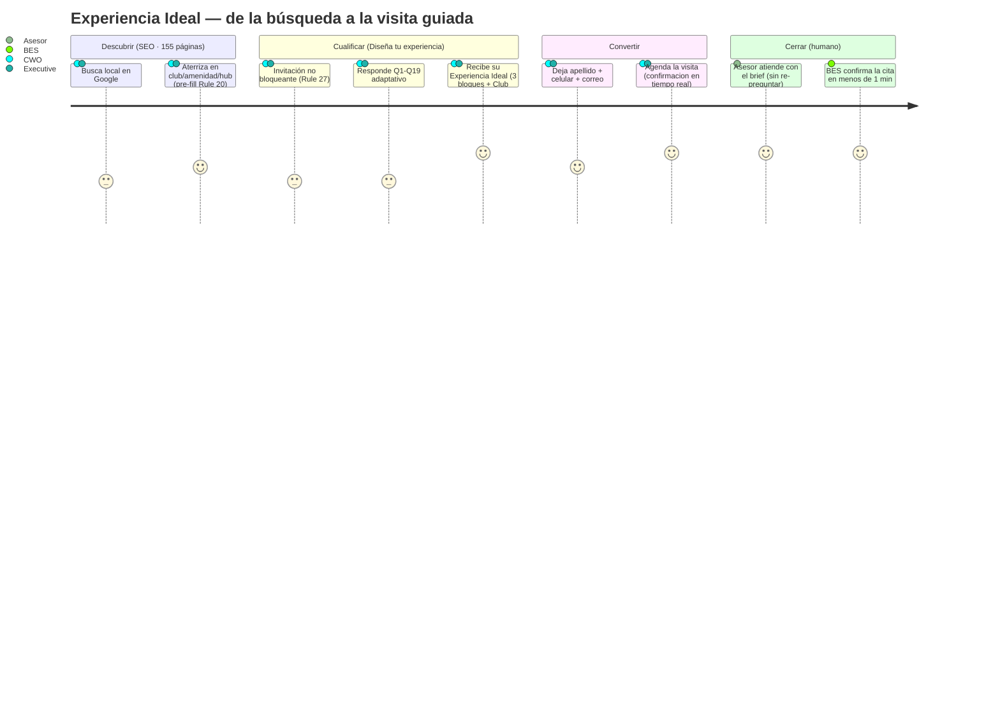
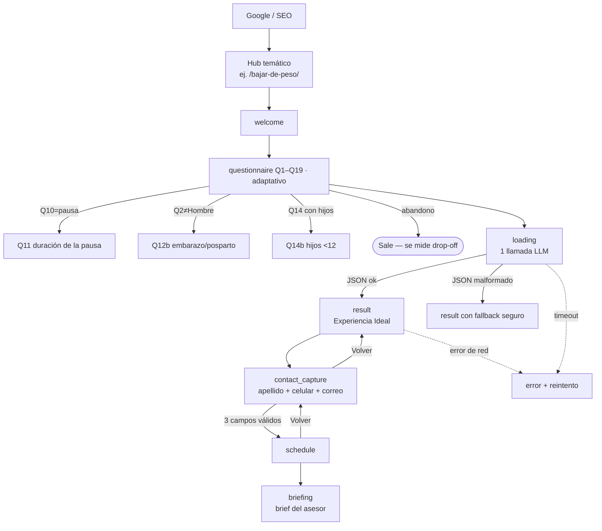

# UX Spec — Experiencia Ideal · Sports World

| Campo | Valor |
|---|---|
| Versión | v5.0 |
| Fecha | 2026-06-12 |
| Autores | Producto · Diseño · Ingeniería · QA (coautoría pendiente de firma) |
| Estado | En revisión |
| Stack de salida | Next.js + React + TypeScript + Tailwind · SSR/ISR · CMS desacoplado |
| Herramienta de handoff | `[POR DEFINIR — enlazar Figma inspect]` |
| Documentos del paquete | `DESIGN.md` (tokens + lineamientos premium) · `anexo-clinico.md` · `anexo-contenido-prompts.md` · `anexo-ingenieria-crm.md` |
| Prototipo de referencia | `sw_experiencia_ideal_demo_v6_FINAL.jsx` — implementación funcional del flujo cuestionario→resultado→brief; donde difiera de este documento, gobierna este documento |

> **Cómo leer este documento.** Las secciones 1–12 siguen el orden estándar de un spec UX: del porqué (negocio) al qué (arquitectura, flujos, pantallas) y al cómo se verifica (edge cases, accesibilidad, aceptación, métricas). Las reglas conservan su número estable (`Rule N`) para referencia cruzada con el código y los anexos; el **Apéndice G** indexa cada regla con su sección. El copy de interfaz citado entre comillas es verbatim y en es-MX.

## Índice

- **Resumen ejecutivo**
- **1. Racionalidad del diseño**
  - 1.1 Cadena de razonamiento (Por qué → Quién → Qué → Cómo)
  - 1.2 Justificación macro (estrategia de negocio)
  - 1.3 Justificación micro (decisiones puntuales)
  - 1.4 Audiencia, marca e idioma
- **2. Personas y customer journey**
  - 2.1 Personas
  - 2.2 Customer journey — el embudo que conecta las tres metas
  - 2.3 Hallazgos del estudio de usuarios que informan el diseño
- **3. Arquitectura de información y SEO**
  - 3.1 Inventario de páginas
  - 3.2 Detalle por tipo de página
  - 3.3 Entrenamiento individual: taxonomía de subgrupos
  - 3.4 Datos confirmados del sitio (Rule 11)
  - 3.5 Datos vivos por club (Rule 12)
  - 3.6 Cross-linking obligatorio entre páginas (Rule 10)
  - 3.7 Marcado estructurado schema.org (Rule 13)
  - 3.8 Ruteo de búsqueda externa (Rule 15)
  - 3.9 Convenciones
- **4. Flujos, estados y personalización**
  - 4.1 Estado del usuario respecto al cuestionario (Rule 32)
  - 4.2 Inferencia desde la búsqueda externa (Rule 16)
  - 4.3 Precedencia entre inferencias en conflicto (Rule 17)
  - 4.4 Pre-llenado por página de aterrizaje (Rule 20)
  - 4.5 Pipeline de la aplicación (cuestionario → resultado → brief)
  - 4.6 Refresco de experiencia obsoleta (Rule 34)
- **5. Especificación por pantalla y componente**
  - 5.1 Header global
  - 5.2 Panel lateral «Tu Sports World»
  - 5.3 BES — asistente conversacional global
  - 5.4 Menú contextual (recomendaciones, no menús)
  - 5.5 Hub temático SEO (ej. `/bajar-de-peso/`)
  - 5.6 Home — matriz de comportamiento
  - 5.7 Página individual de club — matriz de comportamiento
  - 5.8 Páginas de clase
  - 5.9 Hubs de objetivo — matriz
  - 5.10 FitKidz
  - 5.11 Personal Training — matriz
  - 5.12 Diario (Journal) — matriz
  - 5.13 Membresías (Rule 22 — sin checkout)
  - 5.14 Páginas de entrenamiento individual
  - 5.15 BES vía URL de fallback — matriz
  - 5.16 Cuestionario «Diseña tu experiencia»
  - 5.17 Resultado — la página Experiencia Ideal
  - 5.18 Captura de contacto (Rule 32b)
  - 5.19 Agenda y brief del Asesor
- **6. Matriz de edge cases y estados condicionales**
  - 6.1 Geolocalización denegada o no disponible
  - 6.2 La búsqueda infiere una ubicación sin club
  - 6.3 SEPOMEX (autocompletado de CP) no disponible
  - 6.4 Errores de validación de formularios
  - 6.5 Abandono del cuestionario a medio flujo
  - 6.6 Aviso de salud rechazado
  - 6.7 BES recibe una pregunta fuera de alcance
  - 6.8 API de catálogo o reservas no disponible
  - 6.9 Búsqueda con inferencias en conflicto
  - 6.10 Usuario recurrente con experiencia obsoleta
  - 6.11 JavaScript desactivado o navegador antiguo
  - 6.12 Conexión lenta o ahorro de datos
  - 6.13 Listas vacías de amenidades o clubes
  - 6.14 Preferencia acuática pero el club ideal no tiene alberca
  - 6.15 Q12 suprime Bloque 1 y Bloque 2 a la vez
  - 6.16 Reemplazo de clase fuera de compatibilidad Q4
  - 6.17 Cambio de club sin set viable de Bloque 3
  - 6.18 Los tres bloques suprimidos
- **7. Sistema de diseño, tokens y redacción**
  - 7.1 Marca y posicionamiento editorial (Rule 8)
  - 7.2 Reglas editoriales para todo el copy (Rule 9)
- **8. Accesibilidad (WCAG 2.2 AA)**
- **9. Privacidad y manejo de datos (Rule 36)**
- **10. Handoff y sincronización**
  - 10.1 Insumos pendientes del cliente
- **11. Criterios de aceptación**
- **12. Métricas y experimentación**
  - 12.1 KPIs
  - 12.2 Lead scoring y enrutamiento
  - 12.3 Perfilado progresivo (recomendación)
  - 12.4 A/B testing
- **Apéndice B — Páginas explícitamente fuera de alcance (Rule 37)**
- **Apéndice C — Glosario**
- **Apéndice D — Referencia de códigos**
- **Apéndice F — Plantilla de referencia de la página de resultado**
- **Apéndice G — Brief del Asesor**
- **Apéndice H — Llamada única al LLM: esquema y prompt YMYL**
- **Apéndice — Índice de reglas**
- **Control del documento**

---

## Resumen ejecutivo

**Los problemas que motivan el rediseño** (documentados como objetivos firmados):

1. El sitio aparece en menos del 1% de las búsquedas "gym para bajar de peso" → hub **`/bajar-de-peso/`** con contenido YMYL y firma médica visible (cédula profesional, Rule 14).
2. Queda fuera del top 100 en búsquedas como "yoga cerca de mí" → **una página dedicada por clase**: 51 adultas (7 Les Mills + 44 regulares) + hub FitKidz con 34 infantiles (§3).
3. "Gym near me" aterriza en home en lugar del club más cercano → detección de ubicación y **ruteo al club más cercano** (tabla de routing, Rule 15).
4. *(Operacional)* El usuario llena un formulario y pasan días sin contacto del asesor → **BES 24/7** resuelve dudas operativas en el momento (Rule 3); el Asesor humano entra cuando aporta valor real. Primera respuesta <1 min.

**Tres activos que ningún competidor reúne:** **49** clubes en 13 estados (32 en la zona metro del Valle de México, 17 en el resto del país) · catálogo de **51+34** clases · y el activo único: **cada clase clasificada por su contribución exacta a cada objetivo del usuario** (fichas del anexo clínico; gate de validación médica).

**La tesis del proyecto:** conocer profundamente al usuario es lo que permite proponerle *la experiencia ideal*.

`CUESTIONARIO → CONOCIMIENTO → EXPERIENCIA IDEAL → LEAD CALIFICADO`

**El prospecto llega por una de cuatro puertas** — home (1) · club (49) · clase/amenidad (61) · objetivo (6 hubs) — y todas conducen al mismo destino: **«Diseña tu experiencia»**, el cuestionario oficial de **15 preguntas base + 6 condicionales** (Q1–Q19, 15–21 visibles). Cada puerta carga información implícita y el sistema la usa (Rule 16/20): aterrizar en un club **omite Q15/Q16** (quedan 13; 16 en el path de peso); aterrizar en una clase o un hub de objetivo **pre-marca Q4**; el path de peso agrega Q17–Q19 y el **modal YMYL** antes del resultado. El usuario no ve menús: ve recomendaciones (menú contextual por estado, Rules 23–31).

**El resultado es un documento editorial personalizado, no una lista:** hook que conecta con su motivación (Q3) + tarjetas resumen + card **Club Ideal** solo con datos verificables (Rule 42) + **tres bloques** — 01 Fuerza · 02 Cardio · 03 Clases del catálogo real del club resuelto, filtradas por el filtro duro de contraindicaciones YMYL — con conectores "Porque mencionaste que…". **Honra la decisión del usuario:** si cambia el club, recalcula; si cambia una clase, reordena (Rule 41); nunca bloquea, nunca insiste.

**BES** no es un FAQ: es el knowledge hub completo del club con capacidad de acción en el chat (precios, promos, horarios, schedule de clases, membresías, agendar la visita), por texto o voz. Lo sensible **no lo ejecuta directo**: cancelaciones, congelamientos y reembolsos se capturan, abren ticket en CRM y conectan con el Asesor (Rule 3.1). Recordatorios de visita por WhatsApp a 24 h y 2 h (Rule 3.2).

**El cierre de valor: la guía del Asesor.** Cada lead llega al club con el brief de Apéndice G — **5 preguntas de validación**, **ruta de visita de 4 pasos** (conectar con su objetivo · tour enfocado · resolver el bloqueador · cerrar con siguiente paso), propuesta principal + complemento, **3 prioridades de cierre** y un guion de cierre ≤60 palabras — priorizado por banderas (familia/hijos, condición médica, viene de otro gimnasio, principiante, regreso de pausa). El Asesor convierte **sin re-preguntar nada** de lo que el usuario ya respondió: ése es el valor real para los 49 equipos de venta.

**Metas firmadas:** duplicar el tráfico orgánico (**80,000 → 160,000 visitas/mes en 3 meses**) · **2x leads cualificados** · primera respuesta **<1 min, 24/7**.

---

---

## 1. Racionalidad del diseño

El sitio existe para convertir búsquedas de Google en visitas guiadas al club. Esta sección documenta esa cadena completa: la meta de negocio (duplicar el tráfico orgánico de 80,000 a 160,000 visitas mensuales y duplicar los leads cualificados), quiénes son los actores (los dos arquetipos CORE, el Asesor y BES), qué comportamiento medible se busca del usuario, y por qué cada decisión de producto — el cuestionario único adaptativo, el rojo reservado a conversión, la captura de contacto después del resultado — es la que es y no otra.

### 1.1 Cadena de razonamiento (Por qué → Quién → Qué → Cómo)

- **Por qué (meta SMART).** Duplicar el tráfico orgánico del sitio: pasar de **80,000 a 160,000 visitas mensuales en 3 meses**, haciendo el sitio mucho más encontrable en Google mediante una estrategia SEO aplicada a una **nueva estructura de hubs y paginación**. Palanca de ejemplo: un **hub de "perder peso"** captura una de las búsquedas de mayor volumen en México y, por sí solo, tiene potencial de duplicar el tráfico.
 - **Meta secundaria:** duplicar (**2x**) el número de **leads cualificados** que llegan al asesor.
 - **Meta terciaria:** reducir el **tiempo de respuesta al cliente** mediante el **agente de voz** (atención inmediata 24/7).
- **Quién (actores).**
 - *Primarios:* los dos arquetipos CORE del consumer journey (§2): **Family Wellbeing Manager** (Family CWO, Prioridad 1, LTV 3x–4x) y **Urban Hybrid Executive** (Third Spacer, Prioridad 2). Llegan vía búsqueda local en Google y aterrizan por una de 4 puertas (home, club, amenidad/clase, página de objetivo).
 - *Secundario:* el **Asesor** (ventas) que recibe el brief y agenda la visita guiada; el **agente de voz** que responde y coordina.
 - *Fuera de escena:* entrenadores que definen ejercicios en la primera sesión; equipo de marketing/SEO que gobierna los hubs.
- **Qué (comportamiento medible / Jobs to be Done).** El visitante debe: **encontrar** el sitio en Google → **completar** el cuestionario Experiencia Ideal → **dejar** sus datos de contacto → **agendar** la visita guiada. Se mide con: tráfico orgánico, tasa de finalización del cuestionario, leads cualificados y tiempo de primera respuesta.
- **Cómo (táctica/UI).** Arquitectura de **hubs SEO** (páginas indexables de alto volumen) que alimentan el flujo **Experiencia Ideal**: un cuestionario guiado **adaptativo** (15–21 preguntas según género, pausa, hijos y path de peso) que entrega una recomendación personalizada (Bloque 1 pesas · Bloque 2 cardio · Bloque 3 clases) + captura de contacto + brief para el asesor + agente de voz.

### 1.2 Justificación macro (estrategia de negocio)

El motor de crecimiento es **SEO de estructura**, no publicidad pagada. Hoy el sitio recibe 80,000 visitas/mes; el techo está limitado por la **arquitectura de información**: pocas páginas indexables apuntando a búsquedas de alto volumen. La nueva estructura crea **hubs temáticos** (perder peso, masa muscular, salud cardiovascular, etc.) y **páginas paginadas** de clubes/clases, multiplicando la superficie indexable y la relevancia. Cada hub es a la vez una **puerta de entrada SEO** y el inicio del **embudo de conversión** (Experiencia Ideal). Así, el mismo cambio estructural sirve a las tres metas: más tráfico, más leads cualificados y respuesta más rápida.

#### Objetivos de negocio

El sitio se reconstruye para corregir tres problemas medibles del sitio anterior:

| Problema | Causa | Solución en el nuevo sitio |
| --- | --- | --- |
| El sitio aparece en menos del 1% de las búsquedas de "gym for losing weight" | No existía una página dedicada a bajar de peso | Hub en /bajar-de-peso/ con contenido conforme a YMYL y aprobación médica |
| El sitio queda fuera del top 100 de resultados para "yoga near me" | Las páginas de clase no estaban optimizadas | Una página dedicada por clase (51 clases para adultos + el hub de FitKidz, que absorbe 34 actividades infantiles) con marcado estructurado |
| Búsquedas como "gym near me" aterrizan en el homepage en lugar del club más cercano | El sitio anterior no detectaba la ubicación | El nuevo sitio detecta la ubicación y enruta al club más cercano (Rule 15) |

#### Medidas de éxito

| Medida | Meta |
| --- | --- |
| Visibilidad de tráfico orgánico en el clúster "bajar de peso" | Top 10 en las consultas objetivo dentro de los 90 días posteriores al lanzamiento |
| Precisión del enrutamiento "gym near me" → club más cercano | 100% de las sesiones geolocalizadas enrutadas al club abierto más cercano |
| Visibilidad orgánica de las páginas de clase | Top 50 para las 51 clases para adultos dentro de 90 días |
| Core Web Vitals en mobile p75 | LCP < 2.5 s, INP < 200 ms, CLS < 0.1 |
| Accesibilidad | WCAG 2.2 AA en todas las páginas |

### 1.3 Justificación micro (decisiones puntuales)

| Decisión | Por qué esta y no otra |
|---|---|
| **Cuestionario único guiado** (adaptativo, 15–21 preguntas) en vez de formulario corto | Es una **herramienta interactiva de valor** (calculadora de "experiencia ideal"): el usuario entrega datos a cambio de una recomendación personalizada, lo que mitiga el rebote de los formularios largos. *Riesgo:* sigue siendo largo → se mide abandono por pregunta (ver §12) y se evalúa perfilado progresivo si el abandono supera el umbral. |
| **Rojo de marca `#E6282A`** reservado a CTA y acentos | Señala acción/conversión; nunca se usa en bloques de texto para no diluir la jerarquía. |
| **Tres bloques de color** (azul/verde/gris) para la recomendación | Segmentan cognitivamente los tres componentes del entrenamiento; reducen carga al separar "qué hago con pesas / cardio / clases". |
| **Captura de contacto DESPUÉS del resultado** | El usuario ya recibió valor (su recomendación); pedir datos en ese momento maximiza la conversión y la calidad del lead. |
| **Lenguaje accesible, sin jerga** ("crecimiento muscular", no "hipertrofia") | El público objetivo no es experto; la jerga aliena y reduce conversión (ver `ux-writing`). |
| **Nombres de subgrupo orientados a objetivo** (6) en vez de nomenclatura ACSM | El usuario se reconoce en su meta ("Bajar de peso"), no en un término técnico de fisiología. |

---

### 1.4 Audiencia, marca e idioma

El sitio atiende a tres tipos de usuario primarios, en orden de prioridad:

- Prospectos de membresía que investigan un gimnasio - guiados por la intención, a menudo llegan desde búsqueda externa ("gimnasio Polanco", "bajar de peso gym", "yoga estudio").
- Miembros existentes que realizan tareas de autoservicio - consultar horarios, ubicar amenidades, preguntar al asistente conversacional sobre horarios, cancelaciones o congelamientos.
- Padres y tomadores de decisión de la familia que investigan el programa infantil (FitKidz) - comportamiento de búsqueda exploratorio más que específico por nombre de clase.

La marca del sitio es **premium fitness**. Tres implicaciones:

La submarca FitKidz es **premium family fitness**.

- Tipografía cuidada, espaciado generoso, fotografía editorial.
- Lenguaje directo y mesurado. Sin entusiasmo forzado, sin signos de exclamación, sin copy de marketing todo en mayúsculas, sin titulares de pregunta-anzuelo.
- El encuadre familiar aplica únicamente en las páginas de FitKidz. En todo lo demás el encuadre es individual o personalizado. El resto del sitio le habla a un usuario a la vez, no a "la familia".

El sitio web de Sports World se entrega en español (México) a los usuarios finales. A lo largo de esta especificación, los nombres de botones y demás labels de UI de producción se mantienen en su forma en español, con una glosa en inglés entre paréntesis en la primera mención. La prosa descriptiva que los rodea está en inglés

para servir a un equipo de producción multilingüe. Los códigos internos de sistema (como CIUDAD-1, ( CIUDAD-

ZMVM1 Q17 ) se mantienen en español porque mapean directamente a identificadores de implementación y

deben permanecer idénticos en el código, el copy del CMS y los archivos de diseño.

---

## 2. Personas y customer journey

> Los arquetipos provienen del estudio de usuarios de Sports World (*Consumer Journey*); aquí se expresan sobre la maquinaria real del sitio: las **155 páginas** (§3) son la red que captura sus búsquedas en Google (de ahí sale el 80,000→160,000), **«Diseña tu experiencia»** (Q1–Q19) es el instrumento que los convierte en lead cualificado, y el **brief del Asesor** (Apéndice G) es lo que el negocio recibe a cambio.

### 2.1 Personas

Los arquetipos son **quién** llega (qué teclean en Google y por cuál de las 155 páginas entran); el objetivo **Q4** que marcan es **qué** buscan. Cada persona se especifica como recorrido por el sistema real: búsqueda → routing (Rule 15) → pre-fills (Rule 16/20) → cuestionario → resultado → brief.

**P1 — Family Wellbeing Manager ("Family CWO") · CORE Prioridad 1 · dueña del LTV (3x–4x la membresía individual).**
35–50 años · NSE AB/C+ · 1–2 hijos de 4–12 · Del Valle, Polanco, Satélite, Interlomas, Pedregal. JTBD: *"que el club me devuelva tiempo"* — entrenar mientras los hijos están seguros en FitKidz, sin coordinar tres ubicaciones.

| Etapa | Qué hace ella | Qué hace el sistema (regla aplicable) |
| --- | --- | --- |
| **Busca** | "natación para niños Satélite", "gimnasio para niños cerca de mí" | Routing de búsqueda (Rule 15): niños/familia → **/fitkidz/**; amenidad+ubicación → **/amenidades/alberca/**; si la búsqueda trae ubicación, Q15/Q16 quedan inferidas (Rule 16) |
| **Aterriza** | Revisa el hub FitKidz (actividades por edad, disciplina y club) o la página del club | Aterrizar en FitKidz **pre-llena Q14 = "Yo y mis hijos"** (Rule 20) → Q14b ya viene armada; aterrizar en **/clubes/[club]/** omite Q15/Q16 (el conteo baja en 2). «Diseña tu experiencia» espera en header y menú contextual sin bloquear la lectura (Rule 27) |
| **Responde** | Q2 = Mujer → aparece **Q12b** (embarazo/posparto); Q4 típico = Bajar de peso o Salud cardiovascular; Q6 con alberca; Q14b = Sí. Si marca Bajar de peso: **Q17–Q19** (tratamientos GLP-1/bariátrica, peso/estatura/cintura, objetivo de cambio) | `resolveBlocks` (Rule 39): variantes acuáticas de Bloque 1/2 **solo si el club resuelto tiene alberca**; si no, bloques secos + "este club no tiene alberca; revisa otros clubes cerca". En el path de peso, modal YMYL con firma del revisor médico **antes** del resultado (Rule 19) |
| **Recibe** | Su Experiencia Ideal: "Fuerza integral con pesas" + "Cardio continuo moderado 35–45 min" + top 2 clases del **catálogo real de su club** ya filtradas por contraindicaciones (Q12/Q12b/Q17 → claves l/c/e/p/b) | Card **Club Ideal** (Rule 42: solo datos verificables del backend, nunca inventados); `infrastructure_argument` ≤55 palabras citando el club concreto; sección FitKidz **Estado A** (chips con nombres de clase) o **Estado B** en los 10 clubes sin nombres ("Tu Asesor te compartirá las actividades para tus hijos") |
| **Decide** (1–3 semanas, consulta a la pareja) | Vuelve al sitio a re-revisar y enseñárselo a su pareja | **Rule 28**: completado el cuestionario, el menú cambia a «Volver a tu experiencia ideal» — regresa a su resultado sin repetir nada. BES responde dudas 24/7 (<1 min) |
| **Visita** | Visita guiada **con los hijos** | El brief llega marcado con **isFamily + hasKids**; la `visit_route` de 4 pasos incluye resolver la logística de los niños; las 5 `validation_questions` **no re-preguntan** lo capturado en Q14/Q14b. Bloqueo absoluto: cualquier señal de inseguridad infantil |

**P2 — Urban Hybrid Executive ("Third Spacer") · CORE Prioridad 2 · justifica el precio premium.**
28–45 años · profesional híbrido/remoto · vive o trabaja cerca de un club legacy (Antara, Reforma, Polanco, Santa Fe, Interlomas). JTBD: un **tercer espacio** para romper el día, entrenar y bañarse en condiciones premium.

| Etapa | Qué hace él | Qué hace el sistema (regla aplicable) |
| --- | --- | --- |
| **Busca** | "gym con vapor Polanco", "gimnasio cerca de mí", "body pump cdmx" | Rule 15: amenidad+ubicación → **/amenidades/sauna-y-vapor/**; "cerca de mí" → club más próximo por geolocalización; clase → **/clases/signature/body-pump/**. Buscar una amenidad **no** infiere preferencia de entrenamiento (Rule 16): su cualificación ocurre íntegra en el cuestionario |
| **Aterriza** | Hace el **review-check** del club: fotos reales, horarios, clases, reseñas | La página de club muestra el catálogo real del club; aterrizar ahí omite Q15/Q16 (Rule 20). Aterrizar en una página de clase pre-marca el Q4 alineado a esa clase (mapa = fichas Block 3) |
| **Responde** | Q4 = Aumentar masa muscular o Desempeño atlético; Q7 = Temprano (5:00–8:00) y/o Noche (20:00–22:00); Q10 = "Sí, vengo de otro gimnasio"; a veces Q13 = "Solo, a mi ritmo" | Q13 = Solo → **Bloque 3 OFF** y el menú renombra "Clases recomendadas" → "Tu rutina individual" (Rule 38); Q10 levanta el flag `fromOtherGym` para el brief |
| **Recibe** | Bloque 1 nombrado por su objetivo: **"Desarrollo muscular progresivo"** (masa) o **"Potencia y velocidad"** (desempeño) + **"Intervalos intensos 4×4"** de cardio — sin jerga (nunca "hipertrofia" ni "HIIT") | `infrastructure_argument` cita los **49 clubes y el acceso multiclub** + las amenidades premium del club resuelto (vapor/sauna); las clases del Bloque 3 respetan su Q7 (desempate de horario en Rule 40) |
| **Decide** (rápido; revisa 5–15 reseñas) | Agenda en el momento | Fase `schedule` con **confirmación en tiempo real** (API del cliente); BES/WhatsApp confirman en <1 min — exactamente la fricción que lo hace desistir en la competencia |
| **Visita** | Tour corto, enfocado, sin venta lenta | Brief con `fromOtherGym`: el Asesor abre con lo que le faltaba en su gimnasio anterior; las 3 `closing_priorities` apuntan a cierre en la misma visita |

**P3 — Asesor (interna).** No diseña la experiencia: la **consume**. Recibe el brief de Apéndice G — exactamente **5 `validation_questions`** (≤18 palabras c/u), **`visit_route` de 4 pasos** (Conectar con su objetivo · Tour enfocado · Resolver bloqueador · Cerrar con siguiente paso), `proposal` (main + complement), **3 `closing_priorities`** y un `closing_script` ≤60 palabras en primera persona. Su métrica: convertir la visita **sin re-preguntar ninguna de las 15–21 respuestas** — la consistencia entre los 49 clubes depende de que todos trabajen sobre el mismo brief.
**P4 — BES (agente conversacional, sistema).** Widget global flotante en las 155 páginas (Rule 3), con URL de fallback para usuarios sin JavaScript. Absorbe lo que el sitio deliberadamente no publica como página (cancelaciones, congelamientos, soporte — Rule 37) y confirma citas. Es la palanca de la meta terciaria: **primera respuesta <1 min, 24/7**.

### 2.2 Customer journey — el embudo que conecta las tres metas

Cada fase del journey tiene un instrumento concreto en este spec y sirve a una meta medible de §10:

| Fase | Instrumento concreto | Meta que sirve |
| --- | --- | --- |
| **Descubrir** | Las 155 páginas indexables (§3): 49 clubes · 51 clases (7 Les Mills signature + 44 regulares) · 5 hubs de objetivo (`/perfiles/…`) · hub `/bajar-de-peso/` (YMYL) · 10 amenidades · FitKidz · Personal Training · 10 de entrenamiento individual · 6 de membresías · 20 artículos del diario · Home | **80,000 → 160,000 visitas/mes** (la superficie indexable ES la palanca) |
| **Cualificar** | «Diseña tu experiencia» (Q1–Q19 adaptativo) con pre-fills por aterrizaje (Rule 20) e inferencia de búsqueda (Rule 16): cada puerta de entrada acorta el cuestionario | **2x leads cualificados** — el lead llega con 15–21 variables, no con un nombre y un teléfono |
| **Convertir** | `result` (la recomendación es el "pago" por los datos) → `contact_capture` (apellido + celular 10 dígitos + correo) → `schedule` (API en tiempo real) | **2x leads cualificados** (calidad + volumen) |
| **Cerrar** | `briefing` → brief del Asesor (Apéndice G) + BES 24/7 | **Primera respuesta <1 min** |



Las fases técnicas exactas (welcome · questionnaire · loading · result · contact_capture · schedule · briefing · error) y todas las bifurcaciones están en **§4** y **§5**.

### 2.3 Hallazgos del estudio de usuarios que informan el diseño

Cada hallazgo del estudio de usuarios se atiende con una regla o sección específica de este documento:

| Hallazgo del estudio | Dónde se atiende en este documento |
| --- | --- |
| Las puertas de entrada revelan intención | Pre-fill por aterrizaje (Rule 20) + inferencia de búsqueda (Rule 16); el hub `/bajar-de-peso/` es la puerta de mayor volumen y pre-marca Q4 (activa Q17–Q19) |
| Invitación no bloqueante, persistente como botón | «Diseña tu experiencia» en header (Rule 1) y menú contextual mientras el cuestionario esté incompleto (Rule 27); al completarlo cambia a «Volver a tu experiencia ideal» (Rule 28) |
| El review-check del club específico decide la conversión | Página de club (§3) con fotos reales, horarios, clases, reseñas y amenidades; card Club Ideal con datos verificables (Rule 42) |
| Consistencia del asesor entre 49 clubes + confirmación rápida | Brief único (Apéndice G) generado en la misma llamada LLM que el reporte; agenda en tiempo real (fase `schedule`, API del cliente) |
| Meseta silenciosa (sem. 4–6) y regreso tras ausencia = mayor churn | **Fuera del alcance del sitio** (retención/CRM post-venta); se anota como dependencia, no se diseña aquí |
| Benchmarks: NPS 47.3 · retención 66.4% · 50% churn a 6 meses (sector) | Contexto de §12; el sitio impacta **captación**, no la retención post-venta |


---

---

## 3. Arquitectura de información y SEO

La superficie indexable es la palanca del objetivo de tráfico: 155 páginas en 12 tipos, cada una con propósito de búsqueda propio, datos vivos del club y marcado estructurado.

### 3.1 Inventario de páginas

El sitio tiene 12 tipos de página canónicos en alcance, más el asistente conversacional BES, implementado como widget global flotante y no como página de destino.

| # | Tipo de página | Cantidad | Patrón de URL | Sensible a la salud (YMYL) |
| --- | --- | --- | --- | --- |
| 1 | Inicio | 1 | / | No |
| 2 | Club individual | 49 | /clubes/[club]/ | No |
| 3 | Amenidad | 10 | /amenidades/[amenidad]/ | No |
| 4 | Clase Premium Les Mills | 7 | /clases/signature/[clase]/ | No |
| 5 | Clase regular | 44 | /clases/[clase]/ | No |
| 6 | FitKidz | 1 | /fitkidz/ | No |
| 7 | Hub de objetivo | 5 | /perfiles/[objetivo]/ | Solo rehabilitación |
| 8 | Hub Bajar de peso | 1 | /bajar-de-peso/ | Sí (YMYL) |
| 9 | Personal Training | 1 | /personal-training/ | No |
| 10 | Membresías | 6 (1 hub + 5 planes) | /membresias/ y /membresias/[plan]/ | No |
| 11 | Artículo del diario | 20 | /diario/[articulo]/ | Algunos, sí |
| 12 | Página de entrenamiento individual | 10 (2 padre + 8 subpáginas de subgrupo) | /entrenamiento-con-pesas-individual/[subgrupo] · /entrenamiento-aerobico-individual/[subgrupo] | No |

Total de páginas firmadas: 1 + 49 + 10 + 7 + 44 + 1 + 5 + 1 + 1 + 6 + 20 + 10 = **155 páginas**.

> El alcance de este spec es de **155 páginas** (los 12 tipos de la tabla).

BES. El asistente conversacional es un widget global flotante presente en cada página (Rule 3). También expone una URL de fallback para usuarios sin JavaScript y para deep-linking. BES se entrega como un proyecto aparte con su propia especificación; este documento cubre solo sus puntos de integración e interfaces de comportamiento con el resto del sitio.

### 3.2 Detalle por tipo de página

- Los 5 hubs de objetivo (tipo 7, `/perfiles/`) son: primeros pasos, salud y bienestar, estética corporal, ganar fuerza, rehabilitación. El hub de bajar de peso es un tipo aparte (tipo 8) por su clasificación YMYL.
- Los 5 planes de membresía son: UniClub, AllClub, Black Pass, Pink Plan y la Promo de 21 días.
- Los 10 hubs de amenidades son: alberca, INTENZ (zona de entrenamiento funcional), FitKidz, ring de box, muro de escalada, canchas, sauna y vapor, regaderas y vestidores, cafetería y estacionamiento.
- «FitKidz» aparece tanto como tipo de página (el hub padre) como una de las 10 amenidades. El hub de FitKidz es la página completamente construida; la entrada de FitKidz como amenidad es un apuntador que enlaza a ella.
- El hub de FitKidz absorbe las 34 actividades infantiles. Las actividades infantiles no tienen páginas individuales; se organizan dentro del hub por rango de edad, tipo de disciplina y disponibilidad por club.
- Diagrama de arquitectura: *(diagrama visual — entregable de diseño Semana 1; el «Page inventory» de arriba es el contenido autoritativo)*

El diagrama anterior es una aproximación textual. El equipo de diseño produce el diagrama formal de IA como entregable de la Semana 1. Regla anti-huérfanos: toda página debe ser alcanzable desde al menos otras dos páginas. La matriz de enlaces cruzados se aplica mediante la Rule 10.

> **Hubs de objetivo y objetivos Q4 — relación, no equivalencia.** Los hubs de objetivo son páginas de aterrizaje SEO nombradas por intención de búsqueda; **no** son una copia 1:1 de los 6 objetivos Q4 del cuestionario. Esta es la relación exacta (pre-llenado por Rule 20):
>
> | Hub de objetivo (tipo de página) | Objetivo Q4 que pre-marca |
> | --- | --- |
> | Bajar de peso (tipo 8, YMYL) | Bajar de peso |
> | Salud y Bienestar | Mejorar mi salud cardiovascular |
> | Estética corporal | Mejorar mi estética corporal |
> | Ganar Fuerza | Aumentar masa muscular |
> | Rehabilitación | Recuperarme de una lesión o dolor |
> | Primeros Pasos | Ninguno: pre-marca Q9 = Principiante (sirve a cualquier objetivo para quien empieza) |
>
> El sexto objetivo Q4, **Mejorar mi desempeño atlético**, no tiene hub de objetivo dedicado: se atiende desde las páginas de entrenamiento individual (subpáginas Potencia y SIT, §3.3) y es alcanzable desde el hub Ganar Fuerza. Por eso hay **5 hubs de objetivo + 1 hub de peso** para **6 objetivos Q4**: la correspondencia es intencional, no un error de conteo.

### 3.3 Entrenamiento individual: taxonomía de subgrupos

Los nombres del Bloque 1 visibles para el usuario son los **seis nombres oficiales del Catálogo**, mapeados desde el objetivo Q4 primario (tabla de mapeo abajo): **Fuerza integral con pesas** (cuerpo completo, peso moderado) · **Rutina por grupos musculares** (definición por zonas) · **Desarrollo muscular progresivo** (carga creciente) · **Potencia y velocidad** (fuerza explosiva) · **Fuerza de mantenimiento** (fuerza general) · **Fuerza guiada en máquinas** (técnica controlada). La prescripción ACSM, el equipo y el detalle de citas que sigue son la referencia de protocolo interno y no se muestran al usuario; los nombres técnicos (Fuerza, Hipertrofia, Potencia, Resistencia muscular, LISS, MICT, HIIT, SIT) viven solo en fichas, URLs de subpáginas e identificadores de backend.

Dos páginas de nivel superior de entrenamiento individual — entrenamiento-con-pesas-individual y entrenamiento-aerobico-individual — más sus 8 subpáginas de subgrupo (Rule 20) son el **tipo de página canónico 12** del inventario de arriba. Forman parte del alcance firmado de 155 páginas. Cada una mapea a seis subgrupos (uno por objetivo Q4; nombres oficiales en «Catálogo oficial — Programas de entrenamiento individual»), fundamentados en el consenso ACSM. Un tercer bloque, acuático (Entrenamiento acuático), se activa cuando Q6 = "En la alberca"/"Ambas" y el club resuelto tiene alberca. Los subgrupos de pesas siguen el ACSM Position Stand 2026 (Currier BS, D'Souza AC, Singh MAF, et al. "Resistance Training Prescription for Muscle Function, Hypertrophy, and Physical Performance in Healthy Adults: An Overview of Reviews." Medicine & Science in Sports & Exercise 2026. DOI: 10.1249/MSS.0000000000003897). Los subgrupos aeróbicos siguen el ACSM/ESSA Joint Expert Statement 2024 ("Physical Activity and Exercise Intensity Terminology." Journal of Science and Medicine in Sport 2024). El comportamiento de pre-fill y resultado de estas páginas se rige por Rule 38.


Las **prescripciones técnicas ACSM por subgrupo** (series, repeticiones, %1RM, descansos, equipo, DOIs) viven en `anexo-clinico.md` §2 (referencia de protocolo interno bajo validación médica; no se muestra al usuario).

#### Mapeo objetivo Q4 → subgrupo (Rule 38)

| Q4 goal | Block 1 — Fuerza y desarrollo muscular (nombre oficial · detalle) | Block 2 — Cardio y resistencia (nombre oficial · máquina · duración) |
| --- | --- | --- |
| Bajar de peso | **Fuerza integral con pesas** (cuerpo completo, peso moderado) | **Cardio continuo moderado** · caminadora/bici/elíptica · 35–45 min |
| Mejorar mi estética corporal y definición muscular | **Rutina por grupos musculares** (definición por zonas) | **Cardio moderado con intervalos** · caminadora/bici/elíptica · 25–35 min |
| Aumentar masa muscular | **Desarrollo muscular progresivo** (carga creciente) | **Cardio ligero de mantenimiento** · caminadora suave/bici · 15–25 min |
| Mejorar mi desempeño atlético | **Potencia y velocidad** (fuerza explosiva) | **Intervalos intensos 4×4** · bici/remo/caminadora · 30–40 min |
| Mejorar mi salud cardiovascular | **Fuerza de mantenimiento** (fuerza general) | **Base aeróbica 80/20** · caminadora/bici/elíptica/remo · 35–45 min |
| Recuperarme de una lesión o dolor crónico | **Fuerza guiada en máquinas** (técnica controlada) | **Recuperación activa de bajo impacto** · bici reclinada/elíptica/caminadora muy suave · 15–25 min |

If Q4 has two selections (allowed up to two), the recommended set is the union of both rows, deduplicated.

#### Catálogo oficial — programas de entrenamiento individual

Tres familias oficiales (Fuerza y desarrollo muscular · Cardio y resistencia · Entrenamiento acuático), 6 sub-clases cada una, mapeadas a los 6 objetivos Q4. El detalle completo (tablas de mapeo y estados `clínico`/`inferido`) vive en `anexo-clinico.md` §3. El bloque acuático se activa cuando Q6 = "En la alberca"/"Ambas" y el club resuelto tiene alberca (Rule 39).

### 3.4 Datos confirmados del sitio (Rule 11)

| Concepto | Valor |
| --- | --- |
| Clubes totales | 49 |
| Estados con clubes | 13 |
| Clubes en la Zona Metropolitana de la Ciudad de México (CDMX + Estado de México) | 32 |
| Clubes fuera de esa zona | 17 (repartidos en 11 estados) |
| Clases para adultos | 51 (7 Premium Les Mills + 44 regulares) |
| Actividades infantiles FitKidz | 34 |
| Hubs de objetivo | 5 |
| Hubs de amenidades | 10 |
| Planes de membresía | 5 (más el hub) |
| Artículos iniciales del Journal | 20 |
| Páginas firmadas totales (alcance del Workstream B) | 155 |

### 3.5 Datos vivos por club (Rule 12)

Cada página individual de club (tipo de página 2) muestra los siguientes cuatro datos extraídos en vivo de la API del cliente:

- Horarios de operación por día de la semana.
- Teléfono y correo electrónico del club.
- Catálogo de clases: cuáles de las 51 clases para adultos y cuáles actividades de FitKidz se ofrecen en este club específico.
- Horario de clases - por clase, por día, con horarios.
Si la API no está disponible, la página recurre al último valor cacheado con éxito, con un aviso visible; ver Edge Case 6.8.

### 3.6 Cross-linking obligatorio entre páginas (Rule 10)

Cada página debe enlazar a sus páginas relacionadas. Sin páginas huérfanas.

). Los titulares son directos


| Desde | Hacia | Dirección |
| --- | --- | --- |
| Cada página de club | Cada amenidad que ofrece | Bidireccional |
| Cada página de amenidad | Cada club que la ofrece | Bidireccional |
| Cada página de clase | Cada club donde se ofrece la clase | Bidireccional |
| Cada artículo del | Al menos un hub relacionado, y al menos un club si | Unidireccional (artículo➔hub/club) |
| Journal | existe relevancia geográfica | |
| Página de Personal Training | Cada uno de los 5 hubs de objetivo | Bidireccional |
| Cada hub de objetivo | Página de Personal Training | Bidireccional (contraparte de |
| | | la anterior) |

### 3.7 Marcado estructurado schema.org (Rule 13)

Cada tipo de página lleva los datos estructurados correspondientes para que los motores de búsqueda puedan entender su contenido:

| Tipo de página | Tipos schema.org requeridos |
| --- | --- |
| Páginas de club | HealthClub + OpeningHoursSpecification (una entrada por día por club) + GeoCoordinates (latitud, longitud verificadas) |
| Páginas de clase (premium y regulares) | **Course**. Los horarios por club pueden complementarse con `Event` por sesión programada (decisión de ingeniería). |
| Hub Bajar de peso | MedicalWebPage + el revisor médico con credenciales (nombre y cédula profesional) |
| Hubs de objetivo y cualquier página con FAQs | FAQPage |
| Artículos del Journal | Article (autor con credenciales cuando aplique) |
| Todas las páginas (excepto home) | BreadcrumbList |

Todo el marcado debe validar en Google Rich Results Test antes de publicar.

Todos los datos estructurados deben validar contra el Rich Results Test de Google antes de su publicación.

### 3.8 Ruteo de búsqueda externa (Rule 15)

Rule 15 - Mapeo de consultas de búsqueda a páginas

Cuando un usuario realiza una consulta en un motor de búsqueda relacionada con Sports World, el sitio debe llevarlo a la página que mejor responda esa consulta.


| Tipo de consulta | Ejemplos | Página de aterrizaje |
| --- | --- | --- |
| Búsqueda pura de marca | sports world, sports world mexico | Home |
| Marca + ubicación específica | sports world polanco, sports world antara | La página del club específico |
| Gimnasio cerca de mí | gimnasio cerca de mi, gimnasio polanco | El club más cercano vía geolocalización; si no se puede detectar la ubicación, aterriza en Home con el flujo de búsqueda de club abierto |
| Amenidad + ubicación | alberca cdmx, yoga estudio polanco | El hub de la amenidad |
| Clase específica | body pump, spinning cdmx, pilates reformer | La página de esa clase |
| Objetivo personal | estética corporal, ganar masa muscular, primeros pasos en el gym | El hub del objetivo correspondiente |
| Pérdida de peso | bajar de peso, perder peso gym, GLP-1 ozempic gimnasio | Hub Bajar de peso |
| Rehabilitación | rehabilitación rodilla gym, ejercicio post lesión | Hub de Rehabilitación |
| Niños / familia | gimnasio para niños, actividades familia, FitKidz | FitKidz |
| Personal Training | entrenador personal, personal trainer cdmx | Personal Training |
| Precios y membresías | precio sports world, uniclub vs allclub | Hub de membresías |
| Información de fitness | calorias spinning, diferencia body pump vs combat | Artículo del Journal sobre el tema |
| Información específica de Sports World / cancelaciones, congelamientos, soporte | horario polanco, alberca en antara | Home con el widget BES abierto |

### 3.9 Convenciones

El sitio se diseña y se construye mobile-first como metodología, no como un responsive de último momento. Cada layout, interacción y regla de esta especificación debe implementarse partiendo del viewport móvil y mejorándose progresivamente hacia arriba. El ÚNICO sistema de breakpoints es el de los tokens (DESIGN.md): mobile 360 · tablet 768 · laptop 1024 · desktop 1440. Lo contrario —diseñar para desktop y "hacerlo responsive" después— es no conforme.

Donde esta especificación describe un comportamiento exclusivo de desktop (como las interacciones de la Rule

5), la regla es explícita sobre su alcance de viewport. El equivalente móvil siempre se especifica.

La especificación utiliza varios sistemas de identificadores inmutables. Una vez asignado, un código nunca cambia de significado y nunca se reutiliza para un elemento distinto. Si un elemento se elimina del sitio, su código se retira de forma permanente y no se reasigna.


| Sistema de códigos | Formato | Ejemplos | Significado |
| --- | --- | --- | --- |
| Pagetype | numérico, 1-12 | Page type 2 = Club individual | Doce tipos de página canónicos en el alcance de 155 páginas. BES es un widget global (Rule 3). |
| Question | Q+número (+variante) | Q1, Q4, Q12, Q16, Q17, Q18, Q19 | Preguntas del cuestionario. |
| City classification | CIUDAD- +etiqueta | CIUDAD-UNO, CIUDAD-POCOS, CIUDAD-ZMVM | Número de clubes en la ciudad del usuario. |
| Rule | Rule + número | Rule 7, Rule 25 | Reglas globales del sitio; el índice de reglas (al final) mapea cada una a su sección. |
| Article tag | minúsculas, con guiones | bajar-de-peso, clase-spinning, amenidad-alberca | Etiquetas de contenido para el sistema de cross-linking del Journal (Rule 29). |

- Strings de UI del usuario final: español (México). Imperativo de segunda persona familiar para los CTAs
( Visi ta un club , no Visi te un club ). Vocabulario del español de México ( checar , platicar , Aqui empieza todo - no el peninsular Aqui comienza todo ). Sin calcos del inglés.

- Prosa de la especificación: español; edición paralela en inglés en `resultados/en/`.
- Códigos internos de sistema: español, nunca se traducen.

Cada matriz por página de §5 tiene tres columnas:

- Estado - combinación de dos factores: (a) si el usuario completó el cuestionario, y (b) si el usuario tiene un club identificado.
- Cuestionario - el número de preguntas presentadas después del pre-llenado. Si una pregunta se omite por completo (el caso especial de Club Individual para Q15 y Q16), no cuenta. Si una pregunta está pre-llenada pero es editable, sigue contando como pregunta visible.
- Menú contextual - los botones que aparecen en el contenido del cuerpo de la página para ese estado. Los botones del header (siempre visibles según las Rules 1-2) y el widget BES (siempre visible según la Rule 3) no se repiten en cada matriz.
El botón contextual aparece en las matrices solo en las páginas

donde razonablemente se espera que existan artículos etiquetados (el hub, los hubs de objetivo,

Personal Training). En las demás páginas el botón aparece igualmente de forma dinámica cuando hay artículos etiquetados coincidentes, pero no se documenta en la matriz porque es variable.

#### Límite de alcance: lo que este documento no cubre

Los siguientes temas quedan intencionalmente fuera del alcance de esta especificación. Se rigen por otros documentos dirigidos al partner.

- Reglas de producción visual (qué fotografías usar, lineamientos de imágenes generadas con IA, shot lists de video, políticas de imágenes de empleados, metas de volumen de assets) - viven en el brief del partner, Sección 6.
- Decisiones de stack técnico (framework, CMS, hosting, observabilidad, tooling de performance) - viven en el brief del partner, Sección 5.
- Dirección creativa de los assets de marca (selección tipográfica, paleta de color, logotipo, referencias de mood)
- viven en el paquete de assets de marca entregado al partner en la Semana 1.

- Proceso del proyecto (gates de aprobación, calendario de entregables, capacidades del proveedor, términos comerciales) - viven en el brief del partner.
- Reglas de producción de contenido (scoring anti-contenido-duplicado, detalles del registro del español-MX más allá de los CTAs, criterios de selección de artículos del Journal) - viven en la guía del equipo de contenido.

---

## 4. Flujos, estados y personalización

Todas las bifurcaciones (no solo el camino feliz). Fases del sistema: `welcome · questionnaire · loading · result · contact_capture · schedule · briefing · error`.



**Filtro de seguridad (YMYL):** antes de construir el Bloque 3 (clases), el motor aplica el **filtro duro de contraindicaciones** (5 condiciones: lesión, cardiovascular, embarazo, posparto, bariátrica). Las clases contraindicadas nunca aparecen. Detalle completo en §5.17 (Rule 14b). 

---

### 4.1 Estado del usuario respecto al cuestionario (Rule 32)

Para construir el menú contextual de cada página, el sistema clasifica al usuario en uno de tres estados:

| Estado | Descripción |
| --- | --- |
| Sin cuestionario | El usuario no ha completado el cuestionario. |
| Completo, dentro del flujo | El usuario completó el cuestionario y llegó a esta página haciendo clic en un botón desde su plan personalizado (p. ej., "Ver tu club" desde la pantalla de resultado). |
| Completo, fuera del flujo | El usuario completó el cuestionario previamente pero llegó a esta página por una vía distinta (búsqueda externa, navegación interna, etc.). |

Cuando el usuario ha completado el cuestionario, siempre tiene un club identificado - las preguntas del cuestionario que identifican el club (Q15 y Q16) forman parte de las 15 preguntas base. Conteo de preguntas visibles por path (base 15 más condicionales): 15 sin condicionales; +1 si Q11 (pausa); +1 si Q12b (Q2 ≠ Hombre); +1 si Q14b (hijos <12); +3 si Q17–Q19 (Q4 incluye Bajar de peso). Rango 15–21. Ver la tabla normativa de conteo abajo.

> **Tabla normativa de conteo de preguntas:**

| Condición activa | Se añade | Δ |
| --- | --- | :-: |
| Base — siempre visible | Q1–Q10, Q12, Q13, Q14, Q15, Q16 | **15** |
| Q10 = "Regreso después de una pausa" | + Q11 | +1 |
| Q2 ≠ Hombre (incluye "Prefiero no mencionarlo") | + Q12b | +1 |
| Q14 ∈ {"Yo y mis hijos", "La familia completa"} | + Q14b | +1 |
| Q4 incluye "Bajar de peso" | + Q17, Q18, Q19 | +3 |
| **Mínimo** (sin condicionales) | | **15** |
| **Máximo** (todas activas) | | **21** |

### 4.2 Inferencia desde la búsqueda externa (Rule 16)

Cuando un usuario llega al sitio desde una búsqueda externa, el sistema solo puede inferir dos variables del cuestionario a partir de lo que buscó:

- Objetivo (Q4) — solo si la búsqueda contenía un objetivo explícito (bajar de peso, estética corporal, fuerza, condición y resistencia, recuperación de lesión o dolor).
- Ubicación (Q15 y Q16) — solo si la búsqueda contenía una ubicación específica.

Las siguientes inferencias NO se hacen:

- Una búsqueda de clase no llena el objetivo, porque una misma clase puede servir a varios objetivos. (Aterrizar en una página de clase sí pre-marca Q4 según Rule 20.)
- Una búsqueda de amenidad no llena la preferencia de movimiento (Q5 o Q6), porque la preferencia por una amenidad no determina el estilo de entrenamiento.
- Rule 16 gobierna SOLO la inferencia desde la búsqueda externa. Los pre-llenados por página de aterrizaje los gobierna Rule 20, que es la regla autoritativa donde se superponen: aterrizar en FitKidz pre-llena Q14, en Personal Training pre-llena Q13 y en una clase o hub de objetivo pre-marca Q4.
- Aterrizar en el hub Bajar de peso no fuerza las condicionales de peso; Q17–Q19 solo se activan cuando el usuario marca Q4 = Bajar de peso en el cuestionario.
- Navegar internamente no infiere nada: solo cuenta la búsqueda externa que trajo al usuario al sitio.

**Excepción.** Cuando el usuario presiona «Tu Club ideal» dentro del sitio y proporciona su ubicación en ese flujo, la ubicación llena Q16 automáticamente. Eso no es inferencia de búsqueda: es captura directa de una interacción del usuario.

### 4.3 Precedencia entre inferencias en conflicto (Rule 17)

Cuando una búsqueda combina elementos que mapean a varias inferencias (p. ej. «yoga Polanco bajar de peso» = una clase + una ubicación + un objetivo), el sistema aplica una sola precedencia:

**Q4 (objetivo) > Q16 (ubicación) > pre-marca de objetivo derivada de clase.**

En el ejemplo: el usuario aterriza en el hub Bajar de peso (gana Q4) con Q16 pre-llenado a Polanco. La pre-marca derivada de la clase no se aplica, porque el aterrizaje por objetivo domina al aterrizaje por clase.

### 4.4 Pre-llenado por página de aterrizaje (Rule 20)

Cuando el usuario aterriza en una página específica, el sistema prellena las preguntas que ya puede inferir del aterrizaje. Toda respuesta prellenada permanece editable.


| Página de aterrizaje | Prellenado / inferido | Comportamiento |
| --- | --- | --- |
| Home | Ninguno desde el aterrizaje. Q3, Q4 o Q15 pueden inferirse de la consulta de búsqueda externa según la Rule 16. | Si la búsqueda externa incluye una ubicación, Q15 y Q16 se prellenan. |
| Página de club individual | Q15 y Q16 se omiten por completo. | El conteo baja en 2 para esta vía de entrada. |
| Hub de amenidad | Ninguno. | |
| Hub de clase premium o regular | Q4 pre-marca el objetivo alineado al movimiento. | El mapa de clase a objetivo es la tabla de fichas del Block 3 (perfil por objetivo Q4) bajo la Rule 14b — ver «Fichas de clases grupales (Block 3)». |
| FitKidz | Q14 prellena "Yo y mis hijos". | |
| Hub de objetivo — Primeros Pasos | Q9 pre-marca "Principiante". | |
| Hub de objetivo — Salud y Bienestar | Q4 pre-marca "Mejorar mi salud cardiovascular". | |
| Hub de objetivo — Estética corporal | Q4 pre-marca "Mejorar mi estética corporal". | Renombrado desde Tonificar. |
| Hub de objetivo — Ganar Fuerza | Q4 pre-marca "Aumentar masa muscular". | |
| Hub de objetivo — Rehabilitación | Q4 pre-marca "Recuperarme de una lesión o dolor". | |
| Hub YMYL — Bajar de peso | Q4 pre-marca "Bajar de peso", lo que activa Q17 a Q19. | |
| Personal Training | Q13 pre-marca "Acompañado/Acompañada". | |
| Membresías, Journal | Ninguno. | |
| entrenamiento-con-pesas-individual (y subpáginas) | Q13 pre-marca "Solo, a mi ritmo" (o "Sola" si Q2 = Mujer). Las subpáginas pre-marcan Q4: Fuerza → "Aumentar masa muscular"; Hipertrofia → "Mejorar mi estética corporal"; Potencia → "Mejorar mi desempeño atlético"; Resistencia muscular → "Mejorar mi salud cardiovascular". | Nuevo. |
| entrenamiento-aerobico-individual (y subpáginas) | Q13 pre-marca "Solo, a mi ritmo" (o "Sola" si Q2 = Mujer). Las subpáginas pre-marcan Q4: LISS → sin pre-marca; MICT → "Mejorar mi salud cardiovascular"; HIIT → "Mejorar mi estética corporal"; SIT → "Mejorar mi salud cardiovascular". | Nuevo. |

El prellenado siempre es editable por el usuario.

### 4.5 Pipeline de la aplicación (cuestionario → resultado → brief)

> El catálogo oficial de 51 clases y el cuestionario Q1–Q19 son **normativos**. El **prototipo de referencia** (`sw_experiencia_ideal_demo_v6_FINAL.jsx`, ver portada) implementa este flujo; donde difiera, gobierna este documento. En particular: el catálogo es de **51 clases** (`DANZA AEREA`, `FLYBOARD`, `INTERVAL`, `FULL BODY`, `GIMNASIA DE GRUPOS` y `ACUAEROBICS` no existen en él) y **Q18** captura peso · estatura · **cintura**. Mapeo de nombres del prototipo → canónicos: `FUN TRAC`→FUNTRAC · `KINETICS BALL`→KINETIC BALL · `SH BAM`→SH'BAM · `JAZZ 90`→JAZZ · `GRIT DEMO`→GRIT · `TRAINT BOOST DEMO`→TRAINT BOOST · `HAWAIANO`→RITMOS LATINOS · `FIT Y DANCE`→FIT DANCE · `ACUAZUMBA`→AQUA ZUMBA.

**1. Flujo del cuestionario (`getQuestions`).** 15 base + 6 condicionales (ver tabla normativa). Disparadores: Q11 si Q10 = "Regreso después de una pausa"; Q12b si Q2 ≠ "Hombre"; Q14b si Q14 ∈ {"Yo y mis hijos","La familia completa"}; Q17/Q18/Q19 si Q4 incluye "Bajar de peso". Conjugación de género en Q3, Q13, Q14 cuando Q2 = Mujer.

**2. Resolución de bloques (`resolveBlocks`, Q6-aware).** Objetivo primario = primer Q4 seleccionado.
- **Q6 = "En la alberca"** → si el club tiene Alberca: Block 1 y Block 2 usan las **variantes acuáticas**; si no tiene alberca: bloques secos + nota "este club no tiene alberca; revisa otros clubes cerca".
- **Q6 = "Ambas"** → Block 1 seco; Block 2 seco + alternativa acuática si el club tiene alberca.
- **Q6 = "Lo que mi entrenador recomiende"** → bloques secos; el entrenador decide piso/alberca en la 1ª sesión.
- **Q6 = "En piso / área seca"** → bloques secos.
- **Block 3 (clases grupales)** se muestra solo si Q13 ≠ "Solo/Sola, a mi ritmo" (si entrena solo → Block 3 OFF; el menú renombra "Clases recomendadas" → "Tu rutina individual").

**3. Block 1 (Fuerza) y Block 2 (Cardio): mapeo Q4 → subgrupo + protocolo** = las 3 familias oficiales (ver «Catálogo oficial» arriba). El demo aporta `protocol` y `why` por objetivo; variantes acuáticas (Q6 = alberca) en `AQUATIC_BLOCK_1/2`.

**4. Ranking de clases grupales (`rankClasses`) — sobre las 51 canónicas:**
1. Solo clases que el **club ofrece** (catálogo por club).
2. **Filtro Q6**: "En la alberca" → solo acuáticas; "En piso" → solo secas.
3. **Filtro Q9 nivel**: la clase debe incluir el nivel del usuario.
4. **Filtro duro de contraindicaciones** (Q12, Q12b, Q17 → claves l/c/e/p/b): excluye clases contraindicadas (matriz de 51).
5. **Score por Q4** (`profiles`): top3 = +3, apto = +1, **no apto = descarta la clase**. Multi-Q4 acumula. El algoritmo canónico es Rule 40 (añade los desempates Q3 +2, Q5 +1, Q7 +1/+0.5); el prototipo de referencia debe extenderse para igualarlo.
6. Orden por score desc + alfabético → **top 2** + "también encajan" (3–5).

**5. Llamada única al LLM (`callClaude`) — produce el reporte del cliente Y el brief del asesor** (1 sola llamada; modelo y parámetros en `anexo-ingenieria-crm.md` R12). System-prompt: prohíbe "plan" (usar "tu experiencia ideal"/"rutina"), códigos Qn y jerga técnica; reglas YMYL (no diagnosticar/prescribir; el asesor valida con criterio clínico). Defense-in-depth: `stripQCodes` recursivo borra cualquier Qn que el LLM filtre.

Claves JSON exactas:
- **Reporte del cliente:** `hook` (≤30 pal., conecta con Q3) · `plan_argument` (≤45, sin "plan", cierra en personalización) · `intent_line` (≤18, refleja Q13/Q14) · `infrastructure_argument` (≤55, cita 49 clubes + clasificación por objetivo + club) · `class_1_connector` / `class_2_connector` (≤15 c/u, "Porque mencionaste que…", solo si Block 3).
- **Resumen del lead (asesor):** `validation_questions` (**exactamente 5**, ≤18 c/u) · `visit_route` (**4 pasos**: Conectar con su objetivo · Tour enfocado · Resolver bloqueador · Cerrar con siguiente paso) · `proposal` {`main` ≤35, `complement` ≤30} · `closing_priorities` (**exactamente 3**, ≤12 c/u) · `closing_script` (≤60, 1ª persona asesor→lead).

**6. Banderas que priorizan el brief** (derivadas de respuestas): `fromOtherGym`, `hasMedical` (+ trimestre si embarazo, tiempo en tratamiento si GLP-1), `wantsAquatic` (comodidad real en agua), `isFamily`+`hasKids` (servicios/ FitKidz para hijos), `isPrincipiante` (primer ingreso), `fromPause` (motivo y duración).

**7. Contexto médico (`medicalContext`)** se inyecta al prompt cuando `hasMedical`: lista condiciones; embarazo/posparto (clases de impacto ya filtradas); GLP-1 (priorizar fuerza para preservar masa muscular); bariátrica; recordatorio de que el filtro grupal ya excluye contraindicadas y el asesor ajusta protocolos individuales con criterio clínico.

### 4.6 Refresco de experiencia obsoleta (Rule 34)

A un usuario con cuestionario completo cuyo resultado se generó hace más de 60 días se le muestra un aviso no bloqueante que ofrece refrescar su experiencia con su contexto de vida actual («¿Sigue siendo tu objetivo?»). Si el usuario no interactúa con el aviso, su resultado sigue disponible sin cambios. Esto evita que recomendaciones obsoletas sesguen el menú contextual indefinidamente.

---

## 5. Especificación por pantalla y componente

Cada subsección sigue el mismo orden: propósito · comportamiento · contenido · estados. Las matrices «estado del usuario → preguntas visibles → menú contextual» definen el comportamiento exacto por tipo de página.

### 5.1 Header global

El header está fijo en la parte superior de las 155 páginas y concentra las tres rutas paralelas del sitio (Tu Sports World · Diseña tu experiencia · Pregúntale a BES) más la única acción de conversión («Agenda tu visita», botón rojo). Su estructura desktop, su colapso a dos filas en móvil, el comportamiento del CTA y su conducta al hacer scroll se definen en las cuatro reglas siguientes.

#### Estructura desktop (Rule 1)

El header está fijo en la parte superior de la pantalla en todas las páginas. Contiene cinco elementos, de izquierda a derecha:

- Logo de Sports World - siempre regresa a la página de inicio al hacer clic.
- Tu Sports World - abre un drawer lateral con los 8 hubs principales del sitio (Rule 4).
- Diseña tu experiencia - abre el cuestionario (Rules 18-21).
- Pregúntale a BES - abre el widget global de BES (Rule 3).
- Agenda tu visita - botón pill rojo que lleva al flujo de agendado de la visita guiada (Rule 6).
Los elementos 2, 3 y 4 son tres rutas paralelas a través del sitio. Comparten la misma jerarquía: el usuario elige la que prefiera. El elemento 5 es la única acción de conversión y recibe un tratamiento visual distinto.

#### Estructura móvil (Rule 2)

En pantallas de menos de 1024 px los cuatro elementos de la izquierda no caben en una sola fila. La solución son dos filas apiladas:

- **Fila 1 (header, 56 px):** logo Sports World (izquierda) + botón rojo «Agenda tu visita» (derecha).
- **Fila 2 (franja editorial, 44 px):** Tu Sports World · Diseña tu experiencia · Pregúntale a BES.

Las etiquetas se acortan según el ancho disponible:

| Ancho de pantalla | Etiquetas mostradas |
| --- | --- |
| ≥ 1024 px (desktop) | Tu Sports World • Diseña tu experiencia • Pregúntale a BES (texto completo) |
| 768–1023 px (tablet) | Texto completo en una sola franja; si no cabe, abreviar a: Tu Sports World • Diseña tu experiencia • BES |
| 480–767 px (móvil grande) | Ícono + texto: ☰ Menú • ✦ Diseña tu experiencia • 💬 BES (la franja puede hacer scroll horizontal antes que truncar) |
| < 480 px (móvil chico) | Solo íconos con `aria-label`: ☰ (Tu Sports World) • ✦ (Diseña tu experiencia) • 💬 (BES). El botón rojo «Agenda tu visita» permanece visible con texto en la fila 1 |

> El botón de conversión «Agenda tu visita» **nunca** se reduce a ícono: es la acción primaria y conserva su etiqueta en todos los anchos (Rule 6). Cada ícono lleva `aria-label` con su nombre completo para lectores de pantalla.

#### CTA del header «Agenda tu visita» (Rule 6)

- Tratamiento visual: botón pill (esquinas redondeadas, estilo cápsula) con fondo rojo de marca y texto blanco.
- Posición: anclado a la derecha del header en todas las páginas y en todos los estados de navegación. Esta es la única excepción a la regla de "cada cosa vive en un solo lugar", porque es la acción de conversión primaria del sitio y debe poder alcanzarse siempre en un solo toque.
- Al presionarlo: lleva al flujo de agendado de la visita guiada. Si el usuario aún no ha completado el cuestionario, el cuestionario se presenta como paso prerrequisito antes de confirmar la cita.

#### Comportamiento al hacer scroll (Rule 7)

El header permanece anclado en la parte superior de la pantalla mientras el usuario hace scroll. Su altura no cambia. Su fondo es sólido (transparencia y desenfoque sutiles para una sensación premium: opacidad de fondo 0.85, backdrop-blur 8px), sin cambios en ninguna posición de scroll.

### 5.2 Panel lateral «Tu Sports World»

«Tu Sports World» es el único punto de navegación estructural del sitio: un panel lateral que reúne los 8 hubs principales (clubes, clases, amenidades, perfiles, bajar de peso, FitKidz, membresías y diario). Los tres elementos de acción del header no se duplican dentro de él — cada pieza de navegación vive en exactamente un lugar. Su contenido y su comportamiento (apertura, cierre, animación, teclado) se definen en las dos reglas siguientes.

#### Contenido (Rule 4)

Al pasar el cursor (desktop) o tocar (móvil) «Tu Sports World», un panel lateral se desliza desde la derecha con los 8 hubs principales del sitio:

- Clubes.
- Clases.
- Amenidades.
- Perfiles (hubs de objetivo).
- Bajar de peso.
- FitKidz (programa infantil).
- Membresías.
- Diario (artículos editoriales).

El panel mide 560 px de ancho en desktop y es pantalla completa en móvil. Incluye un pie con redes sociales y aviso de privacidad.

Los tres elementos del header — «Diseña tu experiencia», «Pregúntale a BES» y «Agenda tu visita» — **no** están en el panel lateral: cada pieza de navegación vive en exactamente un lugar para evitar duplicación.

#### Comportamiento (Rule 5)

- Desktop: abre al hacer hover sobre «Tu Sports World» con 200 ms de retardo para evitar aperturas accidentales. Cierra cuando el cursor sale del panel, con 300 ms de gracia.
- Móvil: abre al tocar. Cierra al tocar fuera del panel o al tocar cualquier elemento.
- Animación: entra desde la derecha en 320 ms; sale en 240 ms.
- Telón de fondo: mientras está abierto, el resto de la página se cubre con un velo semitransparente (backdrop-blur de 12 px + overlay negro al 40% de opacidad).
- Cierre manual: una "X" en la esquina superior izquierda del panel.
- Teclado: `Esc` cierra el panel; `Tab` cicla el foco solo dentro del panel mientras está abierto (focus trap).

### 5.3 BES — asistente conversacional global

BES («Pregúntale a BES») es el asistente conversacional del sitio: un widget flotante presente en las 155 páginas que responde preguntas operativas (horarios, precios, clases, membresías), agenda visitas y conoce el contexto de la página donde se abre. Tiene límites deliberados — no ejecuta cancelaciones ni responde preguntas profundas de salud — y un alcance acotado de WhatsApp (solo recordatorios de visita). Las tres reglas siguientes definen el widget, sus límites y ese alcance.

#### Widget global (Rule 3)

BES («Pregúntale a BES — tu asistente Sports World») es un **widget global flotante** presente en cada una de las 155 páginas. No es una página de destino.

- **Botón flotante.** Anclado a la esquina inferior derecha en todas las páginas y breakpoints. No se desplaza con el scroll.
- **Panel de chat.** Se desliza sobre la página actual (no navega a otra URL). Móvil: panel de pantalla completa con botón de cierre. Desktop: panel lateral derecho de 420 px.
- **Modo por defecto:** entrada y respuesta de texto. Un toggle en el encabezado del panel cambia a entrada y salida de voz.
- **Punto de entrada del header.** El elemento «Pregúntale a BES» del header (Rule 1) es un punto de entrada redundante que abre el mismo panel.
- **URL de fallback.** Usuarios sin JavaScript, usuarios que siguen un enlace compartido e indexadores llegan a una página de fallback renderizada en servidor con un mensaje claro y la misma interfaz de chat en layout no flotante.
- **Paso de contexto.** Al abrirse, BES conoce el tipo de página actual y sus identificadores (tag de club, slug de amenidad, de objetivo o de clase). Así responde preguntas específicas de la página sin que el usuario repita el contexto.

BES se entrega como proyecto aparte con su propia especificación; este documento cubre únicamente sus puntos de integración con el sitio.

#### Lo que BES NO hace (Rule 3.1)

- No ejecuta directamente cancelaciones, congelamientos, cambios de plan ni reembolsos. Captura la solicitud, hace una validación básica de identidad, abre un ticket en el CRM del cliente y ofrece conectar con un Asesor humano.
- No responde preguntas profundas de salud. Redirige al hub correspondiente (Bajar de peso o el hub de objetivo), que lleva la firma del revisor médico.
- No promete resultados.

#### Alcance de WhatsApp (Rule 3.2)

- Solo recordatorios de visita. Cuando un usuario agenda una visita guiada, BES programa dos mensajes de plantilla de WhatsApp: uno 24 horas antes de la cita y otro 2 horas antes. Los mensajes son de plantilla e informativos; no requieren respuesta del usuario.
- Consentimiento. El número telefónico se captura durante el flujo de agendado con opt-in explícito a los recordatorios por WhatsApp. Sin opt-in, no se envía ningún mensaje de WhatsApp y el recordatorio de visita recurre al correo electrónico.
- Fuera de alcance. BES no usa WhatsApp para ventas, cambios de cuenta ni ninguna otra categoría de comunicación.

### 5.4 Menú contextual (recomendaciones, no menús)

El usuario no ve menús: ve recomendaciones. El menú contextual es el conjunto de botones de acción dentro del cuerpo de cada página, y cambia en función de tres ejes: el estado del cuestionario (sin completar / completo), la página por la que llega, y el club resuelto. «Agenda tu visita guiada» aparece siempre; el resto de los botones obedece a las reglas siguientes.

#### Qué es el menú contextual (Rule 25)

El menú contextual es el conjunto de botones que aparecen como acciones primarias dentro del contenido de la página (no en el header). Cambia según la página y el estado del usuario al momento de aterrizar.

Hay dos tipos de botones en el menú contextual:

- **Botones permanentes**, sujetos a condiciones globales que aplican en casi todas las páginas.
- **Botones específicos de página**, que dependen del contenido de esa página en particular.

#### Botón «Agenda tu visita guiada» — siempre presente (Rule 26)

En el menú contextual de **toda** página, en **todo** estado, aparece el botón «Agenda tu visita guiada». Es la acción de conversión del sitio y no tiene excepciones. Es la contraparte en el cuerpo de la página del botón del header (Rule 6); ambos llevan al mismo flujo de agendamiento.

#### Botón «Tu Club ideal» (Rule 23)

El botón **«Tu Club ideal»** aparece en el menú contextual cuando:

- el usuario está en una página que NO es una página individual de club, y
- el usuario no está dentro de su flujo de experiencia ideal.

En páginas individuales de club no aparece (el usuario ya está en un club); en su lugar puede aparecer «Otros clubes en tu ciudad» u «Otros clubes en el área», según Rule 24.

**Comportamiento al presionar:**

| Situación | Qué pasa al presionar |
| --- | --- |
| Sin ubicación inferida | El sistema presenta Q15 y Q16 del cuestionario (intención geográfica: casa, trabajo, escuela, otro; luego ciudad / colonia / CP). |
| Ubicación inferida de la búsqueda externa | El sistema presenta Q15 y Q16 pre-llenados con la ubicación inferida; el usuario confirma o cambia. |

Capturada la ubicación, el sistema aplica las reglas geográficas (Rule 24) para proponer clubes según cuántos existan en la ciudad indicada.

#### Botón «Otros clubes…» y reglas geográficas (Rule 24)

El botón **«Otros clubes…»** solo aparece en páginas individuales de club. Su etiqueta y comportamiento dependen de tres factores:

**Factor 1 — cuántos clubes hay en la ciudad del club actual:**

| Tipo de ciudad | Definición |
| --- | --- |
| CIUDAD-UNO | Solo 1 club en la ciudad. |
| CIUDAD-POCOS | 2 o 3 clubes en la ciudad. |
| CIUDAD-ZMVM | Más de 3 clubes (zona metropolitana de CDMX y Estado de México, 32 clubes). |

**Factor 2** — si el usuario ya eligió club explícitamente vía cuestionario. **Factor 3** — si el sistema tiene ubicación inferida de la búsqueda externa.

**Comportamiento del botón:**

| Tipo de ciudad | Estado del usuario | Etiqueta | Acción al presionar |
| --- | --- | --- | --- |
| CIUDAD-UNO | Cualquiera | (el botón no aparece) | — |
| CIUDAD-POCOS | Club identificado (por aterrizaje, selección o inferencia) | Otros clubes en tu ciudad | Muestra los otros 1 o 2 clubes de la ciudad. Sin opciones adicionales. |
| CIUDAD-ZMVM | Club identificado | Otros clubes en el área | Dos opciones: (1) clubes cerca del club actual (radio de 10 km); (2) clubes cerca de otra ubicación — el sistema pregunta si es casa, trabajo, escuela u otro; luego ciudad / colonia / CP; y aplica el filtro de conteo de la nueva ciudad. |
| CIUDAD-ZMVM | Sin club identificado y sin ubicación inferida | Tu Club ideal | El sistema presenta Q15 y Q16 del cuestionario para identificar el club. |

#### Aparece con cuestionario incompleto (Rule 27)

Mientras el usuario no haya completado el cuestionario, Diseña tu experiencia aparece en el menú contextual de cada página. El sistema necesita capturar las variables del cuestionario y recordarle al usuario que esta opción está disponible. Una vez que el cuestionario está completo, [ Diseña tu experiencia)deja de aparecer en el menú contextual (el botón permanece en el header según la Rule 1, pero no se duplica dentro del cuerpo).

#### Aparece con cuestionario completo (Rule 28)

Una vez que el usuario ha completado el cuestionario, Volver a tu experiencia ideal aparece en el menú contextual. Reemplaza al botón Diseña tu experiencia. Lleva al usuario de regreso a la salida de su plan personalizado.

Rule 29- - cuándo aparece

Cada artículo del Journal lleva una o más etiquetas que lo asocian con páginas relevantes del sitio. Las etiquetas posibles incluyen:


Cuando un usuario aterriza en una página y existe al menos un artículo del Journal con una etiqueta que coincide con esa página, el menú contextual muestra el botón Artículos o información útil, que se expande para mostrar los artículos relevantes. Si no hay artículos etiquetados para esa página, el botón no aparece.

#### Resumen de botones por estado (Rule 33)

El menú contextual de cada página es función de **tres ejes**, no solo del club: (1) el **estado del cuestionario** (Rule 32), (2) la **página desde la que llega / tipo de página** (matrices por página de §5 + inferencia de aterrizaje Rule 16/20), y (3) el **club resuelto** (Rule 24/42: ciudad de 1 club, ≤3 clubes, >3 clubes, o con ubicación inferida). La tabla siguiente resuelve el eje (1); los ejes (2) y (3) determinan los *botones propios de la página* y si aparece «Tu Club ideal», según cada matriz de §5.

| Estado del cuestionario (Rule 32) | Botones del menú contextual |
| --- | --- |
| **Sin cuestionario** | «Tu Club ideal» (cuando el eje 3 aplica: >3 clubes o ubicación inferida) · «Diseña tu experiencia» (Rule 27) · «Agenda tu visita guiada» · «Artículos o información útil» (si hay artículos etiquetados) · botones propios de la página (eje 2) |
| **Completo, dentro del flujo** (llegó a esta página con un botón de su resultado, p. ej. «Ver tu club») | Botones propios de la página (eje 2). No se ofrece «Diseña tu experiencia» (ya completado) ni se duplica «Volver a tu experiencia ideal»: ya navega dentro de su experiencia |
| **Completo, fuera del flujo** (lo completó antes pero llegó por búsqueda externa o navegación interna) | «Volver a tu experiencia ideal» (Rule 28, sustituye a «Diseña tu experiencia») · «Artículos o información útil» (si hay) · botones propios de la página (eje 2) |

Regla transversal: «Agenda tu visita guiada» (conversión) y «Pregúntale a BES» están siempre en el header (Rule 1) y no se duplican en el cuerpo (Rule 7). «Diseña tu experiencia» / «Volver a tu experiencia ideal» viven en exactamente un lugar a la vez según el estado (Rule 27/28).

### 5.5 Hub temático SEO (ej. `/bajar-de-peso/`)

- **Propósito:** captar tráfico orgánico de alta intención y enrutarlo a «Diseña tu experiencia». En el caso de `/bajar-de-peso/`, el aterrizaje pre-marca Q4 = Bajar de peso (Rule 20), lo que activa Q17–Q19 y el modal YMYL antes del resultado.
- **Layout y dimensiones:** grid de 12 columnas; contenedor máx. 1200px; padding 16px móvil / 24px desktop; breakpoints 360 / 768 / 1024 / 1440px.
- **Contenido SEO (mínimo por hub):** H1 con la keyword principal; 600–900 palabras de texto útil; FAQ con `schema.org/FAQPage`; enlaces internos a clubes y clases relacionadas; CTA «Diseña tu experiencia» (nombre oficial del botón, Rule 1/27).
- **Metadatos:** `<title>` ≤ 60 car., `meta description` ≤ 155 car., canonical, Open Graph; `lang="es-MX"`.
- **Paginación:** listados de clubes/clases con `rel=next/prev` lógico y URLs limpias `/clubes/cdmx/pagina-2`; evita contenido duplicado con canonical.
- **CTA principal:** botón rojo `#E6282A` → inicia `welcome`.
- **Solo `/bajar-de-peso/`:** slot para el **video institucional de 45–60 s** (música licenciada + voz en off). Carga diferida (`poster` + lazy) para no romper el presupuesto de LCP; nunca autoplay con audio.
- **Imágenes:** servir en **AVIF/WebP** con `srcset` responsivo; las fotos provienen del banco del cliente (~650 tratadas) + ~150 generadas por IA.
- **Requisito no funcional:** **LCP < 2.5 s**, **CLS < 0.1**, **INP < 200 ms** (Core Web Vitals — afectan ranking SEO).

### 5.6 Home — matriz de comportamiento

| Estado | Cuestionario | Menú contextual |
| --- | --- | --- |
| Sin cuestionario · sin ubicación inferida · búsqueda de marca pura | 15 preguntas estándar (18 si bajar de peso) | Diseña tu experiencia · Agenda tu visita guiada |
| Sin cuestionario · sin ubicación inferida · búsqueda con objetivo | 15 preguntas, Q4 prellenada y editable (18 si bajar de peso) | Diseña tu experiencia · Agenda tu visita guiada |
| Sin cuestionario · con ubicación inferida | 15 preguntas, Q15 y Q16 prellenadas y editables (18 si bajar de peso) | Tu Club ideal · Diseña tu experiencia · Agenda tu visita guiada |
| Cuestionario completo (siempre fuera del flujo en home) | Ya completo | Volver a tu experiencia ideal · Agenda tu visita guiada |

### 5.7 Página individual de club — matriz de comportamiento

Al aterrizar en la página de un club específico, el club ya está identificado, por lo que Q15 y Q16 se omiten (13 preguntas base; 16 si bajar de peso). El tamaño de la ciudad cambia los botones Tu Club ideal / Otros clubes.

| Estado | Cuestionario | Menú contextual |
| --- | --- | --- |
| Sin cuestionario · ciudad con un solo club | 13 preguntas estándar (16 si bajar de peso) | Diseña tu experiencia · Agenda tu visita guiada |
| Sin cuestionario · ciudad con hasta 3 clubes | 13 preguntas estándar (16 si bajar de peso) | Diseña tu experiencia · Agenda tu visita guiada |
| Sin cuestionario · ciudad con más de 3 clubes (CIUDAD-ZMVM) | 13 preguntas estándar (16 si bajar de peso) | Tu Club ideal · Diseña tu experiencia · Agenda tu visita guiada |
| Completo, dentro del flujo | Ya completo | Volver a tu experiencia ideal · Agenda tu visita guiada |
| Completo, fuera del flujo · ciudad con un solo club | Ya completo | Volver a tu experiencia ideal · Agenda tu visita guiada |
| Completo, fuera del flujo · ciudad con hasta 3 clubes | Ya completo | Volver a tu experiencia ideal · Agenda tu visita guiada |
| Completo, fuera del flujo · ciudad con más de 3 clubes | Ya completo | Volver a tu experiencia ideal · Otros clubes en el área · Agenda tu visita guiada |

#### Otros clubes del área y re-evaluación de clases (Rule 43)

La acción "Ver otros clubes cerca de ti" de la tarjeta de Club Ideal abre un panel que lista clubes adicionales de Sports World dentro de un radio configurable por Producto en la configuración del sitio (15 km por defecto) respecto a la ubicación Q16 del usuario, ordenados por distancia en coche ascendente. Las entradas del panel muestran el nombre del club, la distancia en minutos, la dirección completa y un resumen de una línea de las amenidades distintivas.

Cuando el usuario selecciona un club diferente: (1) la tarjeta de Club Ideal se actualiza con el nuevo nombre, distancia, dirección, línea de intención y características; (2) el Bloque 3 se reevalúa con el catálogo del nuevo club - el algoritmo de Rule 40 se ejecuta de nuevo, se recalculan top_2, tambien_encajan y resto, y se reinvoca al LLM para los IDs de beneficio, las razones de match y las cadenas conectoras de las nuevas clases top; (3) los Bloques 1 y 2 NO se reevalúan, ya que se basan en subgrupos y no dependen del club; (4) el cambio persiste en la sesión y en el CRM con una bandera que indica una anulación manual.

Si el catálogo del nuevo club no puede producir un conjunto viable para el Bloque 3, el sistema muestra una advertencia suave - "En este club no programamos [class names] en tus horarios. Aquí están las clases que sí encajan" - y el usuario puede aceptar las alternativas o volver al club anterior.

### 5.8 Páginas de clase

El sitio tiene 51 páginas de clase (7 Les Mills premium en `/clases/signature/` y 44 regulares en `/clases/`), una por clase del catálogo. Cada una muestra la descripción, los clubes que la ofrecen con horarios reales, y pre-marca el objetivo Q4 alineado a la clase cuando el usuario inicia el cuestionario desde ella. Las matrices siguientes definen su comportamiento exacto por estado del usuario.

#### Clase premium Les Mills — matriz

Aterrizar en una clase premarca Q4 (el objetivo alineado con el movimiento) a partir de la disciplina de la clase. El usuario puede confirmar o cambiar.


| Estado | Cuestionario | Menú contextual |
| --- | --- | --- |
| Sin cuestionario · sin club seleccionado · sin ubicación inferida | 15 preguntas, Q4 prellenada y editable (18 si bajar de peso) | Tu Club ideal • Diseña tu experiencia · Agenda tu visita guiada |
| Sin cuestionario · sin club seleccionado · con ubicación inferida | 15 preguntas, Q4, Q15 y Q16 prellenadas y editables (18 si bajar de peso) | Tu Club ideal • Diseña tu experiencia · Agenda tu visita guiada |
| Sin cuestionario · con club seleccionado | 15 preguntas, Q4 prellenada y editable (18 si bajar de peso) | Diseña tu experiencia · Agenda tu visita guiada |
| Completo, dentro del flujo | Ya completo | Volver a tu experiencia ideal · Agenda tu visita guiada |
| Completo, fuera del flujo | Ya completo | Volver a tu experiencia ideal · Agenda tu visita guiada |

#### Clase regular — matriz

Comportamiento idéntico al de la clase Premium Les Mills (la misma matriz de 5 estados de arriba; el aterrizaje premarca Q4 a partir de la disciplina de la clase).

### 5.9 Hubs de objetivo — matriz

Aplica a los 5 hubs (Primeros Pasos, Salud y Bienestar, Estética corporal, Ganar Fuerza, Rehabilitación). El aterrizaje premarca Q4 con el objetivo del hub. El modal de aviso de salud YMYL se muestra solo en la ruta de bajar de peso (Q4 = Bajar de peso), no en el hub de rehabilitación.

| Estado | Cuestionario | Menú contextual |
| --- | --- | --- |
| Sin cuestionario · sin club seleccionado · sin ubicación inferida | 15 preguntas, Q4 prellenada y editable (18 si el usuario cambia a bajar de peso) | Artículos o información útil (si los hay) · Diseña tu experiencia · Agenda tu visita guiada |
| Sin cuestionario · sin club seleccionado · con ubicación inferida | 15 preguntas, Q4, Q15 y Q16 prellenadas y editables (18 si bajar de peso) | Artículos o información útil (si los hay) · Diseña tu experiencia · Agenda tu visita guiada |
| Sin cuestionario · con club seleccionado | 15 preguntas, Q4 prellenada y editable (18 si bajar de peso) | Diseña tu experiencia · Agenda tu visita guiada |
| Completo, dentro del flujo | Ya completo | Volver a tu experiencia ideal · Agenda tu visita guiada |
| Completo, fuera del flujo | Ya completo | Volver a tu experiencia ideal · Agenda tu visita guiada |

**Hub de Bajar de peso (YMYL).** El aterrizaje premarca Q4 = Bajar de peso, lo que activa automáticamente los condicionales de bajar de peso (Q17–Q19), por lo que el conteo es siempre 18. Un modal de aviso de salud aparece antes del resultado. Esta página siempre tiene artículos del Journal etiquetados bajar-de-peso, por lo que el botón de Artículos siempre aparece.

| Estado | Cuestionario | Menú contextual |
| --- | --- | --- |
| Sin cuestionario · sin club seleccionado · sin ubicación inferida | 18 preguntas con Q4 prellenada y editable | Artículos o información útil · Diseña tu experiencia · Agenda tu visita guiada |
| Sin cuestionario · sin club seleccionado · con ubicación inferida | 18 preguntas con Q4, Q15 y Q16 prellenadas y editables | Artículos o información útil · Diseña tu experiencia · Agenda tu visita guiada |
| Sin cuestionario · con club seleccionado | 18 preguntas con Q4 prellenada y editable | Diseña tu experiencia · Agenda tu visita guiada |
| Completo, dentro / fuera del flujo | Ya completo | Volver a tu experiencia ideal · Agenda tu visita guiada |

### 5.10 FitKidz

FitKidz es el hub del programa infantil: absorbe las 34 actividades para niños (organizadas por edad, disciplina y disponibilidad por club; no tienen páginas individuales) y pre-llena Q14 = «Yo y mis hijos» cuando el usuario inicia el cuestionario desde aquí. Sus botones específicos — ver las clases del club identificado y los clubes propuestos con sus tres acciones — se definen en las dos reglas siguientes.

#### Botones específicos (Rule 30)

En la página de FitKidz, además de los botones generales, aparece un botón específico — «Clases FitKidz disponibles» — una vez que el usuario tiene un club identificado. Al presionarlo, muestra las clases FitKidz que se ofrecen en el club de ese usuario, con sus horarios.

Este botón no aparece cuando el usuario no tiene un club identificado, porque cada club tiene un subconjunto distinto de las 34 actividades FitKidz, y mostrarlas todas sin contexto sería engañoso.

Las 34 actividades FitKidz se organizan dentro del hub de FitKidz por:

- Rango de edad (niños pequeños, niños, preadolescentes, adolescentes- rangos concretos definidos por el equipo de contenido).
- Tipo de disciplina (acuática, atlética, expresiva, marcial, fitness).
- Disponibilidad por club (qué clubes ofrecen esta actividad).

#### Clubes propuestos dentro de FitKidz (Rule 31)

Cuando el usuario está en FitKidz y el sistema le propone hasta 3 clubes (según las reglas geográficas de Rule 24), cada club se presenta con tres botones propios:

1. **«Ver el club»** — lleva a la página individual del club.
2. **«Agenda tu visita guiada»** — flujo de visita guiada con ese club preseleccionado.
3. **«Clases FitKidz disponibles para tu familia»** — muestra las clases FitKidz de ese club específico, con horarios.

### 5.11 Personal Training — matriz

El aterrizaje premarca Q13 = Acompañado/Acompañada. El usuario puede confirmar o cambiar.

| Estado | Cuestionario | Menú contextual |
| --- | --- | --- |
| Sin cuestionario · sin club seleccionado · sin ubicación inferida | 15 preguntas con Q13 prellenada y editable (18 si bajar de peso) | Artículos o información útil (si los hay) · Diseña tu experiencia · Agenda tu visita guiada |
| Sin cuestionario · sin club seleccionado · con ubicación inferida | 15 preguntas con Q13, Q15 y Q16 prellenadas y editables (18 si bajar de peso) | Artículos o información útil (si los hay) · Diseña tu experiencia · Agenda tu visita guiada |
| Sin cuestionario · con club seleccionado | 15 preguntas con Q13 prellenada y editable (18 si bajar de peso) | Diseña tu experiencia · Agenda tu visita guiada |
| Completo, dentro del flujo | Ya completo | Volver a tu experiencia ideal · Agenda tu visita guiada |
| Completo, fuera del flujo | Ya completo | Volver a tu experiencia ideal · Agenda tu visita guiada |

**Membresías.** El aterrizaje en membresías no permite inferir variables del cuestionario. Según Rule 22, la página no tiene checkout en línea — la conversión pasa por Agenda tu visita guiada.

| Estado | Cuestionario | Menú contextual |
| --- | --- | --- |
| Sin cuestionario · sin club seleccionado · sin ubicación inferida | 15 preguntas estándar (18 si bajar de peso) | Tu Club ideal · Diseña tu experiencia · Agenda tu visita guiada |
| Sin cuestionario · sin club seleccionado · con ubicación inferida | 15 preguntas con Q15 y Q16 prellenadas y editables (18 si bajar de peso) | Tu Club ideal · Diseña tu experiencia · Agenda tu visita guiada |
| Sin cuestionario · con club seleccionado | 15 preguntas estándar (18 si bajar de peso) | Diseña tu experiencia · Agenda tu visita guiada |
| Completo, dentro del flujo | Ya completo | Volver a tu experiencia ideal · Agenda tu visita guiada |
| Completo, fuera del flujo | Ya completo | Volver a tu experiencia ideal · Agenda tu visita guiada |

### 5.12 Diario (Journal) — matriz

El aterrizaje en un artículo no permite inferir variables del cuestionario.

| Estado | Cuestionario | Menú contextual |
| --- | --- | --- |
| Sin cuestionario · sin club seleccionado · sin ubicación inferida | 15 preguntas estándar (18 si bajar de peso) | Diseña tu experiencia · Agenda tu visita guiada |
| Sin cuestionario · sin club seleccionado · con ubicación inferida | 15 preguntas con Q15 y Q16 prellenadas y editables (18 si bajar de peso) | Diseña tu experiencia · Agenda tu visita guiada |
| Sin cuestionario · con club seleccionado | 15 preguntas estándar (18 si bajar de peso) | Diseña tu experiencia · Agenda tu visita guiada |
| Completo, dentro del flujo | Ya completo | Volver a tu experiencia ideal · Agenda tu visita guiada |
| Completo, fuera del flujo | Ya completo | Volver a tu experiencia ideal · Agenda tu visita guiada |

#### Etiquetas de artículos (Rule 29)

Las etiquetas temáticas de los artículos del Diario (todas en minúsculas, con guiones) enlazan artículos con páginas de clase, hubs y clubes para el cross-linking de Rule 10. La lista canónica de etiquetas es `[POR DEFINIR — contenido: la lista no llegó íntegra del documento fuente; reconstruirla con el equipo editorial antes de producción]`.

### 5.13 Membresías (Rule 22 — sin checkout)

Las 6 páginas de membresía (1 hub + 5 planes) muestran de cada plan: descripción, qué incluye, qué no incluye, precio, letra chica y un comparativo. **No incluyen checkout transaccional.**

La ruta de conversión desde una página de membresía es «Agenda tu visita guiada», que captura el lead y lo enruta al call center o al club correspondiente para una visita presencial guiada. La venta de la membresía ocurre en persona en el club o por teléfono con el call center, no en el sitio.

### 5.14 Páginas de entrenamiento individual

El sitio ofrece dos experiencias de entrenamiento individual de nivel superior, entrenamiento-con-pesas-individual y entrenamiento-aerobico-individual, cada una con seis subgrupos — uno por objetivo de Q4, con los nombres oficiales del Catálogo oficial (ver §3.3 y la tabla puente más abajo) — fundamentados en el consenso de la ACSM. Cuando el usuario aterriza en cualquier página dentro de estos dos árboles, Q13 se premarca "Solo, a mi ritmo" (mostrado "Sola" si Q2 = Mujer), y Q4 se premarca con el objetivo que corresponde al subgrupo en el que se aterrizó, según el mapeo de Rule 20.

Cuando Q13 = "Solo, a mi ritmo" (o "Sola, a mi ritmo") en la respuesta final, la página de resultado de la Experiencia Ideal del usuario no recomienda clases grupales. En su lugar recomienda: (1) el subgrupo o subgrupos de entrenamiento con pesas individual que correspondan a Q4 según la tabla de §3.3; (2) el subgrupo o subgrupos de entrenamiento aeróbico individual que correspondan a Q4 según la misma tabla. Si Q4 contiene dos selecciones, el conjunto recomendado es la unión de ambas filas, sin duplicados.

El catálogo de clases se suprime para este estado del usuario. El menú contextual (Rules 22-31) lo refleja: donde normalmente mostraría "Clases recomendadas", muestra en su lugar "Tu rutina individual".

#### Entrenamiento con pesas individual — matriz

Individual weight-training page (class page type). Per Rule 38, Q13 pre-marks Solo, a mi ritmo (Sola if Q2 = Mujer) and the result page recommends individual subgroups, not group classes; the contextual menu shows Tu rutina individual instead of Clases recomendadas.


| State | Questionnaire | Contextual menu |
| --- | --- | --- |
| No questionnaire | 15 questions, Q13 pre-marked Solo/Sola and Q4 pre-marked per subpage, both editable (18 if weight loss) | Diseña tu experiencia · Agenda tu visita guiada |
| Complete, inside the flow | Already complete | Volver a tu experiencia ideal · Tu rutina individual · Agenda tu visita guiada |
| Complete, outside the flow | Already complete | Volver a tu experiencia ideal · Tu rutina individual · Agenda tu visita guiada |

Subpage Q4 pre-mark (Rule 20, deduplicado): Fuerza pre-marks **Aumentar masa muscular**; Hipertrofia pre-marks Mejorar mi estética corporal; Potencia pre-marks Mejorar mi desempeño atlético; Resistencia muscular pre-marks Mejorar mi salud cardiovascular. Nota de coherencia landing→resultado: el pre-fill es editable; el resultado se deriva del Q4 final, por lo que puede diferir de la subpágina visitada — comportamiento intencional, documentado aquí.

#### Entrenamiento aeróbico individual — matriz

Página de entrenamiento aeróbico individual (tipo de página de clase). Según Rule 38, Q13 premarca Solo, a mi ritmo (Sola si Q2 = Mujer) y la página de resultado recomienda subgrupos individuales, no clases grupales; el menú contextual muestra Tu rutina individual.


| Estado | Cuestionario | Menú contextual |
| --- | --- | --- |
| Sin cuestionario | 15 preguntas, Q13 premarcada Solo/Sola y Q4 premarcada según la subpágina, ambas editables (18 si bajar de peso) | Diseña tu experiencia · Agenda tu visita guiada |
| Completo, dentro del flujo | Ya completo | Volver a tu experiencia ideal · Tu rutina individual · Agenda tu visita guiada |
| Completo, fuera del flujo | Ya completo | Volver a tu experiencia ideal · Tu rutina individual · Agenda tu visita guiada |

Premarcado de Q4 por subpágina (Rule 20, deduplicado): LISS sin premarcado; MICT premarca Mejorar mi salud cardiovascular; HIIT premarca Mejorar mi estética corporal; SIT premarca **Mejorar mi desempeño atlético**.

### 5.15 BES vía URL de fallback — matriz

Normalmente se llega a BES mediante el widget global (Rule 3), que se superpone a la página actual. La URL dedicada existe como fallback para usuarios sin JavaScript y como destino enlazable mediante deep link. Cuando se llega por /bes, la página se renderiza en el servidor con la misma interfaz de chat en un layout no flotante.

| Estado | Comportamiento |
| --- | --- |
| Sin cuestionario | El asistente responde preguntas. Si BES detecta una intención de personalización, ofrece abrir el cuestionario; el usuario decide. Acción siempre disponible: "Hablar con un asesor humano". |
| Completo, dentro del flujo | El asistente responde manteniendo el contexto de la experiencia. "Volver a tu experiencia ideal" está siempre visible. |
| Completo, fuera del flujo | El asistente responde libremente. "Volver a tu experiencia ideal" está siempre visible. |

### 5.16 Cuestionario «Diseña tu experiencia»

- **Propósito:** cualificar y personalizar; recolectar los datos del lead.
- **Estructura (cuestionario oficial):** **15 preguntas base** siempre visibles (Q1–Q10, Q12, Q13, Q14, Q15, Q16) + **6 condicionales**: **Q11** (si Q10=pausa), **Q12b** (si Q2 ≠ Hombre), **Q14b** (si Q14 incluye hijos) y **Q17–Q19** (si Q4 incluye Bajar de peso). Total real **15–21** según ruta (ver la tabla normativa de conteo en §4.1).
- **Un paso por pantalla**, barra de progreso, botón "Continuar" deshabilitado hasta responder.
- **Estados interactivos:** opción `default / hover / focus-visible / selected / disabled`; botón `default / hover / active / disabled / loading`.
- **Validación inline (en tiempo real):**
 - Q1 Nombre: requerido, ≥ 2 caracteres.
 - Q8 días / Q7 horarios: multiselección, ≥ 1.
 - Q16 CP **o** colonia (OR — al menos uno; ambos es aceptable): CP = 5 dígitos numéricos.
- **Contenido (UX writing):** preguntas en español MX, voz activa, sin jerga. Concordancia de género si Q2=Mujer (Q3, Q13, Q14).
- **Requisito no funcional:** transición entre preguntas < 100 ms; estado persistido en cliente para no perder respuestas al recargar (solo tras aceptar el aviso de privacidad, ver edge case 6.5).

#### Cuestionario base: 15 + 6 condicionales (Rule 18)

Per the official questionnaire, there are 15 base questions always shown (Q1–Q10, Q12, Q13, Q14, Q15, Q16) plus six conditional questions: Q11 (only if Q10 = "Regreso después de una pausa"), Q12b (visible unless Q2 = Hombre — includes "Prefiero no mencionarlo", with neutral phrasing), Q14b (only if Q14 = "Yo y mis hijos" or "La familia completa"), and the weight-loss conditionals Q17, Q18, Q19 (only if Q4 includes "Bajar de peso", see Rule 19). Visible count ranges 15–21 (normative table below). Pregnancy is not an option inside Q12 — captured separately in Q12b. Question copy is production Spanish (MX); type descriptors are engineering notes. All pre-filled answers remain editable.


| Code | Question (ES MX) | Type | Options / Field |
| --- | --- | --- | --- |
| Q1 | ¿Cómo te llamas? | Text, required | Texto libre. Placeholder: "Tu nombre completo". |
| Q2 | Género | Single-select, required | Hombre · Mujer · Prefiero no mencionarlo |
| Q3 | ¿Qué quieres sentir al salir del club? | Single-select, required | Desconectado/a del trabajo y la rutina · Renovado/a y de buen ánimo · Parte de una comunidad saludable · Confiado/a en que mi cuerpo no me va a fallar · Más a gusto conmigo mismo/a (feminine forms if Q2 = Mujer) |
| Q4 | ¿Qué buscas? | Multi-select, max 2, required | Bajar de peso · Mejorar mi estética corporal y definición muscular · Aumentar masa muscular · Mejorar mi desempeño atlético · Mejorar mi salud cardiovascular · Recuperarme de una lesión o dolor crónico |
| Q5 | ¿Qué ritmo va contigo? | Single-select, required | Suave/controlado · Moderado y constante · Intenso, que me rete |
| Q6 | ¿Dónde prefieres entrenar? | Single-select, required | En piso / área seca · En la alberca · Ambas · Lo que mi entrenador recomiende |
| Q7 | ¿En qué horario prefieres entrenar? | Multi-select, required | Temprano (5:00–8:00) · Media mañana (8:00–11:00) · Mediodía (11:00–14:00) · Primera tarde (14:00–17:00) · Tarde (17:00–20:00) · Noche (20:00–22:00) |
| Q8 | ¿Qué días prefieres entrenar? | Multi-select, required | L · M · X · J · V · S · D |
| Q9 | ¿Cuál es tu nivel de entrenamiento? | Single-select, required | Principiante · Intermedio · Avanzado |
| Q10 | ¿Vienes de otro gimnasio? | Single-select, required | Sí, vengo de otro gimnasio · Nunca he ido a un gimnasio · Regreso después de una pausa |
| Q11 | ¿Qué tan larga fue la pausa? | Single-select, conditional (visible if Q10 = Regreso después de una pausa) | Menos de 3 meses · Entre 3 y 12 meses · Más de un año |
| Q12 | ¿Tienes alguna condición médica? | Multi-select, required | Ninguna · Lesión o dolor articular/muscular · Condición cardiovascular o de presión · Otra, la comento en el club (helper cuando Q2 ≠ Hombre: "Solo condiciones médicas. Embarazo no es una condición." (lo pregunta Q12b después); helper cuando Q2 = Hombre: "Solo condiciones médicas." — pregnancy captured separately in Q12b) |
| Q12b | ¿Estás embarazada o en posparto reciente? | Single-select, conditional (**visible unless Q2 = Hombre** — incluye "Prefiero no mencionarlo",: la privacidad de género no puede eliminar el screening médico; con "Prefiero no mencionarlo" se usa fraseo neutro "¿Aplica para ti alguna de estas situaciones?") | Sí, embarazo · Sí, posparto reciente (últimos 6 meses) · No |
| Q13 | ¿Prefieres entrenar solo o acompañado? | Single-select, required | Solo/Sola, a mi ritmo · Acompañado/Acompañada, en clases o grupo · Me da igual |
| Q14 | ¿Con quién nos visitas en el club? | Single-select, required | Solo/Sola · Con mi amigo/a · Con mi pareja · Yo y mis hijos · La familia completa |
| Q14b | ¿Uno o más de tus hijos tiene menos de 12 años? | Single-select, conditional (visible if Q14 = "Yo y mis hijos" or "La familia completa") | Sí · No |
| Q15 | ¿Buscas el gimnasio cerca de tu casa o de tu trabajo? | Single-select, required | Cerca de mi casa · Cerca de mi trabajo · Ambos · No me importa |
| Q16 | ¿Dónde queda? | Two fields, at least one required (OR) | Helper: "Llena uno: código postal o colonia." Campo A: Código postal (5 dígitos) · Campo B: Colonia (autocompletado SEPOMEX en implementación → CP + colonia + estado; texto libre como fallback, edge case 6.3). Al menos uno debe estar presente; ambos es aceptable. |

Gender concordance (Q3, Q13, Q14). If Q2 = Mujer, render feminine forms ("Desconectada", "Renovada", "Confiada", "conmigo misma", "Sola", "Acompañada"). Otherwise the masculine default applies.

#### Condicionales del path de peso Q17–Q19 (Rule 19)

> Aclaración: "optionals" = **condicionales del path de peso**: solo aparecen si Q4 = Bajar de peso, pero **una vez en ese path son obligatorias** (no se pueden saltar). El descriptor de tipo "required" es correcto.

Cuando el usuario marca Q4 = Bajar de peso, se añaden tres preguntas opcionales (Q17 a Q19) después de Q16. No se muestran para ningún otro objetivo; en particular, Q4 = Mejorar mi estética corporal no las activa.


| Código | Pregunta (ES MX) | Tipo | Opciones / Campo |
| --- | --- | --- | --- |
| Q17 | ¿Estás tomando algún tratamiento para bajar de peso? | Multiselección, condicional (visible si Q4 incluye Bajar de peso) | GLP-1 (Ozempic, Wegovy, Mounjaro) · Cirugía bariátrica · Acompañamiento nutricional con especialista · Otro tratamiento médico para peso · Ninguno. Helper: "Solo tratamientos activos. Las condiciones médicas ya las anotaste antes." |
| Q18 | Tus datos físicos actuales | Numérico, 3 campos, obligatoria | Peso actual kg (30–300) · Estatura cm (120–230) · Cintura cm (40–200). Ayuda: "Esta información permite construir un plan seguro. Se almacena bajo consentimiento LFPDPPP." |
| Q19 | ¿Cuál es tu objetivo de cambio? | Selección única, obligatoria | 1 a 3 kilos · 3 a 6 kilos · 6 a 10 kilos · 10 a 15 kilos · Más de 15 kilos · Sin un número específico. Ayuda: "Sin promesas clínicas — los rangos son referencia, no compromiso." |

Antes de renderizar el resultado, se muestra un modal de aviso de salud YMYL, que lleva la firma del revisor médico (ver Rule 14). Esto aplica únicamente al path de bajar de peso. Para los conteos de preguntas visibles por path, la tabla normativa de conteo (Rule 32) es la fuente única: base 15, +3 en el path de bajar de peso (18), más los demás condicionales según apliquen.

#### Q4 admite hasta dos objetivos (Rule 21)

Q4 (objetivo) es siempre multiselección con un máximo de dos objetivos. El usuario puede elegir una o dos de las seis opciones de objetivo, en cualquier combinación. No existe ninguna excepción por objetivo: Q4 es multiselección con máximo dos en todos los casos. Cuando se seleccionan dos objetivos, la página de resultado y las recomendaciones de entrenamiento individual usan la unión de los mapeos de ambos objetivos, deduplicada, según la Rule 38 y §3.3.

### 5.17 Resultado — la página Experiencia Ideal

- **Propósito:** entregar la recomendación personalizada (el "valor" a cambio de los datos).
- **Estructura de contenido (vinculante):** la página presenta, en este orden, los **elementos** que deben existir — encabezado con hook (Q3) y argumento que nombra los 3 bloques; **tarjetas resumen** (objetivo, nivel, horario, con quién entrena); **card Club Ideal** (Rule 42); **3 bloques** (01 pesas · 02 cardio · 03 clases); **sección de seguridad** (YMYL) cuando aplica; nota legal. *Qué* aparece y *qué* dice es vinculante.
- **Tratamiento visual (lo decide el equipo de diseño):** *cómo* se ven esos elementos —si son tarjetas, listas o acordeones; espaciado, retícula, jerarquía— es entregable del equipo de diseño, dentro de los tokens y los **lineamientos de estilo premium** (`DESIGN.md`). El demo usa una arquitectura v6 (barra roja, tarjetas, banner, bloques de color suaves, sección ámbar): es **referencia ilustrativa, no diseño impuesto**.
- **Bloque 1 (pesas):** uno de **6 nombres accesibles** según objetivo Q4; nunca lista equipo ("Tu entrenador define los ejercicios y el peso en la primera sesión").
- **Bloque 2 (cardio):** máquina + duración + ritmo en lenguaje llano ("ritmo conversacional", no "Zone 2").
- **Bloque 3 (clases):** top 2 clases recomendadas tras el filtro de contraindicaciones, o Personal Training como alternativa.
- **Requisito no funcional:** render con datos de fallback si el LLM devuelve JSON inválido (degradación elegante, sin pantalla en blanco).

#### Estructura combinada de los 3 bloques (Rule 39)

Cada usuario que completa el cuestionario recibe un plan personalizado combinado compuesto por tres bloques estructurados, presentados en este orden:

1. Entrenamiento con pesas individual - uno de los seis subgrupos oficiales (§3.3, Catálogo oficial).

2. Entrenamiento aeróbico individual - uno de los seis subgrupos oficiales (§3.3, Catálogo oficial), con presentación de cara al usuario según §5 (máquina, duración y momento relativo a pesas), no el nombre técnico de la ACSM.

> **Tabla puente — protocolo técnico (fichas ACSM) ↔ nombre oficial:**
>
> | Protocolo técnico (ficha) | Nombre oficial (Bloque 1) | Nombre oficial (Bloque 2) |
> | --- | --- | --- |
> | Fuerza (strength) | Fuerza integral con pesas / Fuerza de mantenimiento (según Q4) | — |
> | Hipertrofia | Rutina por grupos musculares / Desarrollo muscular progresivo (según Q4) | — |
> | Potencia | Potencia y velocidad | — |
> | Resistencia muscular | Fuerza guiada en máquinas | — |
> | LISS | — | Cardio ligero de mantenimiento / Recuperación activa de bajo impacto |
> | MICT | — | Cardio continuo moderado / Base aeróbica 80/20 |
> | HIIT | — | Cardio moderado con intervalos / Intervalos intensos 4×4 |
> | SIT | — | (componente de Intervalos intensos 4×4, fase sprint) |

3. Clases recomendadas - las dos mejores clases grupales con explicación, más clases adicionales plegables.

Cada bloque está ON por defecto. Un bloque se pone OFF solo cuando aplica una condición de supresión explícita. El sistema es auditable: cualquier revisor puede predecir qué bloques ve el usuario leyendo sus respuestas del cuestionario.

Bloque 1 (Pesas) — Q6 NUNCA suprime el Bloque 1: cuando Q6 = "En la alberca" Y el club resuelto tiene alberca, el Bloque 1 muestra su variante ACUÁTICA (p. ej., "Fuerza acuática con equipo" según el Catálogo oficial); si el club no tiene alberca, el Bloque 1 muestra la variante en seco con la nota de sin alberca (caso límite "preferencia acuática pero el club ideal no tiene alberca"). El ÚNICO disparador de supresión es que Q12 contenga una condición marcada en la ficha del subgrupo como contraindicación absoluta. En caso contrario ON, con subgrupo según el mapeo de Q4 en §3.

Supresión del Bloque 2 (Aeróbico): una condición cardiovascular no estabilizada en Q12 sin autorización médica lo restringe a solo Cardio suave (LISS), o lo pone OFF. En caso contrario ON, con subgrupo según el mapeo de Q4 en §3 y presentación de cara al usuario según §5.

Supresión del Bloque 3 (Clases): Q13 = "Solo, a mi ritmo" (o "Sola, a mi ritmo") lo pone OFF, según Rule 38. En caso contrario ON, con selección según Rule 40 y presentación según Rule 41.

Casos especiales de Q6: "Ambas" deja los Bloques 1 y 2 ambos ON, y el bloque aeróbico puede preferir la variante acuática cuando el club tiene alberca; "Lo que mi entrenador recomiende" deja ambos ON con el entorno decidido en la primera sesión; "En piso / área seca" deja ambos ON sin preferencia acuática; "En la alberca" mantiene los Bloques 1 y 2 ON en su variante acuática cuando el club resuelto tiene alberca (ver el párrafo del Bloque 1 arriba: Q6 nunca suprime el Bloque 1); sin alberca, ambos en seco con la nota correspondiente.

El sistema devuelve las banderas block_1_on, block_2_on y block_3_on. El frontend renderiza solo los bloques cuya bandera es true. Si los tres quedaran suprimidos, el sistema lanza un error y dirige al usuario a un asesor humano.

#### Filtro duro de contraindicaciones YMYL (Rule 14b)

The Clases recomendadas block (Block 3) applies a hard contraindication filter before ranking — Rule 40 step 4. Contraindicated classes never appear in the user's recommendation and are never named in user-facing copy (the page does not surface what was removed). The filter maps questionnaire answers to five internal condition keys:


| Condition key | Condition | Triggered by |
| --- | --- | --- |
| lesion | Lesión o dolor articular/muscular | Q12 includes "Lesión o dolor articular/muscular" |
| cardiovascular | Condición cardiovascular o de presión | Q12 includes "Condición cardiovascular o de presión" |
| embarazo | Embarazada | Q12b = "Sí, embarazada" |
| posparto | Posparto reciente (<6 meses) | Q12b = "Sí, posparto reciente (últimos 6 meses)" |
| bariatrica | Cirugía bariátrica | Q17 includes "Cirugía bariátrica" |

Matriz de contraindicaciones reorganizada por beneficio sobre el catálogo canónico de 51 clases (ver tabla siguiente). Las 3 clases que no estaban en el catálogo final (DANZA AEREA, INTERVAL, FLYBOARD) fueron eliminadas.


**Contrato del filtro (permanece aquí):** 5 claves de condición — l (lesión), c (cond_cardiovascular), e (embarazo), p (posparto), b (bariátrica) — mapeadas desde Q12/Q12b/Q17; exclusión dura ANTES del ranking (Rule 40 paso 5); las clases excluidas jamás se nombran al usuario. **Los datos** (matriz de 51 clases por beneficio×contraindicación + fichas de perfil por objetivo Q4) viven en `anexo-clinico.md` §1 como única fuente, bajo gate de validación MD bloqueante.

GLP-1 (Ozempic, Wegovy, Mounjaro): no classes are filtered. The research-based clinical recommendation is to PRIORITIZE strength to preserve muscle mass during treatment. A soft info message renders: "Durante tu tratamiento con GLP-1, priorizar clases de fuerza preserva tu masa muscular mientras bajas grasa. Tu Asesor lo confirma en la visita guiada."

"Otra, la comento en el club" (Q12) and "Otro tratamiento médico para peso" (Q17): open-ended responses trigger an asesor-review soft message: "Mencionaste una condición o tratamiento médico. Tu selección de clases grupales ya excluye las clases contraindicadas, y tu Asesor ajusta los protocolos de pesas y cardio individual en la visita guiada según tu criterio clínico."

Base de investigación: `research_contraindicaciones_audit.md` (protocolo v2, 9 fuentes profesionales, etiquetas epistémicas [QUOTED]/[DERIVED]/[INFERRED]). La validación por un médico del deporte es **obligatoria y bloqueante** antes de desplegar este contenido YMYL a producción (ver §10.1).

#### Algoritmo de selección de clases (Rule 40)

Cuando el Bloque 3 está ON, la selección de clases se ejecuta en el backend antes de invocar al LLM. El LLM no genera, ordena ni filtra clases. El LLM solo selecciona, a partir de fichas validadas, los IDs de beneficio y los IDs de razón de match a mostrar por clase.

Este es el ÚNICO algoritmo de ranking con autoridad. Se ejecuta en este orden: (1) conjunto de candidatas - el catálogo completo del club ideal del usuario, resuelto a partir de Q15 y Q16; (2) **filtro de entorno Q6** - "En la alberca" conserva solo clases acuáticas; "En piso / área seca" conserva solo clases en seco; "Ambas" / "Lo que mi entrenador recomiende" conservan todas; (3) filtro de compatibilidad Q4 - conservar las clases cuya ficha lista el objetivo de Q4; **cualquier "no apto" frente a cualquier objetivo Q4 seleccionado descarta la clase de inmediato**; (4) filtro de nivel Q9 - conservar las clases cuya ficha lista Q9; (5) filtro duro de contraindicaciones (Q12, Q12b, Q17 → claves l/c/e/p/b) - eliminar las clases contraindicadas; (6) ranking final por puntuación - coincidencia con Q4 (top3 +3, apto +1), coincidencia con Q3 (+2), coincidencia con Q5 (+1), solapamiento de horario Q7 (completo +1, parcial +0.5), ordenado de forma descendente con desempate alfabético; (7) partición en top_2, tambien_encajan (3 a 5) y resto. El prototipo de referencia debe añadir la puntuación de desempate Q3/Q5/Q7 para cumplir esta regla.

El LLM recibe top_2 y tambien_encajan con las fichas completas. Selecciona beneficios_seleccionados (uno o dos IDs de beneficio por clase) y razon_de_match_id (un ID que coincide con el Q4 primario del usuario), y produce un conector_personal (15 palabras o menos) que hace referencia literal a las respuestas del cuestionario del usuario. El LLM no genera ningún contenido factual en este bloque.

#### Reemplazo de clases y catálogo completo (Rule 41)

La presentación del Bloque 3 incluye tres elementos. (1) Dos tarjetas de clases top - cada una muestra el nombre de la clase, la razón de match (textual de la ficha), uno o dos beneficios (textuales de la ficha), el conector_personal generado por el LLM (15 palabras o menos) y dos controles de acción separados mostrados como enlaces apilados: "Cambiar mis clases" y "Ver todas las del club". Las dos acciones son independientes: "Cambiar mis clases" abre el panel de reemplazo; "Ver todas" abre el filtro del catálogo completo. (2) Un desplegable "Otras clases que también encajan" que lista de 3 a 5 clases de tambien_encajan. (3) Un panel de catálogo completo del club, abierto mediante "Ver todas las del club", que lista alfabéticamente el catálogo filtrado del club con filtros de texto libre y de chips de Q4.

"Cambiar mis clases" abre un panel de reemplazo que muestra primero tambien_encajan, luego un separador y después el catálogo más amplio. Cuando el usuario selecciona, se reemplaza la tarjeta afectada y se reinvoca al LLM solo para esa única clase; la otra tarjeta top no se regenera. El reemplazo manual persiste en la sesión y en el CRM si Q1 y un campo de contacto están presentes, según la política de privacidad (§9).

Restricciones: el usuario no puede seleccionar una clase fuera del catálogo del club; cada tarjeta top es reemplazable de forma independiente; si el usuario elige una clase fuera de la compatibilidad con Q4, la tarjeta muestra una nota suave - "Esta clase no es la mejor opción para tu objetivo de [Q4], pero está disponible en tu club"; "Reiniciar cuestionario" permanece disponible en todo momento.

#### Card «Tu Club Ideal» (Rule 42)

La página de Experiencia Ideal renderiza una tarjeta de Club Ideal entre la sección de hero/argumento y los tres bloques del plan. Todo el contenido factual es verificable desde el backend (catálogo más API de geocodificación). Ninguna generación de hechos por el LLM.

Contenido de la tarjeta: (1) nombre del club, resuelto a partir del catálogo de clubes usando la ubicación de Q16 frente al GPS del club - gana el más cercano salvo que Q15 = "No me importa", en cuyo caso aplica la ciudad o el fallback más cercano; (2) distancia, una estimación de distancia en coche en minutos desde Q16 hasta el club mediante la Google Maps Distance Matrix API o equivalente, mostrada como "A N minutos de tu colonia/CP"; (3) dirección, textual del catálogo; (4) línea de intención, generada por el LLM, que combina Q13 y Q14 en una oración de 18 palabras o menos, con plantillas en `anexo-contenido-prompts.md`; (5) lista de características, exactamente cuatro viñetas, todas verificables desde el catálogo - las dos clases top del Bloque 3 con la nota de horario "en tus horarios disponibles" cuando el solapamiento de Q7 es completo, el área de pesas, la alberca si existe y una amenidad adicional relevante para el Q4 del usuario; (6) el enlace de acción "Ver otros clubes cerca de ti", que activa Rule 43.

Degradación elegante: si alguno de los contenidos 1 a 4 no puede resolverse (fallo de geocodificación, Q16 faltante, hueco en el catálogo), se omite el elemento no resoluble. Nunca inventar.

#### Matriz de la página de resultado

Se llega solo después de completar el cuestionario. Renderiza el plan personalizado combinado de tres bloques definido en Rule 39. La visibilidad de los bloques se controla con las banderas block_1_on, block_2_on y block_3_on; el frontend renderiza solo los bloques cuya bandera es true. La tarjeta de Club Ideal sigue Rule 42 y el panel de otros clubes sigue Rule 43; la selección de clases sigue Rule 40 y la UI de reemplazo sigue Rule 41. La referencia de layout de la página está en Apéndice F, y toda cadena generada por el LLM en la página sigue la Brand Voice Guide (`anexo-contenido-prompts.md`).


| Bloque | Por defecto | Condición de supresión | Bandera de backend |
| --- | --- | --- | --- |
| 01 Pesas individual | ON (variante en seco o acuática según Q6 + alberca del club, Rule 39) | SOLO: Q12 contiene una contraindicación absoluta de la ficha del subgrupo | block_1_on |
| 02 Cardio individual | ON | Q12 cardiovascular no estabilizada sin autorización médica (restringir a Cardio suave, u OFF) | block_2_on |
| 03 Clases recomendadas | ON | Q13 = Solo/Sola, a mi ritmo (según Rule 38) | block_3_on |

Matriz de estados. Sin cuestionario: la página no es alcanzable; el usuario es dirigido a Diseña tu experiencia. Cuestionario completo: se renderiza el plan completo con los bloques según las banderas anteriores. Menú contextual: Volver a tu experiencia ideal más Agendar visita guiada; cuando block_3_on es false, Clases recomendadas se reemplaza por Tu rutina individual (según Rule 38). Si las tres banderas son false, el sistema lanza un error y renderiza la tarjeta de traspaso a asesor humano (§6).

#### Bloque 1 (pesas) — presentación al usuario

El Bloque 1 muestra el nombre de subgrupo de cara al usuario seleccionado a partir del objetivo Q4 primario del usuario — uno de los seis nombres oficiales del Catálogo según el mapeo Q4→subgrupo (§3.3): Fuerza integral con pesas, Rutina por grupos musculares, Desarrollo muscular progresivo, Potencia y velocidad, Fuerza de mantenimiento, Fuerza guiada en máquinas. La razón del bloque explica en lenguaje sencillo el beneficio ligado a Q4. El Bloque 1 nunca lista equipamiento en el copy de cara al usuario: la selección del equipamiento es decisión del entrenador en la primera sesión, y la razón termina con "Tu entrenador define los ejercicios y el peso en la primera sesión" (o una variante aprobada).

#### Bloque 2 (cardio) — presentación al usuario

The Block 2 card does NOT use the technical ACSM names (LISS, MICT, HIIT, SIT) in user-facing copy. It shows a machine recommendation, a duration, the timing relative to the pesas session, and a plain-language reason. The technical names stay in fichas, subpage URLs and backend identifiers only. Mapping by Q4:


| Q4 goal | Machine (block name) | Duration · intensity · when | Why (plain language) |
| --- | --- | --- | --- |
| Bajar de peso | Caminadora, bicicleta o elíptica | 35 a 45 min · ritmo conversacional · después de pesas, o día separado | Cardio sostenido a un ritmo donde aún puedes mantener una conversación. Quemas grasa como combustible principal y puedes hacerlo día tras día sin agotarte. |
| Mejorar mi estética corporal y definición muscular | Caminadora, bicicleta o elíptica | 25 a 35 min · ritmo conversacional + 1 día con intervalos cortos al máximo · después de pesas, no antes | Cardio que sostiene la pérdida de grasa sin tocar el músculo que estás construyendo. Después de pesas para no agotarte antes del trabajo de fuerza. |
| Aumentar masa muscular | Caminadora suave o bicicleta | 15 a 25 min · ritmo muy ligero · día separado de pesas, o calentamiento corto | Cardio corto y suave. Mucho cardio compite con tu recuperación muscular y limita el crecimiento. La prioridad son las pesas. |
| Mejorar mi desempeño atlético | Bicicleta, remo o caminadora | 30 a 40 min · ritmo conversacional + intervalos cortos al máximo con recuperación activa · día separado de la fuerza explosiva | Intervalos al borde de tu capacidad aeróbica. Suben tu techo cardiovascular más rápido que el cardio sostenido — el factor que más limita tu rendimiento atlético. |
| Mejorar mi salud cardiovascular | Caminadora, bicicleta, elíptica o remo | 35 a 45 min · ritmo conversacional 3-4 días + 1 día con intervalos al máximo · sesión principal del día | Tu motor cardiovascular es la prioridad. Varios días a ritmo conversacional construyen la base; un día con intervalos eleva el techo. Esta combinación es la que más reduce mortalidad. |
| Recuperarme de una lesión o dolor crónico | Bicicleta reclinada, elíptica o caminadora muy suave | 15 a 25 min · ritmo conversacional muy ligero · antes de pesas como activación, o sesión corta | Cardio de bajo impacto que activa la circulación y las articulaciones sin sumar carga a la zona lesionada. Tu entrenador adapta la intensidad según tu evolución. |

The machine list is a recommendation, not a constraint; the user can substitute any equivalent machine in the club. The timing instruction is always relative to the primary Q4 goal; when Q4 has two selections, use the more restrictive guidance (priority for the goal that demands more recovery: Recuperarme de una lesión o dolor crónico, Aumentar masa muscular, Mejorar mi desempeño atlético, Mejorar mi estética corporal, Bajar de peso, Mejorar mi salud cardiovascular). High-intensity interval group classes from the canonical catalog (GRIT, TRAINT BOOST, ALPHA TRAINER, STRONG NATION, POWER JUMP) go exclusively to Block 3, never to Block 2.

### 5.18 Captura de contacto (Rule 32b)

- **Propósito:** convertir el interés en lead contactable. Aparece **entre** `result` y `schedule`; no se puede agendar sin completarla.
- **Encabezado:** "Antes de agendar" · "{Nombre}, necesitamos un par de datos para confirmar tu visita."
- **Campos, validación y errores (verbatim):**

| Campo | Validación | Error inline |
|---|---|---|
| Apellido | `trim().length ≥ 2` | "Ingresa tu apellido (mínimo 2 letras)" |
| Celular | exactamente **10 dígitos** | "Ingresa un número de 10 dígitos" |
| Correo | `/^[^\s@]+@[^\s@]+\.[^\s@]+$/` | "Ingresa un correo electrónico válido" |

- **Privacidad:** "Tus datos se usan únicamente para coordinar tu visita guiada. No los compartimos con terceros."
- **Estados del botón "Continuar":** rojo cuando los 3 campos son válidos; gris deshabilitado en otro caso.
- **Validación en tiempo real:** el error del correo aparece **mientras escribe**, no al enviar.

Después del resultado de Experiencia Ideal y antes de la selección de calendario hay una pantalla de captura obligatoria (token de fase: contact_capture). El flujo es: result → contact_capture → schedule → briefing. El usuario no puede avanzar a la selección de fecha/hora sin proporcionar apellido, celular y correo. Esto NO es una pregunta del cuestionario; es un paso de captura posterior al cuestionario y queda excluido del conteo Q1-Q19.

Copy del encabezado (verbatim): eyebrow "Antes de agendar"; H2 "{firstName}, necesitamos un par de datos para confirmar tu visita."; helper "Tu Asesor te contactará para coordinar el horario y enviarte los detalles del club."


| Campo | Etiqueta | Placeholder | Validación | Mensaje de error (verbatim) |
| --- | --- | --- | --- | --- |
| lastName | Apellido | Tu apellido | trim().length >= 2 | Ingresa tu apellido (mínimo 2 letras) |
| phone | Número de celular | 10 dígitos · ejemplo: 5512345678 | digits.length === 10 | Ingresa un número de 10 dígitos |
| email | Correo electrónico | tu@correo.com | /^[^\s@]+@[^\s@]+\.[^\s@]+$/ | Ingresa un correo electrónico válido |

Aviso de privacidad debajo de los campos (verbatim): "Tus datos se usan únicamente para coordinar tu visita guiada. No los compartimos con terceros."

Navegación: "← Volver" regresa a la fase de resultado; "Continuar" se muestra en rojo cuando los tres campos son válidos y en gris-deshabilitado en caso contrario. Al presionar Continuar, el trío se guarda como result.contact = { lastName, phone, email } y el flujo avanza a schedule. El botón de regreso desde schedule vuelve a contact_capture (no a result). El brief del asesor renderiza el nombre completo como {Q1} {lastName} y expone phone y email como los canales de contacto para el CRM.

### 5.19 Agenda y brief del Asesor

- `schedule`: selección de día/hora; "Volver" regresa a `contact_capture`.
- `briefing`: brief del asesor (10 secciones, 5 generadas por el LLM) con banderas de seguridad. Detalle en el Apéndice G.

### 5.20 Comportamiento responsive por pantalla (celular · tablet · desktop)

El sitio es **mobile-first**: la columna "Celular" es la base; "Tablet" y "Desktop" son mejoras progresivas. Breakpoints únicos (tokens `DESIGN.md`): móvil 360 · tablet 768 · laptop 1024 · desktop 1440. Contenedor de contenido: ancho fluido al 100% en celular (padding 16px), centrado con máximo **1200px** desde laptop (padding 24px). Esta tabla fija el **reflow** (qué se apila, en cuántas columnas, dónde va la navegación y el CTA); la composición visual fina la resuelve el equipo de diseño dentro de estos tokens.

| Pantalla / componente | Celular (<768px) | Tablet (768–1023px) | Desktop (≥1024px) |
| --- | --- | --- | --- |
| **Header** (Rule 1/2) | 2 filas: logo + «Agenda tu visita» (fila 1, 56px) · franja Tu Sports World/Diseña/BES con íconos (fila 2, 44px) | 2 filas, etiquetas abreviadas | 1 fila, 5 elementos con texto completo |
| **Panel «Tu Sports World»** | Pantalla completa, abre al tocar, cierre con «X» | Pantalla completa o panel ancho | Panel 560px, abre en hover |
| **BES** (Rule 3) | Botón flotante ↘; panel de chat a **pantalla completa** | Panel completo o lateral | Botón flotante ↘; panel lateral **420px** |
| **Hub SEO / páginas de contenido** (club, clase, objetivo, FitKidz, PT, diario, membresías) | 1 columna; hero apilado (imagen sobre texto); listados en tarjetas a 1 columna; CTA «Diseña tu experiencia» **fijo al pie** (sticky) | 2 columnas en listados; hero a 1 columna | Grid de 12 col., contenedor 1200px; listados 2–3 col.; CTA en el flujo del hero |
| **Cuestionario** (1 paso por pantalla) | Ancho completo; 1 pregunta visible; opciones apiladas a ancho completo (target ≥44px); barra de progreso fija arriba; «Continuar» fijo al pie | Tarjeta centrada ~600px; opciones en 1–2 col. según largo | Tarjeta centrada máx ~720px; opciones en 2 col. cuando son cortas; «Continuar» bajo la tarjeta |
| **Resultado — Experiencia Ideal** | Todo en **1 columna**: 4 tarjetas resumen en grid **2×2**; Club Ideal apilada; **3 bloques apilados** (01→02→03); sección de seguridad debajo; banner CTA **sticky al pie** | 4 tarjetas resumen 2×2 o 4-up; bloques en 1–2 col. | 4 tarjetas resumen **4-up**; **3 bloques en grid de 3 columnas**; Club Ideal a ancho de contenido; CTA en el flujo |
| **Captura de contacto** | Campos a ancho completo, apilados; validación inline; «Continuar» fijo al pie | Formulario centrado ~480px | Formulario centrado ~480px |
| **Agenda (`schedule`)** | Selector de día/hora a ancho completo (lista vertical o carrusel de fechas); 1 columna | Calendario/horarios en 2 col. | Calendario + horarios lado a lado |

**Reglas transversales responsive:**
- **CTA primario siempre alcanzable:** en celular, «Agenda tu visita guiada» / «Continuar» van fijos al pie (sticky) para quedar siempre a un toque; en desktop viven en el flujo de la página.
- **Sin dependencia de hover:** todo lo que en desktop se abre con hover (panel lateral) abre con tap en celular/tablet (Rule 5).
- **Objetivos táctiles ≥44×44px** en celular y tablet (§8).
- **Imágenes responsivas** (AVIF/WebP con `srcset`) sirviendo el tamaño correcto por breakpoint para cumplir LCP en celular.
- **Core Web Vitals se miden en celular** (criterio de aceptación §11): es el viewport que gobierna el ranking.

---

## 6. Matriz de edge cases y estados condicionales

| Condición | Disparador | Comportamiento de la UI | Mensaje |
|---|---|---|---|
| Estado vacío (sin clases válidas) | Todas las clases contraindicadas | Bloque 3 muestra Personal Training como alternativa | "Tu Asesor define el detalle en la visita." |
| Queda exactamente 1 clase viable | Filtros dejan 1 clase | Card única + Personal Training como segundo slot | "Esta clase encaja contigo; tu Asesor complementa el resto en la visita." |
| Error de servidor / timeout LLM | 5xx o latencia alta | Render con fallback seguro; opción de reintento | "No pudimos generar tu experiencia. Reintentar." |
| JSON malformado del LLM | Parse falla | Página renderiza secciones hardcodeadas; arrays vacíos | — (silencioso) |
| Texto extremadamente largo | Nombre/club muy largos | Wrap + `text-overflow: ellipsis` en chips | — |
| Conexión lenta | Latencia alta | Skeleton en `loading` + spinner; sin bloqueo | — |
| Fase `loading` (llamada LLM) — NFR | Siempre | Skeleton inmediato (0s); mensaje "Estamos armando tu experiencia…" a los ~5s; timeout con reintento a los ~15s (fallback Rule 39 si reintento falla) | "Esto está tomando más de lo normal. Reintentar." |
| Error de red en `contact_capture`/`schedule` | Falla el submit | Datos retenidos en cliente; botón pasa a "Reintentar" sin perder lo escrito; tras 2 fallos, ofrece WhatsApp/BES como canal alterno | "No pudimos enviar tus datos. Reintentar." |
| Sin cobertura de club cerca | CP/zona sin club | Muestra otros clubes + nota TooFar | "El club más cercano está a {distancia}." |
| Embarazo / posparto / lesión / bariátrica | Q12/Q12b/Q17 | Filtro duro de clases + mensaje de seguridad | Copy contextual de seguridad (§4.3) |
| FitKidz sin nombres de clase (10 clubes) | Estado B | Sección roja genérica, sin chips | "Tu Asesor te compartirá las actividades para tus hijos." |
| Abandono del cuestionario | Cierra antes de Q19 | Se registra la última pregunta vista | — (evento analítico) |

> Revisado con QA en fase de diseño: **`[POR DEFINIR — agendar revisión con QA]`**.

---

### 6.1 Geolocalización denegada o no disponible

Disparador: el navegador deniega el aviso de permiso de geolocalización, o el usuario está en un dispositivo o red que no devuelve una coordenada.

Comportamiento: el sistema no vuelve a preguntar repetidamente. El usuario aterriza en Home con el flujo (Tu Club ideal) abierto en modo captura (entrada manual de Q15+ Q16). Un aviso no intrusivo explica que

el usuario puede ingresar su ubicación manualmente o explorar la lista completa de clubes en .

### 6.2 La búsqueda infiere una ubicación sin club

**Disparador:** el usuario busca con una ubicación donde no existe club Sports World (p. ej. «gimnasio en Tijuana»).

**Comportamiento:** el usuario aterriza en Home, no en una página de club. Un aviso neutro («No tenemos club en Tijuana») acompaña dos alternativas: buscar el club más cercano capturando CP manualmente, o explorar la lista completa de clubes. El sistema no auto-selecciona un club lejano.

### 6.3 SEPOMEX (autocompletado de CP) no disponible

Disparador: el endpoint de SEPOMEX está caído o la red del usuario lo bloquea.

Comportamiento: Q16 recurre a un campo de texto libre con validación más laxa. El usuario puede enviar un nombre de colonia o ciudad escrito a mano. El sistema normaliza después la entrada del lado del servidor.

### 6.4 Errores de validación de formularios

- Los errores aparecen en línea inmediatamente debajo del campo afectado, en español (México), con el mismo tono y tipografía que el resto del sitio.
- Ningún error impide al usuario editar otros campos.
- Al enviar un formulario con errores, la página se desplaza hasta el primer error y coloca el foco en él para usuarios de teclado y de lector de pantalla.

### 6.5 Abandono del cuestionario a medio flujo

Comportamiento: el estado parcial del cuestionario se conserva en

después de que el usuario haya aceptado

explícitamente el aviso de privacidad (Rule 36). Cuando el usuario regresa, el cuestionario ofrece retomar desde la última pregunta respondida. Si el usuario no ha aceptado el aviso de privacidad, no se conserva ningún estado.

### 6.6 Aviso de salud rechazado

Disparador: en el flujo (Bajar de peso), se muestra al usuario el modal del aviso de salud (health disclaimer) y este lo rechaza.

Comportamiento: el usuario no recibe el plan personalizado de pérdida de peso. En su lugar recibe una experiencia genérica no clínica (nombra los tres bloques de forma genérica, sin intensidades, duraciones ni contenido médico; el Asesor valida en la visita), con una explicación clara de que las recomendaciones personalizadas requieren aceptar el aviso. No se capturan datos más allá de los que el usuario ya haya ingresado.

### 6.7 BES recibe una pregunta fuera de alcance

Disparador: el usuario pide a BES un diagnóstico médico, cambios de facturación que requieren atención humana, o un servicio que el sitio no ofrece.

Comportamiento: BES redirige al hub correspondiente u ofrece (Hablar con un asesor humano ). Nunca inventa una respuesta. Las categorías fuera de alcance incluyen preguntas profundas de salud, acciones financieras a nivel de cuenta y cualquier compromiso sobre precios o promociones futuros.

### 6.8 API de catálogo o reservas no disponible

Disparador: la API de reservas upstream está caída, o el endpoint del catálogo de clubes excede el tiempo de espera.

- Los datos en vivo por club (Rule 12) - horarios de operación, teléfono, correo electrónico, catálogo de clases, horario - recurren por defecto a los últimos valores correctamente almacenados en caché.
- Un aviso visible en las páginas afectadas explica que los horarios pueden estar desactualizados y pide al usuario confirmar por teléfono.
- El botón (Agenda tu visita guiada) permanece operativo pero en un modo degradado que captura el lead y contacta de vuelta al usuario manualmente dentro de un día hábil (responsable: Asesor/recepción del club), en lugar de ofrecer un horario en tiempo real.

### 6.9 Búsqueda con inferencias en conflicto

Disparador: el usuario busca (yoga Polanco bajar de peso) (una clase+ una ubicación+ un objetivo).

Comportamiento: ver Rule 17. Q4 (objetivo) gana sobre Q16 (ubicación), que gana sobre el pre-marcado de objetivo derivado de clase. Para este ejemplo, el usuario aterriza en el hub de (Bajar de peso) con Q16 pre-llenada con (Polanco). El pre-marcado de objetivo derivado de clase no se aplica (el aterrizaje guiado por objetivo prevalece sobre el aterrizaje guiado por clase).

### 6.10 Usuario recurrente con experiencia obsoleta

Cubierto por Rule 34. Después de 60 días, se muestra al usuario un aviso de actualización no bloqueante.

### 6.11 JavaScript desactivado o navegador antiguo

Comportamiento: el sitio se degrada con elegancia. El contenido renderizado en servidor es totalmente legible. El drawer se convierte en una lista estática de enlaces. El cuestionario y BES no están disponibles en su forma interactiva, pero sus puntos de entrada muestran un aviso apropiado y dirigen al usuario a (Agenda tu visita guiada),

que funciona del lado del servidor. La alternativa.

La URL de respaldo (fallback) proporciona una interfaz tipo chat renderizada en servidor

### 6.12 Conexión lenta o ahorro de datos

Comportamiento: los videos del hero usan una imagen poster como respaldo. Las imágenes below-the-fold usan •

El sitio usa mejora progresiva (progressive enhancement) para que el primer renderizado significativo (first meaningful paint) sea texto e imagen, no un

video bloqueante. La animación respeta la media query.

### 6.13 Listas vacías de amenidades o clubes

Disparador: el usuario filtra la amenidad X por la ciudad Y, y ningún club de la ciudad Y tiene la amenidad X.

Comportamiento: el estado vacío no es silencioso. Un mensaje breve explica que la combinación no tiene coincidencias y ofrece dos opciones: (a) el club más cercano que tiene la amenidad, sin importar la ciudad, y (b) la amenidad más cercana a la ciudad del usuario, sin importar el club.

### 6.14 Preferencia acuática pero el club ideal no tiene alberca

Disparador: Q6 = En la alberca (o Ambas con preferencia acuática) pero el club ideal resuelto no tiene alberca. Comportamiento: el Bloque 1 no se suprime en este club; el sistema mantiene el Bloque 1 en ON y presenta el Bloque 2 con máquinas en piso, con una nota suave - "Tu club más cercano no tiene alberca; te armamos el plan en piso y te marcamos el club con alberca más cercano". El panel de otros clubes (Rule 43) destaca el club más cercano con alberca. Nunca se renderiza un plan acuático para un club sin alberca.

### 6.15 Q12 suprime Bloque 1 y Bloque 2 a la vez

Disparador: las selecciones de Q12 constituyen una contraindicación absoluta para el subgrupo de pesas y una condición cardiovascular no estabilizada sin autorización médica, por lo que block_1_on y block_2_on son ambos false. Comportamiento: si block_3_on es true, se renderiza únicamente el Bloque 3, con una nota YMYL que recomienda autorización médica antes de pesas o cardio. Si el Bloque 3 también es false, se sigue el caso de todos los bloques suprimidos descrito abajo. Nunca se habilita automáticamente un bloque suprimido.

### 6.16 Reemplazo de clase fuera de compatibilidad Q4

Disparador: en el panel de reemplazo de Rule 41 el usuario elige una clase que no está en el conjunto compatible con Q4. Comportamiento: la tarjeta renderiza la clase elegida con la nota suave - "Esta clase no es la mejor opción para tu objetivo de [Q4], pero está disponible en tu club". El conector del LLM se regenera para esa única tarjeta sin afirmar una coincidencia con Q4. La otra tarjeta top no se regenera. El override persiste según Rule 41.

### 6.17 Cambio de club sin set viable de Bloque 3

Disparador: el usuario cambia de club mediante Rule 43 y el catálogo del nuevo club no puede producir un conjunto viable para el Bloque 3 dentro de las ventanas de Q7 del usuario. Comportamiento: el sistema muestra la advertencia suave - "En este club no programamos [class names] en tus horarios. Aquí están las clases que sí encajan" - ofreciendo las alternativas más cercanas, y permite al usuario aceptarlas o regresar al club anterior. Los Bloques 1 y 2 no se reevalúan (Rule 43).

### 6.18 Los tres bloques suprimidos

Disparador: block_1_on, block_2_on y block_3_on son todos false (Rule 39). Comportamiento: el sistema no renderiza un plan vacío; lanza un error controlado y renderiza una tarjeta de handoff a un asesor humano que invita al usuario a Agendar visita guiada y hablar con un asesor que construirá un plan supervisado. Las respuestas del cuestionario se conservan y se adjuntan al lead. Este es el único caso en el que la página de Experiencia Ideal no renderiza ningún bloque del plan.

---

## 7. Sistema de diseño, tokens y redacción

> **Alcance (propiedad del diseño).** Esta sección define **restricciones** (tokens de marca + mínimos de accesibilidad) y los **lineamientos de estilo premium**, no el diseño gráfico final. La creación de las opciones visuales (layouts a alta fidelidad, componentes, retícula, fotografía, micro-interacciones) es **entregable del equipo de desarrollo/diseño**. Los **lineamientos de estilo premium** —la vara de aprobación— viven en `DESIGN.md`. Todo lo "visual" que aparezca en este spec (arquitectura visual por pantalla, Apéndice F HTML/CSS) es **referencia ilustrativa no vinculante** derivada del prototipo de referencia.

- **Guía de estilo y lineamientos premium:** ver `DESIGN.md` (alcance, lineamientos de estilo premium, tokens + reglas para agentes de IA).
- **Tokens (DTCG/JSON):** paleta de los **activos de marca del cliente** (no inventada). Son restricciones, no propuestas de diseño:

| Rol | Token | Valor |
|---|---|---|
| Acción / marca | `color.brand.primary` | `#E6282A` |
| Tinta (texto) | `color.text.ink` | `#1D1D1B` |
| Texto secundario | `color.text.muted` | `#6B6B68` |
| Texto deshabilitado | `color.text.disabled` | `#A8A8A6` |
| Borde | `color.border.default` | `#E5E5E3` |
| Superficie | `color.surface.base` | `#F5F5F4` |
| Bloque 01 (pesas) | `color.block.strength` | `#EEF5FF` |
| Bloque 02 (cardio) | `color.block.cardio` | `#EDF8F1` |
| Bloque 03 (clases) | `color.block.classes` | `#F3F4F6` |
| Banner CTA | `color.cta.bannerBg` / `color.cta.bannerBorder` | `#FFF4F4` / `#F3B9BC` |
| Seguridad (YMYL) | `color.safety.bg` | `#FFF6E7` |

- **Componentes/patrones reutilizados:** tarjeta de bloque, tarjeta resumen, chip/pill, banner CTA, sección de seguridad, campo con validación inline, barra de progreso.

---

### 7.1 Marca y posicionamiento editorial (Rule 8)

Rule 8 - Posicionamiento de marca

Ver §1.4, Posicionamiento de marca. La marca del sitio es **fitness premium**

La submarca FitKidz es **fitness familiar premium** (Premium

family fitness). El encuadre familiar aplica solo en las páginas de FitKidz.

### 7.2 Reglas editoriales para todo el copy (Rule 9)

Las siguientes reglas aplican a todo el copy del sitio:

- Sin signos de exclamación. Ni siquiera en CTAs.
- Sin mayúsculas sostenidas de estilo marketing. Las mayúsculas solo se permiten en logotipos, siglas (BES, GLP-1) o la inicial de nombres propios.
- Sin emojis.
- Sin anglicismos cuando existe la palabra en español: membresía, no membership; asesor, no coach o advisor (la palabra «coach» solo puede aparecer dentro de nombres propios de clases del catálogo).
- Concordancia de género: cuando Q2 = Mujer, todo el copy dirigido a la usuaria usa formas femeninas (Q3, Q13, Q14 y el resultado).

---

## 8. Accesibilidad (WCAG 2.2 AA)

> Estándar del proyecto: **WCAG 2.2 AA** (gate axe-core bloqueante), mapeo preventivo. Nota: la **EAA es legislación de la UE**; Sports World opera solo en México, así que el marco aplicable es WCAG 2.2 AA + riesgo legal local, no la EAA.

### Perceptible

- **Contraste:** validar cada token de texto sobre su fondo ≥ **4.5:1** (texto normal) / **3:1** (grande). Ratios reales medidos del rojo `#E6282A`: 4.47:1 sobre blanco, 4.09:1 sobre `#F5F5F4`, 3.78:1 sobre `#1D1D1B` — los tres **fallan** AA para texto normal. Para texto en rojo usar `#C81E20` (~5.5:1). El blanco sobre rojo solo pasa a ≥18.66px bold (ver tokens DESIGN.md).
- **No solo color:** el estado "seleccionado" de una opción usa **borde + check**, no solo color. La sección de seguridad usa **icono "!" + texto**, no solo el ámbar.
- **Alt text:** toda imagen de hub/club lleva `alt` descriptivo (sintaxis: "{tipo} en {club}, {acción}").

### Operable

- **Tab order** lógico: progreso → opciones → Continuar. Foco visible (`focus-visible` ring de 2px).
- Ningún control depende solo de gesto; multiselección operable por teclado (Espacio/Enter).

### Comprensible

- `lang="es-MX"` declarado. Mensajes de error en voz activa y específicos ("Ingresa un número de 10 dígitos").
- Concordancia de género consistente (Q2=Mujer).

### Robusto

- Cambios dinámicos anunciados con `aria-live="polite"` (confirmación de cita, errores de validación). `role="alert"` en errores de envío.
- Marcado semántico: `<fieldset>/<legend>` por pregunta, `<label>` por campo.

**Checklist por pantalla:** contraste ✔ · alt ✔ · tab order ✔ · foco visible ✔ · idioma ✔ · aria-live ✔ → ejecutar auditoría con plugin antes de front-end.

---

### Piso de accesibilidad por página (Rule 35)

Toda página del sitio cumple WCAG 2.2 AA. En específico:

- Contraste mínimo 4.5:1 en texto de cuerpo y 3:1 en texto grande y componentes de UI.
- Operación completa por teclado con anillos de foco visibles.
- Landmarks semánticos de HTML.
- Etiquetas ARIA en botones de solo ícono.
- `prefers-reduced-motion` respetado en animaciones.
- Objetivos táctiles ≥ 44×44 px (Apple HIG) y ≥ 48×48 dp (Material) en móvil.
- Ninguna interacción depende solo del hover.

---

## 9. Privacidad y manejo de datos (Rule 36)

El sitio captura datos personales en cuatro momentos: cuestionario, registro para la entrega del plan, reserva de visita y conversación con BES.

- En cada punto de captura, el usuario debe ver el aviso de privacidad y dar su consentimiento explícito antes de que se almacene cualquier dato. El cumplimiento de la LFPDPPP mexicana (Ley Federal de Protección de Datos Personales en Posesión de los Particulares) es obligatorio.
- Los datos se almacenan en el sistema del cliente, no en sistemas web separados.
- Los datos de salud (peso, estatura, condiciones médicas, uso de medicamentos) requieren un consentimiento adicional y específico. **Momento de UI:** el consentimiento específico de datos de salud se captura como checkbox obligatorio EN la pantalla de Q12, ANTES de que el usuario pueda responder Q12/Q12b/Q17/Q18 — no después. El health-disclaimer modal pre-resultado es adicional, no sustituto.
- El consentimiento para recordatorios por WhatsApp (Rule 3.2) se captura por separado del consentimiento general de privacidad, con opt-in explícito.
- El usuario puede solicitar la eliminación de sus datos en cualquier momento, y la solicitud se atiende dentro de los plazos establecidos por la regulación aplicable.
Datos de captura de contacto (LFPDPPP). El paso de captura de contacto (Rule 32b) recopila apellido, número de celular y correo electrónico. Limitación de finalidad: estos datos se usan únicamente para coordinar la visita guiada (agendamiento y detalles del club) y no se comparten con terceros, en consistencia con el aviso en pantalla "Tus datos se usan únicamente para coordinar tu visita guiada. No los compartimos con terceros." Se almacenan como result.contact y se transfieren al CRM bajo la misma base de consentimiento que las respuestas del cuestionario.

Datos relacionados con la salud. Q12, Q12b y Q17 (condiciones médicas, embarazo/posparto, tratamientos para bajar de peso) son datos personales sensibles conforme a la LFPDPPP. Alimentan el filtro duro de contraindicaciones (Rule 14b) y requieren consentimiento explícito; se usan únicamente para excluir clases grupales contraindicadas y para preparar el briefing del asesor, nunca para diagnosticar. El asesor valida con criterio clínico en la visita.

### Contenido YMYL (Rule 14)

Las siguientes páginas se clasifican como YMYL (Your Money or Your Life — terminología de calidad de búsqueda de Google para contenido que puede afectar la salud o las finanzas del usuario):

- El hub Bajar de peso (página completa).
- El hub de objetivo Rehabilitación.
- Los artículos del Diario sobre nutrición, rehabilitación y suplementación.

A todas las páginas YMYL les aplican estos requisitos:

- **Firma profesional visible** — nombre y cédula profesional del médico, nutriólogo o fisioterapeuta que respalda el contenido.
- **Aviso de salud** — antes de mostrar recomendaciones, el usuario ve un aviso de que la información es orientativa y no sustituye una consulta médica.
- **Sin promesas numéricas** — el sitio nunca dice "vas a bajar X kilos en Y semanas". Las recomendaciones se presentan por fases, sin prometer un resultado específico.

(Las reglas sobre si pueden mostrarse fotografías del revisor médico son reglas de producción de activos visuales y viven en el brief del socio, sección 6, no aquí.)

---

## 10. Handoff y sincronización

- **Fuente de verdad:** demo `sw_experiencia_ideal_demo_v6_FINAL.jsx` (comportamiento) + este spec (racionalidad) + `DESIGN.md` (tokens). Handoff visual: `[POR DEFINIR — Figma inspect]`.
- **Activos:** iconos vectoriales (SVG), exportables; logotipo "SPORTS WORLD" (peso 800).
- **Riesgo de Design Drift mitigado por:** tokens centralizados (`DESIGN.md`) y componentes respaldados por código (el prototipo de referencia es la implementación funcional).

---

### 10.1 Insumos pendientes del cliente

Estas preguntas BLOQUEAN el gate médico (F11) y deben resolverse con Sports World antes de congelar la matriz. Ninguna se resuelve internamente.

| ID | Pregunta | Dato |
| --- | --- | --- |
| D1 🔴 | ¿Cuál es la disponibilidad por club de TONE, TAI CHI, AERO DANCE, SENSUAL DANCE, **ALPHA TRAINER** y **SWIM TRAINERS**? (sin columna en la matriz fuente; hoy `rankClasses` las descarta siempre) | ¿O se documentan "en catálogo, sin programación actual"? |
| D2 🔴 | Sin SWIM TRAINERS, la única acuática programada es AQUA ZUMBA (31 clubes) → el top 2 acuático es imposible. ¿Se programa SWIM TRAINERS o se acepta render de 1 card + PT (edge L8)? | Flujo Q6=alberca |
| D3 🟠 | 14 clubes CON alberca no ofrecen AQUA ZUMBA (barranca, cumbres, la-rioja, león, metepec, palmas, paseo-interlomas, terraza-coapa, pedregal, san-jerónimo, san-pedro, puebla, bernardo-quintana, culiacán). ¿Programación pendiente o estado esperado? | Edge alberca |
| D4 🟠 | 5 clubes ofrecen AQUA ZUMBA SIN flag de alberca (amores, antara, anzures, reforma, roma). ¿Flag mal o clase mal asignada? | Contradicción de la fuente |
| D5 🟡 | 6 columnas no oficiales en la matriz sin destino: BEAT N BIKE (2), INTRINITY (1), BOX 1 (2), INICIACIÓN TKD (3), ECROSS (3), FÚTBOL (3). ¿Incorporar con ficha+contraindicaciones o excluir? | Catálogo |
| D6 🟡 | Confirmar 3 mapeos SUPUESTOS: AE YOGA→AEROYOGA (2 clubes) · HATHA YOGA 90→HATHA YOGA (4) · VINYASA YOGA 90→VINYASA YOGA (6) | Catálogo |
| D7 🟠 | FitKidz: la matriz trae 21 actividades infantiles; el número correcto es **34** (FitKidz); el cliente debe completar las 13 columnas faltantes de la matriz | Rule 11 / Rule 30 |
| D8 🟠 | 4 de los 10 amenity hubs sin fuente de datos: sauna/vapor, regaderas/lockers, café, estacionamiento. ¿De dónde salen? | 155 páginas firmadas |
| F10 🟡 | kids_classes de los 10 clubes State-B (pregunta rastreada con Gabriela) | FitKidz Estado B |
| F14 ✅ | **Resuelto:** schema de páginas de clase = **Course** (Rule 13); `Event` por sesión queda como complemento opcional de ingeniería | SEO |

---

## 11. Criterios de aceptación

- [ ] Cada hub renderiza H1 con keyword, FAQ con datos estructurados, canonical y metadatos válidos.
- [ ] Core Web Vitals en verde en móvil (LCP < 2.5 s, CLS < 0.1, INP < 200 ms).
- [ ] El cuestionario avanza una pregunta por pantalla; Q11/Q12b/Q14b aparecen solo con su condición.
- [ ] No se puede llegar a `schedule` sin los 3 datos de contacto válidos.
- [ ] El Bloque 3 nunca muestra una clase contraindicada según Q12/Q12b/Q17.
- [ ] Si el LLM falla, la página de resultado renderiza con fallback (sin pantalla en blanco).
- [ ] Todos los textos de error son inline, en voz activa y específicos.
- [ ] Contraste de todos los pares texto/fondo ≥ 4.5:1 (o 3:1 grande), validado por linter.
- [ ] Cambios dinámicos anunciados a lectores de pantalla (aria-live).
- [ ] `lang="es-MX"` declarado en todas las páginas.

---

---

## 12. Métricas y experimentación

El éxito del sitio se mide contra las tres metas de negocio: tráfico orgánico (80,000 → 160,000 visitas/mes), leads cualificados (2x) y tiempo de primera respuesta (<1 min vía BES). Esta sección define los KPIs y sus fuentes, dónde vive la lógica de lead scoring, la recomendación de perfilado progresivo si el abandono del cuestionario supera el umbral, y el estado del A/B testing (no priorizado; los componentes se construyen como slots intercambiables desde ahora).

### 12.1 KPIs

| Métrica | Punto de partida | Meta (3 meses) | Tipo |
|---|---|---|---|
| **Tráfico orgánico mensual** | **80,000 visitas** | **160,000 (2x)** | KPI principal |
| **Leads cualificados / mes** | `[SUPUESTO: 1,000]` | **2x** | Secundario |
| **Tiempo de primera respuesta** (agente de voz) | `[SUPUESTO: horas]` | **< 1 min, 24/7** | Secundario |
| Tasa de finalización del cuestionario | `[SUPUESTO: 40%]` | `[SUPUESTO: ≥ 55%]` | Diagnóstico |
| Tasa de agenda (visita guiada) | `[SUPUESTO: 12%]` | `[SUPUESTO: ≥ 20%]` | Conversión |

> Cifras marcadas `[SUPUESTO]` son de referencia; reemplazar con datos reales de analítica.

### 12.2 Lead scoring y enrutamiento

La lógica de lead scoring y enrutamiento (pesos, umbrales, reglas de CRM/ventas) vive en `anexo-ingenieria-crm.md`; no define comportamiento de UI.

### 12.3 Perfilado progresivo (recomendación)

El cuestionario único es un riesgo de abandono. **Instrumentar drop-off por pregunta**; si Q1→Q19 cae por debajo de `[SUPUESTO: 50%]`, dividir en **2 etapas**: (1) mínimo viable (nombre + objetivo + zona) para dar una recomendación preliminar, (2) detalle antes de agendar.

### 12.4 A/B testing

**No priorizado por ahora** (decisión de negocio). Cuando se active, marcar como variables: titular del hub, copy del CTA («Diseña tu experiencia» vs «Agenda tu visita guiada» como CTA primario del hub), e imagen hero. Construir estos componentes desde ya como **slots intercambiables** para no rehacer.

---

---

## Apéndice B — Páginas explícitamente fuera de alcance (Rule 37)

Para evitar confusiones, las siguientes páginas no existen en el sitio y están explícitamente fuera de alcance:

- Centro de ayuda con clúster de artículos. Las FAQs operativas (cancelar, congelar, cambiar de club) las maneja BES. Los artículos sobre ejercicio o nutrición viven en el Journal.
- Una página para cada actividad de FitKidz. Las 34 actividades viven dentro del hub de FitKidz, organizadas por rango de edad, disciplina y disponibilidad por club según Rule 30. No hay una página individual por actividad.
- Una página por entrenador. Personal Training tiene una sola página, sin perfiles individuales de entrenadores.
- Studio Polanco ni ningún otro estudio boutique como entidad separada. No existen como sub-marca en el sitio.
- Checkout de membresías en línea. Según Rule 22, el sitio no vende membresías
de forma transaccional; la conversión es vía .

## Apéndice C — Glosario

El glosario lista cada término y código usados en esta especificación. Los términos que no estén en esta lista no deben aparecer en el copy del sitio de producción ni en documentos de apoyo de partners sin antes agregarse aquí.

| Término | Significado |
| --- | --- |
| Agenda tu visita guiada | Reserva tu visita guiada. La acción de conversión principal del sitio (también la versión del header). |
| BES | El asistente conversacional de IA de Sports World. Nombre completo de cara al usuario: Pregúntale a BES — tu asistente Sports World. Primero texto, voz opcional. Widget flotante global (Rule 3) con /bes como URL de respaldo. |
| Bajar de peso (page) | Página de pérdida de peso. Activa las opcionales de pérdida de peso Q17–Q19 (Rule 19). Clasificada como YMYL (Rule 14). |
| Brand / Premium fitness | La marca del sitio: Premium fitness. La sub-marca FitKidz: Premium family fitness. Ver §1.4. |
| CIUDAD-UNO | Ciudad donde Sports World tiene un solo club. |
| CIUDAD-POCOS | Ciudad donde Sports World tiene 2 o 3 clubes. |
| CIUDAD-ZMVM | Zona Metropolitana de la Ciudad de México (CDMX y Estado de México), donde Sports World tiene 32 clubes (más de 3). Sujeta a reglas geográficas especiales en Rule 24. |
| Classic navigation | Navegar el sitio mediante menús (header, drawer Tu Sports World, enlaces internos), sin el cuestionario ni BES. |
| Contextual menu | Conjunto de botones que aparecen como acciones primarias dentro del contenido del cuerpo de una página, no en el header. Cambia según la página y el estado del usuario (Rule 25). |
| Course (schema) | Tipo de marcado de Schema.org usado en cada página de clase para adultos. |
| Cédula profesional | Número de cédula profesional mexicana. Debe estar visible en las páginas YMYL para el revisor médico (Rule 14). |
| Diseña tu experiencia | Diseña tu experiencia. El cuestionario base de 15 preguntas (18 con las opcionales de pérdida de peso) que captura información del usuario para construir una experiencia personalizada. |
| External-search inference | Cuando el sistema deduce información sobre el usuario (objetivo, ubicación) a partir de las palabras escritas en el buscador antes de llegar al sitio. |
| FAQPage | Marcado de datos estructurados de Schema.org para páginas con FAQs. |
| FitKidz | El programa infantil de Sports World con 34 actividades organizadas por edad y disciplina. No todos los clubes tienen FitKidz. |
| GLP-1 | Familia de medicamentos para diabetes y pérdida de peso (Ozempic, Wegovy, Mounjaro y similares). Información sensible; requiere manejo especial. |
| HealthClub (schema) | Tipo de marcado de Schema.org usado en cada página de club, junto con OpeningHoursSpecification y GeoCoordinates. |
| Hover | Colocar el cursor sobre un elemento sin hacer clic. Solo desktop — no aplica en móvil. |
| Hub | Página de nivel superior sobre un tema que agrega contenido relacionado (membresías, FitKidz, hubs de amenidades, hubs de objetivos). |
| Club Ideal | El club identificado por el sistema como el más adecuado para el usuario (por elección explícita, identificación por búsqueda externa, o Q15/Q16). |
| Inferred location | Ubicación que el sistema deduce sin que el usuario la proporcione explícitamente, generalmente a partir de la búsqueda externa (p. ej., Polanco). |
| LFPDPPP | Ley Federal de Protección de Datos Personales en Posesión de los Particulares — la ley federal mexicana de protección de datos personales. Cumplimiento obligatorio para cualquier captura de datos personales (Rule 36). |
| LocalBusiness | Tipo de marcado de Schema.org para negocios físicos, usado en cada página de club para que los clubes aparezcan correctamente en búsqueda y Maps. |
| MedicalWebPage | Tipo de marcado de Schema.org para páginas de contenido médico; usado en el hub de Bajar de peso para indicar la aprobación profesional (Rule 13). |
| Memberships (no checkout) | Según Rule 22, las páginas de membresías no tienen checkout en línea; la conversión es vía Agenda tu visita guiada. |
| Mobile-first | Metodología declarada en §3.9. Obligatoria en todas las decisiones de diseño e ingeniería. |
| Movement type | En v4.1 esto era P4 con seis categorías; en v4.2 la preferencia de movimiento se captura mediante Q5 (ritmo) y Q6 (entorno), con el estilo detallado en los subgrupos de entrenamiento individual (§3.3). |
| Q (questionnaire questions) | Preguntas Q1–Q19. Q4 es objetivo; Q16 es ubicación. |
| Weight-loss optionals | Q17, Q18, Q19. Se muestran en la ruta de pérdida de peso (Rule 19); reemplazan a las legadas P10-WL, P11-WL, P12-WL. |
| PAR-Q | Cuestionario médico estándar usado antes de iniciar actividad física. Q12 es una versión amigable y simplificada. |
| Pill button | Botón con esquinas moderadamente redondeadas (estilo cápsula); el estándar de diseño premium para la acción de conversión. |
| Pre-fill | Cuando una pregunta del cuestionario aparece con una respuesta sugerida basada en información que el sistema ya tiene. El usuario puede confirmar o cambiar. |
| Brand positioning | El posicionamiento de marca del sitio. Ver §1.4. |
| Premium family fitness | El posicionamiento de la sub-marca FitKidz. El encuadre familiar es exclusivo de las páginas de FitKidz. |
| Pregúntale a BES | Pregúntale a BES. El punto de entrada del header al widget global de BES. |
| Questionnaire complete, inside the flow | El usuario completó el cuestionario y actualmente navega dentro del flujo activo de su experiencia personalizada. |
| Questionnaire complete, outside the flow | El usuario completó el cuestionario previamente pero ahora navega libremente, ya no dentro del flujo activo. |
| Schema markup | Marcado incrustado en el código de las páginas web que ayuda a los motores de búsqueda a entender el contenido (Rule 13). |
| SEPOMEX | El servicio postal de México. El autocompletado SEPOMEX permite al usuario escribir un código postal y recibir la colonia, ciudad y estado correspondientes. |
| Stale plan | Una experiencia con cuestionario completo generada hace más de 60 días. Dispara un aviso de actualización no bloqueante (Rule 34). |
| Sticky | Comportamiento de un elemento fijado a una posición fija de la pantalla al hacer scroll. El header es sticky. |
| Tag | Etiqueta adjunta a un artículo del Journal para asociarlo con páginas relevantes (Rule 29). |
| Tap | Tocar un elemento en una pantalla táctil; el equivalente móvil de hacer clic. |
| Tu Club ideal | Botón y concepto que ayuda al usuario a identificar el club de Sports World que mejor le queda (Rule 23). |
| Tu Sports World | Nombre del drawer lateral que contiene los 8 hubs principales de la navegación clásica (Rule 4). |
| WCAG 2.2 AA | Web Content Accessibility Guidelines, versión 2.2, nivel AA. Obligatorio para todas las páginas (Rule 35). |
| Bajar de peso questionnaire variant | Se activa cuando Q4 = Bajar de peso. 18 preguntas en total (15 base + opcionales de pérdida de peso Q17–Q19); incluye un modal de aviso de salud antes del resultado. |
| YMYL | Your Money or Your Life — terminología de calidad de búsqueda de Google para contenido que podría afectar la salud o las finanzas. El hub de Bajar de peso, el hub de rehabilitación y algunos artículos del Journal son YMYL (Rule 14). |
| ZMVM | Zona Metropolitana del Valle de México (CDMX + municipios conurbados del Estado de México). Sports World tiene 32 clubes en esta región. |
| LISS / MICT / HIIT / SIT | Subgrupos de entrenamiento individual aeróbico (Low-Intensity Steady State / Moderate-Intensity Continuous / High-Intensity Interval / Sprint Interval Training). Ver §3.3. |
| Individual-training subgroup | Una subpágina bajo entrenamiento-con-pesas-individual (Fuerza, Hipertrofia, Potencia, Resistencia muscular) o entrenamiento-aerobico-individual (LISS, MICT, HIIT, SIT). Ver §3.3 y Rule 38. |
| Gender concordance | (Q3, Q13, Q14). Si Q2 = Mujer, se renderizan las formas femeninas; de lo contrario aplica el masculino por defecto. |
| Q16 location (OR) | Se requiere al menos uno de Código postal o Colonia; proporcionar ambos es aceptable. |
| Estética corporal hub | Hub de objetivo renombrado desde Tonificar (Rule 20). |

## Apéndice D — Referencia de códigos

Este apéndice reúne todos los códigos usados en la especificación, en un solo lugar, para consulta rápida.

Tipos de página. 12 en alcance (numerados 1-12), ver Sección 3.1. BES se implementa como un widget global (Rule 3).

- Q1 (nombre), Q2 (género), Q3 (emoción), Q4 (objetivo), Q5 (ritmo), Q6 (entorno), Q7 (tiempo), Q8 (días), Q9 (nivel), Q10 (historial de gimnasio), Q11 (duración de la pausa, condicional a Q10), Q12 (médica; embarazo/posparto NO está dentro de Q12 — se captura por separado en Q12b cuando Q2 ≠ Hombre), Q13 (acompañamiento propio, con concordancia de género), Q14 (acompañamiento en la visita, con concordancia de género), Q15 (intención geográfica), Q16 (ubicación, OR: al menos uno de código postal / colonia).
- Las opcionales de pérdida de peso, visibles cuando Q4 incluye Bajar de peso, agregan Q17 (salud actual), Q18 (datos físicos), Q19 (objetivo de cambio). La serie P legada (P1 a P10) y su variante de pérdida de peso (P10-WL, P11-WL, P12-WL) quedan retiradas permanentemente conforme al principio de inmutabilidad de códigos y no se reasignan.
Códigosdeclasificacióndeciudad. CIUDAD-1, CIUDAD-POCOS, .Ver Rule 24.

Códigos de tags de artículos. Todos en minúsculas, con guiones. Ver Rule 29 para la lista completa.

Flags de bloques. block_1_on, block_2_on, block_3_on. Booleanos devueltos por el motor de resultados que controlan el render de los tres bloques de la Experiencia Ideal (Rule 39). No se reasignan.

IDs de subgrupos de entrenamiento individual. pesas-fuerza, pesas-hipertrofia, pesas-potencia, pesas-resistencia-muscular; aero-liss, aero-mict, aero-hiit, aero-sit. Identificadores estables para los ocho subgrupos de §3.3; las etiquetas de cara al usuario difieren según la presentación del Bloque 1 y el Bloque 2 (§5).

Códigos de razón de supresión. SUP-Q6-ALBERCA, SUP-Q12-CONTRA, SUP-Q13-SOLO, SUP-CARDIO-RESTRICT. Razones legibles por máquina por las que un bloque del plan se establece en OFF o se restringe (Rule 39); se muestran a los asesores, nunca a los usuarios finales.

IDs de slots de tarjetas de clase. top_2, tambien_encajan, resto, beneficios_seleccionados, razon_de_match_id, conector_personal. Particiones de selección del Bloque 3 y slots de LLM por tarjeta (Rules 40 y 41).

Sub-códigos condicionales del cuestionario. Q12b (embarazo/posparto, condicional a Q2 ≠ Hombre) y Q14b (hijos menores de 12 años, condicional a Q14 = "Yo y mis hijos" o "La familia completa"). No se reasignan.

Claves de condiciones de contraindicación. lesion, cardiovascular, embarazo, posparto, bariatrica. Mapeadas desde Q12, Q12b y Q17; alimentan el filtro duro de Rule 14b.

Campos de captura de contacto. result.contact = { lastName, phone, email }. Recolectados en la fase contact_capture (Rule 32b); el teléfono se normaliza a 10 dígitos.

Fases del flujo. welcome, questionnaire, loading, result, contact_capture, schedule, briefing, error.

Claves LLM del briefing del Asesor. validation_questions[5], visit_route[4]{title,description}, proposal{main,complement}, closing_priorities[3], closing_script — devueltas por la única llamada al LLM junto con las claves del lado cliente hook, plan_argument, intent_line, infrastructure_argument, class_1_connector, class_2_connector (Apéndice H).

Flag de FitKidz. amenidades.includes('FitKidz') booleano por club (40 clubes), separado del catálogo kids_classes; estados de render A/B/C según el Apéndice F.

Reglas. Rule 1 a Rule 43, con sub-reglas 3.1 y 3.2. Todas numeradas globalmente.

Principio de inmutabilidad de códigos. Ninguno de los códigos anteriores se reasigna si un elemento se elimina o reemplaza. Los códigos eliminados se retiran permanentemente. Los códigos nuevos se agregan al final de la serie correspondiente.

## Apéndice F — Plantilla de referencia de la página de resultado

> **Alcance (referencia visual no vinculante).** Este apéndice es una **referencia ilustrativa** de **estructura de contenido, slots y semántica** — **no** es el diseño gráfico prescrito. Crear las opciones de diseño visual (layout a alta fidelidad, componentes, retícula, escala tipográfica, fotografía, micro-interacciones) es **entregable del equipo de diseño/desarrollo**, guiado por los **lineamientos de estilo premium** de `DESIGN.md`. Lo vinculante aquí es *qué* bloques de contenido existen y *qué* dicen; *cómo* se ven lo diseña el equipo de diseño. El HTML/CSS de abajo es una referencia anterior del prototipo.

Esta es la forma autoritativa del reporte de Experiencia Ideal renderizado para el usuario del happy path (Sofía: Mujer, Intermedio, Estética corporal, Q6 = Ambas, Q13 = Acompañada, club Polanco). Los tokens de slot entre llaves son placeholders; sus fuentes de datos están documentadas en la matriz experiencia-ideal de la §5. Solo el hook, el argumento del plan, la intent line, el argumento de infraestructura y los conectores por clase son generados por el LLM, cada uno regido por el Apéndice E; todo el demás contenido proviene del backend o de las fichas.

### Estructura visual (happy path)

[HERO]

Kicker · Nombre · Hook (derivado de Q3) · Argumento del plan (nombra los 3 bloques) · Tags

[TARJETA CLUB IDEAL - oscura]

Izquierda: nombre del club · distancia · dirección · intent line · "Ver otros clubes ->"

Derecha: 4 características

[GRID DE TRES BLOQUES]

Bloque 1 · Pesas individual · nombre del subgrupo · por qué

Bloque 2 · Cardio individual · máquina + duración + cuándo + por qué

Bloque 3 · Clases en grupo · 2 filas de clases top · dos acciones apiladas

[CTA]

Botón rojo: Agendar visita guiada

Secundario: Reiniciar cuestionario

### Restricciones estrictas

La Página 1 cabe en un solo viewport de escritorio (800 px o menos en pantallas de 1280 de ancho); la Página 2 continúa debajo según el Two-page split. Tres alturas de pantalla o menos en móvil (2700 px o menos en viewports de 900 de alto); el total renderizado de referencia es de alrededor de 1,350 px. Sin signos de exclamación. Todo el contenido factual (nombres de subgrupos, resúmenes de prescripción, nombres de clases, beneficios, razones de match, nombre del club, distancia, características, recomendaciones de máquinas) proviene del backend o de las fichas. Tokens de marca: Pantone Black C #1D1D1B, Pantone 485C #E6282A (solo acento), Pantone Bright White; Montserrat (900 titulares, 600-700 kickers/tags, 400-500 cuerpo).

### Variantes de supresión

Variante acuática del Block 1 (Q6 = alberca, club con alberca — según la lógica unificada de la Rule 39, el Block 1 NO se suprime): la tarjeta del Block 1 renderiza el subgrupo acuático; el argumento hero nombra el trabajo de fuerza acuático más el cardio y las clases grupales; el párrafo de infraestructura enfatiza la alberca. Block 3 OFF (Q13 = solo): la tarjeta del Block 3 se oculta; argumento hero - "Combinamos pesas para construir forma y cardio para sostener definición, en tu propio ritmo, sin clases grupales"; el menú contextual renombra Clases recomendadas a Tu rutina individual. Block 1 y Block 3 ambos OFF: solo se renderiza el Block 2, con el hero restringido a la narrativa aeróbica acuática. Los tres OFF: error del sistema según la Rule 39, renderizando la tarjeta de handoff al asesor.

### Arquitectura visual (vista del cliente)

The client Experiencia Ideal page incorporates these visual elements (LLM-personalized content from the result engine is preserved; generic preview content is not adopted):


| Element | Location | Implementation |
| --- | --- | --- |
| Top bar rojo | Top of page | 4px bar, #E6282A |
| Brand box | Header right | "SPORTS WORLD" (800) + "Tu experiencia, a tu medida" (gray) |
| Summary cards (4) | Below header | Tu objetivo (Q4[0]) · Tu nivel (Q9) · Tu horario (Q8+Q7[0]) · Entrenas con (mapped from Q14: A tu ritmo / Con tu amigo/a / Con tu pareja / Con tus hijos / Con tu familia) |
| CTA-row | Between summary and plan-cards | Pink banner (#FFF4F4 / #F3B9BC): "Conoce el club y valida tu experiencia con un Asesor…" + red button "Agendar visita guiada" (pill rojo; sin all-caps por Rule 9) |
| Plan-cards with colors | Three bloque cards | 01 blue (#EEF5FF) · 02 green (#EDF8F1) · 03 gray (#F3F4F6). PT fallback uses dark background. |
| Section title + numbered circle | Above plan-cards | Black circle "1" + "Tres componentes para una experiencia equilibrada" |
| Two-col club + family | Below plan-cards | Club in dark card + Beneficio familiar in green card when applicable |
| Beneficio familiar tags | Inside green card | Pill chips, up to 6 kids class names |
| Safety section amber | Below two-col | Yellow (#FFF6E7) "!" icon + contextual copy (below) + disclaimer |
| Fineprint footer | Bottom | "Recomendación generada con base en tus respuestas." · "Sports World · Tu experiencia, a tu medida" |

### Sección de seguridad — copy contextual, no genérico

| Condition | Safety body copy (verbatim ES-MX) |
| --- | --- |
| GLP-1 + other medical condition | Tu experiencia incluye prioridad en clases de fuerza para preservar tu masa muscular durante tu tratamiento. Las clases con impacto o restricciones específicas ya están filtradas. Tu Asesor confirma el detalle en la visita guiada. |
| GLP-1 only | Durante tu tratamiento con GLP-1, priorizamos clases de fuerza para preservar tu masa muscular mientras bajas grasa. Tu Asesor confirma el detalle clínico en la visita guiada. |
| Other medical condition (no GLP-1) | Con base en lo que compartiste, esta recomendación prioriza opciones controladas y evita actividades contraindicadas. Las clases con impacto o restricciones específicas ya están filtradas. Informa al personal del club sobre cualquier indicación de tu profesional de salud. |
| No medical condition (default) | Con base en lo que compartiste, esta recomendación se ajusta a tu nivel y disponibilidad. Si tienes alguna indicación médica antes de comenzar, coméntala con tu Asesor en la visita guiada. |

Fixed disclaimer line below the body: "Esta recomendación orienta la selección de servicios disponibles y no sustituye una valoración médica."

### Elementos rechazados (no regresar)

Explícitamente NO adoptados de la vista previa de referencia: el texto "Plan recomendado" (usar "experiencia ideal"/"tu experiencia"); las descripciones genéricas de bloque ("Fuerza adaptada / Movimientos controlados"); el placeholder genérico "Clase guiada" (usar las top 2 elegidas por el LLM con conectores personalizados); el bloque placeholder estático con el nombre de marca (toda la personalización deriva de Q1-Q19 + la llamada al LLM).

### FitKidz — render de tres estados

La disponibilidad de FitKidz por club es una bandera booleana amenidades.includes('FitKidz'), separada del catálogo kids_classes. 40 de los 49 clubes ofrecen FitKidz (coincide con el CSV oficial); la lógica anterior kids_classes.length>0 devolvía erróneamente 30. Estados de render: Estado A (30 clubes, ofrece FitKidz + clases infantiles nombradas) → sección roja con chips de clases y "Conoce FitKidz →". Estado B (10 clubes, ofrece FitKidz + kids_classes vacío) → sección roja, texto genérico "Este club ofrece FitKidz. Tu Asesor te compartirá el detalle de actividades y horarios disponibles para tus hijos en tu visita guiada.", sin chips. Estado C (9 de 49 clubes = 18%, — flujo normal, no excepcional: amores, antara, anzures, apodaca, condesa, pabellón-bosques, reforma, roma, triángulo-tecamachalco) → sección gris "Este club no ofrece FitKidz. Otros clubes cerca de ti sí lo tienen — revisa la lista de otros clubes."

Los 10 tags de clubes del Estado B: pedregal, felix-cuevas, miguel-angel-de-quevedo, san-jeronimo, zona-esmeralda, san-pedro, puebla, bernardo-quintana, esfera-queretaro, culiacan. Dependencia del resolver: cuando Q14 ∈ {"Yo y mis hijos", "La familia completa"} y Q14b = "Sí", el resolver trata a FitKidz como una amenidad requerida y elige del universo de 40 clubes (clubMeetsAmenity usa la bandera, no kids_classes.length). Los 10 clubes del Estado B tienen disponibilidad de FitKidz autoritativa pero datos de kids_classes incompletos; la pregunta abierta al cliente para Gabriela sobre los nombres faltantes de clases infantiles se rastrea en las dependencias abiertas.

### División en dos páginas: vista cliente y vista Asesor

Ambas páginas se dividen en Página 1 y Página 2 con un separador digital "Página 2" y un salto de página A4 al imprimir. Vista del cliente — Página 1: barra superior, header, summary cards, CTA-row, título de sección, plan-cards (y paneles expandidos de cambio/todas-las-clases); Página 2: two-col (club + beneficio familiar), panel de otros clubes, nota TooFar, sección de seguridad, argumento de infraestructura, CTA inferior + Reiniciar, fineprint. Vista del asesor — Página 1: banner del cliente, header breve, §1 Perfil, §2 Logística; Página 2: §3-§7, guion de cierre, registro del asesor, footer. No se introduce ninguna nueva fase de máquina de estados; cada vista es un único componente con paginación interna. Print CSS:

@media print {

.page-separator { display: none !important; }

.page-2 { page-break-before: always; }

.brief-page-separator { display: none !important; }

.brief-page-separator + * { page-break-before: always; }

}

### HTML de referencia (legado, no vinculante)

> ⚠️ **Referencia anterior.** La definición autoritativa de la página de resultado es la tabla «Arquitectura visual (vista del cliente)» de arriba (barra roja de 4 px, 4 tarjetas resumen, banner CTA rosa, bloques azul/verde/gris #EEF5FF/#EDF8F1/#F3F4F6, club + familia, sección de seguridad ámbar), implementada por el prototipo de referencia. El HTML siguiente es una referencia compacta más antigua: vale como semántica y CSS base, pero donde difiera de esa tabla, **gana la tabla**. Los colores de bloque deben añadirse al `:root`.

```html
<!DOCTYPE html>

<html lang="es-MX">

<head>

<meta charset="UTF-8">

<meta name="viewport" content="width=device-width, initial-scale=1.0">

<title>Tu Experiencia Ideal · Sports World</title>

<style>

:root { --black:#1D1D1B; --red:#E6282A; --white:#FFF; --gray-1:#F5F5F4; --gray-2:#E5E5E3; --gray-3:#A8A8A6; --gray-4:#6B6B68; }

* { box-sizing:border-box; margin:0; padding:0; }

body { font-family:'Montserrat',sans-serif; color:var(--black); background:var(--white); line-height:1.5; min-height:100vh; display:flex; flex-direction:column; }

.page { flex:1; max-width:1080px; margin:0 auto; width:100%; padding:1.75rem 2rem 2rem; display:flex; flex-direction:column; gap:1.25rem; }

.hero__kicker { font-size:.6875rem; letter-spacing:.22em; text-transform:uppercase; color:#C81E20; font-weight:700; margin-bottom:.5rem; } /*: #E6282A 4.47:1 falla AA a 11px */

.hero__name { font-size:2.25rem; font-weight:900; line-height:1.05; letter-spacing:-.02em; margin-bottom:.625rem; }

.hero__hook { font-size:1rem; color:var(--black); max-width:720px; line-height:1.45; margin-bottom:.625rem; }

.hero__argument { font-size:.875rem; color:var(--gray-4); max-width:720px; line-height:1.55; }

.hero__argument strong { color:var(--black); font-weight:600; }

.hero__tags { margin-top:.875rem; display:flex; gap:.5rem; flex-wrap:wrap; }

.hero__tag { font-size:.6875rem; padding:.25rem .625rem; background:var(--gray-1); color:var(--gray-4); border-radius:2px; font-weight:600; letter-spacing:.02em; }

.club { background:var(--black); color:var(--white); border-radius:6px; padding:1.25rem 1.5rem; display:grid; grid-template-columns:1fr 1fr; gap:1.25rem; align-items:start; }

.club__kicker { font-size:.625rem; letter-spacing:.22em; text-transform:uppercase; color:var(--white); opacity:.85; font-weight:700; margin-bottom:.375rem; } /*: rojo/negro 3.78:1 falla */

.club__name { font-size:1.375rem; font-weight:900; line-height:1.1; margin-bottom:.375rem; }

.club__distance { font-size:.8125rem; color:var(--gray-3); margin-bottom:.25rem; }

.club__address { font-size:.75rem; color:var(--gray-3); margin-bottom:.625rem; }

.club__intent { font-size:.8125rem; color:var(--white); font-style:italic; border-left:2px solid var(--red); padding-left:.625rem; line-height:1.4; }

.club__features { list-style:none; padding:0; margin:0; }

.club__features li { font-size:.8125rem; color:var(--gray-2); padding:.3125rem 0 .3125rem 1.25rem; position:relative; line-height:1.4; }

.club__features li::before { content:"✓"; position:absolute; left:0; color:var(--red); font-weight:700; }

.club__other { display:inline-block; margin-top:.875rem; font-size:.75rem; color:var(--white); font-weight:600; text-decoration:none; border-bottom:1px solid var(--red); padding-bottom:2px; }

.block__actions { display:flex; flex-direction:column; gap:.5rem; align-items:flex-start; }

.plan { display:grid; grid-template-columns:1fr 1fr 1fr; gap:.875rem; }

.block { background:var(--gray-1); border-radius:4px; padding:1.125rem 1.25rem; display:flex; flex-direction:column; }

.block__kicker { font-size:.6875rem; letter-spacing:.18em; text-transform:uppercase; color:var(--gray-4); margin-bottom:.5rem; font-weight:600; }

.block__name { font-size:1.25rem; font-weight:900; line-height:1.1; margin-bottom:.4375rem; }

.block__details { font-size:.75rem; color:var(--black); font-weight:600; margin-bottom:.5rem; line-height:1.4; }

.block__why { font-size:.8125rem; color:var(--gray-4); margin-bottom:.875rem; flex:1; line-height:1.45; }

.block__action { font-size:.75rem; color:#C81E20; font-weight:700; text-decoration:none; border-bottom:1px solid #C81E20; align-self:flex-start; min-height:44px; display:inline-flex; align-items:center; } /*+C1: target ≥44px, rojo AA */

.classes__list { flex:1; margin-bottom:.875rem; }

.class-row { padding:.4375rem 0; border-top:1px solid var(--gray-2); }

.class-row:first-child { border-top:none; padding-top:0; }

.class-row__name { font-size:.875rem; font-weight:800; margin-bottom:.125rem; }

.class-row__why { font-size:.75rem; color:var(--gray-4); line-height:1.4; }

.cta { text-align:center; padding-top:.875rem; border-top:1px solid var(--gray-2); }

.cta__button { display:inline-block; background:var(--red); color:var(--white); font-size:1.1875rem; font-weight:700; padding:.875rem 2.25rem; border:none; cursor:pointer; border-radius:4px; text-decoration:none; } /*: blanco/rojo pasa AA solo ≥18.66px bold → 19px */

.cta__secondary { margin-top:.875rem; display:flex; justify-content:center; gap:1.5rem; font-size:.75rem; } .cta__secondary a { min-height:44px; display:inline-flex; align-items:center; } /* */

.cta__secondary a { color:var(--gray-4); text-decoration:none; font-weight:500; }

@media (max-width:720px) {

.page { padding:1.5rem 1rem; gap:1rem; }

.hero__name { font-size:1.75rem; }

.club { grid-template-columns:1fr; }

.plan { grid-template-columns:1fr; gap:.625rem; }

.cta__button { display:block; width:100%; }

.cta__secondary { flex-direction:column; gap:.5rem; align-items:center; }

}

</style>

</head>

<body>

<main class="page">

<header>

<p class="hero__kicker">Tu experiencia ideal</p>

<h1 class="hero__name">{user_first_name}, esta es tu Experiencia Ideal.</h1>

<p class="hero__hook">{LLM_hook · per `anexo-contenido-prompts.md`}</p>

<p class="hero__argument">{LLM_plan_argument · per `anexo-contenido-prompts.md` · names 3 blocks}</p>

<div class="hero__tags">

<span class="hero__tag">{Q9_level}</span>

<span class="hero__tag">{Q8_days_resolved}</span>

<span class="hero__tag">{Q7_time_resolved}</span>

</div>

</header>

<section class="club">

<div class="club__left">

<p class="club__kicker">Tu club ideal</p>

<h2 class="club__name">{club_name}</h2>

<p class="club__distance">A {distance_minutes} de tu {Q16_label}</p>

<p class="club__address">{club_address}</p>

<p class="club__intent">{LLM_intent_line · per `anexo-contenido-prompts.md`}</p>

<a href="#" class="club__other">Ver otros clubes cerca de ti →</a>

</div>

<ul class="club__features">

<li>{top_2_classes_with_schedule_note}</li>

<li>{pesas_area_description}</li>

<li>{pool_or_main_amenity}</li>

<li>{additional_amenity_for_Q4}</li>

</ul>

</section>

<section class="plan">

<article class="block" data-block="1">

<p class="block__kicker">01 · Pesas individual</p>

<h2 class="block__name">{pesas_subgroup_user_label}</h2>

<p class="block__why">{ficha_pesas_why_for_Q4_verbatim}</p>

<a href="#" class="block__action">Ver más →</a>

</article>

<article class="block" data-block="2">

<p class="block__kicker">02 · Cardio individual</p>

<h2 class="block__name">{cardio_machine_per_Block2_spec}</h2>

<p class="block__details">{duration} · {when_relative_to_pesas}</p>

<p class="block__why">{cardio_why_for_Q4}</p>

<a href="#" class="block__action">Ver más →</a>

</article>

<article class="block" data-block="3">

<p class="block__kicker">03 · Clases en grupo</p>

<div class="classes__list">

<div class="class-row">

<p class="class-row__name">{top_1_class_name}</p>

<p class="class-row__why">{top_1_ficha_why_for_user}</p>

</div>

<div class="class-row">

<p class="class-row__name">{top_2_class_name}</p>

<p class="class-row__why">{top_2_ficha_why_for_user}</p>

</div>

</div>

<div class="block__actions">

<a href="#" class="block__action">Cambiar mis clases →</a>

<a href="#" class="block__action">Ver todas las del club →</a>

</div>

</article>

</section>

<div class="cta">

<a href="#" class="cta__button">Agendar visita guiada</a>

<nav class="cta__secondary">

<a href="#">Reiniciar cuestionario</a>

</nav>

</div>

</main>

</body>

</html>
```

## Apéndice G — Brief del Asesor

El brief dirigido al asesor se renderiza tras la confirmación de la cita (fase briefing). Sigue una arquitectura fija de 10 secciones. Cinco secciones son generadas por LLM mediante la MISMA llamada única al LLM que produce el copy del cliente (ver Apéndice H); el resto está hardcodeado a partir de las respuestas del cuestionario, el club resuelto y la cita.

### Estructura (10 secciones en orden)

| Section | Content | Source |
| --- | --- | --- |
| Client banner | "Visita confirmada" + "{firstName}, te esperamos en {club}." + day · hour · address | Hardcoded (Q1 + club + appointment) |
| Brief header | "Brief de visita guiada · confidencial" + "{fullName} · Nivel {Q9}" + chips (Q2, visita con hijos, preferencia alberca/piso/ambas) + date | Hardcoded |
| §1 Perfil del lead | Grid 2×4: Objetivo (Q4[0]) · Motivación (Q3) · Experiencia deseada (Q6+Q13) · Disponibilidad (Q8+Q7) · Historial (Q10+Q11) · Ritmo (Q5) · Formato (Q13) · Salud (Q12+Q12b+Q17). Nota: "Validar nivel e intensidad antes de recomendar una actividad." | Hardcoded |
| §2 Logística de la cita | Club + Ubicación (distancia min) + Acompañantes | Hardcoded |
| §3 Qué validar | 5 preguntas numeradas | LLM-generated |
| §4 Ruta recomendada | 4 pasos numerados, título + 1 línea | LLM-generated |
| §5 Propuesta recomendada | Oferta principal + complemento/alternativa | LLM-generated |
| §6 Prioridades de cierre | 3 viñetas | LLM-generated |
| §7 Notas y banderas | Lista de flags (ver abajo) + línea "Experiencia ideal calculada" | Hardcoded |
| Guion de cierre sugerido | Quote box, primera persona | LLM-generated |
| Registro del asesor / Footer | 4 cajas vacías (llena el asesor) + "USO INTERNO · Datos declarados por el lead; validar antes de formular recomendaciones." | Hardcoded |

### Notas y banderas (lógica de flags)

| Flag | Trigger | Severity | Copy template |
| --- | --- | --- | --- |
| FitKidz family | isFamily && hasKidsUnder12 | warn | Familia con hijos <12 → ofrecer demo de FitKidz en la visita. |
| Principiante | Q9 = Principiante | warn | Nivel principiante. Tour del club obligatorio antes de cualquier sesión. |
| Pausa | Q10 includes pausa | warn | Reactivación tras pausa. Recomendar primera sesión conservadora. |
| Embarazo | Q12b = Sí, embarazada | warn | Embarazada. Clases con impacto/kicks/saltos ya filtradas. Validar trimestre y autorización médica. |
| Posparto | Q12b = Sí, posparto reciente | warn | Posparto reciente. Clases con impacto/abdominal ya filtradas. Validar evolución con criterio clínico. |
| Bariátrica | Q17 includes Cirugía bariátrica | warn | Cirugía bariátrica. Clases de alto impacto y carga pesada ya filtradas. Validar tiempo post-operatorio. |
| GLP-1 | Q17 includes GLP-1 | info | En tratamiento GLP-1. Priorizar fuerza para preservar masa muscular. |
| Condiciones específicas | Q12 has non-Ninguna items | warn | Condiciones declaradas: {list}. Validar autorización médica si aplica. |
| Alberca note | resolver returned alberca_note | warn | the alberca_note string |
| Solo formato | Q13 = Solo/Sola, a mi ritmo | info | Lead busca formato individual. No presionar venta de pack de clases grupales. |
| Experiencia calculada | always | info | Experiencia ideal calculada: Bloque 1 — {subgrupo} · Bloque 2 — {máquina, duración} · Bloque 3 — {top2 OR Personal Training}. |

Severity drives style: warn = red ⚠ + black text; info = gray middot + gray text.

## Apéndice H — Llamada única al LLM: esquema y prompt YMYL

Una sola llamada al LLM se dispara cuando se completa el cuestionario y devuelve TANTO el copy del cliente como el contenido del brief del asesor. NO hay llamadas separadas. (Modelo y parámetros: `anexo-ingenieria-crm.md` R12.) La misma llamada rellena result.llm con todas las claves de abajo.

### Esquema JSON de salida (una sola llamada)

> Estas claves coinciden con la implementación del prototipo de referencia (`callClaude`). El **flujo completo** (resolveBlocks, rankClasses, banderas, `stripQCodes`) está en §4.5. Los catálogos oficiales (51 clases; cuestionario Q1–Q19) son normativos.

```json
{
"hook": "máx 30 palabras, 1-2 frases",
"plan_argument": "máx 45 palabras, por qué la combinación encaja, cierra con personalización",
"intent_line": "máx 18 palabras, modo de acompañamiento + contexto de visita",
"infrastructure_argument": "máx 55 palabras, SW como red de 49 clubes + club específico",
"class_1_connector": "máx 15 palabras, empieza con 'Porque mencionaste que', cita respuesta — OMITIDO si no hay clases",
"class_2_connector": "máx 15 palabras, distinto del 1 — OMITIDO si no hay clases",
"validation_questions": ["exactamente 5 strings, máx 18 palabras c/u"],
"visit_route": [{"title":"string","description":"máx 18 palabras"}, "... (exactamente 4 objetos)"],
"proposal": {"main":"máx 35 palabras","complement":"máx 30 palabras"},
"closing_priorities": ["exactamente 3 strings, máx 12 palabras c/u"],
"closing_script": "máx 60 palabras, primera persona del asesor al lead"
}
```

### Contexto adaptativo

Antes de componer el user prompt, el backend construye banderas a partir de las respuestas: hasMedical, isPregnant, isPostpartum, onGLP1, onBariatric, isFamily, hasKids, isSolo, isPrincipiante, fromOtherGym, fromPause, fromSedentary, wantsAquatic, wantsDry. Cuando hasMedical es true, el prompt agrega un bloque "⚠ CONDICIONES MÉDICAS / TRATAMIENTOS DECLARADOS:" que enumera las condiciones específicas, con un recordatorio explícito de que las clases contraindicadas están pre-filtradas y de que el asesor maneja el ajuste individual de protocolo por bloque con criterio clínico. Las prohibiciones textuales del system prompt están en el Apéndice E.

### Saneamiento y fallback

Un sanitize() recursivo recorre strings, arrays y objetos anidados para eliminar cualquier código Q filtrado del output del LLM. Si el LLM devuelve JSON malformado u omite claves requeridas, el BriefingScreen y la página de resultado se renderizan con fallbacks seguros (arrays vacíos / strings vacíos): la página Experiencia Ideal de cara al usuario aún renderiza sus secciones hardcoded sin fallar. Un strip de términos prohibidos por separado aún no está implementado (ver dependencias abiertas).

Fin de la Especificación UX v4.2. Confidencial.

## Apéndice — Índice de reglas

| Regla | Tema | Sección |
| --- | --- | --- |
| Rule 1 | Header desktop | §5.1 |
| Rule 2 | Header móvil | §5.1 |
| Rule 3 | Widget global BES | §5.3 |
| Rule 3.1 | Lo que BES no hace | §5.3 |
| Rule 3.2 | Alcance de WhatsApp | §5.3 |
| Rule 4 | Panel lateral: contenido | §5.2 |
| Rule 5 | Panel lateral: comportamiento | §5.2 |
| Rule 6 | CTA del header | §5.1 |
| Rule 7 | Header al hacer scroll | §5.1 |
| Rule 8 | Marca y posicionamiento | §7.1 |
| Rule 9 | Reglas editoriales del copy | §7.2 |
| Rule 10 | Cross-linking entre páginas | §3.6 |
| Rule 11 | Datos confirmados del sitio | §3.4 |
| Rule 12 | Datos vivos por club | §3.5 |
| Rule 13 | Schema markup | §3.7 |
| Rule 14 | Contenido YMYL | §9 |
| Rule 14b | Filtro duro de contraindicaciones | §5.17 |
| Rule 15 | Ruteo de búsqueda externa | §3.8 |
| Rule 16 | Inferencia desde búsqueda | §4.2 |
| Rule 17 | Precedencia de inferencias | §4.3 |
| Rule 18 | Cuestionario base 15+6 | §5.16 |
| Rule 19 | Condicionales de peso Q17–Q19 | §5.16 |
| Rule 20 | Pre-llenado por aterrizaje | §4.4 |
| Rule 21 | Q4 hasta dos objetivos | §5.16 |
| Rule 22 | Membresías sin checkout | §5.13 |
| Rule 23 | Botón «Tu Club ideal» | §5.4 |
| Rule 24 | Botón «Otros clubes…» / geografía | §5.4 |
| Rule 25 | Definición del menú contextual | §5.4 |
| Rule 26 | «Agenda tu visita guiada» siempre | §5.4 |
| Rule 27 | Cuestionario incompleto | §5.4 |
| Rule 28 | Cuestionario completo | §5.4 |
| Rule 29 | Etiquetas del Diario | §5.12 |
| Rule 30 | Botones FitKidz | §5.10 |
| Rule 31 | Clubes propuestos en FitKidz | §5.10 |
| Rule 32 | Estados del usuario | §4.1 |
| Rule 32b | Captura de contacto | §5.18 |
| Rule 33 | Botones por estado | §5.4 |
| Rule 34 | Refresco de experiencia obsoleta | §4.6 |
| Rule 35 | Piso de accesibilidad | §8 |
| Rule 36 | Datos del usuario y privacidad | §9 |
| Rule 37 | Páginas fuera de alcance | Apéndice B |
| Rule 38 | Entrenamiento individual: pre-fill y resultado | §5.14 |
| Rule 39 | Estructura de los 3 bloques | §5.17 |
| Rule 40 | Algoritmo de selección de clases | §5.17 |
| Rule 41 | Reemplazo de clases | §5.17 |
| Rule 42 | Card «Tu Club Ideal» | §5.17 |
| Rule 43 | Otros clubes y re-evaluación | §5.7 |

## Control del documento

Este documento es la única fuente de verdad del comportamiento del sitio web público de Sports World. Está escrito para cuatro audiencias de lectura:

- Diseñadores que construyen las pantallas y los patrones de interacción.
- Ingenieros que los implementan.
- Equipos de contenido y SEO que pueblan cada página.
- Stakeholders del lado del cliente que firman cada gate de aprobación.
Si un comportamiento no está descrito aquí, no existe en el sitio. Si un comportamiento contradice este documento, este documento prevalece hasta que se emita una nueva versión.

**Organización.** Las secciones 1–12 van del negocio a la verificación: racionalidad (§1), personas (§2), arquitectura de información (§3), flujos y estados (§4), especificación por pantalla (§5), edge cases (§6), tokens y redacción (§7), accesibilidad (§8), privacidad (§9), handoff (§10), aceptación (§11) y métricas (§12). Los apéndices conservan su **letra histórica** como identificador estable: B (fuera de alcance), C (glosario), D (códigos), F (plantilla del resultado), G (brief del Asesor), H (llamada LLM). El Apéndice A (privacidad) se integró en §9 y el Apéndice E (voz de marca) vive en `anexo-contenido-prompts.md`. Las reglas (`Rule 1`–`Rule 43`) son identificadores estables; el índice de reglas al final mapea cada una a su sección.

| Versión | Fecha | Descripción |
| --- | --- | --- |
| 1.0 | Feb 2026 | Borrador inicial (sitemap + reglas del header). |
| 2.0 | Mar 2026 | Se agregó la lógica del cuestionario y del menú contextual. |
| 3.0 | May 2026 | Se agregaron las matrices por página para los 12 tipos de página. |
| 4.0 | May 2026 | Reestructurado al formato de UX Specification estándar de la industria. Se agregaron Fundamentos del proyecto, Convenciones, Casos límite y estados de error. Se ajustó el glosario. |
| 4.1 | May 2026 | Revisión de adherencia estricta aplicando mejores prácticas de la industria (UXmatters / NN/G / Atlassian). Se corrigió el posicionamiento de marca a Premium fitness (Premium family fitness solo en FitKidz). Se declaró mobile-first como la metodología. Se reestructuró BES como widget flotante global con /bes como URL de respaldo. Se agregó el comportamiento de recordatorio de BES + WhatsApp con consentimiento. Se agregó la regla explícita de membresía-sin-checkout. Se enumeraron los 4 datos en vivo por club. Se adoptó YMYL como término canónico. Se refinaron el cross-linking, el schema markup, la IA de FitKidz y los tap targets. Se eliminaron las referencias a fotografías de empleados. Se agregaron la regla de precedencia de consultas de búsqueda, el refresh de planes obsoletos y el piso explícito de accesibilidad. |
| 4.2 | Jun 2026 | Cuestionario adaptativo rediseñado: 10→15 preguntas base + 6 condicionales (Q11, Q12b, Q14b, Q17, Q18, Q19); nuevas páginas de entrenamiento individual; se agregó la Rule 38; el hub Tonificar se renombró a Estética corporal. |
| 4.3 | Jun 2026 | Pase de consolidación según auditoría exhaustiva (2026-06-11): lógica Q6=alberca unificada (variante acuática, nunca suprimir el Block 1), algoritmo único de ranking del Block 3 (Rule 40 + filtro Q6 + descarte de no-apto), gating de Q12b movido a Q2 ≠ Hombre (seguridad YMYL), momento de consentimiento de datos de salud definido en Q12, correcciones de contraste/touch-target en plantillas, tabla puente de seis subgrupos, dedupe de pre-llenado, NFR de carga, preguntas abiertas de datos del cliente anexadas. |
