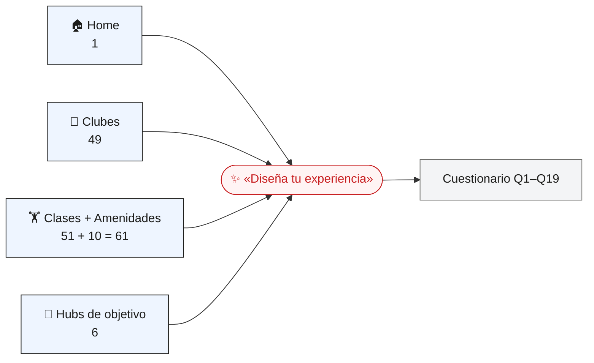
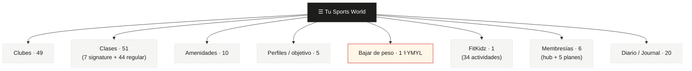
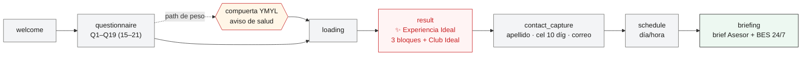
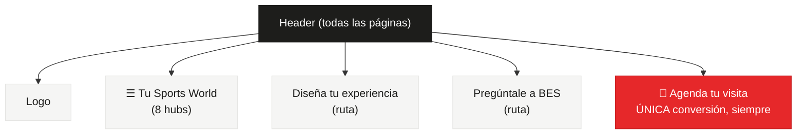

# Arquitectura de información — UX V1 (lienzo de validación)

Borrador para validar **antes** de redactar el spec. Cada bloque es trazable a `01-reglas-de-negocio.md`. Los conteos son los del spec v4.2 (F2); recuerda que **la arquitectura gobierna y los entregables se derivan de ella** (REC-01).

---

## 1. Principio rector: 4 puertas → 1 destino

> RN-D2-07 · El prospecto entra por una de cuatro puertas y todas conducen a «Diseña tu experiencia».

---

## 2. Estructura del sitio: cajón «Tu Sports World» (8 hubs)

> RN-D4-05 · Único menú estructural. RN-D4-06 · Los 3 elementos de acción del header (Diseña tu experiencia · Pregúntale a BES · Agenda tu visita) **no** viven en este cajón.

---

## 3. Inventario de tipos de página (≈155)

> RN-D3-02 / RN-D4-07. Conteos del spec v4.2 (F2).

| # | Tipo de página | Cant. | Notas | Regla |
|---|---|---:|---|---|
| 1 | Home | 1 | Puerta de entrada | RN-D2-07 |
| 2 | Club | 49 | En 13 estados · deben ser SSR/indexables | RN-D3-01·RN-D4-01 |
| 3 | Clase | 51 | 7 Premium Les Mills + 44 regulares | RN-D3-03 |
| 4 | Amenidad | 10 | alberca, INTENZ, FitKidz, box, escalada, canchas, sauna/vapor, vestidores, cafetería, estacionamiento | RN-D3-05 |
| 5 | Hub de objetivo (Perfiles) | 5 | primeros pasos, salud y bienestar, estética, ganar fuerza, rehabilitación | RN-D3-07 |
| 6 | Bajar de peso | 1 | Tipo aparte, **YMYL** | RN-D3-07·RN-D9-03 |
| 7 | FitKidz | 1 | Hub absorbe 34 actividades (sin páginas individuales) | RN-D3-04 |
| 8 | Personal Training | 1 | | RN-D5-09 |
| 9 | Entrenamiento individual | 10 | 18 sub-clases (3 familias × 6) | RN-D3-08 |
| 10 | Membresías | 6 | hub + 5 planes (UniClub, AllClub, Black Pass, Pink Plan, Promo 21 días) · sin checkout | RN-D3-06·RN-D8-11 |
| 11 | Journal / Diario | 20 | artículos; algunos YMYL | RN-D4-07 |
| | **Total** | **≈155** | | RN-D3-02 |

*Pendientes de ratificar (no bloquean): REC-03 FitKidz 34 vs 21 · REC-04 51 vs 49+2 clases.*

---

## 4. El flujo «Experiencia Ideal» (lo que cuelga del destino)

> RN-D2-06 · `CUESTIONARIO → CONOCIMIENTO → EXPERIENCIA IDEAL → LEAD CALIFICADO`. Fases del sistema: welcome · questionnaire · loading · result · contact_capture · schedule · briefing.

**Resultado = 3 bloques** (RN-D7-01): `01 Pesas` · `02 Cardio` · `03 Clases`, cada uno ON por defecto y suprimible por reglas (Q13=Solo → Block 3 OFF; contraindicación → filtra). Antes, la **Card «Tu Club Ideal»** (RN-D7-08).

---

## 5. Capa transversal: header y estados

> RN-D4-06 (header) · RN-D5-01/03/04 (estados y conversión).

**Menú contextual = f(3 ejes)** (RN-D5-02): estado del cuestionario · tipo de página · club resuelto.

| Estado (RN-D5-01) | Botón de experiencia visible | Conversión |
|---|---|---|
| Sin cuestionario | «Diseña tu experiencia» (Rule 27) | «Agenda tu visita» siempre |
| Completo, dentro del flujo | — (no se duplica) | «Agenda tu visita» siempre |
| Completo, fuera del flujo | «Volver a tu experiencia ideal» (Rule 28) | «Agenda tu visita» siempre |

**Reglas geográficas** (RN-D5-06): CIUDAD-UNO (1 club) · CIUDAD-POCOS (2–3) · CIUDAD-ZMVM (>3, 32 clubes) cambian qué botones de club aparecen.

---

## 6. Qué falta para cerrar la arquitectura
- Validar este lienzo (esta es la decisión de ahora).
- Resolver pendientes menores REC-03/04/05 al redactar.
- Definir, **desde esta arquitectura**, el conteo real de entregables (REC-01).
