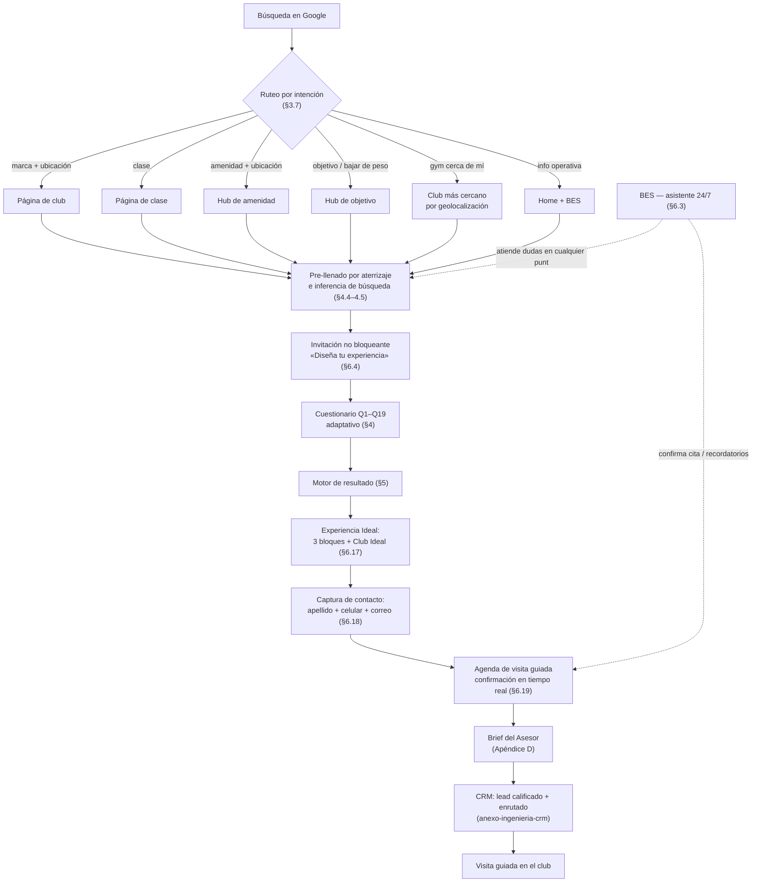
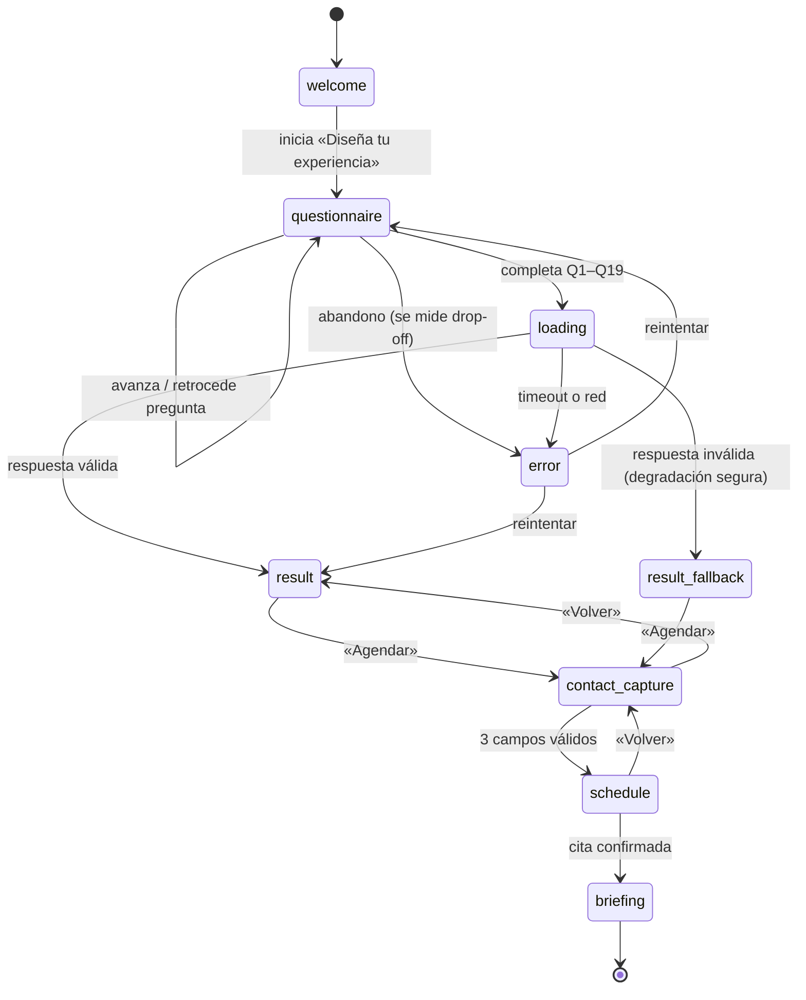
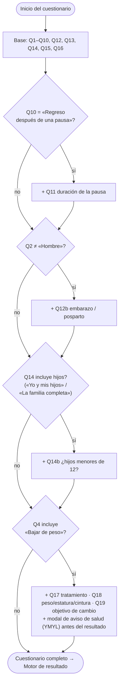
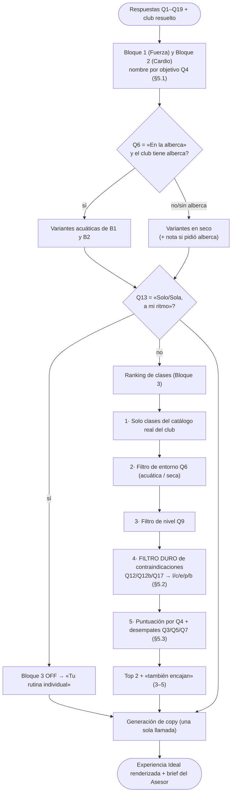
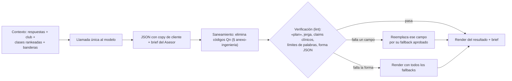
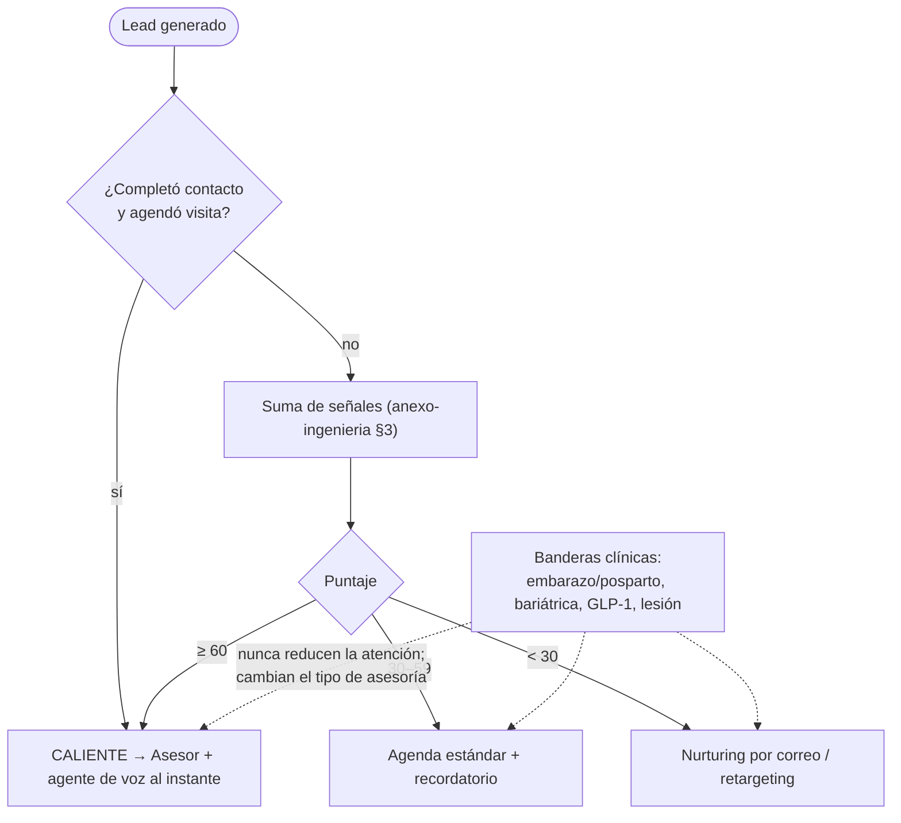

# Diagramas de flujo — Experiencia Ideal · Sports World

Diagramas normativos de extremo a extremo. Cada diagrama es la representación visual de una sección del UX Spec; ante cualquier duda de detalle, gobierna el texto de la sección citada.

Índice:
1. Flujo maestro — de la búsqueda en Google a la visita guiada
2. Máquina de estados de la aplicación (fases)
3. Cuestionario adaptativo «Diseña tu experiencia» (Q1–Q19)
4. Motor de resultado — resolución de bloques, filtro de seguridad y ranking de clases
5. Generación de copy y armado del lead (una sola llamada al modelo)
6. Calificación y enrutamiento del lead (CRM)

---

## 1. Flujo maestro — de la búsqueda a la visita guiada

Recorrido completo: descubrimiento por SEO, cualificación con el cuestionario, conversión y cierre humano. Las cuatro puertas de entrada convergen en el mismo destino.

---

## 2. Máquina de estados de la aplicación (fases)

Fases del sistema y todas sus transiciones, incluido el manejo de error. No solo el camino feliz.

---

## 3. Cuestionario adaptativo «Diseña tu experiencia» (Q1–Q19)

15 preguntas base siempre visibles + 6 condicionales que se insertan según respuestas previas. Rango real: 15 a 21 preguntas. Detalle normativo en §4.

---

## 4. Motor de resultado — resolución de bloques, seguridad y ranking

Cómo se arma la Experiencia Ideal: primero los dos bloques individuales, luego el filtro duro de seguridad y el ranking de clases grupales. El filtro de contraindicaciones corre **antes** de cualquier puntuación.

---

## 5. Generación de copy y armado del lead (una sola llamada al modelo)

Una sola operación produce el copy visible para el cliente y el brief interno del Asesor. Toda salida pasa por saneamiento y verificación antes de mostrarse.

---

## 6. Calificación y enrutamiento del lead (CRM)

El puntaje prioriza a los leads que aún no agendan; agendar siempre tiene prioridad máxima. Las banderas clínicas nunca reducen la atención.

