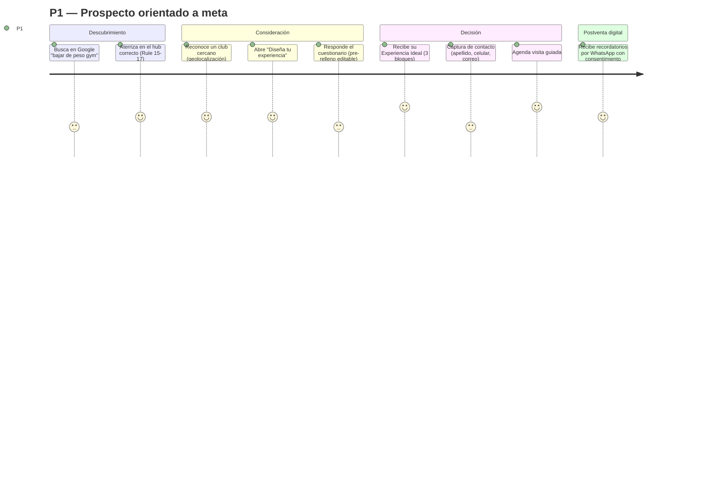
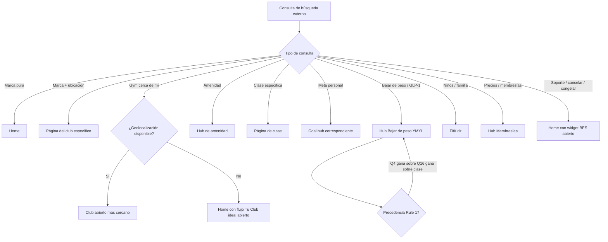
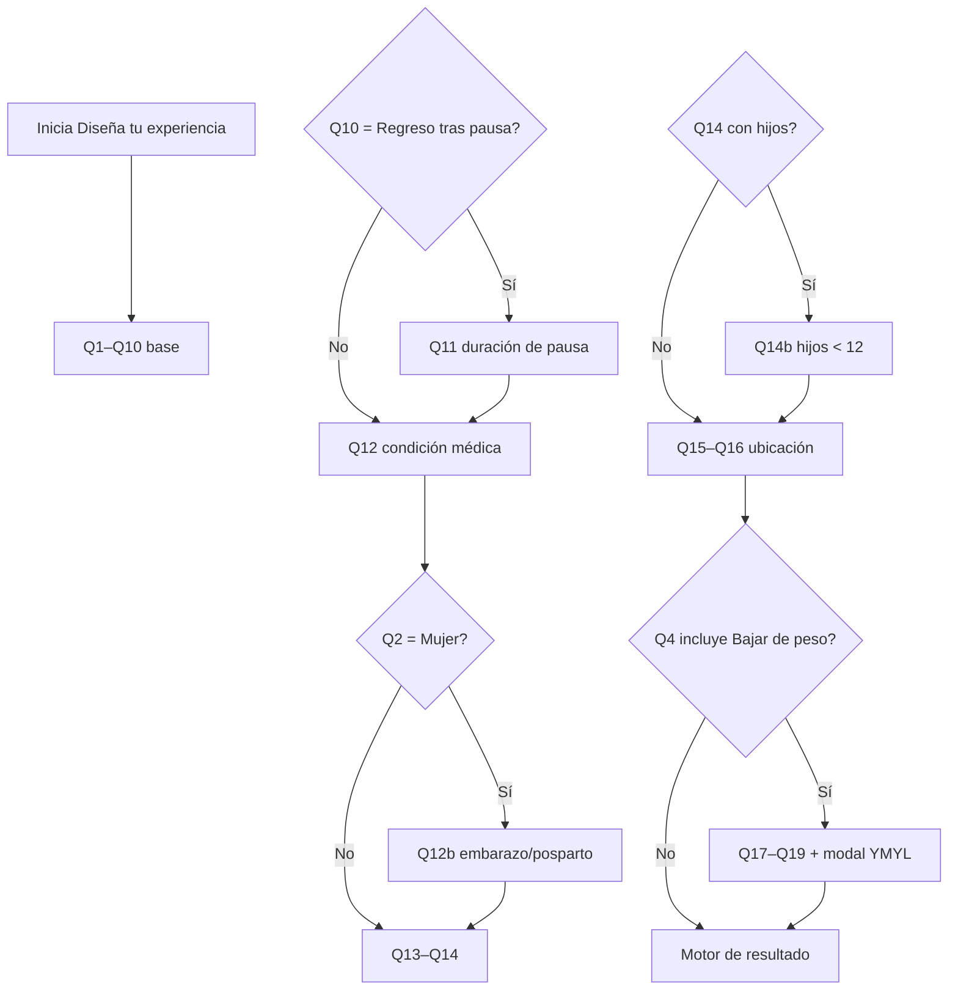
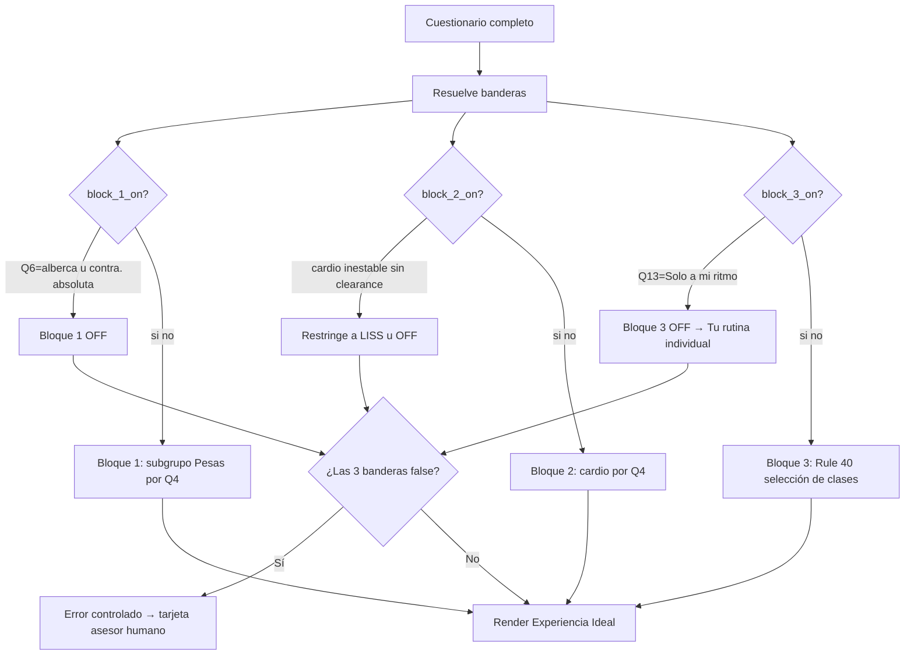
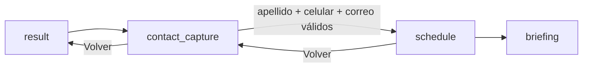

# UX Spec — Sitio público Sports World

| Campo | Valor |
|---|---|
| Versión | v5.0 (rediseño estructural sobre v4.2) |
| Fecha | 2026-06-10 |
| Autores | Producto · Diseño · Ingeniería · QA · Revisor médico (coautoría) |
| Estado | En revisión |
| Stack de salida | Next.js (React) + Tailwind · mobile-first |
| Herramienta de handoff | Figma inspect + repositorio de tokens (fuente única de verdad) |
| Idioma de la interfaz | Español (México) |
| Idioma de la especificación | Español (prosa) · cadenas de UI en español-MX · códigos internos sin traducir |
| Cumplimiento | WCAG 2.2 AA · LFPDPPP · YMYL (Google) |

> **Fuente de verdad.** Este documento define el comportamiento del sitio público de Sports World. Si una conducta no está descrita aquí, no existe en el sitio. Si una conducta contradice este documento, este documento gana hasta que se emita una versión nueva. Supersede a v4.2, v4.1, v4.0 y v3.0.

> **Qué cambió en v5.0 (rediseño).** Se reorganizó el contenido de v4.2 al formato estándar de especificación UX: se antepuso la **Racionalidad del Diseño** (cadena Por qué→Quién→Qué→Cómo con meta SMART), se añadieron **Personas y Customer Journey**, **diagramas de transición** de todas las bifurcaciones, una **matriz única de Edge Cases**, **tokens de diseño DTCG**, el **mapeo POUR criterio por criterio**, las **mecánicas de captación de leads** explícitas (perfilado progresivo, lead scoring/enrutamiento, CUI, A/B testing) y **criterios de aceptación verificables**. No se eliminó comportamiento: las 43 reglas, el cuestionario Q1–Q19, los 11 tipos de página, los subgrupos ACSM, la matriz de contraindicaciones YMYL y la guía de voz de marca se conservan íntegros, depurados de los artefactos de conversión del documento original.

---

## 0. Control del documento

### Audiencia

Cuatro audiencias de lectura:

- **Diseño** — construye pantallas y patrones de interacción.
- **Ingeniería** — los implementa.
- **Contenido y SEO** — pueblan cada página.
- **Stakeholders del cliente** — firman cada compuerta de aprobación.

### Cómo leer este documento

| Sección | Contenido |
|---|---|
| 1. Racionalidad del diseño | El *porqué*: cadena de razonamiento, justificación macro y micro |
| 2. Personas y Customer Journey | Arquetipos y mapa de viaje |
| 3. Flujos y diagramas de transición | Enrutamiento, cuestionario, motor de resultado, agenda |
| 4. Arquitectura de información | 11 tipos de página + widget BES, inventario de 145 páginas |
| 5. Especificación por pantalla / componente | Header, drawer, BES, cuestionario, resultado, agenda |
| 6. Reglas globales (Reglas 1–43) | Comportamiento transversal a todo el sitio |
| 7. Matrices de comportamiento por página | Qué ve el usuario en cada escenario de aterrizaje |
| 8. Matriz de Edge Cases y estados condicionales | Qué hace el sitio cuando falla el camino feliz |
| 9. Sistema de diseño y tokens | Tokens DTCG, fuente única de verdad |
| 10. Accesibilidad (WCAG 2.2 AA / POUR) | Mapeo de cada pilar |
| 11. Mecánicas de captación de leads | Perfilado progresivo, lead scoring, CUI, A/B |
| 12. Handoff y sincronización | Mitigación de Design Drift |
| 13. Criterios de aceptación | Condiciones verificables |
| 14. Métricas y experimentación | KPI y pruebas |
| Apéndices A–H | Privacidad, fuera de alcance, taxonomía ACSM, voz de marca, plantillas de resultado/brief/LLM, glosario, referencia de códigos |

### Convención de idioma

- **Cadenas de UI:** español (México). Imperativo en segunda persona familiar (*Visita un club*, no *Visite un club*). Vocabulario mexicano (*checar*, *platicar*, *Aquí empieza todo*). Sin calcos del inglés.
- **Prosa de la especificación:** español.
- **Códigos internos** (`CIUDAD-ZMVM`, `Q17`, `block_1_on`): nunca se traducen; mapean uno a uno con identificadores de implementación.

### Convención de códigos (identificadores inmutables)

Una vez asignado, un código nunca cambia de significado ni se reutiliza. Si un elemento se retira, su código se retira de forma permanente.

| Sistema | Formato | Ejemplos | Significado |
|---|---|---|---|
| Tipo de página | numérico 1–11 | `2` = Club individual | 11 tipos canónicos en el alcance de 145 páginas |
| Pregunta | `Q`+número | `Q1`, `Q16`, `Q19` | Preguntas del cuestionario |
| Clasificación de ciudad | `CIUDAD-`+tag | `CIUDAD-1`, `CIUDAD-ZMVM` | Número de clubes en la ciudad del usuario |
| Regla | `Rule`+número | `Rule 7`, `Rule 43` | Reglas globales de la sección 6 |
| Tag de artículo | minúsculas con guion | `bajar-de-peso`, `amenidad-alberca` | Etiquetas del Journal para cross-linking (Rule 29) |
| Bandera de bloque | `block_N_on` | `block_3_on` | Render de los bloques del resultado (Rule 39) |

### Historial de revisiones

| Versión | Fecha | Descripción |
|---|---|---|
| 1.0 | Feb 2026 | Borrador inicial (sitemap + reglas de header) |
| 2.0 | Mar 2026 | Cuestionario y lógica de menú contextual |
| 3.0 | May 2026 | Matrices por página para los 12 tipos |
| 4.0 | May 2026 | Reestructura a formato de especificación UX de industria |
| 4.1 | May 2026 | Mejores prácticas (UXmatters / NN/g / Atlassian); posicionamiento Premium fitness; mobile-first; BES como widget global; YMYL canónico |
| 4.2 | Jun 2026 | Cuestionario adaptativo 10→16 base + 3 WL + 1 condicional; páginas de entrenamiento individual; Rule 38; hub *Tonificar* → *Estética corporal* |
| **5.0** | **Jun 2026** | **Rediseño al formato estándar del skill UX Spec: racionalidad antepuesta, personas, diagramas, matriz de edge cases, tokens DTCG, POUR, captación de leads y criterios de aceptación. Sin pérdida de comportamiento.** |

---

## 1. Racionalidad del Diseño (Design Rationale)

### 1.1 Cadena de razonamiento (Por qué → Quién → Qué → Cómo)

- **Por qué (meta SMART).** El sitio anterior es casi invisible en búsqueda orgánica y enruta mal a los prospectos. Metas medibles a 90 días desde el lanzamiento:
  - Top 10 en el clúster de consultas *bajar de peso*.
  - Top 50 para las 51 clases de adultos.
  - 100% de las sesiones geolocalizadas enrutadas al club abierto más cercano.
  - Core Web Vitals móvil p75: LCP < 2.5 s, INP < 200 ms, CLS < 0.1.
  - WCAG 2.2 AA en todas las páginas.
- **Quién (actores).** Primarios: prospectos que investigan un gimnasio, miembros existentes en autoservicio, padres y decisores familiares (FitKidz). Secundarios: equipos de contenido/SEO, asesores de venta (Advisors), revisor médico. Fuera de escena: call center, CRM del cliente, proveedor de BES.
- **Qué (comportamiento medible / Jobs to be Done).** El prospecto debe (a) llegar a la página que mejor responde su búsqueda, (b) reconocer un club cercano, (c) construir una experiencia personalizada respondiendo el cuestionario, y (d) agendar una visita guiada. Se mide por: tasa de finalización del cuestionario, tasa de agendado de visita, exactitud de enrutamiento por geolocalización.
- **Cómo (táctica/UI).** Tres caminos paralelos de igual jerarquía (*Tu Sports World*, *Diseña tu experiencia*, *Pregúntale a BES*) más una única acción de conversión persistente (*Agenda tu visita*). Un cuestionario adaptativo que pre-rellena lo inferible y entrega un plan de tres bloques auditable. Sin checkout en línea: la venta ocurre en la visita guiada.

### 1.2 Justificación macro (cómo apoya la estrategia)

| Problema del sitio anterior | Causa | Solución en el sitio nuevo |
|---|---|---|
| Aparece en < 1% de búsquedas *gym para bajar de peso* | No existía página dedicada | Hub `/bajar-de-peso/` con contenido YMYL y firma médica |
| Fuera del top 100 en *yoga cerca de mí* | Páginas de clase sin optimizar | Una página dedicada por clase (51 de adultos) + hub FitKidz que absorbe 34 actividades, con marcado estructurado |
| *Gym cerca de mí* aterriza en home, no en el club cercano | El sitio no detectaba ubicación | Detección de ubicación y enrutamiento al club abierto más cercano (Rule 15) |

### 1.3 Justificación micro (por qué este patrón y no otro)

| Decisión | Justificación |
|---|---|
| **Tres caminos de igual jerarquía** + 1 CTA destacada | El usuario elige su modo de exploración; la conversión (*Agenda tu visita*) es la única acción tratada visualmente como prioritaria (pill rojo `#E6282A`). |
| **BES como widget flotante global**, no página destino | Disponible en cada página sin navegar fuera; *lazy-load* para no afectar LCP; con fallback `/bes` para no-JS e indexadores. |
| **Sin checkout en línea** (Rule 22) | La venta premium se cierra en persona; el sitio captura el lead cualificado y lo enruta a la visita guiada. Reduce fricción y abandono en pago. |
| **Cuestionario adaptativo con pre-relleno editable** | Baja la carga cognitiva: pregunta solo lo que no puede inferir; todo pre-relleno es editable para no falsear datos. |
| **Plan de 3 bloques con banderas de supresión auditables** | Cualquier revisor predice qué ve el usuario leyendo sus respuestas; la IA no inventa hechos, solo selecciona IDs validados. |
| **Filtro duro de contraindicaciones antes del ranking** (Rule 14b) | YMYL: una clase contraindicada nunca aparece; la seguridad precede a la personalización. |
| **Voz de marca sobria** (sin signos de exclamación, sin anglicismos) | Posicionamiento *Premium fitness*: lenguaje medido, directo, adulto; sin *enthusiasm* forzado. |

---

## 2. Personas y Customer Journey

### 2.1 Personas (en orden de prioridad)

- **P1 · Prospecto orientado a meta.** Llega de búsqueda externa (*gimnasio Polanco*, *bajar de peso gym*, *yoga estudio*). Meta: encontrar el gimnasio correcto cerca de él y entender qué le ofrece. Frustración: aterrizar en una home genérica que no responde su intención.
- **P2 · Miembro existente en autoservicio.** Consulta horarios, ubica amenidades, pregunta a BES por horarios, cancelaciones o congelamientos. Meta: resolver rápido sin llamar. Frustración: no encontrar el dato o no saber a quién preguntar.
- **P3 · Padre / decisor familiar (FitKidz).** Búsqueda exploratoria (*gimnasio para niños*, *actividades familia*), no por nombre de clase. Meta: evaluar el programa infantil y la cercanía. Frustración: ver 34 actividades sin saber cuáles ofrece su club.

> El encuadre **familiar** aplica solo en páginas FitKidz (*Premium family fitness*). En el resto del sitio el encuadre es individual o personalizado: habla a una persona a la vez.

### 2.2 Customer Journey (P1, camino feliz)



---

## 3. Flujos y diagramas de transición

> Diagramas de **todas** las bifurcaciones lógicas, no solo el camino feliz.

### 3.1 Enrutamiento desde búsqueda externa (Reglas 15–17)



**Inferencia (Rule 16).** Desde la búsqueda externa solo se infieren **dos** variables: meta (`Q4`, si la búsqueda contiene una meta explícita) y ubicación (`Q15`/`Q16`, si contiene una ubicación). No se infiere nada desde navegación interna.

**Precedencia (Rule 17).** `Q4 (meta) > Q16 (ubicación) > pre-marca de meta por clase`. Ej.: *yoga Polanco bajar de peso* aterriza en el hub **Bajar de peso** con `Q16` = Polanco; la pre-marca por clase no se aplica.

### 3.2 Cuestionario adaptativo (Reglas 18–21)



Conteos de preguntas visibles: **16 base (A)** · **17 con Q11 (B)** · **19 con WL Q17–Q19 (C)** · **20 con Q11 + WL (D)**. En página de club individual, `Q15` y `Q16` se omiten (cuenta −2).

### 3.3 Motor de resultado — plan de tres bloques (Reglas 38–43)



### 3.4 Conversión — de resultado a visita guiada (Rule 32b)



`contact_capture` es un paso obligatorio de intake, **no** una pregunta del cuestionario (excluido del conteo Q1–Q19). El usuario no avanza a fecha/hora sin los tres datos válidos.

---

## 4. Arquitectura de información

### 4.1 Inventario de páginas

11 tipos de página canónicos en alcance + el asistente BES (widget global, no página destino).

| # | Tipo de página | Conteo | Patrón de URL | YMYL |
|---|---|---|---|---|
| 1 | Home | 1 | `/` | No |
| 2 | Club individual | 49 | `/clubes/[club]/` | No |
| 3 | Amenidad | 10 | `/amenidades/[amenidad]/` | No |
| 4 | Clase Premium Les Mills | 7 | `/clases/signature/[clase]/` | No |
| 5 | Clase regular | 44 | `/clases/[clase]/` | No |
| 6 | FitKidz | 1 | `/fitkidz/` | No |
| 7 | Goal hub | 5 | `/perfiles/[objetivo]/` | Solo rehabilitación |
| 8 | Hub Bajar de peso | 1 | `/bajar-de-peso/` | **Sí (YMYL)** |
| 9 | Personal Training | 1 | `/personal-training/` | No |
| 10 | Membresías | 6 (1 hub + 5 planes) | `/membresias/` y `/membresias/[plan]/` | No |
| 11 | Artículo del Journal | 20 | `/diario/[articulo]/` | Algunos |

**Total de páginas firmadas:** 1 + 49 + 10 + 7 + 44 + 1 + 5 + 1 + 1 + 6 + 20 = **145 páginas**.

Páginas de entrenamiento individual añadidas como tipo *clase* (no alteran el conteo de 11 tipos): `entrenamiento-con-pesas-individual` y `entrenamiento-aerobico-individual`, con 4 subgrupos cada una (ver Apéndice C).

### 4.2 Detalle por tipo

- **5 goal hubs:** Primeros Pasos, Salud y Bienestar, Estética corporal *(antes Tonificar)*, Ganar Fuerza, Rehabilitación.
- **5 planes de membresía:** UniClub, AllClub, Black Pass, Pink Plan, Promo 21 días.
- **10 amenidades:** alberca, INTENZ (zona funcional), FitKidz, ring de box, muro de escalar, canchas, sauna y vapor, regaderas y vestidores, cafetería, estacionamiento.
- **FitKidz** aparece como tipo de página (el hub) y como una de las 10 amenidades (apuntador que enlaza al hub). El hub absorbe las **34 actividades infantiles**, organizadas por rango de edad, disciplina y disponibilidad por club. No hay página por actividad.

> **Regla anti-huérfanos:** cada página es alcanzable desde al menos otras dos. La matriz de cross-linking se hace cumplir por la Rule 10.

---

## 5. Especificación por pantalla / componente

> Cada bloque documenta propósito, layout y dimensiones, tipografía, estados interactivos, validación, contenido y requisitos no funcionales. Las dimensiones son exactas (px/rem), nunca "a ojo".

### 5.1 Header (Reglas 1, 2, 7)

- **Propósito:** navegación persistente y acceso a la única acción de conversión.
- **Layout y dimensiones:**
  - **Desktop (≥ 1024 px):** una fila fija, sticky, altura constante; fondo sólido con leve transparencia y *blur*. Cinco elementos de izquierda a derecha: logo · *Tu Sports World* · *Diseña tu experiencia* · *Pregúntale a BES* · *Agenda tu visita* (pill rojo).
  - **Mobile (< 1024 px):** dos filas apiladas — Fila 1 (56 px): logo + *Agenda tu visita*. Fila 2 (tira editorial, 44 px): *Tu Sports World · Diseña · BES*.
- **Etiquetas responsivas:**

  | Ancho de pantalla | Etiquetas mostradas |
  |---|---|
  | ≥ 1024 px (desktop) | Tu Sports World · Diseña tu experiencia · Pregúntale a BES |
  | 480–1023 px | Tu Sports World · Diseña tu experiencia · BES |
  | < 480 px | Tu Sports World · Diseña · BES |

- **Jerarquía:** los elementos 2–4 son tres caminos paralelos de igual peso; el elemento 5 (*Agenda tu visita*) es la única acción de conversión y se trata distinto.
- **Estados interactivos:** default / hover (desktop) / focus (anillo visible) / active / disabled. La CTA pill nunca depende solo de hover.
- **Requisitos no funcionales:** sticky sin cambio de altura ni *layout shift* (CLS < 0.1); altura idéntica en todas las posiciones de scroll (Rule 7).

### 5.2 Drawer lateral *Tu Sports World* (Reglas 4–5)

- **Propósito:** navegación clásica a los 8 hubs principales.
- **Contenido (8 hubs):** Tu Club ideal · Clases · Amenidades · FitKidz · Bajar de peso · Personal Training · Membresías · Diario. Footer con redes sociales y aviso de privacidad.
- **Layout y dimensiones:** panel de **560 px** en desktop; pantalla completa en mobile.
- **Comportamiento:**
  - Desktop: abre en hover sobre *Tu Sports World* con retardo de **200 ms**; cierra al salir el cursor con gracia de **300 ms**.
  - Mobile: abre en tap; cierra al tocar fuera o cualquier ítem.
  - Animación: entra en **320 ms**, sale en **240 ms**.
  - Backdrop: velo semitransparente con `backdrop-blur 12px` + overlay negro 40%.
  - Cierre manual: "X" arriba a la izquierda.
- **Accesibilidad:** `Esc` cierra; `Tab` cicla foco solo dentro del drawer (focus trap).
- **No duplica:** las tres acciones del header (*Diseña*, *BES*, *Agenda*) no están en el drawer. Cada navegación vive en un solo lugar.

### 5.3 Widget BES (Reglas 3, 3.1, 3.2)

- **Propósito:** asistente conversacional de IA, texto-primero con voz opcional.
- **Layout:** botón flotante persistente abajo a la derecha en cada página y viewport; *lazy-load* para no afectar LCP. Panel de chat que se desliza sobre la página actual (no navega a otra URL): pantalla completa en mobile; panel derecho de **420 px** en desktop.
- **Modo por defecto:** texto-texto; un toggle en el header del panel cambia a voz-voz.
- **Context-passing:** al abrir, BES conoce el tipo de página y los identificadores contextuales (club, amenidad, goal, clase) sin que el usuario reitere contexto.
- **Fallback `/bes`:** página server-rendered para no-JS, enlaces compartidos e indexadores.
- **Lo que BES NO hace (3.1):** no ejecuta cancelaciones, congelamientos, cambios de plan ni reembolsos (captura la solicitud, valida identidad básica, abre ticket en el CRM y ofrece asesor humano); no responde preguntas de salud profundas (redirige al hub con firma médica); no promete resultados.
- **Alcance WhatsApp (3.2):** solo recordatorios de visita (24 h y 2 h antes), plantillas informativas sin requerir respuesta; consentimiento explícito (opt-in) capturado en la reserva; sin opt-in, el recordatorio cae a correo. WhatsApp no se usa para ventas ni cambios de cuenta.

### 5.4 Cuestionario *Diseña tu experiencia* (Reglas 18–21)

- **Propósito:** capturar variables para construir el plan personalizado con la mínima fricción.
- **Estructura:** 16 preguntas base (Q1–Q16) + 3 condicionales internas (Q11, Q12b, Q14b) + 3 opcionales de bajar de peso (Q17–Q19). Tabla completa en **Apéndice B**.
- **Pre-relleno (Rule 20):** cada aterrizaje pre-rellena lo inferible; **todo pre-relleno es editable**.
- **Validación de entrada (inline, en tiempo real):**

  | Campo | Regla | Mensaje de error (verbatim) |
  |---|---|---|
  | `Q16` Código postal | 5 dígitos numéricos | — |
  | `Q16` Colonia | texto libre; XOR con CP (al menos uno) | — |
  | `Q18` Peso | 30–300 kg | — |
  | `Q18` Altura | 120–230 cm | — |
  | `Q18` Edad | 15–90 años | — |
- **Concordancia de género (Q3, Q13, Q14):** si `Q2 = Mujer`, formas femeninas (*Desconectada*, *Renovada*, *Sola*, *Acompañada*).
- **Requisitos no funcionales:** estado parcial preservado en `localStorage` **solo** tras aceptar el aviso de privacidad (Rule 36); al volver, ofrece reanudar desde la última pregunta.

### 5.5 Página de resultado *Experiencia Ideal* (Reglas 39–43)

- **Propósito:** entregar el plan combinado de tres bloques, auditable.
- **Estructura visual (camino feliz):** Hero (kicker · nombre · hook por Q3 · argumento que nombra los 3 bloques · tags) → **Club Ideal card** (nombre · distancia · dirección · intent line · "Ver otros clubes") → **grid de tres bloques** → CTA *Agendar visita guiada* + secundario *Reiniciar cuestionario*.
- **Restricciones duras de layout:** un viewport en desktop (≤ 800 px en pantallas de 1280 px de ancho); ≤ 3 alturas de pantalla en mobile (≈ 1,350 px de referencia); sin signos de exclamación. Todo contenido factual proviene del backend o fichas. Plantilla HTML de referencia en **Apéndice E**.
- **Banderas de bloque:**

  | Bloque | Default | Condición de supresión | Bandera |
  |---|---|---|---|
  | 01 Pesas individual | ON | `Q6` = En la alberca; o `Q12` con contraindicación absoluta de la ficha del subgrupo | `block_1_on` |
  | 02 Cardio individual | ON | Cardiovascular inestable sin clearance (restringe a cardio suave/LISS, o OFF) | `block_2_on` |
  | 03 Clases recomendadas | ON | `Q13` = Solo/Sola, a mi ritmo (Rule 38) | `block_3_on` |

- **Bloque 2 (presentación al usuario):** muestra máquina + duración + cuándo + razón en lenguaje llano. **No** usa nombres técnicos ACSM (LISS, MICT, HIIT, SIT) en el copy de cara al usuario. Mapeo por `Q4`:

  | Q4 | Máquina | Duración · intensidad · cuándo |
  |---|---|---|
  | Bajar de peso | Caminadora, bicicleta o elíptica | 35–45 min · ritmo conversacional · después de pesas o día separado |
  | Estética / definición | Caminadora, bicicleta o elíptica | 25–35 min · conversacional + 1 día con intervalos cortos · después de pesas |
  | Aumentar masa muscular | Caminadora suave o bicicleta | 15–25 min · muy ligero · día separado o calentamiento corto |
  | Desempeño atlético | Bicicleta, remo o caminadora | 30–40 min · conversacional + intervalos · día separado de la fuerza |
  | Salud cardiovascular | Caminadora, bicicleta, elíptica o remo | 35–45 min · 3–4 días conversacional + 1 día con intervalos |
  | Recuperación lesión/dolor | Bicicleta reclinada, elíptica o caminadora muy suave | 15–25 min · muy ligero · antes de pesas como activación |

  Cuando `Q4` tiene dos selecciones, se usa la guía más restrictiva (prioridad: rehabilitación > fuerza > estética > bajar de peso > condición). Las clases grupales de HIIT con instructor van exclusivamente al Bloque 3, nunca al Bloque 2.
- **Bloque 1 (presentación al usuario):** muestra el nombre accesible del subgrupo (uno de seis, ver Apéndice C); nunca lista equipo; cierra con *"Tu entrenador define los ejercicios y el peso en la primera sesión"*.
- **Selección de clases (Rule 40):** el backend ejecuta el algoritmo antes de invocar al LLM. Orden: (1) catálogo del club ideal → (2) filtro de compatibilidad Q4 → (3) filtro de nivel Q9 → (4) **filtro duro de contraindicaciones Q12** → (5) preferencia de horario Q7 → (6) ranking por score (Q4 primario +3 / secundario +1, Q3 +2, Q5 +1, Q7 completo +1 / parcial +0.5) → (7) partición en `top_2`, `tambien_encajan` (3–5), `resto`. El LLM solo selecciona IDs de beneficio y razón de match y produce un `conector_personal` (≤ 15 palabras). **El LLM no genera, ordena ni filtra clases.**
- **Reemplazo de clase (Rule 41):** dos controles apilados por tarjeta — *Cambiar mis clases* (panel de reemplazo) y *Ver todas las del club* (catálogo filtrado). El reemplazo re-invoca el LLM solo para esa tarjeta; la otra no se regenera. Si el usuario elige fuera de compatibilidad Q4, nota suave: *"Esta clase no es la mejor opción para tu objetivo de [Q4], pero está disponible en tu club"*.
- **Club Ideal card (Rule 42):** nombre (más cercano por Q16 vs GPS), distancia en minutos (Distance Matrix API), dirección verbatim, intent line LLM (≤ 18 palabras), exactamente 4 features verificables, y "Ver otros clubes cerca de ti" (Rule 43). **Degradación elegante:** si algo no resuelve (geocoding, Q16 faltante), se omite ese elemento; nunca se inventa.
- **Otros clubes (Rule 43):** panel de clubes en radio configurable (default 15 km) ordenados por distancia. Al cambiar de club: la card se actualiza y el **Bloque 3 se reevalúa** (Rule 40 corre de nuevo); los Bloques 1 y 2 **no** se reevalúan (son por subgrupo, no por club).

### 5.6 Captura de contacto y agenda (Rule 32b)

- **Propósito:** convertir el plan en lead cualificado antes de seleccionar horario.
- **Pantalla intake obligatoria** (`contact_capture`), flujo `result → contact_capture → schedule → briefing`.
- **Copy del encabezado:** eyebrow *"Antes de agendar"*; H2 *"{firstName}, necesitamos un par de datos para confirmar tu visita."*; helper *"Tu Advisor te contactará para coordinar el horario y enviarte los detalles del club."*
- **Validación inline:**

  | Campo | Label | Regla | Error (verbatim) |
  |---|---|---|---|
  | `lastName` | Apellido | `trim().length ≥ 2` | Ingresa tu apellido (mínimo 2 letras) |
  | `phone` | Número de celular | exactamente 10 dígitos | Ingresa un número de 10 dígitos |
  | `email` | Correo electrónico | `/^[^\s@]+@[^\s@]+\.[^\s@]+$/` | Ingresa un correo electrónico válido |
- **Estados del botón:** *Continuar* en rojo cuando los tres campos son válidos; gris-deshabilitado en cualquier otro caso.
- **Aviso de privacidad (verbatim):** *"Tus datos se usan únicamente para coordinar tu visita guiada. No los compartimos con terceros."*
- **Navegación:** *← Volver* regresa a `result`; desde `schedule`, *Volver* regresa a `contact_capture` (no a `result`). El trío se guarda como `result.contact = { lastName, phone, email }`.

### 5.7 Menú contextual (Reglas 25–33)

- **Definición:** botones de acción primaria dentro del cuerpo de la página (no en el header). Cambia por página y por estado del usuario.
- **Botones always-on:** *Agenda tu visita guiada* aparece en **todas** las páginas y estados (Rule 26). *Diseña tu experiencia* aparece mientras el cuestionario esté incompleto (Rule 27); al completarse, lo reemplaza *Volver a tu experiencia ideal* (Rule 28).
- **Botones por página:** *Tu Club ideal* / *Otros clubes* (Reglas 23–24), *Artículos o información útil* (Rule 29, si hay artículos con tag coincidente), *Clases FitKidz disponibles* (Rule 30), *Tu rutina individual* (cuando `block_3_on = false`, Rule 38).
- **Estados del usuario (Rule 32):** *Sin cuestionario* · *Completo, dentro del flujo* · *Completo, fuera del flujo*.

### 5.8 Datos en vivo por club (Rule 12)

Cada página de club individual (tipo 2) muestra 4 datos en vivo de la API del cliente: horarios por día; teléfono y correo; catálogo de clases (cuáles de las 51 de adultos y cuáles FitKidz se ofrecen aquí); horario por clase, por día. Si la API no está disponible, la página cae al último valor cacheado con aviso visible (ver Edge Case EC-08).

---

## 6. Reglas globales (índice Reglas 1–43)

> Las reglas se conservan íntegras de v4.2. Las detalladas como componentes viven en §5; aquí se indexan todas para referencia inequívoca. Las marcadas con detalle completo están en su sección o apéndice.

| Regla | Tema | Dónde está el detalle |
|---|---|---|
| 1–2 | Estructura de header desktop / mobile | §5.1 |
| 3, 3.1, 3.2 | Widget BES, exclusiones, alcance WhatsApp | §5.3 |
| 4–5 | Drawer *Tu Sports World*, comportamiento | §5.2 |
| 6 | CTA *Agenda tu visita* (pill rojo `#E6282A`) | §5.1, §9 |
| 7 | Comportamiento sticky del header | §5.1 |
| 8 | Posicionamiento de marca (*Premium fitness*) | §1.3 |
| 9 | Reglas editoriales de copy | §6.1 |
| 10 | Cross-linking obligatorio entre páginas | §6.2 |
| 11 | Datos confirmados del sitio | §6.3 |
| 12 | Datos en vivo por club | §5.8 |
| 13 | Marcado schema.org | §6.4 |
| 14, 14b | Reglas YMYL + matriz de contraindicaciones | §6.5, Apéndice C |
| 15–17 | Enrutamiento e inferencia desde búsqueda | §3.1 |
| 18–21 | Cuestionario, opcionales WL, pre-relleno, multi-meta | §5.4, Apéndice B |
| 22 | Membresías sin checkout | §1.3, §6.6 |
| 23–24 | *Tu Club ideal* / *Otros clubes* | §5.7 |
| 25–33 | Menú contextual y estados | §5.7 |
| 32b | Captura de contacto | §5.6 |
| 34 | Refresco de plan obsoleto (60 días) | §6.7 |
| 35 | Piso de accesibilidad (WCAG 2.2 AA) | §10 |
| 36 | Datos y privacidad (LFPDPPP) | Apéndice A |
| 37 | Páginas fuera de alcance | Apéndice A |
| 38 | Pre-relleno y resultado al entrenar solo | §5.5 |
| 39 | Estructura del plan combinado | §5.5 |
| 40–41 | Selección y reemplazo de clases | §5.5 |
| 42–43 | Club Ideal card y otros clubes | §5.5 |

### 6.1 Rule 9 — Reglas editoriales de todo el copy

- Sin signos de exclamación, ni en CTAs.
- Sin texto en mayúsculas tipo marketing (solo logos, acrónimos como `BES`, `GLP-1`, o inicial de nombres propios).
- Sin emoji.
- Sin anglicismos donde existe palabra en español: *membresía* (no *membership*), *asesor* (no *advisor* en copy), *agenda* (no *book*).
- Sin titulares anzuelo de pregunta (*¿Sabes cuántas calorías quemas?*). Titulares directos y descriptivos.

### 6.2 Rule 10 — Cross-linking obligatorio (sin huérfanos)

| Desde | Hacia | Dirección |
|---|---|---|
| Cada club | Cada amenidad que ofrece | Bidireccional |
| Cada amenidad | Cada club que la ofrece | Bidireccional |
| Cada clase | Cada club donde se imparte | Bidireccional |
| Cada artículo del Journal | Al menos un hub relacionado, y un club si hay relevancia geográfica | Unidireccional (artículo → hub/club) |
| Personal Training | Cada uno de los 5 goal hubs | Bidireccional |

### 6.3 Rule 11 — Datos confirmados del sitio

| Ítem | Valor |
|---|---|
| Clubes totales | 49 |
| Clubes en ZMVM (CDMX + Edo. Méx.) | 32 |
| Clubes fuera de ZMVM | 17 (en 11 estados) |
| Clases de adultos | 51 (7 Premium Les Mills + 44 regulares) |
| Actividades FitKidz | 34 |
| Goal hubs | 5 (+ el hub Bajar de peso) |
| Amenidades | 10 |
| Planes de membresía | 5 (+ el hub) |
| Artículos iniciales del Journal | 20 |
| Páginas firmadas (alcance) | 145 |

### 6.4 Rule 13 — Marcado schema.org

| Tipo de página | Schema requerido |
|---|---|
| Club | `LocalBusiness` + `HealthClub` + `OpeningHoursSpecification` (una entrada por día) + `GeoCoordinates` verificadas |
| Clase (premium y regular) | `Course` |
| Bajar de peso (hub) | `MedicalWebPage` + `Person` (revisor médico con credenciales, nombre y cédula profesional) |
| Goal hubs y páginas con FAQ | `FAQPage` |
| Artículo del Journal | `Article` + `Person` (autor con credenciales cuando aplica) |
| Toda página (excepto home) | `BreadcrumbList` |
| Raíz del sitio | `Organization` + `WebSite` |

Todo dato estructurado debe validar contra el Rich Results Test de Google antes de publicar.

### 6.5 Rule 14 — Reglas YMYL

Páginas YMYL: hub **Bajar de peso** (completo), hub de **rehabilitación**, algunos artículos del Journal sobre nutrición, rehabilitación y suplementación. Requisitos:

- **Firma profesional visible:** nombre y cédula profesional del médico, nutriólogo o fisioterapeuta que respalda el contenido.
- **Disclaimer de salud** antes de mostrar recomendaciones: la información es orientativa y no sustituye consulta médica.
- **Sin promesas numéricas:** el sitio nunca dice "bajas X kilos en Y semanas"; los planes se presentan por fases (semanas 1–4 adaptación, 4–12 progresión).

La matriz dura de contraindicaciones para clases grupales (Rule 14b) vive en el **Apéndice C**.

### 6.6 Rule 22 — Membresías sin checkout

Las 6 páginas de membresía muestran descripción, qué incluye, qué no, precio, letra chica y comparación. **No** incluyen checkout transaccional. La conversión es *Agenda tu visita guiada*; la venta ocurre en persona o por teléfono.

### 6.7 Rule 34 — Refresco de plan obsoleto

Un usuario con plan generado hace más de **60 días** ve un aviso no bloqueante que ofrece refrescar el plan (*"¿Sigue siendo tu objetivo?"*). El plan sigue disponible sin cambios si el usuario no interactúa.

---

## 7. Matrices de comportamiento por página

> Cada matriz cruza el estado del usuario con el cuestionario y el menú contextual. Asumen las reglas globales aplicadas. El header (Reglas 1–2) y BES (Rule 3) están siempre visibles y no se repiten.

### 7.1 Home

| Estado | Cuestionario | Menú contextual |
|---|---|---|
| Sin cuestionario · sin ubicación · marca pura | 16 (19 si bajar de peso) | Tu Club ideal · Diseña tu experiencia · Agenda tu visita guiada |
| Sin cuestionario · sin ubicación · búsqueda con meta | 16, Q4 pre-rellena editable (19 si WL) | Tu Club ideal · Diseña tu experiencia · Agenda tu visita guiada |
| Sin cuestionario · con ubicación inferida | 16, Q15/Q16 pre-rellenas editables (19 si WL) | Tu Club ideal · Diseña tu experiencia · Agenda tu visita guiada |
| Completo (siempre fuera del flujo en home) | Ya completo | Volver a tu experiencia ideal · Agenda tu visita guiada |

### 7.2 Club individual

Al aterrizar en un club, el club ya está identificado: **Q15 y Q16 se omiten**.

| Estado | Cuestionario | Menú contextual |
|---|---|---|
| Sin cuestionario · ciudad de 1 club | 14 (10 si WL) | Diseña tu experiencia · Agenda tu visita guiada |
| Sin cuestionario · ciudad de 2–3 clubes | 14 (10 si WL) | Otros clubes en tu ciudad · Diseña tu experiencia · Agenda tu visita guiada |
| Sin cuestionario · ciudad ZMVM (>3) | 14 (10 si WL) | Otros clubes en el área · Diseña tu experiencia · Agenda tu visita guiada |
| Completo · ciudad de 1 club | Ya completo | Volver a tu experiencia ideal · Agenda tu visita guiada |
| Completo · ciudad de 2–3 clubes | Ya completo | Volver a tu experiencia ideal · Otros clubes en tu ciudad · Agenda tu visita guiada |
| Completo · ciudad ZMVM (>3) | Ya completo | Volver a tu experiencia ideal · Otros clubes en el área · Agenda tu visita guiada |

### 7.3 Goal hub (5 hubs)

Aterrizar pre-marca `Q4` con la meta del hub. El modal YMYL se muestra **solo** en el camino bajar de peso, no en rehabilitación.

| Estado | Cuestionario | Menú contextual |
|---|---|---|
| Sin cuestionario · sin club · sin ubicación | 16 con Q4 pre-rellena (19 si cambia a WL) | Tu Club ideal · Artículos o información útil (si hay) · Diseña tu experiencia · Agenda tu visita guiada |
| Sin cuestionario · con ubicación inferida | 16 con Q4, Q15, Q16 pre-rellenas | Tu Club ideal · Artículos o información útil (si hay) · Diseña tu experiencia · Agenda tu visita guiada |
| Sin cuestionario · con club | 16 con Q4 pre-rellena | Artículos o información útil (si hay) · Diseña tu experiencia · Agenda tu visita guiada |
| Completo (dentro/fuera del flujo) | Ya completo | Volver a tu experiencia ideal · Artículos o información útil (si hay) · Agenda tu visita guiada |

#### 7.3b Variante Bajar de peso (YMYL)

Pre-marca `Q4 = Bajar de peso`, que activa los opcionales `Q17–Q19`. Modal de disclaimer antes del resultado. Siempre hay artículos con tag `bajar-de-peso`, así que *Artículos o información útil* siempre aparece. Conteo: 19 preguntas.

### 7.4 FitKidz

Sin club identificado, el sistema **fuerza el flujo Tu Club ideal** antes de mostrar contenido de clase. Con club, aparece *Clases FitKidz disponibles* con horario. Aterrizar pre-rellena `Q14` con la opción familiar.

| Estado | Cuestionario | Menú contextual |
|---|---|---|
| Sin cuestionario · sin club · sin ubicación | Fuerza Tu Club ideal; si invoca Diseña, 16 con Q14 pre-rellena (19 si WL) | Tu Club ideal |
| Sin cuestionario · con ubicación | Surfacea hasta 3 clubes, cada uno con 3 botones (Conoce el club · Agenda una visita guiada · Clases FitKidz para tu familia); Diseña = 16 con Q14, Q15, Q16 pre-rellenas | Tu Club ideal · Diseña tu experiencia · Agenda tu visita guiada |
| Completo, dentro del flujo | Ya completo; muestra clubes y clases FitKidz del plan con horario | Tu Club ideal · Clases FitKidz disponibles · Diseña tu experiencia · Agenda tu visita guiada |
| Completo, fuera del flujo | Ya completo | Volver a tu experiencia ideal · Clases FitKidz disponibles · Agenda tu visita guiada |

### 7.5 Entrenamiento individual (pesas / aeróbico)

Por Rule 38, `Q13` pre-marca *Solo, a mi ritmo* (*Sola* si Q2 = Mujer) y el resultado recomienda subgrupos individuales, no clases grupales; el menú muestra *Tu rutina individual*.

| Estado | Cuestionario | Menú contextual |
|---|---|---|
| Sin cuestionario | 16, Q13 pre-marca Solo/Sola y Q4 pre-marca por subpágina, editables (19 si WL) | Tu rutina individual · Diseña tu experiencia · Agenda tu visita guiada |
| Completo (dentro/fuera) | Ya completo | Volver a tu experiencia ideal · Tu rutina individual · Agenda tu visita guiada |

**Pre-marca Q4 por subpágina:** Fuerza→*Ganar fuerza*; Hipertrofia→*Mejorar mi estética corporal*; Potencia→*Ganar fuerza*; Resistencia muscular→*Mejorar condición y aguante*; LISS→sin pre-marca; MICT→*Mejorar condición y aguante*; HIIT→*Mejorar mi estética corporal*; SIT→*Mejorar condición y aguante*.

### 7.6 Amenidad, Premium Les Mills, Clase regular, Personal Training, Membresías, Journal

| Tipo | Inferencia de aterrizaje | Notas |
|---|---|---|
| Amenidad | Ninguna | 14 estándar (10 si WL); menú base |
| Premium Les Mills / Clase regular | Pre-marca Q4 (meta alineada al movimiento) | 16 con Q4 editable (19 si WL) |
| Personal Training | Pre-marca Q13 = Acompañado/a | 16 con Q13 editable (19 si WL) |
| Membresías | Ninguna (sin checkout, Rule 22) | 16 (19 si WL); conversión vía Agenda |
| Journal | Ninguna | 16 (19 si WL); menú base |

### 7.7 /bes (fallback)

| Estado | Comportamiento |
|---|---|
| Sin cuestionario | Responde; si detecta intención de personalización, ofrece abrir el cuestionario. Siempre disponible: *Hablar con un asesor humano*. |
| Completo (dentro/fuera) | Responde manteniendo el contexto del plan; *Volver a tu experiencia ideal* siempre visible. |

---

## 8. Matriz de Edge Cases y estados condicionales

> Revisado con QA en fase de diseño. Cada comportamiento debe implementarse y verificarse antes del lanzamiento.

| ID | Condición | Disparador | Comportamiento esperado de la UI | Mensaje (verbatim si aplica) |
|---|---|---|---|---|
| EC-01 | Geolocalización denegada/no disponible | El navegador niega el permiso o el dispositivo no devuelve coordenada | No reintentar en bucle. Home con *Tu Club ideal* en modo captura (Q15+Q16 manual); aviso no intrusivo con opción de listar `/clubes/` | "Puedes escribir tu ubicación o ver la lista de clubes" |
| EC-02 | Ubicación inferida sin club | Búsqueda *gimnasio Tijuana* (sin club ahí) | Home, no página de club. Aviso neutral + fallback por CP manual o lista completa. No autoseleccionar club lejano | "No tenemos club en Tijuana" |
| EC-03 | SEPOMEX no disponible | Endpoint caído o bloqueado | Q16 cae a texto libre con validación más laxa; normaliza server-side después | — |
| EC-04 | Errores de validación de formulario | Campo inválido | Error inline bajo el campo, en español-MX; no bloquea editar otros campos; al enviar, scroll y foco al primer error | (mensaje por campo, §5.4/§5.6) |
| EC-05 | Abandono del cuestionario | Usuario sale a media captura | Estado parcial en `localStorage` solo si aceptó privacidad (Rule 36); al volver, ofrece reanudar | "¿Retomamos donde te quedaste?" |
| EC-06 | Disclaimer de salud rechazado | En flujo WL, el usuario declina el modal | No entrega plan WL personalizado; entrega plan genérico no clínico con explicación; no captura datos extra | "Las recomendaciones personalizadas requieren aceptar el aviso" |
| EC-07 | Pregunta fuera de alcance a BES | Diagnóstico médico, cambios de cuenta, servicio inexistente | BES redirige al hub o ofrece *Hablar con un asesor humano*; nunca fabrica respuesta | — |
| EC-08 | API de catálogo/reservas caída | Endpoint down o timeout | Datos en vivo (Rule 12) caen a último cacheado; aviso visible; *Agenda tu visita guiada* en modo degradado (captura lead, contacto manual en 1 día hábil) | "Los horarios pueden estar desactualizados; confírmalos por teléfono" |
| EC-09 | Inferencias múltiples en competencia | *yoga Polanco bajar de peso* | Precedencia Rule 17: Q4 > Q16 > clase. Aterriza en Bajar de peso con Q16 = Polanco | — |
| EC-10 | Plan obsoleto (returning user) | Plan > 60 días | Aviso de refresco no bloqueante (Rule 34) | "¿Sigue siendo tu objetivo?" |
| EC-11 | JavaScript desactivado / navegador viejo | Sin JS | Degradación elegante: contenido server-rendered legible; drawer = lista estática; cuestionario y BES con aviso → *Agenda tu visita guiada* server-side; fallback `/bes` | — |
| EC-12 | Conexión lenta / data-saver | Latencia alta | Video hero con poster fallback; imágenes `loading="lazy"`; primer paint = texto+imagen; respeta `prefers-reduced-motion` | — |
| EC-13 | Resultado vacío en listas | Amenidad X en ciudad Y sin match | Estado vacío no silencioso: ofrece (a) club más cercano con esa amenidad y (b) amenidad más cercana a su ciudad | "Esa combinación no tiene match; te mostramos lo más cercano" |
| EC-14 | Preferencia de alberca, club sin alberca | Q6 = En la alberca pero el club ideal no tiene | Bloque 1 ON; Bloque 2 en piso; nota suave; resalta el club con alberca más cercano (Rule 43) | "Tu club más cercano no tiene alberca; te armamos el plan en piso y te marcamos el club con alberca más cercano" |
| EC-15 | Q12 suprime Bloques 1 y 2 | Contra. absoluta + cardiovascular inestable | Si block_3_on, render solo Bloque 3 con nota YMYL de clearance; si no, caso EC-18. Nunca auto-activar bloque suprimido | "Recomendamos valoración médica antes de pesas o cardio" |
| EC-16 | Reemplazo de clase fuera de Q4 | Usuario elige clase no compatible (Rule 41) | Render con nota suave; conector LLM regenerado sin afirmar match Q4; la otra tarjeta no se regenera | "Esta clase no es la mejor opción para tu objetivo de [Q4], pero está disponible en tu club" |
| EC-17 | Cambio de club sin Bloque 3 viable | Catálogo del nuevo club no produce set viable en horarios Q7 | Aviso suave con alternativas más cercanas; aceptar o volver al club previo; Bloques 1 y 2 no se reevalúan | "En este club no programamos [clases] en tus horarios. Aquí están las que sí encajan" |
| EC-18 | Las tres banderas suprimidas | block_1_on = block_2_on = block_3_on = false | No renderiza plan vacío: error controlado + tarjeta de traspaso a asesor humano; respuestas preservadas y adjuntas al lead | "Agenda una visita guiada y un asesor arma tu plan supervisado" |

---

## 9. Sistema de diseño y tokens

> Fuente única de verdad. Tokens agnósticos de plataforma en gramática **W3C DTCG**; de aquí se derivan CSS, y futuras salidas. Cambiar un valor primario propaga a todas las plataformas y evita *Design Drift*.

### 9.1 Tokens (DTCG / JSON)

```json
{
  "color": {
    "brand": {
      "ink":   { "$type": "color", "$value": "#1D1D1B", "$description": "Pantone Black C. Tinta principal de titulares y texto; austeridad premium." },
      "red":   { "$type": "color", "$value": "#E6282A", "$description": "Pantone 485C. Solo acento y conversión (CTA pill, acentos). Nunca en bloques de texto." },
      "white": { "$type": "color", "$value": "#FFFFFF", "$description": "Pantone Bright White. Superficie base." }
    },
    "gray": {
      "1": { "$type": "color", "$value": "#F5F5F4" },
      "2": { "$type": "color", "$value": "#E5E5E3" },
      "3": { "$type": "color", "$value": "#A8A8A6" },
      "4": { "$type": "color", "$value": "#6B6B68" }
    },
    "block": {
      "pesas":  { "$type": "color", "$value": "#EEF5FF", "$description": "Bloque 01 (azul claro)." },
      "cardio": { "$type": "color", "$value": "#EDF8F1", "$description": "Bloque 02 (verde claro)." },
      "clases": { "$type": "color", "$value": "#F3F4F6", "$description": "Bloque 03 (gris)." }
    },
    "feedback": {
      "safety-amber": { "$type": "color", "$value": "#FFF6E7", "$description": "Sección de seguridad/aviso." },
      "cta-row":      { "$type": "color", "$value": "#FFF4F4", "$description": "Banner de CTA (rosa)." }
    }
  },
  "type": {
    "family":   { "$type": "fontFamily", "$value": "Montserrat" },
    "headline": { "$type": "fontWeight", "$value": 900 },
    "kicker":   { "$type": "fontWeight", "$value": 700 },
    "body":     { "$type": "fontWeight", "$value": 400 },
    "lineHeight-body": { "$type": "number", "$value": 1.5 }
  },
  "radius": {
    "sm":   { "$type": "dimension", "$value": "4px" },
    "card": { "$type": "dimension", "$value": "6px" },
    "pill": { "$type": "dimension", "$value": "9999px" }
  },
  "layout": {
    "header-mobile-row1": { "$type": "dimension", "$value": "56px" },
    "header-mobile-row2": { "$type": "dimension", "$value": "44px" },
    "drawer-desktop":     { "$type": "dimension", "$value": "560px" },
    "bes-panel-desktop":  { "$type": "dimension", "$value": "420px" },
    "page-max":           { "$type": "dimension", "$value": "1080px" },
    "tap-target-min":     { "$type": "dimension", "$value": "44px", "$description": "Mínimo táctil (Apple HIG); 48dp Material." }
  },
  "breakpoint": {
    "mobile":  { "$type": "dimension", "$value": "375px" },
    "tablet":  { "$type": "dimension", "$value": "768px" },
    "desktop": { "$type": "dimension", "$value": "1280px" }
  },
  "motion": {
    "drawer-in":  { "$type": "duration", "$value": "320ms" },
    "drawer-out": { "$type": "duration", "$value": "240ms" },
    "hover-open-delay":  { "$type": "duration", "$value": "200ms" },
    "hover-close-grace": { "$type": "duration", "$value": "300ms" }
  },
  "contrast": { "min_ratio_aa": 4.5, "min_ratio_large": 3 }
}
```

### 9.2 Reglas de uso de tokens

- `brand.red` (`#E6282A`) se reserva para conversión y acento; **nunca** en bloques de texto largo.
- Ningún par de tokens texto/fondo por debajo de 4.5:1 (texto normal) o 3:1 (texto grande/UI). Si ocurre, abortar y reportar.
- Tipografía Montserrat: 900 titulares, 600–700 kickers/tags, 400–500 cuerpo.

### 9.3 Componentes/patrones reutilizados

Pill button (CTA), card oscura (Club Ideal), cards de bloque con color por bloque, chips/tags, banner de CTA, sección de seguridad ámbar, filas de clase. Variante `DESIGN.md` para agentes de IA disponible (front matter YAML + rationale) — ver §12.

---

## 10. Accesibilidad (WCAG 2.2 AA / POUR)

> Mandato legal, no opcional. Piso por Rule 35: WCAG 2.2 AA en **todas** las páginas. Mapeo POUR criterio por criterio:

### Perceptible
- **Contraste pre-validado en tokens:** ≥ 4.5:1 texto normal, ≥ 3:1 texto grande y componentes UI. No comunicar solo con color (el rojo de acento siempre acompaña texto o ícono).
- **Alt text descriptivo** en toda imagen estructural (sintaxis definida en el partner brief, Sección 6).
- **Subtítulos** en componentes de video; el hero usa poster fallback.

### Operable
- **Operabilidad total por teclado** con focus rings visibles en cada control.
- **Tab order** lógico; en el drawer, focus trap; `Esc` cierra.
- **Targets táctiles** ≥ 44×44 px (Apple HIG) y ≥ 48×48 dp (Material).
- **Ninguna interacción depende solo de hover**; el mobile siempre tiene equivalente por tap.
- Respeta `prefers-reduced-motion`.

### Comprensible
- **Idioma declarado** programáticamente (`lang="es-MX"`).
- Mensajes de error claros, en voz activa, inline (§5.4, §5.6, §8).
- HTML semántico con landmarks.

### Robusto
- ARIA labels en botones solo-ícono.
- Cambios dinámicos (resultado asíncrono, confirmación de agenda, errores) anunciados con `aria-live`.
- El fallback `/bes` server-rendered garantiza acceso sin JS.

### Checklist mínima por pantalla
- [ ] Contraste validado (token o herramienta).
- [ ] Alt text por imagen con contenido.
- [ ] Orden de tabulación documentado.
- [ ] Focus visible especificado.
- [ ] Idioma declarado.
- [ ] Cambios dinámicos anunciados (`aria-live` / roles).
- [ ] Auditoría preventiva con simulación de deficiencias visuales.

---

## 11. Mecánicas de captación de leads

> El cuestionario y BES son la infraestructura de captación. Esta sección los documenta como mecánica de conversión.

### 11.1 Perfilado progresivo

El sitio no pide todo de golpe: pre-rellena lo inferible y escala la captura.

| Etapa | Datos solicitados | Disparador | Justificación |
|---|---|---|---|
| 1 | Meta (Q4) y/o ubicación (Q15/Q16) inferidas de la búsqueda | Aterrizaje desde búsqueda externa (Rule 16) | Barrera cero; el usuario no escribe nada |
| 2 | Cuestionario Q1–Q16 (pre-relleno editable) | *Diseña tu experiencia* | Personalización del plan |
| 3 | Opcionales WL Q17–Q19 + consentimiento de salud | Q4 = Bajar de peso (Rule 19) | Cualificación YMYL con consentimiento |
| 4 | Apellido, celular, correo (`contact_capture`) | Tras el resultado, antes de agendar (Rule 32b) | Cualificación final para el Advisor/CRM |

### 11.2 Herramienta interactiva (el cuestionario como recomendador)

El cuestionario es la "calculadora de objetivos": un árbol de decisión que entrega una recomendación a medida. La lógica condicional (Q10→Q11, Q2→Q12b, Q14→Q14b, Q4-WL→Q17–Q19), el mapeo Q4→subgrupo y el algoritmo de selección de clases (Rule 40) corren en backend y producen el plan de tres bloques. Resultado personalizado: la interfaz adapta hook, argumento, intent line y conectores por respuesta (Apéndice D).

### 11.3 Lead scoring y enrutamiento

El plan ya cualifica al lead; el `briefing` para el Advisor traduce las respuestas en banderas de prioridad y ruta de venta.

| Señal del usuario | Bandera / efecto | Acción de enrutamiento |
|---|---|---|
| Interés en alto rendimiento / fuerza, nivel avanzado | `info` formato/fuerza | Lead caliente → Advisor con propuesta de Personal Training |
| Familia con hijos < 12 (Q14+Q14b) | `warn` FitKidz family | Ofrecer demo FitKidz en la visita |
| Condición médica / embarazo / GLP-1 / bariátrica (Q12/Q12b/Q17) | `warn`/`info` YMYL | Clases contraindicadas pre-filtradas; el Advisor valida con criterio clínico |
| Solo, a mi ritmo (Q13) | `info` formato individual | No presionar venta de pack de clases grupales |
| Solo info de precios (aterriza en Membresías, sin completar) | — | *Agenda tu visita guiada* + nurturing |

Banderas completas y plantillas del brief en **Apéndice F**.

### 11.4 Interfaz conversacional (CUI) — BES

- **Personalidad y tono:** voz de marca *Premium fitness* — directa, sobria, adulta (Apéndice D). Sin signos de exclamación ni anglicismos.
- **Alineación de tareas:** guía hacia *Agenda tu visita guiada* y hacia el hub correcto; conoce el contexto de la página.
- **Gestión de errores y expectativas:** declara sus límites (no ejecuta cambios de cuenta, no diagnostica); recuperación amable con **traspaso a asesor humano** (*Hablar con un asesor humano*) siempre disponible.

### 11.5 Pruebas A/B estructurales

Componentes construidos dinámicamente para experimentación continua:

| Componente | Variantes | Métrica objetivo |
|---|---|---|
| Hook del hero (por Q3) | Plantillas aprobadas A/B (Apéndice D) | Scroll al plan / clic a Agendar |
| CTA principal | "Agenda tu visita" / "Agenda tu visita guiada" | Tasa de envío de contacto |
| Imagen/video hero | Instalación / personas entrenando | Tiempo en página / LCP |
| Orden de bloques del resultado | 1-2-3 / variante | Tasa de agendado |

---

## 12. Handoff y sincronización

- **Fuente de verdad:** Figma inspect + repositorio de tokens (§9). El diagrama IA formal es entregable de Semana 1.
- **Activos:** íconos vectoriales exportables; pack de marca (tipografía, paleta, logo) entregado en Semana 1 (vive en el brand asset pack, no aquí).
- **Riesgo de Design Drift mitigado por:** componentes respaldados por código y tokens DTCG; cualquier cambio de valor primario se propaga desde el repositorio.
- **Variante `DESIGN.md` (legible por agentes de IA):** recomendada por la fuerte presencia de IA en el producto (BES, llamada única de LLM). Front matter YAML con los tokens de §9 + cuerpo en prosa que eleva cada token a rol semántico (p. ej. *"`brand.red` señala conversión; nunca texto"*). Reglas para agentes: abortar y reportar si dos tokens incumplen 4.5:1.

---

## 13. Criterios de aceptación (verificables)

- [ ] Toda búsqueda de las 13 categorías de la Rule 15 aterriza en la página correcta; el enrutamiento por geolocalización cubre 100% de sesiones geolocalizadas.
- [ ] La precedencia de inferencias (Rule 17) se cumple para consultas mixtas (caso EC-09).
- [ ] El cuestionario muestra exactamente 16/17/19/20 preguntas según el camino A/B/C/D; en club individual, 14/15/19.
- [ ] Todo pre-relleno (Rule 20) es editable.
- [ ] El modal YMYL aparece antes del resultado solo en el camino bajar de peso; el rechazo entrega plan genérico (EC-06).
- [ ] El filtro duro de contraindicaciones (Rule 14b) excluye toda clase contraindicada y nunca la nombra en el copy.
- [ ] Las banderas `block_1_on/2_on/3_on` determinan el render; con las tres en false se renderiza la tarjeta de asesor (EC-18).
- [ ] El LLM no genera, ordena ni filtra clases (Rule 40); solo selecciona IDs y conectores ≤ 15 palabras.
- [ ] `contact_capture` bloquea el avance a `schedule` sin apellido, celular (10 dígitos) y correo válidos.
- [ ] Ninguna membresía ofrece checkout en línea (Rule 22).
- [ ] Cada página es alcanzable desde ≥ 2 páginas (Rule 10, anti-huérfanos).
- [ ] Todo dato estructurado valida en el Rich Results Test (Rule 13).
- [ ] Ningún copy contiene signos de exclamación, emoji ni anglicismos evitables (Rule 9).
- [ ] Cada página cumple WCAG 2.2 AA (contraste, teclado, focus, targets ≥ 44px, `lang`, `aria-live`).
- [ ] Los 18 edge cases (EC-01…EC-18) están implementados y verificados por QA.
- [ ] Core Web Vitals móvil p75: LCP < 2.5 s, INP < 200 ms, CLS < 0.1.

---

## 14. Métricas y experimentación

| Medida | Objetivo |
|---|---|
| Visibilidad orgánica clúster *bajar de peso* | Top 10 en consultas objetivo a 90 días |
| Exactitud de enrutamiento *gym cerca de mí* | 100% de sesiones geolocalizadas al club abierto más cercano |
| Visibilidad orgánica de páginas de clase | Top 50 para las 51 clases de adultos a 90 días |
| Core Web Vitals móvil p75 | LCP < 2.5 s · INP < 200 ms · CLS < 0.1 |
| Accesibilidad | WCAG 2.2 AA en cada página |
| **KPI principal de conversión** | Tasa de agendado de visita guiada (lead cualificado) |
| Embudo | Inicio cuestionario → finalización → `contact_capture` → `schedule` → `briefing` |

Componentes en A/B test: ver §11.5.

---

# Apéndices

## Apéndice A — Privacidad y páginas fuera de alcance (Reglas 36–37)

### Rule 36 — Datos y privacidad (LFPDPPP)

El sitio captura datos en cuatro momentos: cuestionario, alta de plan, reserva de visita y conversación con BES. En cada punto, el usuario ve el aviso de privacidad y da consentimiento explícito antes de almacenar. Cumplimiento **LFPDPPP** obligatorio.

- Los datos se guardan en el sistema del cliente, no en sistemas web aparte.
- Datos de salud (peso, altura, condiciones, medicación) requieren consentimiento adicional específico. `Q12`, `Q12b`, `Q17` son datos sensibles: alimentan el filtro de contraindicaciones (Rule 14b), se usan solo para excluir clases y para el brief del Advisor, nunca para diagnosticar.
- Consentimiento de WhatsApp (Rule 3.2) capturado por separado, con opt-in explícito.
- Datos de `contact_capture` (apellido, celular, correo): limitación de propósito a coordinar la visita; no se comparten con terceros; se transfieren al CRM bajo la misma base de consentimiento.
- El usuario puede solicitar borrado en cualquier momento; se honra en los plazos regulatorios.

### Rule 37 — Páginas fuera de alcance

No existen en el sitio: Centro de ayuda con clúster de artículos (FAQs operativas las maneja BES); una página por actividad FitKidz (todas viven en el hub, Rule 30); una página por entrenador (Personal Training es una sola página); Studio Polanco u otro boutique como entidad separada; checkout de membresía en línea (Rule 22).

## Apéndice B — Cuestionario completo (Reglas 18–19)

> Copy de producción en español-MX; descriptores de tipo son notas de ingeniería. Todo pre-relleno es editable.

| Código | Pregunta | Tipo | Opciones / Campo |
|---|---|---|---|
| Q1 | Nombre completo | Texto, obligatorio | Texto libre |
| Q2 | Género | Único, obligatorio | Hombre · Mujer · Prefiero no mencionarlo |
| Q3 | ¿Qué quieres sentir al salir del club? | Único, obligatorio | Desconectado/a · Renovado/a y de buen ánimo · Parte de una comunidad saludable · Confiado/a en que mi cuerpo no me va a fallar · Más a gusto conmigo mismo/a |
| Q4 | ¿Qué buscas? | Múltiple, máx 2, obligatorio | Bajar de peso · Mejorar mi estética corporal y definición muscular · Aumentar masa muscular · Mejorar mi desempeño atlético · Mejorar mi salud cardiovascular · Recuperarme de una lesión o dolor crónico |
| Q5 | ¿Qué ritmo va contigo? | Único, obligatorio | Suave/controlado · Moderado y constante · Intenso, que me rete |
| Q6 | ¿Dónde prefieres entrenar? | Único, obligatorio | En piso / área seca · En la alberca · Ambas · Lo que mi entrenador recomiende |
| Q7 | ¿En qué horario prefieres entrenar? | Múltiple, obligatorio | Temprano (5–8) · Media mañana (8–11) · Mediodía (11–14) · Primera tarde (14–17) · Tarde (17–20) · Noche (20–22) |
| Q8 | ¿Qué días prefieres entrenar? | Múltiple, obligatorio | L · M · X · J · V · S · D |
| Q9 | ¿Cuál es tu nivel? | Único, obligatorio | Principiante · Intermedio · Avanzado |
| Q10 | ¿Vienes de otro gimnasio? | Único, obligatorio | Sí, vengo de otro gimnasio · Nunca he ido a un gimnasio · Regreso después de una pausa |
| Q11 | ¿Qué tan larga fue la pausa? | Único, condicional (Q10 = Regreso) | Menos de 3 meses · Entre 3 y 12 meses · Más de un año |
| Q12 | ¿Tienes alguna condición médica? | Múltiple, obligatorio | Ninguna · Lesión o dolor articular/muscular · Condición cardiovascular o de presión · Otra, la comento en el club *(ayuda: "Solo condiciones médicas. Embarazo no es una condición")* |
| Q12b | ¿Estás embarazada o en posparto reciente? | Único, condicional (Q2 = Mujer) | Sí, embarazada · Sí, posparto reciente (últimos 6 meses) · No |
| Q13 | ¿Prefieres entrenar solo o acompañado? | Único, obligatorio | Solo/Sola, a mi ritmo · Acompañado/Acompañada, en clases o grupo · Me da igual |
| Q14 | ¿Con quién nos visitas en el club? | Único, obligatorio | Solo/Sola, es mi momento · Con mi amigo/a · Con mi pareja · Yo y mis hijos · La familia completa |
| Q14b | ¿Uno o más de tus hijos tiene menos de 12 años? | Único, condicional (Q14 = hijos/familia) | Sí · No |
| Q15 | ¿Buscas el gimnasio cerca de tu casa o de tu trabajo? | Único, obligatorio | Cerca de mi casa · Cerca de mi trabajo · Ambos · No me importa |
| Q16 | ¿Dónde queda? | Dos campos, XOR (al menos uno) | Código postal (5 dígitos) · Colonia (texto libre) |
| Q17 | ¿Estás tomando algún tratamiento para bajar de peso? | Múltiple, condicional (Q4 incluye Bajar de peso) | GLP-1 (Ozempic, Wegovy, Mounjaro) · Cirugía bariátrica · Acompañamiento nutricional · Otro tratamiento médico para peso · Ninguno |
| Q18 | Tus datos físicos actuales | Numérico 3 campos, obligatorio | Peso 30–300 kg · Altura 120–230 cm · Edad 15–90 años |
| Q19 | ¿Cuál es tu objetivo de cambio? | Único, obligatorio | 1–3 kg · 3–6 kg · 6–10 kg · 10–15 kg · Más de 15 kg · Sin un número específico |

**Multi-meta (Rule 21):** Q4 siempre permite hasta dos metas; cuando hay dos, el resultado usa la unión deduplicada de ambos mapeos.

## Apéndice C — Taxonomía ACSM y matriz de contraindicaciones (Rule 14b)

### Subgrupos de entrenamiento individual

**`entrenamiento-con-pesas-individual`** (ACSM Position Stand 2026) — 4 subgrupos técnicos (nombre interno, no de cara al usuario): **Fuerza · Hipertrofia · Potencia · Resistencia muscular**.

**`entrenamiento-aerobico-individual`** (ACSM/ESSA Joint Statement 2024) — 4 subgrupos: **LISS · MICT · HIIT · SIT**.

**Mapeo Q4 → subgrupo (Rule 38).** Nombres accesibles de cara al usuario en Bloque 1:

| Q4 | Subgrupo Pesas (etiqueta accesible) | Cardio (máquina · duración) |
|---|---|---|
| Bajar de peso | Cuerpo completo con peso moderado | Caminadora, bici o elíptica · 35–45 min |
| Estética / definición | Definición muscular por zonas | Caminadora, bici o elíptica · 25–35 min |
| Aumentar masa muscular | Crecimiento muscular con carga creciente | Caminadora suave o bici · 15–25 min |
| Desempeño atlético | Fuerza explosiva y velocidad | Bici, remo o caminadora · 30–40 min |
| Salud cardiovascular | Mantenimiento de fuerza general | Caminadora, bici, elíptica o remo · 35–45 min |
| Recuperación lesión/dolor | Pesas guiadas con énfasis en técnica controlada | Bici reclinada, elíptica o caminadora muy suave · 15–25 min |

> El detalle de prescripción ACSM (cargas, repeticiones, equipo, beneficios, perfil ideal, cautelas) por subgrupo es referencia interna de protocolo; los nombres técnicos (Fuerza, Hipertrofia, Potencia, Resistencia muscular, LISS, MICT, HIIT, SIT) viven solo en fichas, URLs de subpágina e identificadores de backend. Citas: ACSM Position Stand 2026 (DOI: 10.1249/MSS.0000000000003897); ACSM/ESSA Joint Expert Statement 2024.

### Matriz dura de contraindicaciones para clases grupales

El bloque *Clases recomendadas* aplica un filtro duro **antes** del ranking (Rule 40, paso 4). Las clases contraindicadas nunca aparecen ni se nombran. Claves de condición:

| Clave | Condición | Disparador |
|---|---|---|
| `lesion` | Lesión o dolor articular/muscular | Q12 incluye la opción |
| `cardiovascular` | Condición cardiovascular o de presión | Q12 incluye la opción |
| `embarazo` | Embarazada | Q12b = Sí, embarazada |
| `posparto` | Posparto reciente (<6 meses) | Q12b = Sí, posparto reciente |
| `bariatrica` | Cirugía bariátrica | Q17 incluye Cirugía bariátrica |

Conteos de clases filtradas en el catálogo de 56 (52 secas + 4 acuáticas): lesion 17 · cardiovascular 14 · embarazo 21 · posparto 21 · bariatrica 16. (`l`=lesion, `c`=cardiovascular, `e`=embarazo, `p`=posparto, `b`=bariatrica; clases no listadas: sin contraindicación.)

| Clase | l | c | e | p | b |
|---|:--:|:--:|:--:|:--:|:--:|
| CORE | | | X | X | X |
| CX WORX | | | X | X | X |
| FUN TRAC | | | X | X | X |
| KINETIC CHAIN | X | X | X | X | X |
| BODY ATTACK | X | X | X | X | X |
| BODY COMBAT | X | X | X | X | X |
| BODY STEP | X | | | X | |
| POWER CYCLING | | X | | | |
| POWER JUMP | X | X | X | X | X |
| RPM | | X | | | |
| STEP | X | | | X | |
| STRONG NATION | X | X | X | X | X |
| ZUMBA STEP | X | | X | X | X |
| AEROYOGA | X | X | X | X | X |
| ASHTANGA YOGA | | | X | | |
| DANZA AÉREA | X | X | X | X | X |
| BELLY DANCE | | | X | | |
| JAZZ 90 | X | | X | X | |
| SH'BAM | X | X | X | X | X |
| URBAN DANCE | X | | X | X | |
| ALPHA TRAINER | X | X | X | X | X |
| GRIT DEMO | X | X | X | X | X |
| TRAIN BOOST DEMO | X | X | X | X | X |
| INTERVAL | X | X | X | X | X |
| FLYBOARD | | | X | X | |

**Fuera de la matriz (mensaje contextual, sin filtrar clase):**
- **GLP-1:** no filtra clases; recomienda priorizar fuerza para preservar masa muscular. Mensaje suave: *"Durante tu tratamiento con GLP-1, priorizar clases de fuerza preserva tu masa muscular mientras bajas grasa. Tu Advisor lo confirma en la visita guiada."*
- **"Otra, la comento en el club" (Q12) / "Otro tratamiento médico" (Q17):** mensaje de revisión por asesor: *"Mencionaste una condición o tratamiento médico. Tu plan de clases grupales ya excluye las contraindicadas, y tu Advisor ajusta los protocolos de pesas y cardio individual en la visita guiada según tu criterio clínico."*

> **Base de evidencia:** protocolo de investigación v2 (9 fuentes profesionales: ACOG 2020, Les Mills oficial, ASMBS, ACSM, Cleveland Clinic, NASM, Mount Sinai, Heart Foundation NZ, Obesity Action Coalition). Etiquetas epistémicas: `[QUOTED]` (clases Les Mills con modificaciones oficiales de embarazo), `[DERIVED]` (clases no-Les Mills por categoría de movimiento dominante), `[INFERRED]` (subgrupos y bloques acuáticos por principios fisiológicos). Validación por médico del deporte recomendada antes del despliegue YMYL en producción.

## Apéndice D — Guía de voz y tono (LLM)

Gobierna todo copy generado por LLM en la Experiencia Ideal (hook, argumento, intent line, conectores, argumento de infraestructura). Referenciada por Reglas 38–43.

**Voz en una frase:** Sports World habla como un entrenador adulto: directo, cercano, sin promesas vacías ni paternalismo. Trata a quien escucha como una persona capaz que toma una decisión importante.

**Principios:** verdad sobre motivación inflada; segunda persona (tú); frases cortas (párrafo ≤ 60 palabras); verbos concretos (construir, sostener, mejorar, recuperar, ajustar, mantener); cero exclamaciones, cero anglicismos, cero promesas en kilos/tallas/plazos/métricas clínicas inventadas.

**Vocabulario prohibido:** clichés de gimnasio ("transformación", "mejor versión de ti", "atrévete"); anglicismos ("journey", "lifestyle", "mindset", "core", "fit"); paternalismo ("no te preocupes", "tú puedes"); cursilería; clínica falsa ("quema X calorías", "pierde X kilos"); jerga técnica de cara al usuario (hipertrofia, Zone 2, HIIT, VO2max, RPE, 1RM, déficit calórico, propiocepción…). En su lugar: "crecimiento muscular", "ritmo conversacional", "intervalos al máximo", "técnica controlada", "fuerza sostenida en posturas", "conciencia corporal".

**Prohibiciones del system-prompt (verbatim):** prohibido absoluto (a) la palabra "plan" en cualquier forma; (b) códigos tipo Q1–Q4; (c) jerga técnica (lista arriba). **Restricciones YMYL:** si el lead tiene condición médica, embarazo/posparto o tratamiento, no diagnosticar, no recomendar intensidades específicas, no sugerir que "puede hacer todo" — siempre mencionar que el Advisor valida con criterio clínico en la visita.

**Reglas de los conectores (≤ 15 palabras, tarjetas Bloque 3):** citar literalmente una respuesta del cuestionario; empezar con "Porque mencionaste que…", "Considerando que…", "Para tu caso de…" o "Sabiendo que…"; no introducir información factual nueva. *Válido:* "Porque mencionaste que buscas mejorar tu estética corporal,". *Inválido:* "¡Esto es perfecto para ti!".

**Intent line (≤ 18 palabras, Club Ideal card, Rule 42):** plantillas por combinación Q13×Q14; si Q13 = "Me da igual", se omite y se renderiza la lista de features.

**Antes / después:**

| ❌ | ✅ |
|---|---|
| ¡Bienvenida, Sofía! …en este journey. | Sofía, este es tu plan. |
| Tu mejor versión te está esperando. | Lo que buscas tiene un camino claro. Este es el tuyo. |
| ¡Quema hasta 600 calorías por sesión! | Sesión de 45 min que sostiene gasto energético. |
| Recuerda: lo importante es solo empezar. | El plan está hecho. La decisión es tuya. |

> Plantillas de resultado (HTML de referencia, variantes de supresión, render FitKidz de tres estados, vista cliente/asesor), brief del Advisor (10 secciones, lógica de banderas §7) y esquema de la llamada única de LLM (`max_tokens = 2000`, JSON de salida, sanitización de Q-codes, fallbacks seguros) se conservan de v4.2 en los Apéndices E–H del repositorio de implementación. Tokens de marca usados: `#1D1D1B`, `#E6282A` (solo acento), Bright White; Montserrat.

## Apéndice E — Referencia de códigos

- **Tipos de página:** 1–11 (§4.1). BES = widget global (Rule 3).
- **Códigos de cuestionario:** Q1–Q16 base; condicionales Q11, Q12b, Q14b; opcionales WL Q17–Q19. La serie legacy P1–P10 (y P10-WL/P11-WL/P12-WL) está retirada permanentemente.
- **Clasificación de ciudad:** `CIUDAD-1`, `CIUDAD-POCOS`, `CIUDAD-ZMVM` (Rule 24).
- **Banderas de bloque:** `block_1_on`, `block_2_on`, `block_3_on` (Rule 39).
- **IDs de subgrupo:** `pesas-fuerza`, `pesas-hipertrofia`, `pesas-potencia`, `pesas-resistencia-muscular`; `aero-liss`, `aero-mict`, `aero-hiit`, `aero-sit`.
- **Códigos de supresión:** `SUP-Q6-ALBERCA`, `SUP-Q12-CONTRA`, `SUP-Q13-SOLO`, `SUP-CARDIO-RESTRICT` (visibles a asesores, nunca al usuario).
- **Slots de tarjeta de clase:** `top_2`, `tambien_encajan`, `resto`, `beneficios_seleccionados`, `razon_de_match_id`, `conector_personal`.
- **Claves de contraindicación:** `lesion`, `cardiovascular`, `embarazo`, `posparto`, `bariatrica`.
- **Campos de contacto:** `result.contact = { lastName, phone, email }`.
- **Fases de flujo:** `welcome`, `questionnaire`, `loading`, `result`, `contact_capture`, `schedule`, `briefing`, `error`.
- **Bandera FitKidz:** `amenidades.includes('FitKidz')` (40 de 49 clubes), separada de `kids_classes`; render estados A/B/C.
- **Principio de inmutabilidad:** ningún código se reasigna; los retirados se retiran permanentemente.

## Apéndice F — Glosario

| Término | Significado |
|---|---|
| **Agenda tu visita guiada** | Acción de conversión principal. Versión header: *Agenda tu visita*. |
| **BES** | Asistente conversacional de IA de Sports World (*Pregúntale a BES*). Widget global (Rule 3) con fallback `/bes`. |
| **Bajar de peso** | Activa los opcionales Q17–Q19 (Rule 19). Página YMYL (Rule 14). |
| **CIUDAD-1 / -POCOS / -ZMVM** | Ciudad con 1 club / 2–3 clubes / >3 (ZMVM, 32 clubes). |
| **Cédula profesional** | Licencia profesional mexicana; visible en páginas YMYL. |
| **Diseña tu experiencia** | Cuestionario de 16 preguntas (19 con WL). |
| **GLP-1** | Familia de medicamentos (Ozempic, Wegovy, Mounjaro); manejo especial en el plan. |
| **LFPDPPP** | Ley Federal de Protección de Datos Personales en Posesión de los Particulares. |
| **Menú contextual** | Botones de acción dentro del cuerpo de la página (Rule 25). |
| **Mobile-first** | Metodología obligatoria (Parte 2). |
| **PAR-Q** | Cuestionario médico previo a actividad física; Q12 es una versión simplificada. |
| **SEPOMEX** | Servicio postal de México; autocompleta CP → colonia/ciudad/estado. |
| **Stale plan** | Plan generado hace > 60 días; dispara aviso de refresco (Rule 34). |
| **Tu Club ideal / Otros clubes** | Botones para identificar el club que mejor encaja (Reglas 23–24). |
| **Tu Sports World** | Drawer lateral con los 8 hubs (Rule 4). |
| **WCAG 2.2 AA** | Piso de accesibilidad obligatorio (Rule 35). |
| **YMYL** | *Your Money or Your Life*; dispara la Rule 14. |
| **ZMVM** | Zona Metropolitana del Valle de México (CDMX + Edo. Méx.); 32 clubes. |
| **LISS/MICT/HIIT/SIT** | Subgrupos aeróbicos individuales (Apéndice C); nombres técnicos solo en fichas/URLs/backend. |

---

*Fin de la UX Spec v5.0 — Sitio público Sports World. Confidencial.*
